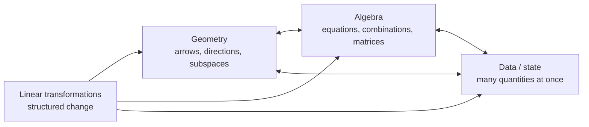

# What Linear Algebra Is Actually Studying

## If you landed here directly

You do not need prior linear algebra for this lesson. Basic arithmetic is enough. If symbols such as $(2,3)$ or $2x+3y$ are unfamiliar, do not treat that as failure; this lesson introduces the role those objects will play before later lessons formalize the notation.

## The problem worth understanding

Suppose one object has several quantities attached to it at once:

- a position has an east-west coordinate and a north-south coordinate;
- a recipe has amounts of flour, water, and salt;
- an image pixel has red, green, and blue intensities;
- a physical system can have position, velocity, temperature, and other state variables;
- a language model can represent one token by hundreds or thousands of numerical features.

Ordinary arithmetic is excellent at one number at a time. Many real problems are about **many numbers that must move together according to structure**.

Linear algebra is the mathematics of that structure.

It studies objects that can be combined, transformations that preserve the rules of combination, equations built from those transformations, and the geometry and computation that emerge from them.

The word *linear* does not mean “easy,” and it does not merely mean “a straight line.” It signals a specific compatibility with addition and scaling that we will make precise later.

## A first mental model: one story, three views

A large fraction of linear algebra can be entered through three doors.



The doors are not separate subjects. They are different views of the same structure.

A vector may be:

- an arrow in a plane;
- an ordered list such as $(3,2)$;
- a bundle of measurements;
- the input or output of a transformation.

A matrix may be:

- a rectangular table of numbers;
- the coefficients of simultaneous equations;
- a machine that transforms vectors;
- a compact description of relationships between many variables.

The early goal is not to memorize which definition is “the real one.” The goal is to learn how to **change viewpoint without changing the underlying mathematics**.

## Example 1: the same vector in three languages

Consider the pair

$$ (3,2). $$

### As data

It could mean:

| quantity | value |
|---|---:|
| apples | 3 |
| oranges | 2 |

The vector stores two related quantities together.

### As geometry

It can represent an arrow from the origin to the point three units to the right and two units up.

### As state

It might represent the current state of a tiny system: 3 units of one resource and 2 units of another.

Same pair of numbers. Different interpretation.

The interpretation changes; the algebraic operations we will build can stay the same.

## Two operations that keep appearing

You do not yet need the formal vector-space definition. Two operations are enough to expose the central pattern.

### Add

If

$$ u=(3,2), \qquad v=(1,4), $$

then

$$ u+v=(4,6). $$

Geometrically, arrows can be placed head-to-tail. As data, corresponding quantities are added. As state, two contributions accumulate.

### Scale

If

$$ u=(3,2), $$

then

$$ 2u=(6,4). $$

The whole object is scaled by one number. That number is called a **scalar**.

Now combine the two ideas:

$$ 2u-\frac12 v. $$

This is a **linear combination**. Much of linear algebra asks what can be reached, represented, solved, approximated, or transformed by combinations of this form.

## Example 2: a recipe becomes algebra

Let

$$ r_1=(500,300,10) $$

mean 500 g flour, 300 g water, and 10 g salt for one recipe, and

$$ r_2=(200,120,4) $$

mean the same quantities for a smaller recipe.

If a kitchen needs two batches of the first and three batches of the second, the total is

$$ 2r_1+3r_2. $$

Compute component by component:

$$ 2(500,300,10)+3(200,120,4) =(1600,960,32). $$

This example is deliberately mundane. The same pattern appears when combining forces, portfolio positions, basis functions, image components, chemical mixtures, neural-network features, or signals.

The reusable idea is not “recipes.” It is **structured combination**.

## Where matrices enter

Suppose an input vector

$$ x=(x_1,x_2) $$

is transformed into

$$ (2x_1+x_2,\; x_1-3x_2). $$

Later we will write this compactly as

$$ Ax, $$

where

```math
A=
\begin{bmatrix}
2 & 1\\
1 & -3
\end{bmatrix}.
```

Do not worry about matrix multiplication yet. For now, read the matrix as a compact rule that tells us how input coordinates contribute to output coordinates.

That is the first glimpse of a **linear transformation**.

## What makes a transformation linear?

A transformation $T$ is linear when it respects the two combination operations:

$$ T(u+v)=T(u)+T(v) $$

and

$$ T(cu)=cT(u). $$

These two conditions mean that the transformation does not destroy the addition-and-scaling structure.

They imply a powerful combined rule:

$$ T(au+bv)=aT(u)+bT(v). $$

Later this single property will explain why matrices, systems of equations, bases, eigenvectors, Fourier-like decompositions, least squares, and many numerical algorithms fit together.

## Example 3: linear versus almost-linear-looking

Consider two rules on planar vectors.

Rule A doubles every coordinate:

$$ T(x,y)=(2x,2y). $$

Rule B moves every point one unit to the right:

$$ S(x,y)=(x+1,y). $$

Rule A is linear. Rule B is not.

A quick reason is what happens to the zero vector:

$$ T(0,0)=(0,0), $$

but

$$ S(0,0)=(1,0). $$

Every linear transformation must send zero to zero. A translation is geometrically simple, but it is not a linear transformation.

This is a useful warning: **“looks simple” and “is linear” are different claims.**

## Why linear problems matter if the world is nonlinear

Many real systems are nonlinear. Linear algebra remains central because linear structure appears in several ways:

1. some systems are genuinely linear over the range of interest;
2. nonlinear systems can often be approximated locally by linear ones;
3. large computational methods repeatedly reduce to linear subproblems;
4. data are often represented by vectors and transformed by matrices even when the full model is nonlinear;
5. linear structure is unusually rich: we can often solve, classify, approximate, and analyze it with precise guarantees.

This is why linear algebra sits underneath numerical computing, optimization, statistics, graphics, control, quantum mechanics, differential equations, signal processing, and machine learning.

## A small interactive checkpoint

Before opening the answers, decide which statements are true.

1. A vector is always a physical arrow.
2. A matrix is only a table used to store numbers.
3. A linear transformation must preserve addition and scalar multiplication.
4. Translation by a fixed nonzero vector is linear.
5. The same vector can represent geometry in one problem and data in another.

<details>
<summary>Check your reasoning</summary>

1. **False.** An arrow is one interpretation; vectors also represent data, coefficients, state, functions, and more abstract objects.
2. **False.** A matrix can store data, but in linear algebra it often represents a linear map or a system of coefficients.
3. **True.** Those are the defining structural properties.
4. **False.** A nonzero translation does not send zero to zero.
5. **True.** Interpretation belongs to the model; the algebraic structure can be shared.

</details>

## Where intuition breaks

### “A vector is just a list of numbers”

Coordinates are a representation. Later we will meet vectors that are polynomials, functions, matrices, or other objects. The deeper idea is the operations and rules they satisfy.

### “A matrix is the subject”

Matrices are extraordinarily useful, but linear algebra is broader than matrix manipulation. A matrix is often the coordinate representation of a linear map after bases are chosen.

### “Linear means one-dimensional”

Linear algebra handles spaces with two, three, a thousand, or millions of coordinates, and also abstract finite-dimensional spaces.

### “If a formula contains x, it is linear”

Expressions such as $x^2$, $|x|$, or adding a fixed offset can break linearity. We will learn systematic tests rather than relying on appearance.

## Active work

Without searching for a formula, create your own two-component vector for each interpretation:

1. a displacement;
2. a pair of measurements;
3. a system state.

Then choose two vectors $u$ and $v$, and predict what

$$ 3u-2v $$

means in each interpretation.

Finally, invent one transformation that you believe is linear and one that you believe is not. Explain your reasoning using addition/scaling or the zero-vector test.

## Retrieval / self-explanation

Close the lesson and reconstruct these ideas:

- What problem does linear algebra solve that one-number-at-a-time arithmetic does not?
- What is a linear combination?
- Why can one vector have geometric, algebraic, and data interpretations?
- What two rules define a linear transformation?
- Why does a nonzero translation fail the linearity test?

If you can explain those in your own words, the lesson has done its job.

## Connections

The next lesson makes the notation precise: scalars, coordinates, tuples, row/column conventions, and the difference between an object and the numbers used to represent it.

Companion exercise: [`LA-EXR-0001`](../exercises/LA-EXR-0001-see-one-structure-three-ways.md).

## What this unlocks

You now have the organizing question for the entire track:

> **What objects can be combined, what transformations preserve those combinations, and what can we infer or compute from that structure?**

Every later topic—systems, bases, rank, eigenvectors, least squares, SVD, numerical stability, tensors, randomized algorithms—will be a deeper answer to part of that question.

## References

- MIT OpenCourseWare, *18.06 Linear Algebra*.
- Sheldon Axler, *Linear Algebra Done Right*, 4th ed.
- Stephen Boyd and Lieven Vandenberghe, *Introduction to Applied Linear Algebra — Vectors, Matrices, and Least Squares*.
