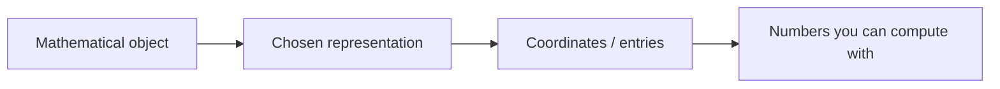
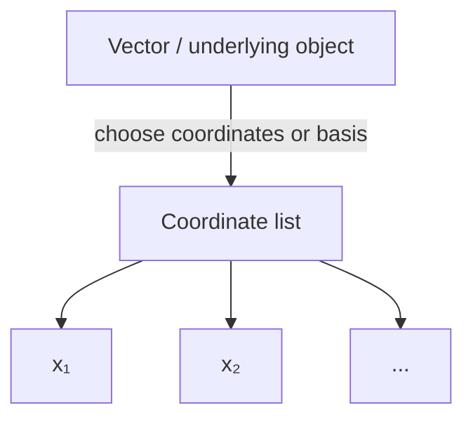

# Scalars, Coordinates, Tuples, and Notation

## If you landed here directly

This lesson assumes only the organizing idea from [`LA-0001`](LA-0001-what-linear-algebra-is-actually-studying.md): linear algebra studies structured collections of quantities and the transformations that preserve addition-and-scaling structure.

You do **not** need prior matrix algebra, calculus, proofs, or programming.

This lesson has a deliberately modest goal: make the symbols readable enough that notation stops consuming all of your attention.

## The problem worth understanding

A page of linear algebra can contain expressions such as:

$$ 3,\qquad (2,-1,5),\qquad x\in\mathbb{R}^n,\qquad x_i,\qquad A\in\mathbb{R}^{m\times n},\qquad a_{ij}. $$

A beginner can understand the underlying idea but still feel blocked because every symbol looks like a new concept.

The cure is not memorizing typography. It is learning to ask what **kind of object** each symbol names and what information the notation encodes.

By the end of this lesson, you should be able to translate a small piece of notation into plain language and back again.

## Mental model: object, representation, coordinate

Keep three layers separate:



At the beginning of the subject, these layers often collapse together because a vector in $\mathbb{R}^n$ is literally presented as an ordered list of numbers.

Later, however, the distinction becomes essential:

- the **vector** is the mathematical object;
- a **coordinate list** describes that vector relative to a chosen coordinate system or basis;
- each **coordinate** is one scalar appearing in that description.

For now, we work mainly in familiar coordinate spaces so that the notation is concrete.

## Scalars: one quantity at a time

A **scalar** is a single number used as a coefficient, measurement, scale factor, or entry.

Examples:

$$ 5,\qquad -2.3,\qquad \frac12,\qquad \pi. $$

In our early examples, scalars are usually real numbers, written as elements of

$$ \mathbb{R}. $$

Read

$$ a\in\mathbb{R} $$

as:

> “$a$ is a real number.”

Later, some parts of linear algebra use complex scalars in $\mathbb{C}$. The word *scalar* is therefore more structural than “real number”; it tells us the role a number plays relative to vectors.

### Scalar versus vector

Compare:

$$ 3 $$

with

$$ (3,2). $$

The first is one scalar. The second is an ordered two-component object.

Multiplying the vector by the scalar gives

$$ 3(3,2)=(9,6). $$

The scalar scales the whole vector.

## Tuples: order is part of the information

A **tuple** is an ordered list.

For example,

$$ (4,7) $$

is a 2-tuple, and

$$ (4,7,-2) $$

is a 3-tuple.

Ordered means

$$ (4,7)\neq(7,4) $$

unless the two positions happen to carry equal values in a particular example.

This matters because position carries meaning.

If

$$ x=(72,18) $$

means

```text
x = (temperature in °C, pressure in kPa)
```

then reversing the order changes the model:

```text
(18,72)
```

is not merely the same data written differently.

## Coordinates: numbers with positions

If

$$ x=(x_1,x_2,\ldots,x_n), $$

then $x_1$ is the first coordinate, $x_2$ the second, and $x_i$ means the coordinate in position $i$.

The subscript is an **index**, not multiplication and not an exponent.

Thus

$$ x_2 $$

means “the second coordinate of $x$,” while

$$ x^2 $$

usually means “$x$ squared” when $x$ is a scalar.

Typography is doing real work here.

### Worked example 1: a sensor state

Suppose

$$ s=(21.6,45,101.2). $$

We define the coordinate meanings as:

| coordinate | meaning |
|---|---|
| $s_1$ | temperature in °C |
| $s_2$ | relative humidity in % |
| $s_3$ | pressure in kPa |

Then

$$ s_2=45. $$

The number `45` is a scalar. It is also the second coordinate of the vector $s$.

Those are compatible descriptions at different levels.

## What does $\mathbb{R}^n$ mean?

The notation

$$ \mathbb{R}^n $$

means the set of all ordered lists of length $n$ whose coordinates are real numbers.

An element looks like

$$ (x_1,\ldots,x_n). $$

Examples:

$$ (2,-1)\in\mathbb{R}^2, $$

$$ (2,-1,7)\in\mathbb{R}^3, $$

and

$$ (2,-1,7,0,4.5)\in\mathbb{R}^5. $$

The superscript in $\mathbb{R}^5$ does **not** mean “raise the real numbers to the fifth power.” It indicates the length of the coordinate lists in this context.

### Interactive check

Which statements are meaningful and true?

1. $(2,5)\in\mathbb{R}^2$
2. $(2,5)\in\mathbb{R}^3$
3. $-7\in\mathbb{R}$
4. the third coordinate of $(2,5)$ is 5

<details>
<summary>Reveal</summary>

1. **True.** It is an ordered list of two real numbers.
2. **False.** It has two coordinates, not three.
3. **True.** $-7$ is a real scalar.
4. **False.** A two-coordinate tuple has no third coordinate.

</details>

## Vector notation: tuple form and column form

The same coordinate vector is often displayed in either form:

$$ x=(2,-1,5) $$

or

```math
x=
\begin{bmatrix}
2\\
-1\\
5
\end{bmatrix}.
```

At this stage, treat these as two visual layouts for the same ordered coordinates when the author says they represent the same vector.

The column form becomes especially useful when matrices act on vectors.

You may also encounter row vectors such as

```math
\begin{bmatrix}2&-1&5\end{bmatrix}.
```

Row-versus-column orientation eventually matters for matrix multiplication. We will not build that machinery yet.

For now, record the shape:

```text
column vector with 3 entries  →  3 × 1 shape
row vector with 3 entries     →  1 × 3 shape
```

Do not confuse “three coordinates” with “three-dimensional physical space.” Three coordinates can describe any three modeled quantities.

## Matrix notation: a rectangular array with indexed entries

A matrix is written as a rectangular array such as

```math
A=
\begin{bmatrix}
2 & 5 & -1\\
0 & 3 & 7
\end{bmatrix}.
```

This matrix has:

- 2 rows;
- 3 columns.

We say its shape is

$$ 2\times 3. $$

If all entries are real, we can write

$$ A\in\mathbb{R}^{2\times3}. $$

More generally,

$$ A\in\mathbb{R}^{m\times n} $$

means that $A$ has $m$ rows and $n$ columns, with real entries.

### Reading $a_{ij}$

The notation

$$ a_{ij} $$

usually means the entry of matrix $A$ in row $i$, column $j$.

For

```math
A=
\begin{bmatrix}
2 & 5 & -1\\
0 & 3 & 7
\end{bmatrix},
```

we have

$$ a_{11}=2,\qquad a_{12}=5,\qquad a_{23}=7. $$

A useful reading rule is:

```text
a_ij  →  row i, column j
```

### Worked example 2: decode before computing

Suppose

$$ B\in\mathbb{R}^{4\times 6}. $$

Before knowing any entries, you already know:

- $B$ has 4 rows;
- $B$ has 6 columns;
- each $b_{ij}$ is a real scalar;
- valid row indices are $1,2,3,4$;
- valid column indices are $1,2,3,4,5,6$.

Therefore $b_{3,5}$ can exist, while $b_{5,3}$ is outside the stated shape.

Notation carries constraints before arithmetic begins.

## Worked example 3: a data matrix

Suppose three machines are measured for temperature and vibration:

| machine | temperature | vibration |
|---|---:|---:|
| A | 61 | 0.8 |
| B | 59 | 1.1 |
| C | 66 | 0.9 |

One possible matrix representation is

```math
M=
\begin{bmatrix}
61 & 0.8\\
59 & 1.1\\
66 & 0.9
\end{bmatrix}.
```

Then

$$ M\in\mathbb{R}^{3\times2}. $$

Rows correspond to machines; columns correspond to measured features.

But that interpretation is **not encoded automatically by the brackets**. The modeler assigns semantic meaning to rows and columns.

Another project could use rows for features and columns for machines.

The numbers alone do not tell you which convention was chosen.

## Coordinates are representation, not identity

This distinction is easy to ignore in $\mathbb{R}^2$, but it becomes foundational later.

Suppose an arrow is represented by

$$ (1,0) $$

relative to ordinary horizontal/vertical coordinate axes.

If we choose a different basis, the **same geometric vector** can receive a different coordinate list.

We will not calculate change of basis yet. Just preserve the mental separation:



This prevents a common future misconception:

> “A vector *is nothing but* its current coordinates.”

In elementary coordinate space, treating them as identical is convenient. In deeper linear algebra, the distinction matters.

## The zero problem: context determines the object

The symbol

$$ 0 $$

can denote the scalar zero.

But in a vector equation, the same printed symbol may denote the zero vector:

$$ 0=(0,0,\ldots,0). $$

Similarly, a zero matrix contains zeros in every entry.

Mathematics frequently overloads notation when context makes the intended object clear.

So do not ask only:

> “What does the symbol `0` mean?”

Ask:

> “What type of object must live here for the expression to make sense?”

That is the beginning of **type-aware mathematical reading**.

## Shape is a type check

Compare:

$$ x\in\mathbb{R}^3 $$

and

$$ y\in\mathbb{R}^5. $$

The coordinatewise sum $x+y$ is not defined in the ordinary way because their shapes do not match.

Likewise, a $2\times3$ matrix and a $4\times2$ matrix do not have matching shapes for entry-by-entry addition.

We will later learn operations with their own compatibility rules. For now, dimensions function like a fast type system:

```text
object kind + shape → what operations could even make sense?
```

This habit prevents many mechanical errors.

## Units and meaning still matter

Suppose

$$ x=(20,3) $$

where the first coordinate is temperature in °C and the second is distance in km.

Mathematically, this is an element of $\mathbb{R}^2$.

But whether expressions such as

$$ 2x, \qquad x+y, $$

make sense scientifically depends on the model and the meaning of coordinates.

Linear algebra manipulates structure; it does not automatically certify that your modeling choices are meaningful.

This matters later in data science, engineering, optimization, and machine learning, where feature scaling and units can strongly affect interpretation.

## A notation translation table

| notation | read it as |
|---|---|
| $a\in\mathbb{R}$ | $a$ is a real scalar |
| $x\in\mathbb{R}^n$ | $x$ is an $n$-coordinate real vector |
| $x_i$ | the $i$-th coordinate of $x$ |
| $A\in\mathbb{R}^{m\times n}$ | $A$ is a real matrix with $m$ rows and $n$ columns |
| $a_{ij}$ | entry of $A$ in row $i$, column $j$ |
| $0$ | a zero object whose type is inferred from context |

Do not memorize the table as isolated vocabulary. Practice translating symbols into structural statements.

## Interactive notation drill

Try each before opening the answer.

### A

$$ x\in\mathbb{R}^7 $$

What do you know before seeing $x$?

<details>
<summary>Reveal</summary>

It is represented by an ordered list of seven real coordinates. You do not yet know what those coordinates mean in an application.

</details>

### B

$$ A\in\mathbb{R}^{3\times5} $$

How many rows? How many columns? Is $a_{4,2}$ a valid entry?

<details>
<summary>Reveal</summary>

Three rows, five columns. $a_{4,2}$ is outside the row range and therefore is not an entry of this stated matrix.

</details>

### C

$$ v=(8,-2,1),\qquad v_2=? $$

<details>
<summary>Reveal</summary>

$v_2=-2$. The subscript selects the second coordinate.

</details>

### D

Are these equal?

$$ (1,4,9)\quad\text{and}\quad(9,4,1) $$

<details>
<summary>Reveal</summary>

No. Tuples are ordered. Matching values in different positions do not make the tuples equal.

</details>

## Where intuition breaks

### “A scalar is just a one-dimensional vector”

There are contexts where $\mathbb{R}$ and $\mathbb{R}^1$ can be naturally identified, but they play different notational roles. Keeping “scalar” and “vector” distinct is useful, especially when matrix shapes appear.

### “Coordinates are labels with no order”

False. Order is built into a tuple. Changing coordinate order changes the representation and often the modeled meaning.

### “The superscript in $\mathbb{R}^n$ is ordinary exponentiation”

Not in this notation. It describes a Cartesian product / coordinate-space structure: ordered lists of length $n$.

### “A $3\times5$ matrix has 3 columns and 5 rows”

The standard convention is **rows × columns**.

### “The brackets tell me what rows and columns mean”

No. Semantic roles come from the model or surrounding explanation.

### “The vector and its coordinates are always the same thing”

Convenient at first, dangerous later. Coordinates depend on representation choices such as basis.

## Active work: translate both directions

Translate these into plain English:

$$ a\in\mathbb{R}, $$

$$ x\in\mathbb{R}^4, $$

$$ A\in\mathbb{R}^{2\times7}, $$

$$ a_{2,6}. $$

Then reverse the process. Write notation for:

1. a real scalar named $c$;
2. a vector $p$ with five real coordinates;
3. a real matrix $W$ with 8 rows and 3 columns;
4. the entry in row 7, column 2 of matrix $B$.

Finally, invent one data context for a vector in $\mathbb{R}^4$. State explicitly what each coordinate means and which units it uses.

## Retrieval / self-explanation

Without rereading, explain:

1. What is the difference between a scalar and a coordinate?
2. Why is a tuple ordered?
3. What does $x\in\mathbb{R}^n$ tell you, and what does it *not* tell you?
4. How do you read $A\in\mathbb{R}^{m\times n}$?
5. What does $a_{ij}$ mean?
6. Why can the same vector eventually have different coordinate lists?
7. Why is “shape” similar to a type check?

Then reconstruct from memory:

```text
object → representation → coordinates → scalar entries
```

## Connections

Two curriculum branches are now immediately available:

- [`LA-N-0003`](../ROADMAP.md) — vectors as displacement, data, and state;
- [`LA-N-0007`](../ROADMAP.md) — linear equations as constraints.

The first deepens the meaning of vectors; the second begins using scalar and coordinate notation to express simultaneous conditions.

Complete the companion exercise: [`LA-EXR-0002`](../exercises/LA-EXR-0002-translate-and-type-check-linear-algebra-notation.md).

## What this unlocks

You can now read elementary linear-algebra notation as compressed language rather than decoration.

When you see

$$ A\in\mathbb{R}^{m\times n},\qquad x\in\mathbb{R}^n, $$

you may not yet know what operation comes next, but you already know the **kinds and shapes of the objects involved**.

That is enough to make later definitions substantially easier to parse.

## References

- MIT OpenCourseWare, *18.06 Linear Algebra*.
- Sheldon Axler, *Linear Algebra Done Right*, 4th ed.
- Stephen Boyd and Lieven Vandenberghe, *Introduction to Applied Linear Algebra — Vectors, Matrices, and Least Squares*.
