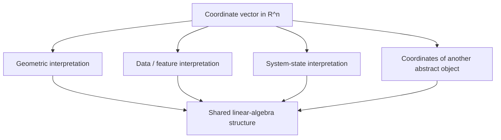
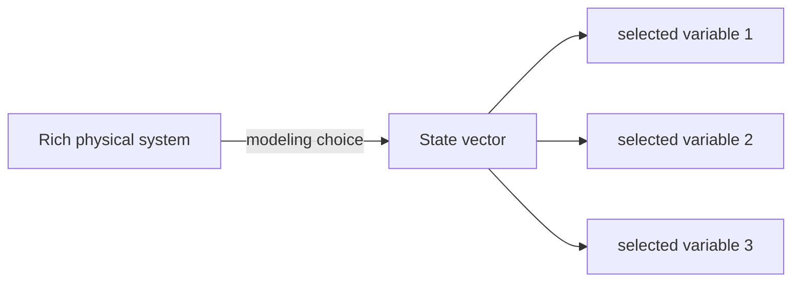
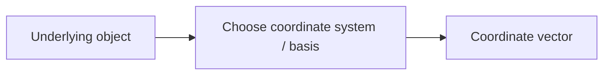

# Vectors as Displacement, Data, and State

## If you landed here directly

You need only the notation from [`LA-0002`](LA-0002-scalars-coordinates-tuples-and-notation.md):

- a scalar is one number;
- a vector in $\mathbb{R}^n$ can be represented by an ordered list of $n$ real coordinates;
- coordinate order matters;
- notation describes shape, but context supplies meaning.

You do **not** need matrix multiplication, vector addition, dot products, calculus, or proofs for this lesson.

The goal is to answer a deceptively simple question:

> When someone writes a vector such as $(3,-2)$ or $(21.4,55,101.3)$, what kind of thing is it representing?

There is no single universal answer.

## The problem worth understanding

Consider the same coordinate list:

$$
(3,2).
$$

It could mean:

- a displacement: 3 meters east and 2 meters north;
- a data record: 3 failed tests and 2 warnings;
- a state: 3 liters in tank A and 2 liters in tank B;
- a point location in a chosen coordinate system;
- coefficients relative to some basis we have not yet studied.

The mathematics sees a two-coordinate object.

The application gives those coordinates meaning.

If you confuse **mathematical structure** with **domain semantics**, linear algebra can feel either mysteriously abstract or misleadingly concrete.

This lesson trains the ability to move between the two.

## Mental model: one mathematical form, several interpretations



The reusable object is the vector structure.

The interpretation determines what a coordinate means and which operations are scientifically meaningful.

## First precision: a vector is not merely “an arrow”

Arrows are an excellent geometric representation of vectors in two or three dimensions.

For example, the vector

$$
v=
\begin{bmatrix}
3\\
2
\end{bmatrix}
$$

can be drawn as a displacement three units to the right and two units upward.


But an arrow is a **representation** of a vector, not the only possible definition of one.

A 50,000-coordinate embedding used in a computational model is still treated as a vector even though nobody draws it as a literal arrow in physical space.

The arrow picture teaches structure. It should not imprison the concept.

## Displacement: vectors can describe change in position

Imagine a flat map with an east/north coordinate convention.

A displacement vector

$$
d=
\begin{bmatrix}
3\\
2
\end{bmatrix}
$$

can mean:

```text
3 km east
2 km north
```

The vector describes **how to move**, not necessarily **where you are**.

### Point versus displacement

Suppose a location has coordinates

$$
p=(3,2).
$$

and a displacement also has coordinates

$$
d=(3,2).
$$

The symbols contain the same two numbers, but the roles differ:

```text
p : a location relative to an origin

d : a change in location
```

This distinction becomes important in geometry, physics, graphics, robotics, and affine spaces.

At this stage, remember:

> **Identical coordinate arrays do not guarantee identical semantic roles.**

### Interactive check

A navigation system reports:

```text
position = (5, 4) km
move     = (5, 4) km
```

Must these mean the same physical thing because the coordinates match?

<details>
<summary>Reveal</summary>

No. The first can be a location measured from a chosen origin. The second can be a displacement instruction. Their numerical representations match, but their roles are different.

</details>

## Data vectors: coordinates can be measured features

Now forget geometry.

Suppose one flower is represented by:

$$
x=(5.1,3.5,1.4,0.2).
$$

A semantic map might be:

| coordinate | meaning | unit |
|---|---|---|
| $x_1$ | sepal length | cm |
| $x_2$ | sepal width | cm |
| $x_3$ | petal length | cm |
| $x_4$ | petal width | cm |

The vector is now an organized data record.

You can still reason about it as an element of $\mathbb{R}^4$, but the coordinate semantics matter.

Swapping $x_1$ and $x_4$ would not be harmless formatting. It would change which measurement occupies each coordinate slot.

### Dimension is not meaning

If

$$
x\in\mathbb{R}^4,
$$

then the mathematical statement tells you that $x$ has four real coordinates.

It does **not** tell you whether they are:

- lengths;
- temperatures;
- financial indicators;
- pixel values;
- model features;
- four arbitrary coefficients.

The ambient space constrains structure. Metadata and domain context supply semantics.

## State vectors: a vector can summarize “what the system is like now”

Suppose a small controlled room is modeled by:

$$
s=
\begin{bmatrix}
21.5\\
45\\
0.30
\end{bmatrix}.
$$

We define:

```text
s_1 = temperature in Celsius
s_2 = relative humidity in percent
s_3 = valve opening fraction
```

Then $s$ is a **state vector**: a chosen collection of quantities intended to summarize the system's current state for a model.

The vector is not the room itself.

It is a representation containing the variables the model chooses to track.

### Model state is selective

The physical room has vastly more detail:

- molecular positions;
- wall temperatures;
- air velocity at every point;
- exact sensor electronics;
- people moving inside;
- noise.

A three-coordinate state vector ignores most of that.

This is not automatically a flaw.

Modeling requires choosing what information matters for the question being asked.



Linear algebra manipulates the representation. Science and engineering decide whether the representation is adequate.

## The same coordinate pattern can live in different semantic worlds

Consider three objects with the same coordinates:

$$
a=(2,1,-1),
$$

$$
b=(2,1,-1),
$$

$$
c=(2,1,-1).
$$

We might declare:

```text
a = displacement in meters
b = color-channel adjustment
c = inventory changes in thousands of units
```

Numerically, the coordinate vectors match.

Operationally, statements involving units or interpretation can differ dramatically.

Good technical work therefore names both:

1. the mathematical object; and
2. the semantic meaning of its coordinates.

## Coordinate order is part of the representation contract

Suppose a state convention is

$$
s=(T,H,P),
$$

where:

- $T$ = temperature;
- $H$ = humidity;
- $P$ = pressure.

Then

$$
s=(22,50,101.2)
$$

has a defined meaning.

Writing

$$
(50,22,101.2)
$$

without changing the convention is a different vector.

A useful software analogy is an API contract:

```text
coordinate 1 means T
coordinate 2 means H
coordinate 3 means P
```

Both mathematics and software fail when two components silently disagree about the ordering convention.

## Column or row display does not automatically change the underlying role

The same coordinate vector is often displayed as

$$
x=(3,-2,5)
$$

or as a column:

$$
x=
\begin{bmatrix}
3\\
-2\\
5
\end{bmatrix}.
$$

At this stage, treat these as common coordinate-display conventions unless surrounding mathematics assigns a specific row/column role.

Later, matrix multiplication will make orientation operationally important.

Do not invent a distinction too early, but do not assume typography never matters either.

## The zero vector has context-dependent meaning

In $\mathbb{R}^3$, the zero vector is represented by

$$
0=
\begin{bmatrix}
0\\
0\\
0
\end{bmatrix}.
$$

Its interpretation depends on context:

- zero displacement: no movement;
- zero velocity: no instantaneous velocity;
- zero inventory-change vector: no recorded changes;
- all-zero feature vector: every encoded feature has value zero.

These are not the same real-world statement.

What is shared is the mathematical role of the all-zero vector.

That role becomes central when we study vector addition and linear combinations.

## Units: legal mathematics versus meaningful modeling

Consider the state vector

$$
s=(21.5,45,0.30),
$$

with units:

```text
Celsius, percent, dimensionless fraction
```

It is valid to store these coordinates together as a model state.

But if someone computes a geometric length from the raw coordinates and declares it physically meaningful, you should ask questions.

Why?

Because the coordinates have different scales and units.

A formula can be mathematically defined yet scientifically poorly motivated.

This lesson therefore separates two questions:

```text
Is this a legal operation on the mathematical vector?
Is this operation meaningful for the represented quantities?
```

The first is linear algebra. The second depends on modeling choices and domain knowledge.

## Worked example 1: displacement versus endpoint

A robot command is

$$
d=(2,-1).
$$

Interpretation:

```text
2 meters in the positive x-direction
1 meter in the negative y-direction
```

The vector describes a displacement.

If another object has coordinates

$$
p=(2,-1),
$$

but $p$ represents a point measured relative to an origin, the same coordinates have a different semantic role.

### Prediction

Which phrase is safer?

A. “The vector $(2,-1)$ is the point at $(2,-1)$.”

B. “The coordinates $(2,-1)$ can represent a point or a displacement depending on context.”

<details>
<summary>Reveal</summary>

B. Linear algebra often uses coordinate lists for several related kinds of objects. Context must identify the role.

</details>

## Worked example 2: a student performance vector

Suppose

$$
x=(82,91,7).
$$

and define:

```text
x_1 = exam score out of 100
x_2 = project score out of 100
x_3 = absences
```

This is a three-coordinate data vector.

Now ask:

> Is $(91,82,7)$ the same student record?

Not under the stated coordinate convention. Exam and project scores have been swapped.

The ordered structure is part of the meaning.

## Worked example 3: state for a dynamical model

A simple tank model tracks

$$
s=(h,T),
$$

where:

- $h$ = liquid height;
- $T$ = temperature.

At one instant:

$$
s=(1.8,40).
$$

At a later instant:

$$
s=(1.6,42).
$$

The two vectors represent two system states at two times.

We have not yet defined a state-transition equation. That belongs later.

For now, the essential idea is:

> A vector can be a compact description of the variables a model needs at one moment.

## Vectors do not require a physical interpretation

Not every vector needs a story about arrows, sensors, or tanks.

Linear algebra eventually studies vectors abstractly as elements of vector spaces.

An object can qualify because it obeys the relevant algebraic structure even if its “coordinates” are not immediately physical measurements.

We postpone that abstraction until later curriculum levels.

At L0, the important step is to stop identifying “vector” with exactly one picture.

## Coordinate representation versus underlying object

Recall the distinction introduced in `LA-0002`:



In familiar $\mathbb{R}^2$ examples we often treat the coordinate vector as the object because standard coordinates are natural and convenient.

Later, the same geometric vector can receive different coordinate lists under different bases.

So when you see

$$
\begin{bmatrix}
3\\
2
\end{bmatrix},
$$

learn to ask:

> Coordinates of what, relative to which convention?

You will not always need an elaborate answer, but the question protects you from confusing representation with identity.

## Where intuition breaks: a numerical row is not automatically a good vector model

A spreadsheet row with numbers is not magically a well-designed vector representation.

You need a declared convention:

- what each coordinate means;
- ordering;
- units/scales when relevant;
- missing-value rules;
- whether operations on these coordinates are meaningful.

Linear algebra supplies structure; data modeling supplies the contract.

## Where intuition breaks: higher dimension is not automatically richer meaning

A vector in $\mathbb{R}^{1000}$ has more coordinates than one in $\mathbb{R}^{3}$.

That does not imply it contains better information.

It could contain:

- redundant measurements;
- noise;
- arbitrary encodings;
- meaningful features;
- a mixture of all four.

Dimension is a mathematical property, not a certificate of quality.

## Where intuition breaks: geometric language can mislead in mixed-unit data

A two-coordinate vector

$$
x=(180,70)
$$

might mean:

```text
height = 180 cm
mass = 70 kg
```

It is easy to draw $(180,70)$ as a point in a plane.

But the visual axes have different physical units.

A geometric picture is still available, but interpretations of distance, angle, or magnitude require additional modeling choices.

Do not let a convenient plot silently make scientific assumptions for you.

## Where intuition breaks: state is model-relative

Two engineers can model the same physical system with different state vectors.

One model might use

$$
s_1=(T,P),
$$

while another uses

$$
s_2=(T,P,H,F).
$$

Neither is automatically “the real state.”

The right representation depends on the dynamics, observations, and questions the model needs to support.

This becomes important in control, signal processing, machine learning, and numerical simulation.

## Active work: classify the role

For each object, classify the most natural interpretation as **displacement**, **data**, **state**, or **ambiguous without more context**.

1. $(4,-1)$ meters east/north from a starting point.
2. $(120,80,72)$ with labels systolic pressure, diastolic pressure, heart rate.
3. $(x,v)$ containing position and velocity needed to predict a moving object's next configuration.
4. $(2,5,7)$ with no description.

<details>
<summary>Reveal</summary>

1. displacement
2. data vector
3. state vector
4. ambiguous without context

The fourth is still a valid coordinate vector in $\mathbb{R}^3$ if its entries are real; what is missing is semantic interpretation.

</details>

## Active work: detect an ordering bug

A model expects

$$
x=(\text{age},\text{income},\text{years of education}).
$$

A data pipeline emits

$$
(\text{income},\text{age},\text{years of education}).
$$

Both outputs have three real numbers.

Explain why a dimension/shape check alone cannot detect the semantic bug.

<details>
<summary>Reveal</summary>

Both objects belong structurally to $\mathbb{R}^3$, so shape is correct. The bug is the coordinate contract: positions 1 and 2 carry the wrong meanings. Structural validation and semantic validation are different layers.

</details>

## Active work: design a state vector

Choose a simple system:

- a room;
- a bicycle;
- a bank account model;
- a two-tank process;
- a game character;
- another system you know.

Define a vector

$$
s\in\mathbb{R}^n
$$

that represents a useful state.

Write:

```text
coordinate 1:
coordinate 2:
...
units:
why these variables are included:
what important information is omitted:
```

The last question is essential. A vector representation is always a choice.

## Active work: same coordinates, different worlds

Create three interpretations for

$$
v=(1,0,2).
$$

At least one should be geometric and one should be non-geometric.

Then answer:

> Which facts about the coordinate vector remain true across all three interpretations, and which statements depend on the domain meaning?

A strong answer separates mathematical shape/order from units and semantics.

## Retrieval / self-explanation

Without rereading the lesson, explain these sentences:

1. “A vector is not just an arrow.”
2. “$\mathbb{R}^n$ tells you shape, not semantics.”
3. “A state vector is model-relative.”
4. “The same coordinate list can play different roles.”
5. “An operation can be mathematically legal but scientifically meaningless.”

If you cannot explain at least one concrete example for each, revisit the corresponding section.

## A compact interpretation checklist

When you meet a vector in a new subject, ask:

```text
1. What space or shape is stated?
2. What does each coordinate mean?
3. Does coordinate order have a declared convention?
4. Are units/scales relevant?
5. Is the object acting as a point, displacement, data record, state, or something else?
6. Is this the underlying object or coordinates relative to a representation choice?
7. Which proposed operations are meaningful in the application?
```

This checklist is more durable than memorizing one picture of vectors.

## Connections

- [`LA-0001`](LA-0001-what-linear-algebra-is-actually-studying.md) introduced the idea that one structure can be viewed geometrically, algebraically, and as data.
- [`LA-0002`](LA-0002-scalars-coordinates-tuples-and-notation.md) established scalars, coordinate order, $\mathbb{R}^n$, and object-versus-representation language.
- This lesson turns those symbols into three reusable interpretations: displacement, data, and state.

## What this unlocks

You can now encounter a coordinate vector and avoid two opposite mistakes:

- treating it as meaningless numbers;
- assuming it must mean a geometric arrow.

The next core node is:

```text
LA-N-0004 — Vector addition and scalar multiplication
```

A parallel branch beginning with linear equations is also available from the earlier notation prerequisite; use `python scripts/csf.py next linear-algebra` to see graph-valid authoring candidates rather than assuming the curriculum is strictly linear.

## References

- `LA-REF-001` — MIT 18.06 Linear Algebra, for the geometric and applied role of vectors in an undergraduate linear-algebra sequence.
- `LA-REF-003` — *Linear Algebra Done Right*, for the broader vector-space perspective beyond literal arrows.
- `LA-REF-004` — Boyd & Vandenberghe, *Introduction to Applied Linear Algebra — Vectors, Matrices, and Least Squares*, for vectors as quantities, features, signals, and application-level representations.
