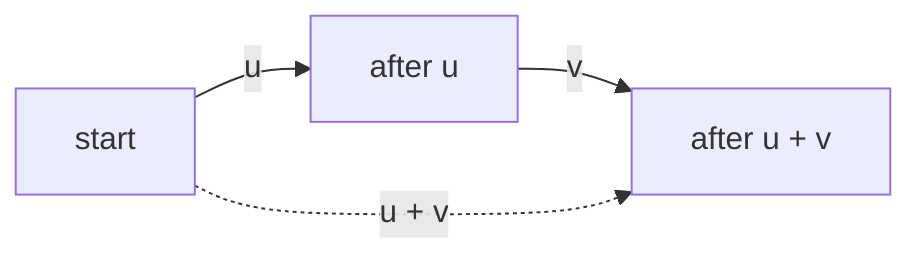

# Vector addition and scalar multiplication

## If you landed here directly

This lesson assumes only one genuinely important prerequisite:

- you can interpret a vector as a displacement, a data record, or a system state depending on context.

If that idea is not yet comfortable, read **LA-0003 — Vectors as displacement, data, and state** first.

You should also be able to read a vector such as

$$
\mathbf{v}=
\begin{bmatrix}
3\\
-2
\end{bmatrix}
$$

as an ordered list of coordinates rather than as decorative notation.

The goal here is narrow but foundational: learn the two operations from which linear combinations are built.

Those operations are:

1. **vector addition**, and
2. **scalar multiplication**.

By the end, you should be able to compute them, predict their geometric effect, interpret them in data and state models, and notice when the algebra is legal but the model is not.

---

## The problem worth understanding

Suppose a robot moves three meters east and one meter north. Then it makes a second move: one meter west and two meters north.

How should we describe the total displacement?

Or suppose a measured change in a system is

$$
\Delta \mathbf{x} =
\begin{bmatrix}
4\\
-2\\
1
\end{bmatrix}.
$$

What does it mean to apply half of that change? What does it mean to reverse it?

Linear algebra answers both questions with two operations that look almost embarrassingly simple:

$$
\mathbf{u}+\mathbf{v}
$$

and

$$
a\mathbf{v},
$$

where $a$ is a scalar.

The arithmetic is easy. The deeper work is learning what these operations preserve, what they mean in different representations, and what they do **not** mean.

If you understand these two operations correctly, later ideas such as linear combinations, span, matrix-vector multiplication, linear transformations, eigenvectors, and vector spaces stop looking like unrelated inventions. They become variations on one recurring pattern:

> combine compatible vectors, and scale compatible vectors, without leaving the space in which they live.

---

## Mental model

Think of a vector as an **actionable change**.

- Adding vectors means **performing changes together or in sequence**.
- Multiplying a vector by a scalar means **resizing, reversing, or nullifying the same kind of change**.

For displacement vectors:

- $\mathbf{u}+\mathbf{v}$ means "take displacement $\mathbf{u}$, then displacement $\mathbf{v}$";
- $2\mathbf{u}$ means "twice the displacement";
- $\frac12\mathbf{u}$ means "half the displacement";
- $-\mathbf{u}$ means "the same magnitude in the opposite direction";
- $0\mathbf{u}$ means "no displacement".

For a data vector, the geometry may be less literal, but the operation is still coordinate-wise. Whether the result has a useful real-world interpretation depends on what the coordinates mean.

This distinction will matter repeatedly:

> **Algebraic validity and modeling validity are not the same thing.**

Two vectors may have the same mathematical shape and therefore be addable in $\mathbb{R}^n$, while adding their real-world meanings may still be nonsense.

---

## Precise concepts

### 1. Vector addition

Let

$$
\mathbf{u}=
\begin{bmatrix}
u_1\\
u_2\\
\vdots\\
u_n
\end{bmatrix},
\qquad
\mathbf{v}=
\begin{bmatrix}
v_1\\
v_2\\
\vdots\\
v_n
\end{bmatrix}.
$$

If both vectors have the same number of coordinates, their sum is defined coordinate by coordinate:

$$
\mathbf{u}+\mathbf{v}
=
\begin{bmatrix}
u_1+v_1\\
u_2+v_2\\
\vdots\\
u_n+v_n
\end{bmatrix}.
$$

For example,

$$
\begin{bmatrix}
3\\
1
\end{bmatrix}
+
\begin{bmatrix}
-1\\
2
\end{bmatrix}
=
\begin{bmatrix}
2\\
3
\end{bmatrix}.
$$

The result has the same dimension as the inputs.

You cannot add a vector in $\mathbb{R}^2$ to a vector in $\mathbb{R}^3$ using ordinary vector addition:

$$
\begin{bmatrix}
1\\
2
\end{bmatrix}
+
\begin{bmatrix}
3\\
4\\
5
\end{bmatrix}
$$

is not defined.

That failure is not a minor notation problem. The coordinate positions no longer line up.

---

### 2. Scalar multiplication

A **scalar** is one number. If $a$ is a scalar and

$$
\mathbf{v}=
\begin{bmatrix}
v_1\\
v_2\\
\vdots\\
v_n
\end{bmatrix},
$$

then

$$
a\mathbf{v}
=
\begin{bmatrix}
av_1\\
av_2\\
\vdots\\
av_n
\end{bmatrix}.
$$

For example,

$$
-2
\begin{bmatrix}
3\\
-1
\end{bmatrix}
=
\begin{bmatrix}
-6\\
2
\end{bmatrix}.
$$

Every coordinate is multiplied by the **same** scalar.

That "same scalar" condition is important. An operation such as

$$
\begin{bmatrix}
2u_1\\
5u_2
\end{bmatrix}
$$

may be a perfectly useful transformation, but it is not scalar multiplication of $\mathbf{u}$ by one scalar.

---

### 3. Closure: the result stays in the same vector space

At this level, our vectors mostly live in $\mathbb{R}^n$.

If

$$
\mathbf{u},\mathbf{v}\in\mathbb{R}^n
$$

and

$$
a\in\mathbb{R},
$$

then

$$
\mathbf{u}+\mathbf{v}\in\mathbb{R}^n
$$

and

$$
a\mathbf{v}\in\mathbb{R}^n.
$$

This "stays in the same space" property is called **closure**.

Later, when we define an abstract vector space, closure under these two operations will be part of the contract.

For now, the practical intuition is enough:

> combining or scaling valid vectors should not suddenly produce an object of a different kind.

---

### 4. The zero vector

The **zero vector** in $\mathbb{R}^n$ is

$$
\mathbf{0}
=
\begin{bmatrix}
0\\
0\\
\vdots\\
0
\end{bmatrix}.
$$

It behaves like an additive "do nothing":

$$
\mathbf{v}+\mathbf{0}=\mathbf{v}.
$$

It also appears when a vector is scaled by zero:

$$
0\mathbf{v}=\mathbf{0}.
$$

Do not confuse the scalar $0$ with the vector $\mathbf{0}$.

They are related, but they are different kinds of mathematical objects.

---

### 5. Additive inverse

For every vector $\mathbf{v}$,

$$
-\mathbf{v}
=
(-1)\mathbf{v}.
$$

Then

$$
\mathbf{v}+(-\mathbf{v})=\mathbf{0}.
$$

Geometrically, $-\mathbf{v}$ has the same length as $\mathbf{v}$ and points in the opposite direction.

In a change model, it represents undoing or reversing the change.

---

## How it actually works

### Coordinate view

In coordinates, the rules are mechanical.

For

$$
\mathbf{u}=
\begin{bmatrix}
u_1\\
u_2
\end{bmatrix},
\qquad
\mathbf{v}=
\begin{bmatrix}
v_1\\
v_2
\end{bmatrix},
$$

addition is

$$
\mathbf{u}+\mathbf{v}
=
\begin{bmatrix}
u_1+v_1\\
u_2+v_2
\end{bmatrix},
$$

and scalar multiplication is

$$
a\mathbf{v}
=
\begin{bmatrix}
av_1\\
av_2
\end{bmatrix}.
$$

Each coordinate position is treated consistently.

The first coordinate combines with the first coordinate.
The second combines with the second.
There is no cross-mixing.

That consistency is what lets coordinates act as a representation of a single vector object.

---

### Geometric view: head-to-tail addition

Suppose $\mathbf{u}$ is an arrow from the origin to some point.

To add $\mathbf{v}$:

1. draw $\mathbf{u}$;
2. translate $\mathbf{v}$ without rotating or resizing it so that its tail starts at the head of $\mathbf{u}$;
3. draw the arrow from the original tail to the final head.

That resulting arrow is $\mathbf{u}+\mathbf{v}$.

The geometry explains why addition naturally models sequential displacement.

It also explains why the order does not matter for ordinary vectors:

$$
\mathbf{u}+\mathbf{v}
=
\mathbf{v}+\mathbf{u}.
$$

The two head-to-tail paths form opposite sides of a parallelogram and reach the same final point.

---

### Geometric view: scalar multiplication

For a nonzero vector $\mathbf{v}$:

- if $a>1$, then $a\mathbf{v}$ points the same way and is longer;
- if $0<a<1$, it points the same way and is shorter;
- if $a=0$, it collapses to $\mathbf{0}$;
- if $a<0$, it reverses direction, with length scaled by $|a|$.

So

$$
-3\mathbf{v}
$$

means three times the magnitude of $\mathbf{v}$ in the opposite direction.

This is more informative than saying "multiply every coordinate by $-3$." The coordinate rule is the calculation; direction reversal and resizing are the geometry.

---

### Why the familiar algebraic laws work

Vector addition and scalar multiplication obey patterns that resemble ordinary number arithmetic.

For compatible vectors $\mathbf{u},\mathbf{v},\mathbf{w}$ and scalars $a,b$:

$$
\mathbf{u}+\mathbf{v}
=
\mathbf{v}+\mathbf{u},
$$

$$
(\mathbf{u}+\mathbf{v})+\mathbf{w}
=
\mathbf{u}+(\mathbf{v}+\mathbf{w}),
$$

$$
\mathbf{v}+\mathbf{0}=\mathbf{v},
$$

$$
\mathbf{v}+(-\mathbf{v})=\mathbf{0},
$$

$$
a(\mathbf{u}+\mathbf{v})
=
a\mathbf{u}+a\mathbf{v},
$$

$$
(a+b)\mathbf{v}
=
a\mathbf{v}+b\mathbf{v},
$$

$$
a(b\mathbf{v})=(ab)\mathbf{v},
$$

and

$$
1\mathbf{v}=\mathbf{v}.
$$

At this stage, do not memorize this as a disconnected list.

Instead, test one law coordinate-wise.

Let

$$
\mathbf{u}=
\begin{bmatrix}
u_1\\
u_2
\end{bmatrix},
\qquad
\mathbf{v}=
\begin{bmatrix}
v_1\\
v_2
\end{bmatrix}.
$$

Then

$$
a(\mathbf{u}+\mathbf{v})
=
a
\begin{bmatrix}
u_1+v_1\\
u_2+v_2
\end{bmatrix}
=
\begin{bmatrix}
a(u_1+v_1)\\
a(u_2+v_2)
\end{bmatrix}.
$$

Using ordinary distributivity of real numbers,

$$
=
\begin{bmatrix}
au_1+av_1\\
au_2+av_2
\end{bmatrix}
=
a\mathbf{u}+a\mathbf{v}.
$$

The vector law inherits its behavior from the coordinate operations.

Later, vector spaces will turn this around: instead of defining vectors by coordinates first, we will ask whether abstract objects support operations satisfying this structural behavior.

---

## Worked examples

### LA-EX-010 — Two displacements, one net motion

A small drone makes two movements on a flat map.

First:

$$
\mathbf{u}
=
\begin{bmatrix}
3\\
1
\end{bmatrix}
$$

meters, where the first coordinate is east-west and the second is north-south.

Then:

$$
\mathbf{v}
=
\begin{bmatrix}
-1\\
2
\end{bmatrix}.
$$

The total displacement is

$$
\mathbf{u}+\mathbf{v}
=
\begin{bmatrix}
3+(-1)\\
1+2
\end{bmatrix}
=
\begin{bmatrix}
2\\
3
\end{bmatrix}.
$$

So the drone ends two meters east and three meters north of its starting position.

Now reverse the order:

$$
\mathbf{v}+\mathbf{u}
=
\begin{bmatrix}
-1+3\\
2+1
\end{bmatrix}
=
\begin{bmatrix}
2\\
3
\end{bmatrix}.
$$

The intermediate location changes, but the net displacement is the same.

That is the geometric meaning of commutativity here.

#### Check the endpoint, not just the arithmetic

Start at

$$
\mathbf{p}
=
\begin{bmatrix}
10\\
5
\end{bmatrix}.
$$

After both displacements:

$$
\mathbf{p}+\mathbf{u}+\mathbf{v}
=
\begin{bmatrix}
10\\
5
\end{bmatrix}
+
\begin{bmatrix}
2\\
3
\end{bmatrix}
=
\begin{bmatrix}
12\\
8
\end{bmatrix}.
$$

Notice the role separation:

- $\mathbf{p}$ is being interpreted as a location;
- $\mathbf{u}$ and $\mathbf{v}$ are displacements.

The coordinates happen to use the same mathematical container, but the semantics are not identical.

---

### LA-EX-011 — Scaling a change through positive, zero, and negative factors

Suppose a control action changes three measured quantities by

$$
\Delta\mathbf{x}
=
\begin{bmatrix}
4\\
-2\\
1
\end{bmatrix}.
$$

Interpret this as a **change vector**, not an absolute state.

Half-strength action:

$$
\frac12\Delta\mathbf{x}
=
\begin{bmatrix}
2\\
-1\\
0.5
\end{bmatrix}.
$$

Zero-strength action:

$$
0\Delta\mathbf{x}
=
\begin{bmatrix}
0\\
0\\
0
\end{bmatrix}.
$$

Reverse half-strength action:

$$
-\frac12\Delta\mathbf{x}
=
\begin{bmatrix}
-2\\
1\\
-0.5
\end{bmatrix}.
$$

The last case is easy to misread.

The negative sign does not mean "the vector is bad" or "all coordinates must become negative." It reverses the direction of the vector as a whole. Coordinates that were negative become positive.

Now check cancellation:

$$
\Delta\mathbf{x}+(-\Delta\mathbf{x})
=
\mathbf{0}.
$$

That is why additive inverse is a useful model for reversing a change.

---

### LA-EX-012 — Algebraically addable, semantically questionable

Consider these two vectors:

$$
\mathbf{a}
=
\begin{bmatrix}
20\\
50
\end{bmatrix},
\qquad
\mathbf{b}
=
\begin{bmatrix}
3\\
4
\end{bmatrix}.
$$

As bare elements of $\mathbb{R}^2$,

$$
\mathbf{a}+\mathbf{b}
=
\begin{bmatrix}
23\\
54
\end{bmatrix}
$$

is valid.

But now attach meanings.

Suppose $\mathbf{a}$ means

- coordinate 1: temperature in degrees Celsius;
- coordinate 2: humidity in percent,

while $\mathbf{b}$ means

- coordinate 1: mass in kilograms;
- coordinate 2: time in seconds.

The arithmetic still exists in $\mathbb{R}^2$, but the model does not justify adding the coordinates.

"20 °C + 3 kg" is not repaired by placing the two numbers in the same column position.

Now make a subtler change.

Suppose both vectors use the same coordinate names, but one records **absolute state** while the other records **change**.

For example,

$$
\mathbf{s}
=
\begin{bmatrix}
20\\
50
\end{bmatrix}
$$

might be an absolute state, while

$$
\Delta\mathbf{s}
=
\begin{bmatrix}
3\\
-4
\end{bmatrix}
$$

is a change in those same quantities.

Then

$$
\mathbf{s}+\Delta\mathbf{s}
=
\begin{bmatrix}
23\\
46
\end{bmatrix}
$$

may be meaningful: apply a change to a state.

But

$$
2\mathbf{s}
$$

may or may not have a sensible physical interpretation, depending on the coordinates. Doubling an absolute Celsius temperature is not the same physical operation as doubling a displacement.

The lesson is not "never add data vectors." It is:

> vector operations preserve mathematical structure; your model must supply the semantic contract.

---

## Addition is not concatenation

A common beginner error is to treat vector addition as joining lists.

If

$$
\mathbf{u}
=
\begin{bmatrix}
1\\
2
\end{bmatrix},
\qquad
\mathbf{v}
=
\begin{bmatrix}
3\\
4
\end{bmatrix},
$$

then

$$
\mathbf{u}+\mathbf{v}
=
\begin{bmatrix}
4\\
6
\end{bmatrix},
$$

not

$$
\begin{bmatrix}
1\\
2\\
3\\
4
\end{bmatrix}.
$$

The second object is a four-coordinate vector formed by concatenation. It is a different operation with a different result space.

This distinction matters in programming and machine learning because arrays are often joined, stacked, broadcast, or added by different APIs. Similar-looking syntax can hide different mathematical operations.

---

## Scalar multiplication is not coordinate replacement

Another mistake is to scale only one coordinate:

$$
2
\begin{bmatrix}
3\\
4
\end{bmatrix}
\neq
\begin{bmatrix}
6\\
4
\end{bmatrix}.
$$

Correctly,

$$
2
\begin{bmatrix}
3\\
4
\end{bmatrix}
=
\begin{bmatrix}
6\\
8
\end{bmatrix}.
$$

Scaling one coordinate but not the other changes direction in general.

Scalar multiplication preserves the line through the origin containing the original vector.

If $\mathbf{v}\neq\mathbf{0}$, all vectors of the form

$$
a\mathbf{v}
$$

lie on that line.

This simple observation becomes the first geometric glimpse of span.

---

## Dimensions are part of the operation contract

Suppose

$$
\mathbf{u}\in\mathbb{R}^n
$$

and

$$
\mathbf{v}\in\mathbb{R}^m.
$$

For ordinary vector addition, you need

$$
n=m.
$$

Why?

Because addition pairs coordinates:

$$
u_i+v_i.
$$

If one vector has no $i$th coordinate where the other does, the rule has no partner to use.

This is the mathematical reason behind many "shape mismatch" errors in numerical software.

The error message may come from NumPy, PyTorch, Julia, MATLAB, or another system, but the underlying question is often the same:

> what mathematical operation did you intend between objects whose coordinate structures differ?

Later, broadcasting rules will complicate this story in programming libraries. Do not confuse a library's convenience rule with the definition of vector addition.

---

## Where intuition breaks

### 1. "Two arrows can always be added"

Only if they belong to the same vector space or have been represented in compatible coordinates.

An east-north displacement and a velocity written in the same two coordinate slots are both elements of $\mathbb{R}^2$ mathematically, but adding meters to meters-per-second is not automatically a meaningful physical model.

---

### 2. "A vector is a point, so add points"

Coordinates can represent either points or vectors, but the semantics differ.

For geometric points $P$ and $Q$, the expression $P+Q$ is not generally an intrinsic geometric operation.

By contrast, a displacement vector can be added to a point to produce another point, and two displacement vectors can be added to produce another displacement.

This distinction becomes important in affine geometry, graphics, robotics, and homogeneous coordinates.

---

### 3. "Negative scaling just makes entries negative"

No.

If

$$
\mathbf{v}
=
\begin{bmatrix}
-2\\
5
\end{bmatrix},
$$

then

$$
-3\mathbf{v}
=
\begin{bmatrix}
6\\
-15
\end{bmatrix}.
$$

The important invariant is direction reversal and magnitude scaling by $3$, not "negative-looking coordinates."

---

### 4. "Zero times a vector is scalar zero"

The result of scalar multiplication must be a vector:

$$
0\mathbf{v}=\mathbf{0}.
$$

Its type is the same vector type as $\mathbf{v}$, even though every coordinate is zero.

---

### 5. "Same dimension means same meaning"

Same dimension is necessary for ordinary coordinate-wise addition, but it is not sufficient for a meaningful model.

Coordinate order, units, reference frame, normalization, timestamp, and interpretation can all matter.

Two vectors can both belong to $\mathbb{R}^{100}$ and still encode incompatible things.

---

### 6. "The arithmetic laws are arbitrary rules to memorize"

They are not arbitrary.

For coordinate vectors, they follow from ordinary arithmetic applied consistently to each coordinate.

Later, these laws become the defining structure that lets us call far more abstract objects "vectors."

---

## A first glimpse of linear combination

We are not yet studying linear combinations in full; that is the next lesson.

But now the phrase can stop being mysterious.

If $\mathbf{u}$ and $\mathbf{v}$ are vectors and $a,b$ are scalars, then

$$
a\mathbf{u}+b\mathbf{v}
$$

uses exactly the two operations from this lesson:

1. scale vectors;
2. add the results.

For example,

$$
2
\begin{bmatrix}
1\\
0
\end{bmatrix}
+
3
\begin{bmatrix}
0\\
1
\end{bmatrix}
=
\begin{bmatrix}
2\\
3
\end{bmatrix}.
$$

Nothing new has happened operationally.

The next lesson asks the more interesting question:

> what can we build by choosing different weights?

---

## Active work

Do these without looking back at the worked examples.

### Exercise 1 — compute and interpret

Let

$$
\mathbf{u}
=
\begin{bmatrix}
-2\\
5\\
1
\end{bmatrix},
\qquad
\mathbf{v}
=
\begin{bmatrix}
4\\
-1\\
3
\end{bmatrix}.
$$

Compute:

1. $\mathbf{u}+\mathbf{v}$,
2. $2\mathbf{u}$,
3. $-\mathbf{v}$,
4. $\mathbf{u}+(-\mathbf{u})$.

Then explain each result in words as if the vectors represented changes to a three-variable system.

---

### Exercise 2 — predict before calculating

Let

$$
\mathbf{v}
=
\begin{bmatrix}
3\\
-4
\end{bmatrix}.
$$

Without calculating coordinates first, predict the geometric relationship between $\mathbf{v}$ and:

- $4\mathbf{v}$,
- $\frac14\mathbf{v}$,
- $-\mathbf{v}$,
- $0\mathbf{v}$.

Then calculate and check your predictions.

---

### Exercise 3 — debug the operation

A student writes

$$
\begin{bmatrix}
1\\
2
\end{bmatrix}
+
\begin{bmatrix}
3\\
4\\
5
\end{bmatrix}
=
\begin{bmatrix}
4\\
6\\
5
\end{bmatrix}.
$$

Explain exactly why this is not ordinary vector addition.

Do not merely say "the dimensions are different." Explain why the coordinate rule fails.

---

### Exercise 4 — test distributivity

Choose your own nontrivial vectors $\mathbf{u},\mathbf{v}\in\mathbb{R}^2$ and scalar $a$.

Calculate both sides:

$$
a(\mathbf{u}+\mathbf{v})
$$

and

$$
a\mathbf{u}+a\mathbf{v}.
$$

Then explain why matching in one numerical example is evidence but not a proof for all vectors.

Finally, reproduce the coordinate argument that works for arbitrary entries.

---

### Exercise 5 — modeling contract

You receive two three-coordinate vectors from different systems.

Both have shape $(3,1)$.

List at least five questions you should ask before treating their sum as meaningful.

Possible categories include units, coordinate order, frames, timestamps, normalization, and whether each object represents a state or a change.

---

### Exercise 6 — reverse engineer the scalar

Suppose

$$
\mathbf{u}
=
\begin{bmatrix}
2\\
-3\\
5
\end{bmatrix}
$$

and

$$
\mathbf{w}
=
\begin{bmatrix}
-6\\
9\\
-15
\end{bmatrix}.
$$

Find a scalar $a$ such that

$$
\mathbf{w}=a\mathbf{u}.
$$

Then explain how you can check that one scalar works for **every** coordinate.

What would it mean if the first coordinate suggested $a=-3$ but the second suggested $a=2$?

---

## Retrieval / self-explanation

Close the lesson and answer from memory.

1. What is the coordinate definition of vector addition?
2. Why must the dimensions match?
3. What is scalar multiplication?
4. What happens geometrically when the scalar is negative?
5. What is the difference between scalar $0$ and vector $\mathbf{0}$?
6. Why does $\mathbf{v}+(-\mathbf{v})=\mathbf{0}$?
7. Explain $a(\mathbf{u}+\mathbf{v})=a\mathbf{u}+a\mathbf{v}$ without saying "because that is a rule."
8. Give an example where two vectors can be added algebraically but should not be added in a model.
9. Why is vector addition not list concatenation?
10. What two operations appear inside $a\mathbf{u}+b\mathbf{v}$?

If answers 7 and 8 are weak, revisit the sections on algebraic laws and modeling validity. Those are more important than speed at arithmetic.

---

## Connections

### Backward connection: vectors as representation

LA-0003 emphasized that the same coordinate vector can be interpreted as displacement, data, or state.

This lesson adds a requirement:

> before operating on vectors, understand what the representation promises.

The arithmetic does not inspect your units or semantics for you.

---

### Forward connection: linear combinations

The next core node, **LA-N-0005 — Linear combinations and weighted mixtures**, takes expressions such as

$$
a_1\mathbf{v}_1+\cdots+a_k\mathbf{v}_k
$$

and studies what they can represent.

The only operations inside that expression are the two from this lesson.

---

### Forward connection: span

Once you can choose arbitrary scalars and add scaled vectors, you can ask which vectors are reachable.

That reachable set is the idea of **span**.

---

### Forward connection: matrices

A matrix-vector product will later be understood as a linear combination of the matrix's columns.

If vector addition and scalar multiplication are merely mechanical recipes, matrix multiplication will feel arbitrary.

If these operations are already structural objects, matrix-vector multiplication becomes much more natural.

---

### Forward connection: linear transformations

A transformation is linear precisely when it respects these operations:

$$
T(\mathbf{u}+\mathbf{v})
=
T(\mathbf{u})+T(\mathbf{v})
$$

and

$$
T(a\mathbf{v})
=
aT(\mathbf{v}).
$$

So the operations introduced here become the test for linearity later.

---

## What this unlocks

You should now be able to:

- add vectors coordinate-wise and explain the geometric result;
- multiply a vector by a scalar and predict direction/magnitude changes;
- use the zero vector and additive inverse correctly;
- recognize the basic algebraic laws without treating them as unexplained magic;
- distinguish mathematical compatibility from semantic compatibility;
- see why dimension and coordinate contracts matter;
- recognize that linear combinations are built from exactly these two operations.

The immediate next lesson is:

**LA-0005 — Linear combinations and weighted mixtures.**

---

## References

- **LA-REF-001** — MIT OpenCourseWare, *18.06 Linear Algebra*.
- **LA-REF-003** — Sheldon Axler, *Linear Algebra Done Right*, 4th edition.
- **LA-REF-004** — Stephen Boyd and Lieven Vandenberghe, *Introduction to Applied Linear Algebra: Vectors, Matrices, and Least Squares*.
