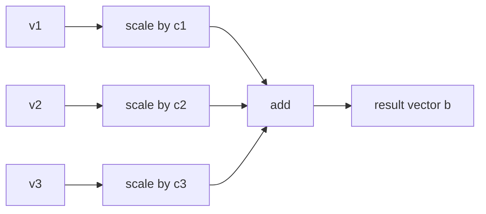

# Linear combinations and weighted mixtures

## If you landed here directly

This lesson assumes you can already do two operations:

1. add compatible vectors;
2. multiply a vector by a scalar.

Those operations were the subject of `LA-0004`.

You should also be comfortable reading a vector as:

- a displacement;
- a data record;
- a system state.

The new idea is simple to write:

$$ c_1\mathbf{v}_1+c_2\mathbf{v}_2+\cdots+c_k\mathbf{v}_k. $$

But this expression is one of the central constructions in linear algebra.

It is called a **linear combination**.

The arithmetic is not the hard part.

The important questions are:

- what are the vectors being combined?
- what do the coefficients mean?
- which combinations are allowed?
- what geometric effect do the coefficients create?
- when does a weighted mixture have a sensible data or physical meaning?
- can a desired target be built from the available vectors?

That final question leads directly to the next lesson on **span**.

---

## The problem worth understanding

Suppose a robot has two basic movement commands:

```math
\mathbf{u}=
\begin{bmatrix}
1\\
0
\end{bmatrix},
\qquad
\mathbf{v}=
\begin{bmatrix}
0\\
1
\end{bmatrix}.
```

One unit of `u` moves east.

One unit of `v` moves north.

How can we describe:

- three units east and two units north?
- one half unit east and four units north?
- two units west and one unit north?

The same pattern solves all three.

```math
3\mathbf{u}+2\mathbf{v}
=
\begin{bmatrix}
3\\
2
\end{bmatrix},
```

```math
\frac12\mathbf{u}+4\mathbf{v}
=
\begin{bmatrix}
0.5\\
4
\end{bmatrix},
```

and

```math
-2\mathbf{u}+\mathbf{v}
=
\begin{bmatrix}
-2\\
1
\end{bmatrix}.
```

The two vectors act like available building directions.

The scalars tell us how much of each direction to use.

This is the basic mental model:

> a linear combination builds a new vector by scaling available vectors and then adding the results.

---

## The formal definition

Given vectors

$$ \mathbf{v}_1,\mathbf{v}_2,\ldots,\mathbf{v}_k $$

and scalars

$$ c_1,c_2,\ldots,c_k, $$

an expression of the form

$$ c_1\mathbf{v}_1+c_2\mathbf{v}_2+\cdots+c_k\mathbf{v}_k $$

is a **linear combination** of those vectors.

The `c_i` values are called:

- coefficients;
- scalar weights;
- combination weights.

At this level, those words are interchangeable enough for practical use.

But be careful with the word **weight**.

A linear-combination weight does **not** have to be:

- positive;
- between zero and one;
- normalized to sum to one.

Those restrictions belong to special kinds of mixtures.

A generic linear combination allows any scalar coefficients permitted by the underlying scalar system.

In this course at L0, those scalars are usually real numbers.

---

## Why this idea is larger than it looks

A linear combination contains the two operations from LA-0004:

```text
scale
then
add
```

That repeated pattern becomes the language of:

- span;
- matrix-vector multiplication;
- systems of equations;
- basis coordinates;
- linear transformations;
- eigenvector expansions;
- Fourier-like representations;
- least squares;
- data decomposition;
- signal models;
- machine learning.

The subject keeps asking variations of:

> which objects can be built from which building blocks, using scalar scaling and addition?

---

## One vector is already a linear combination

If you have one vector `v`, then

$$ 3\mathbf{v} $$

is a linear combination of `v`.

So is:

$$ -\frac12\mathbf{v}. $$

So is:

$$ 0\mathbf{v}=\mathbf{0}. $$

A linear combination does not require many vectors.

The general definition includes the one-vector case.

---

## Vector addition is also a special linear combination

The sum

$$ \mathbf{u}+\mathbf{v} $$

can be written as

$$ 1\mathbf{u}+1\mathbf{v}. $$

So ordinary vector addition is a linear combination whose coefficients are both one.

This is useful because it unifies earlier operations.

Instead of thinking:

```text
addition
scalar multiplication
linear combination
```

as three unrelated topics, think:

```text
linear combination
=
repeated scalar multiplication
+
vector addition
```

---

## Subtraction is also inside the same framework

Because

$$ \mathbf{u}-\mathbf{v}=\mathbf{u}+(-1)\mathbf{v}, $$

subtraction is also a linear combination.

This is a powerful habit:

> rewrite subtraction as addition with a negative coefficient.

That lets one algebraic pattern cover:

- addition;
- subtraction;
- scaling;
- cancellation.

---

## The zero vector is always reachable

For any compatible vectors,

$$ 0\mathbf{v}_1+0\mathbf{v}_2+\cdots+0\mathbf{v}_k=\mathbf{0}. $$

So the zero vector is always a linear combination of any nonempty list of vectors.

This fact later becomes important when we study:

- span;
- linear independence;
- null spaces.

For now, remember:

> choosing every coefficient as zero gives the zero vector.

---

## Coefficients control contribution

Consider:

$$ 2\mathbf{u}-3\mathbf{v}+\frac12\mathbf{w}. $$

Each coefficient tells us how its vector contributes.

- `2` doubles `u`;
- `-3` reverses and triples `v`;
- `1/2` halves `w`.

Then those scaled vectors are added.

A coefficient can therefore control:

- magnitude;
- sign or orientation;
- cancellation;
- relative influence.

---

## Order of the written terms does not change the result

Because ordinary vector addition is commutative,

$$ 2\mathbf{u}-3\mathbf{v} $$

and

$$ -3\mathbf{v}+2\mathbf{u} $$

represent the same vector.

But this does **not** mean the labels on coefficients are interchangeable.

If you swap the coefficient values without swapping their vectors, you change the combination.

For example:

$$ 2\mathbf{u}+5\mathbf{v} $$

is generally different from

$$ 5\mathbf{u}+2\mathbf{v}. $$

The coefficient belongs to its vector.

---

## Mental model: vectors as generators

For this lesson, it is useful to call the available vectors **generators**.

Suppose you are given:

$$ \mathbf{v}_1,\mathbf{v}_2,\mathbf{v}_3. $$

Imagine them as reusable building directions.

You are allowed to:

1. resize each;
2. reverse it if the coefficient is negative;
3. discard it if the coefficient is zero;
4. add the scaled results.

Then a linear combination is one output generated by that process.



The next lesson asks:

> what is the entire set of possible outputs?

That set is the **span**.

---

## Coordinate calculation

Suppose

```math
\mathbf{u}=
\begin{bmatrix}
u_1\\
u_2
\end{bmatrix},
\qquad
\mathbf{v}=
\begin{bmatrix}
v_1\\
v_2
\end{bmatrix}.
```

Then

```math
a\mathbf{u}+b\mathbf{v}
=
\begin{bmatrix}
au_1+bv_1\\
au_2+bv_2
\end{bmatrix}.
```

Every coordinate is formed from the **same coefficient pair** `a,b`.

That is important.

You do not get to use one coefficient for the first coordinate and a different coefficient for the second coordinate unless that change is part of the vector itself.

The vectors are scaled as whole objects.

---

## A worked symbolic example

Let

```math
\mathbf{u}=
\begin{bmatrix}
2\\
1
\end{bmatrix},
\qquad
\mathbf{v}=
\begin{bmatrix}
-1\\
3
\end{bmatrix}.
```

Compute

$$ 4\mathbf{u}-2\mathbf{v}. $$

First scale:

```math
4\mathbf{u}
=
\begin{bmatrix}
8\\
4
\end{bmatrix},
```

and

```math
-2\mathbf{v}
=
\begin{bmatrix}
2\\
-6
\end{bmatrix}.
```

Then add:

```math
4\mathbf{u}-2\mathbf{v}
=
\begin{bmatrix}
10\\
-2
\end{bmatrix}.
```

Or compute directly:

```math
4
\begin{bmatrix}
2\\
1
\end{bmatrix}
-
2
\begin{bmatrix}
-1\\
3
\end{bmatrix}
=
\begin{bmatrix}
4(2)-2(-1)\\
4(1)-2(3)
\end{bmatrix}
=
\begin{bmatrix}
10\\
-2
\end{bmatrix}.
```

Both views describe the same operation.

---

## Geometry: combinations of two directions

Suppose `u` and `v` are two nonparallel displacement vectors in the plane.

A combination

$$ a\mathbf{u}+b\mathbf{v} $$

means:

1. move according to scaled `u`;
2. move according to scaled `v`;
3. take the net displacement.

Because `a` and `b` can vary, many endpoints become possible.

If the two directions genuinely point in different directions, the combinations can sweep across the plane.

If the two vectors lie on the same line, the combinations remain on that line.

You do not need the formal span conclusion yet.

But notice the geometry.

The **relationship among the generators** determines what their combinations can reach.

---

## Coefficients live in their own space

For two generators, a coefficient choice is an ordered pair:

$$ (a,b). $$

For three generators, it is:

$$ (a,b,c). $$

This means there are two kinds of objects in the problem:

1. coefficient vectors;
2. generated vectors.

For example:

```text
coefficient choice:
(2, -1)

generators:
u, v

generated output:
2u - v
```

Later matrix-vector multiplication will package this process into a single expression.

For now, keep coefficient space and output space conceptually separate.

---

## Different coefficient choices can sometimes produce the same output

Suppose

$$ \mathbf{w}=2\mathbf{u}. $$

Then:

$$ 2\mathbf{u}+0\mathbf{w} $$

and

$$ 0\mathbf{u}+1\mathbf{w} $$

produce the same vector.

So a generated vector does not always determine a unique coefficient list.

That question later becomes connected to:

- redundancy;
- linear dependence;
- bases;
- unique coordinates.

At L0, just notice the possibility.

---

## Cancellation is a feature, not a bug

Take:

$$ \mathbf{v}-\mathbf{v}=\mathbf{0}. $$

Two nonzero contributions can cancel.

More generally, several weighted vectors can partially or completely cancel.

This matters in:

- forces;
- displacements;
- signals;
- portfolios;
- state changes;
- model components.

A small final vector does not imply small individual contributions.

---

## Weighted mixture does not always mean average

The phrase **weighted mixture** is intuitive, but it can mislead.

Consider:

$$ 0.2\mathbf{u}+0.8\mathbf{v}. $$

The weights are:

- nonnegative;
- sum to one.

That behaves like an interpolation or average-like mixture.

Now consider:

$$ 3\mathbf{u}-2\mathbf{v}. $$

This is still a linear combination.

But it is not an ordinary average.

The coefficients:

- include a negative value;
- sum to one only by coincidence.

And:

$$ 5\mathbf{u}+7\mathbf{v} $$

is also a linear combination even though the weights sum to twelve.

Therefore:

> every average-like weighted mixture is a linear combination, but not every linear combination is an average.

---

## Nonnegative weights are a special restriction

If all coefficients satisfy:

$$ c_i\ge 0, $$

then no generator is reversed by a negative coefficient.

That creates a restricted family of combinations.

Later mathematics gives such restricted families names and geometric interpretations.

At this stage, the important distinction is:

```text
generic linear combination:
coefficients may have any sign

nonnegative mixture:
coefficients are constrained
```

Do not silently impose positivity unless the model requires it.

---

## Weights summing to one are another special restriction

Suppose:

$$ c_1+c_2+\cdots+c_k=1. $$

This can be useful when combining:

- proportions;
- probabilities;
- normalized mixtures;
- locations;
- model outputs.

But it is an extra condition.

The definition of linear combination does not require it.

This distinction prevents a common mistake:

> “linear-combination coefficients must sum to one.”

They do not.

---

## Example LA-EX-013 — build a displacement from two movement primitives

A mobile robot has two reusable displacement primitives:

```math
\mathbf{u}=
\begin{bmatrix}
2\\
1
\end{bmatrix},
\qquad
\mathbf{v}=
\begin{bmatrix}
-1\\
2
\end{bmatrix}.
```

Suppose we choose coefficients:

$$ a=2,\qquad b=3. $$

Then:

```math
2\mathbf{u}+3\mathbf{v}
=
2
\begin{bmatrix}
2\\
1
\end{bmatrix}
+
3
\begin{bmatrix}
-1\\
2
\end{bmatrix}
=
\begin{bmatrix}
1\\
8
\end{bmatrix}.
```

Interpretation:

- `2u` contributes two copies of the first movement;
- `3v` contributes three copies of the second;
- the net effect is one unit east and eight units north.

Now choose:

$$ a=2,\qquad b=-1. $$

Then:

```math
2\mathbf{u}-\mathbf{v}
=
\begin{bmatrix}
5\\
0
\end{bmatrix}.
```

The north-south components cancel exactly.

This shows why negative coefficients matter.

They can create cancellation and new directions.

---

## The same arithmetic can describe data mixtures

Suppose two standardized data profiles are:

```math
\mathbf{x}_1=
\begin{bmatrix}
1\\
2\\
0
\end{bmatrix},
\qquad
\mathbf{x}_2=
\begin{bmatrix}
3\\
-1\\
4
\end{bmatrix}.
```

Then:

```math
0.25\mathbf{x}_1+0.75\mathbf{x}_2
=
\begin{bmatrix}
2.5\\
-0.25\\
3
\end{bmatrix}.
```

As algebra, the computation is valid.

But whether it represents a meaningful real entity depends on the data semantics.

If coordinates are:

- normalized features;
- physical measurements;
- categorical encodings;
- counts;

the interpretation changes.

Linear algebra supplies the operation.

The model supplies the meaning.

---

## Example LA-EX-014 — a weighted sensor signature

Suppose a sensor system has two calibrated response signatures:

```math
\mathbf{s}_1=
\begin{bmatrix}
4\\
1\\
2
\end{bmatrix},
\qquad
\mathbf{s}_2=
\begin{bmatrix}
0\\
3\\
2
\end{bmatrix}.
```

A measured pattern is approximated as:

$$ 0.6\mathbf{s}_1+0.4\mathbf{s}_2. $$

Compute:

```math
0.6\mathbf{s}_1
=
\begin{bmatrix}
2.4\\
0.6\\
1.2
\end{bmatrix},
```

```math
0.4\mathbf{s}_2
=
\begin{bmatrix}
0\\
1.2\\
0.8
\end{bmatrix},
```

so:

```math
0.6\mathbf{s}_1+0.4\mathbf{s}_2
=
\begin{bmatrix}
2.4\\
1.8\\
2
\end{bmatrix}.
```

Because the coefficients are nonnegative and sum to one, this looks like an average-like mixture.

But the interpretation is justified only if the sensor model is approximately additive.

If the sensor saturates or interacts nonlinearly, the linear mixture can fail physically even though the arithmetic remains correct.

---

## Linear models make an assumption

When we write:

$$ c_1\mathbf{v}_1+c_2\mathbf{v}_2, $$

we are assuming that the modeled effects can be:

- scaled;
- superposed by addition.

In mathematics, that operation is defined.

In applications, superposition may be an approximation.

Examples where it may work well:

- small displacements;
- some signal models;
- financial position vectors;
- certain force models.

Examples where it may fail:

- saturated sensors;
- chemical reactions with nonlinear interactions;
- biological systems with thresholds;
- temperatures under an inappropriate scale interpretation.

So ask two separate questions:

1. Is the linear combination mathematically valid?
2. Is the linear model scientifically or semantically justified?

---

## Units must remain coherent

Suppose:

```math
\mathbf{u}=
\begin{bmatrix}
3\ \text{m}\\
2\ \text{m}
\end{bmatrix}.
```

A dimensionless scalar coefficient such as `2` produces:

```math
2\mathbf{u}
=
\begin{bmatrix}
6\ \text{m}\\
4\ \text{m}
\end{bmatrix}.
```

But if a coefficient itself carries units, the output units change.

In applied work, coefficient units are part of the model.

Do not treat scalars as semantically empty.

---

## Combining vectors requires compatible coordinate meaning

Suppose:

```text
u = [temperature, humidity]
v = [mass, time]
```

Both are two-coordinate vectors.

That does not make them meaningful generators of one shared state space.

A linear combination can be written mathematically if we forget semantics.

But the model may be nonsense.

This repeats a rule from LA-0004:

> matching shape is necessary for coordinate-wise operations, but not sufficient for modeling validity.

---

## Generators should belong to one modeled space

When we say:

> take a linear combination of these vectors,

we normally mean the vectors are being treated as members of the same vector space.

At L0, that often means:

- all are in `R^2`;
- all are in `R^3`;
- all are feature vectors with the same coordinate contract;
- all are state-change vectors of the same model.

Later, abstract vector spaces make this precise.

For now:

> the generators must be compatible objects under the same addition and scalar-multiplication rules.

---

## Example LA-EX-015 — mixture versus generic linear combination

Consider two color-like feature vectors:

```math
\mathbf{a}=
\begin{bmatrix}
1\\
0
\end{bmatrix},
\qquad
\mathbf{b}=
\begin{bmatrix}
0\\
1
\end{bmatrix}.
```

### Average-like mixture

$$ 0.3\mathbf{a}+0.7\mathbf{b} $$

gives:

```math
\begin{bmatrix}
0.3\\
0.7
\end{bmatrix}.
```

The coefficients are nonnegative and sum to one.

### Generic linear combination

$$ 2\mathbf{a}-\mathbf{b} $$

gives:

```math
\begin{bmatrix}
2\\
-1
\end{bmatrix}.
```

This is a valid linear combination.

But if the coordinates must represent nonnegative physical proportions, the output may not be a valid physical mixture.

So:

> mathematical reachability and domain validity are separate constraints.

---

## Targets turn combinations into equations

A common problem has the form:

> Can we find coefficients so that a combination equals a target vector?

For two generators:

$$ a\mathbf{u}+b\mathbf{v}=\mathbf{t}. $$

Here:

- `u,v` are available generators;
- `a,b` are unknown coefficients;
- `t` is the desired target.

This is one of the fundamental forms of a linear algebra problem.

Soon, systems of equations and matrix notation will give us systematic tools for solving it.

At this stage, we can solve simple cases by inspection or coordinate equations.

---

## Solving a simple target problem

Let:

```math
\mathbf{u}=
\begin{bmatrix}
1\\
1
\end{bmatrix},
\qquad
\mathbf{v}=
\begin{bmatrix}
1\\
-1
\end{bmatrix},
\qquad
\mathbf{t}=
\begin{bmatrix}
6\\
2
\end{bmatrix}.
```

We want:

$$ a\mathbf{u}+b\mathbf{v}=\mathbf{t}. $$

Coordinate-wise:

```math
a
\begin{bmatrix}
1\\
1
\end{bmatrix}
+
b
\begin{bmatrix}
1\\
-1
\end{bmatrix}
=
\begin{bmatrix}
a+b\\
a-b
\end{bmatrix}.
```

So we need:

$$ a+b=6 $$

and

$$ a-b=2. $$

Adding the equations gives:

$$ 2a=8, $$

so:

$$ a=4. $$

Then:

$$ b=2. $$

Check:

```math
4\mathbf{u}+2\mathbf{v}
=
\begin{bmatrix}
6\\
2
\end{bmatrix}
=
\mathbf{t}.
```

The target is buildable from the generators.

---

## The coefficient-finding problem connects combinations to systems

Notice what happened.

The vector equation:

$$ a\mathbf{u}+b\mathbf{v}=\mathbf{t} $$

became scalar equations coordinate by coordinate.

That is the bridge between:

- linear combinations;
- systems of linear equations.

Later we will package the same structure as:

$$ A\mathbf{x}=\mathbf{b}. $$

But we are deliberately postponing matrix machinery.

First learn what the matrix equation means.

---

## Example LA-EX-016 — can the target be built?

Take:

```math
\mathbf{u}=
\begin{bmatrix}
2\\
0
\end{bmatrix},
\qquad
\mathbf{v}=
\begin{bmatrix}
0\\
3
\end{bmatrix}.
```

Target:

```math
\mathbf{t}=
\begin{bmatrix}
5\\
-6
\end{bmatrix}.
```

We seek:

$$ a\mathbf{u}+b\mathbf{v}=\mathbf{t}. $$

Coordinate-wise:

$$ 2a=5, $$

$$ 3b=-6. $$

Therefore:

$$ a=2.5,\qquad b=-2. $$

So:

```math
2.5\mathbf{u}-2\mathbf{v}
=
\begin{bmatrix}
5\\
-6
\end{bmatrix}.
```

Now change the generators:

```math
\mathbf{p}=
\begin{bmatrix}
1\\
2
\end{bmatrix},
\qquad
\mathbf{q}=
\begin{bmatrix}
2\\
4
\end{bmatrix}.
```

Notice:

$$ \mathbf{q}=2\mathbf{p}. $$

Any combination:

$$ a\mathbf{p}+b\mathbf{q} $$

becomes:

$$ (a+2b)\mathbf{p}. $$

So every result stays on the same line as `p`.

A target off that line cannot be built.

That observation is exactly what the next lesson formalizes as **span**.

---

## Linear combinations create families of outputs

Fix the generators.

Vary the coefficients.

For:

$$ a\mathbf{u}+b\mathbf{v}, $$

each coefficient pair `(a,b)` produces one output.

So we can imagine a function:

```text
coefficient choice
→ generated vector
```

For example:

```text
(0,0) → 0
(1,0) → u
(0,1) → v
(1,1) → u+v
(2,-1) → 2u-v
```

The entire family of outputs is more important than any one calculation.

That family is what span describes.

---

## Geometry of one generator

With one nonzero vector `v`, all combinations have form:

$$ c\mathbf{v}. $$

As `c` varies over real numbers, the outputs lie along the line through the origin in the direction of `v`.

Positive coefficients go one way.

Negative coefficients go the opposite way.

Zero gives the origin.

This is the first geometric span intuition.

---

## Geometry of two parallel generators

Suppose:

$$ \mathbf{v}=3\mathbf{u}. $$

Then:

$$ a\mathbf{u}+b\mathbf{v}=(a+3b)\mathbf{u}. $$

So adding the second generator does not create a new direction.

It may give many different coefficient descriptions.

But every output remains on the same line.

This is the first hint of redundancy.

---

## Geometry of two nonparallel generators

If two planar vectors point in genuinely different directions, varying two real coefficients can reach much more of the plane.

A useful geometric picture is a grid generated by integer coefficients:

```text
... -u+v     v       u+v ...
... -u       0       u   ...
... -u-v    -v       u-v ...
```

Allowing all real coefficients fills the gaps continuously.

The next lesson makes this precise.

---

## Three vectors can be redundant

Suppose:

$$ \mathbf{w}=\mathbf{u}+\mathbf{v}. $$

Then adding `w` as a third generator does not necessarily create any new outputs.

Any combination:

$$ a\mathbf{u}+b\mathbf{v}+c\mathbf{w} $$

becomes:

$$ (a+c)\mathbf{u}+(b+c)\mathbf{v}. $$

So `w` can already be built from `u` and `v`.

This anticipates linear dependence without defining it formally.

---

## Coefficient uniqueness is a separate question

There are at least three different questions:

1. Can the target be built?
2. If yes, what coefficients build it?
3. Are those coefficients unique?

Do not combine these into one question.

Later:

- span addresses reachability;
- linear independence addresses redundancy and uniqueness structure;
- basis combines reachability with nonredundancy.

This lesson supplies the common language.

---

## Linear combinations in data science

Many models represent an object as a weighted combination of components.

Examples include:

- feature construction;
- latent factors;
- principal-component expansions;
- linear predictors;
- signal decompositions.

A generic form is:

$$ \mathbf{x}\approx c_1\mathbf{v}_1+\cdots+c_k\mathbf{v}_k. $$

The vectors may represent learned or chosen components.

The coefficients may represent how strongly each component contributes.

Later courses will add:

- estimation;
- optimization;
- noise;
- constraints.

The linear-combination idea remains underneath.

---

## Linear combinations in neural engineering

Suppose a neural recording at one instant is represented by a vector of channel voltages.

A model might approximate that vector as a combination of several source patterns:

$$ \mathbf{y}\approx c_1\mathbf{s}_1+\cdots+c_k\mathbf{s}_k. $$

This does **not** mean the biological system is literally linear in every respect.

It means a linear combination is being used as a model.

That distinction is essential.

---

## Linear combinations in language models

Embedding systems often use vector arithmetic and weighted aggregations.

Attention mechanisms eventually produce weighted combinations of value vectors.

The weights there have additional structure produced by the model.

But the basic mathematical operation is still:

> scale vectors and add them.

This is one reason foundational linear algebra transfers across domains.

---

## Linear combinations in control and state models

A state change may be modeled as a combination of actuator effects:

$$ \Delta\mathbf{x}=u_1\mathbf{b}_1+\cdots+u_m\mathbf{b}_m. $$

Here:

- `b_i` describes a state-change direction associated with an actuator;
- `u_i` describes the chosen input magnitude.

This is a direct engineering interpretation of linear combination.

Later systems courses will make such models more formal.

---

## A coefficient is not automatically a probability

If you see:

$$ 0.2\mathbf{u}+0.8\mathbf{v}, $$

it is tempting to call `0.2` and `0.8` probabilities.

They are probabilities only if the model says so and the probability requirements are satisfied.

A linear-combination coefficient is simply a scalar coefficient unless additional meaning is defined.

This distinction matters in:

- mixtures;
- statistics;
- attention;
- portfolios;
- interpolation.

---

## Negative coefficients are often meaningful

Negative coefficients can represent:

- opposite displacement;
- subtraction of a component;
- short financial exposure;
- inhibitory or opposing effect in a simplified model;
- residual correction.

Do not reject negative weights just because the word “mixture” sounds positive.

Instead ask:

> does the application permit signed contribution?

---

## Large coefficients can reveal model strain

Mathematically, coefficients can be arbitrarily large.

In applications, very large coefficients may indicate:

- extrapolation;
- poor conditioning;
- near redundancy among generators;
- physically unrealistic actuation;
- amplified noise.

Those are advanced ideas.

For now, learn the diagnostic habit:

> mathematically allowed does not automatically mean numerically or physically sensible.

---

## The coordinate system still matters

A linear combination is an operation on vector objects.

Coordinates represent those vectors relative to a chosen coordinate system or basis.

Later, the same vector may have different coordinates in another basis.

The structural statement:

$$ \mathbf{b}=c_1\mathbf{v}_1+\cdots+c_k\mathbf{v}_k $$

is about the vector objects.

The coordinate arrays used to compute it depend on representation.

This connects back to LA-0002.

---

## Linear combination versus concatenation

Given:

```math
\mathbf{u}=
\begin{bmatrix}
1\\
2
\end{bmatrix},
\qquad
\mathbf{v}=
\begin{bmatrix}
3\\
4
\end{bmatrix},
```

a linear combination such as:

```math
2\mathbf{u}-\mathbf{v}
=
\begin{bmatrix}
-1\\
0
\end{bmatrix}
```

remains a two-coordinate vector.

Concatenation would create:

```math
\begin{bmatrix}
1\\
2\\
3\\
4
\end{bmatrix}.
```

These are different operations.

Linear combination combines vectors **within one shared space**.

Concatenation builds a larger coordinate representation.

---

## Linear combination versus element-wise weighting by a vector

Suppose:

```math
\mathbf{w}=
\begin{bmatrix}
2\\
5
\end{bmatrix},
\qquad
\mathbf{v}=
\begin{bmatrix}
3\\
4
\end{bmatrix}.
```

The operation:

```math
\begin{bmatrix}
2\cdot 3\\
5\cdot 4
\end{bmatrix}
=
\begin{bmatrix}
6\\
20
\end{bmatrix}
```

uses a different weight for each coordinate.

That is **not** scalar multiplication of `v` by one scalar.

And by itself it is not the same as a linear combination of multiple vectors.

Later you may learn element-wise products.

Keep the operations distinct.

---

## Linear combination versus nonlinear transformation

Consider:

```math
\begin{bmatrix}
x_1^2\\
x_2^2
\end{bmatrix}.
```

This transforms a vector by squaring coordinates.

It is not a linear combination of fixed generator vectors with coefficients that are simply the original scalar inputs in the usual sense.

The word **linear** matters.

Later, linear transformations will preserve linear combinations.

---

## A preview of linear transformations

Suppose a transformation `T` is linear.

Then it obeys:

$$ T(a\mathbf{u}+b\mathbf{v})=aT(\mathbf{u})+bT(\mathbf{v}). $$

This means linear transformations respect the combination structure.

We are not proving or fully defining linear transformations yet.

But this preview explains why linear combinations are central:

> linear maps are exactly the maps that preserve this kind of weighted addition structure.

---

## Common failure mode: weights must sum to one

False for generic linear combinations.

The coefficients can be:

$$ 5,-2,17.3,\frac14,0 $$

or any other allowed scalars.

Sum-to-one is an additional restriction used in special settings.

---

## Common failure mode: weights must be positive

False.

Negative coefficients are valid in ordinary real linear combinations.

Whether they make sense in an application depends on the model.

---

## Common failure mode: all vectors of the same length can be combined meaningfully

They can be algebraically compatible in `R^n`.

That does not guarantee compatible units or semantics.

---

## Common failure mode: a combination is a new coordinate appended to the data

No.

The result remains in the same modeled vector space when the operations are valid.

Concatenation is different.

---

## Common failure mode: coefficients belong to coordinates

A scalar coefficient scales the whole vector.

If you want coordinate-specific scaling, that is another operation.

---

## Common failure mode: a small result means small components

Large weighted vectors can cancel.

Always inspect contributions, not just the final norm or coordinates.

---

## Common failure mode: one target means one unique coefficient set

Not necessarily.

Redundant generators can create multiple coefficient descriptions of the same output.

---

## Common failure mode: linear mixture means the real system is linear

No.

A linear combination can be:

- an exact mathematical relation;
- an approximation;
- a local model;
- a convenient feature construction.

The scientific claim must be justified separately.

---

## Active work

### Exercise 1 — build combinations mechanically

Let:

```math
\mathbf{u}=
\begin{bmatrix}
1\\
2
\end{bmatrix},
\qquad
\mathbf{v}=
\begin{bmatrix}
3\\
-1
\end{bmatrix}.
```

Compute:

1. `2u + v`
2. `u - 3v`
3. `-u + 0.5v`
4. `0u + 0v`

For each, write the scaled components before adding.

### Exercise 2 — classify the coefficients

For each coefficient pair below, say whether it is:

- a generic linear combination;
- nonnegative;
- sum-to-one;
- average-like.

Pairs:

```text
(0.2, 0.8)
(2, -1)
(3, 4)
(-0.5, 1.5)
```

### Exercise 3 — target equation

Given:

```math
\mathbf{u}=
\begin{bmatrix}
1\\
0
\end{bmatrix},
\qquad
\mathbf{v}=
\begin{bmatrix}
1\\
1
\end{bmatrix},
```

find `a,b` such that:

```math
a\mathbf{u}+b\mathbf{v}
=
\begin{bmatrix}
4\\
3
\end{bmatrix}.
```

Check your answer by direct substitution.

### Exercise 4 — semantic compatibility

Construct two vectors with the same shape but incompatible coordinate meaning.

Explain:

- why the arithmetic can be written;
- why the model does not justify the combination.

### Exercise 5 — physical mixture versus linear combination

Give one application where coefficients should be:

- nonnegative;
- sum to one.

Then give another application where negative coefficients are natural.

### Exercise 6 — redundancy preview

Let:

$$ \mathbf{w}=2\mathbf{u}. $$

Find three different coefficient pairs `(a,b)` such that:

$$ a\mathbf{u}+b\mathbf{w}=4\mathbf{u}. $$

What does this suggest about uniqueness?

### Exercise 7 — reachability picture

Draw two vectors in the plane.

First make them parallel.

Sketch several combinations.

Then make them nonparallel.

Sketch several combinations.

Describe how the reachable geometry changes.

### Exercise 8 — model critique

A researcher says:

> “My measurements are vectors, so the average of any two measurements is physically meaningful.”

Give two reasons that conclusion can fail.

---

## Retrieval check

Without looking back:

1. What is a linear combination?
2. What are the coefficients?
3. Which two earlier operations build every linear combination?
4. Why is vector addition a special linear combination?
5. Why is subtraction a linear combination?
6. Why is the zero vector always a linear combination of available generators?
7. Do coefficients need to be positive?
8. Do coefficients need to sum to one?
9. What does a negative coefficient do geometrically?
10. What does a zero coefficient do?
11. What is a generator in the mental model of this lesson?
12. What is the difference between coefficient space and output space?
13. Can two different coefficient lists produce the same output?
14. What causes cancellation?
15. Why is an average-like mixture only a special kind of linear combination?
16. Why can matching vector shape still be semantically insufficient?
17. Why should units be checked?
18. What problem is represented by `a u + b v = t`?
19. How does a vector target equation become scalar equations?
20. What happens geometrically when there is only one nonzero generator?
21. What happens when two generators are parallel?
22. What changes when two planar generators are nonparallel?
23. Why can a third generator be redundant?
24. What three questions distinguish reachability, coefficients, and uniqueness?
25. Why is a linear data model not automatically a claim that nature is linear?
26. Why is concatenation different from linear combination?
27. Why is coordinate-wise scaling by different factors not scalar multiplication?
28. Why do linear transformations care about linear combinations?
29. What concept does the next lesson use to describe all reachable combinations?
30. Why is linear combination one of the recurring operations of linear algebra?

---

## Connection backward: LA-0004

LA-0004 gave you:

$$ \mathbf{u}+\mathbf{v} $$

and

$$ a\mathbf{v}. $$

This lesson simply repeats those operations:

$$ c_1\mathbf{v}_1+\cdots+c_k\mathbf{v}_k. $$

But repeating them changes the question.

Instead of asking:

> what is one addition?

we can ask:

> what vectors can be built from a collection of generators?

That is the beginning of structural linear algebra.

---

## Connection backward: LA-0003

LA-0003 showed that vectors can represent:

- displacement;
- data;
- state.

This lesson shows that linear combinations inherit those interpretations only when the model supports scaling and addition.

So the same algebraic expression can mean:

```text
net displacement
weighted data profile
combined state change
actuator superposition
signal decomposition
```

depending on context.

---

## Connection forward: LA-0006

The next canonical lesson is:

`LA-N-0006 — Span: what combinations can reach`.

This lesson studied **one combination at a time**.

Span asks for the whole set:

$$ \{c_1\mathbf{v}_1+\cdots+c_k\mathbf{v}_k\}. $$

The central question becomes:

> is the target inside the set of reachable combinations?

The examples with parallel and nonparallel generators were preparation for exactly that question.

---

## Connection forward: linear equations

The equation:

$$ a\mathbf{u}+b\mathbf{v}=\mathbf{t} $$

creates scalar equations in the unknown coefficients.

That is why linear combinations and systems of linear equations are two views of the same structure.

Later:

```text
combination view
↔
equation view
↔
matrix view
```

will become one of the most important translations in the course.

---

## Connection forward: matrix-vector multiplication

Eventually we will write:

$$ A\mathbf{x}. $$

One of the most useful interpretations is:

> `Ax` is a linear combination of the columns of `A`, with coefficients taken from `x`.

That future statement should feel natural after this lesson.

Matrix multiplication will package the combination operation rather than replace it.

---

## Connection to LLMs

Modern machine learning constantly forms weighted vector combinations.

Later you will encounter:

- embedding combinations;
- linear layers;
- attention-weighted sums;
- residual additions.

The computational systems are much more elaborate.

But the primitive operation:

```text
scale vectors
+
add vectors
```

is still here.

---

## Connection to neural engineering

Neural data can be represented as vectors.

Models may describe observed activity as weighted mixtures of:

- source patterns;
- components;
- basis functions;
- latent states.

Understanding a linear combination lets you separate:

- the mathematical representation;
- the biological interpretation;
- the assumptions that make the model plausible.

---

## What this unlocks

You should now be able to:

- define a linear combination;
- compute linear combinations of coordinate vectors;
- interpret coefficients as scalar contributions;
- use positive, zero, fractional, and negative coefficients correctly;
- distinguish generic linear combinations from average-like normalized mixtures;
- test semantic and unit compatibility;
- formulate target-building problems;
- recognize that coefficient uniqueness is a separate issue;
- recognize redundancy informally;
- connect vector equations to future systems of equations;
- predict how generator geometry constrains reachable outputs.

That is enough to ask the next structural question:

> what is the complete set of vectors these generators can reach?

That set is their span.

---

## References

- **LA-REF-001** — MIT OpenCourseWare, `18.06 Linear Algebra`.
- **LA-REF-002** — MIT OpenCourseWare, `18.06SC Linear Algebra`.
- **LA-REF-003** — Sheldon Axler, *Linear Algebra Done Right*, 4th ed.
- **LA-REF-004** — Stephen Boyd and Lieven Vandenberghe, *Introduction to Applied Linear Algebra — Vectors, Matrices, and Least Squares*.
