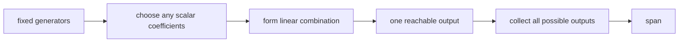

# Span: what combinations can reach

## If you landed here directly

This lesson assumes `LA-0005`.

You should already know how to form a linear combination:

$$ c_1\mathbf{v}_1+c_2\mathbf{v}_2+\cdots+c_k\mathbf{v}_k. $$

You should also know that the coefficients:

- can be positive;
- can be negative;
- can be zero;
- do not have to sum to one.

`LA-0005` asked:

> what vector does one chosen set of coefficients produce?

This lesson asks a larger question:

> if we allow **all** possible coefficient choices, what vectors can the generators reach?

The answer is called their **span**.

By the end, you should be able to:

- define span as a set of all linear combinations;
- visualize span in simple 2D and 3D cases;
- decide whether a target belongs to a span in simple examples;
- distinguish span from one particular linear combination;
- explain why redundant generators may not enlarge a span;
- explain why the zero vector is always in a span;
- distinguish span from a shifted line or average-only mixture;
- connect span to future ideas such as solvability, column space, basis, and linear independence.

---

## The problem worth understanding

Suppose a robot can execute two primitive displacements:

```math
\mathbf{u}=
\begin{bmatrix}
1\\
0
\end{bmatrix},
\qquad
\mathbf{v}=
\begin{bmatrix}
0\\
1
\end{bmatrix}.
```

One coefficient pair produces one movement:

```math
2\mathbf{u}+3\mathbf{v}
=
\begin{bmatrix}
2\\
3
\end{bmatrix}.
```

Another pair produces:

```math
-4\mathbf{u}+\frac12\mathbf{v}
=
\begin{bmatrix}
-4\\
0.5
\end{bmatrix}.
```

But suppose we stop choosing one pair and instead ask:

> What happens if `a` and `b` are allowed to be **any real numbers**?

Then we are no longer studying one output.

We are studying the entire family:

$$ a\mathbf{u}+b\mathbf{v}. $$

For these particular `u` and `v`, every vector in the plane can be produced.

That reachable set is their span.

---

## Formal definition

Given vectors:

$$ \mathbf{v}_1,\mathbf{v}_2,\ldots,\mathbf{v}_k, $$

their **span** is the set of all linear combinations:

$$ \mathrm{span}\{\mathbf{v}_1,\ldots,\mathbf{v}_k\}=\{c_1\mathbf{v}_1+\cdots+c_k\mathbf{v}_k:c_1,\ldots,c_k\in\mathbb{R}\}. $$

We will write the span notation as:

$$ \mathrm{span}\{\mathbf{v}_1,\ldots,\mathbf{v}_k\}. $$

Read it as:

> the set of every vector reachable by scaling and adding the listed generators.

---

## Span is a set, not one vector

This is the first conceptual distinction.

A linear combination such as:

$$ 2\mathbf{u}-3\mathbf{v} $$

is one vector.

The span:

$$ \mathrm{span}\{\mathbf{u},\mathbf{v}\} $$

is a whole set of vectors.

So:

```text
linear combination
→ one chosen output

span
→ all possible outputs
```

Do not use these as synonyms.

---

## The generators define a reachability system

A useful engineering mental model is:



The generators are fixed.

The coefficients vary.

The span is the complete reachable set.

This language connects naturally to:

- control inputs;
- movement primitives;
- signal dictionaries;
- basis functions;
- matrix columns;
- model components.

---

## One nonzero generator spans a line through the origin

Let:

```math
\mathbf{v}=
\begin{bmatrix}
2\\
1
\end{bmatrix}.
```

All linear combinations of this one vector have form:

$$ c\mathbf{v}. $$

Examples:

```text
c = 0     → [0, 0]
c = 1     → [2, 1]
c = 2     → [4, 2]
c = -1    → [-2, -1]
c = 0.5   → [1, 0.5]
```

Every result lies on the same line through the origin.

Therefore:

> one nonzero vector in the plane spans the line through the origin pointing in that vector's direction.

---

## Why the line must pass through the origin

Set the coefficient to zero:

$$ 0\mathbf{v}=\mathbf{0}. $$

So the zero vector is always included.

This means a shifted line such as:

```text
y = 2x + 3
```

cannot be the span of a set of ordinary vectors in `R^2`, because it does not contain the origin.

This distinction will later separate:

- linear sets;
- affine shifted sets.

At L0, remember:

> every span contains the zero vector.

---

## The zero vector alone spans only zero

Consider:

$$ \mathrm{span}\{\mathbf{0}\}. $$

Every possible combination is:

$$ c\mathbf{0}=\mathbf{0}. $$

So:

$$ \mathrm{span}\{\mathbf{0}\}=\{\mathbf{0}\}. $$

The zero vector contributes no direction.

It is a generator that cannot move you anywhere.

---

## Example LA-EX-017 — one generator and the reachable line

Let:

```math
\mathbf{v}=
\begin{bmatrix}
3\\
-2
\end{bmatrix}.
```

Which targets belong to its span?

### Target A

```math
\mathbf{t}_A=
\begin{bmatrix}
6\\
-4
\end{bmatrix}.
```

Since:

$$ \mathbf{t}_A=2\mathbf{v}, $$

it belongs to the span.

### Target B

```math
\mathbf{t}_B=
\begin{bmatrix}
-1.5\\
1
\end{bmatrix}.
```

Since:

$$ \mathbf{t}_B=-\frac12\mathbf{v}, $$

it also belongs.

### Target C

```math
\mathbf{t}_C=
\begin{bmatrix}
3\\
-1
\end{bmatrix}.
```

If it were in the span, we would need one scalar `c` satisfying:

```math
3c=3
```

and:

```math
-2c=-1.
```

The first requires:

$$ c=1. $$

The second requires:

$$ c=\frac12. $$

No single scalar works.

So `t_C` is not in the span.

Geometrically, it lies off the generator's line.

---

## Span membership is a target-building question

To ask:

$$ \mathbf{t}\in\mathrm{span}\{\mathbf{u},\mathbf{v}\}? $$

means:

> Are there coefficients `a,b` such that

$$ a\mathbf{u}+b\mathbf{v}=\mathbf{t}? $$

This is extremely important.

Span membership is not mysterious set theory.

It is a coefficient-solving problem.

```text
target is in span
⇔
some allowed coefficient choice reaches it
```

---

## Two generators can span only one line

Suppose:

$$ \mathbf{v}=3\mathbf{u}. $$

Then:

$$ a\mathbf{u}+b\mathbf{v}=a\mathbf{u}+3b\mathbf{u}=(a+3b)\mathbf{u}. $$

Every combination is still just a scalar multiple of `u`.

So the second vector adds no new direction.

Therefore:

$$ \mathrm{span}\{\mathbf{u},\mathbf{v}\}=\mathrm{span}\{\mathbf{u}\}. $$

This is our first precise encounter with **redundancy**.

---

## More generators do not automatically mean a larger span

You can add ten vectors.

If every one is already a scalar multiple or combination of the earlier ones, the reachable set may not grow at all.

This is a crucial principle:

> count of listed generators is not the same as number of genuinely new directions.

Later, linear independence will make “genuinely new direction” precise.

---

## Two nonparallel vectors in the plane

Suppose:

```math
\mathbf{u}=
\begin{bmatrix}
1\\
0
\end{bmatrix},
\qquad
\mathbf{v}=
\begin{bmatrix}
1\\
1
\end{bmatrix}.
```

A generic combination is:

```math
a\mathbf{u}+b\mathbf{v}
=
\begin{bmatrix}
a+b\\
b
\end{bmatrix}.
```

Given any target:

```math
\mathbf{t}=
\begin{bmatrix}
x\\
y
\end{bmatrix},
```

choose:

$$ b=y $$

and:

$$ a=x-y. $$

Then:

```math
a\mathbf{u}+b\mathbf{v}
=
\begin{bmatrix}
x\\
y
\end{bmatrix}.
```

So every target in `R^2` is reachable.

These two nonparallel generators span the plane.

---

## Parallel versus nonparallel is the geometric fork in R2

For two nonzero planar vectors:

```text
parallel
→ span is one line through origin

nonparallel
→ span is the entire plane
```

This is one of the most useful L0 geometric facts.

You do not need determinants yet.

You do not need row reduction yet.

You can often see the answer geometrically.

---

## Example LA-EX-018 — same number of generators, different span

Compare two pairs.

### Pair A

```math
\mathbf{u}=
\begin{bmatrix}
1\\
2
\end{bmatrix},
\qquad
\mathbf{v}=
\begin{bmatrix}
2\\
4
\end{bmatrix}.
```

Because:

$$ \mathbf{v}=2\mathbf{u}, $$

both lie on one line.

So:

$$ \mathrm{span}\{\mathbf{u},\mathbf{v}\} $$

is that line.

### Pair B

```math
\mathbf{p}=
\begin{bmatrix}
1\\
2
\end{bmatrix},
\qquad
\mathbf{q}=
\begin{bmatrix}
2\\
3
\end{bmatrix}.
```

These are not parallel.

Their combinations can move in two genuinely different planar directions.

So they span all of `R^2`.

Same number of generators.

Different reachable sets.

The geometry of the generators matters more than the count.

---

## A span contains infinitely many vectors

Even a one-vector span contains:

$$ c\mathbf{v} $$

for every real `c`.

There are infinitely many coefficient choices.

So a finite generator list can describe an infinite set.

This compression is one reason linear algebra is powerful.

A small list of vectors can specify a whole geometric or data structure.

---

## Span is closed under more linear combinations

Suppose:

$$ \mathbf{x}\in\mathrm{span}\{\mathbf{u},\mathbf{v}\} $$

and:

$$ \mathbf{y}\in\mathrm{span}\{\mathbf{u},\mathbf{v}\}. $$

Then any combination:

$$ a\mathbf{x}+b\mathbf{y} $$

is also in the same span.

Why?

Write:

$$ \mathbf{x}=c_1\mathbf{u}+c_2\mathbf{v} $$

and:

$$ \mathbf{y}=d_1\mathbf{u}+d_2\mathbf{v}. $$

Then:

```math
a\mathbf{x}+b\mathbf{y}
=
(ac_1+bd_1)\mathbf{u}
+
(ac_2+bd_2)\mathbf{v}.
```

That is another linear combination of the original generators.

Later this property becomes part of the formal idea of a **subspace**.

For now:

> once you are inside a span, further scaling and addition cannot take you outside it.

---

## The span is the smallest linear set containing the generators

This phrase is worth understanding.

The span must contain:

- every generator;
- every scalar multiple of every generator;
- every sum of those multiples;
- every further linear combination of reachable vectors.

But it contains nothing that cannot be produced by those rules.

So:

> the span is exactly the smallest set closed under linear combination that contains the generators.

You do not need abstract set proofs yet.

This is a useful structural intuition.

---

## Adding a vector already in the span changes nothing

Suppose:

$$ \mathbf{w}=2\mathbf{u}-3\mathbf{v}. $$

Then `w` is already reachable from `u,v`.

So:

$$ \mathrm{span}\{\mathbf{u},\mathbf{v},\mathbf{w}\}=\mathrm{span}\{\mathbf{u},\mathbf{v}\}. $$

Why?

Any combination involving `w` can be rewritten using `u,v`.

The new generator creates another description.

It does not create another reachable vector.

---

## Removing a redundant generator changes nothing

The previous statement works in reverse.

If one listed vector can already be built from the others, removing it does not shrink the span.

This prepares for basis.

A basis will eventually be a generator list that:

- reaches the whole space;
- contains no redundancy.

But we are not defining basis formally yet.

---

## Rescaling a nonzero generator does not change its one-dimensional span

For any nonzero scalar `c`:

$$ \mathrm{span}\{\mathbf{v}\}=\mathrm{span}\{c\mathbf{v}\}. $$

Example:

```math
\mathbf{v}=
\begin{bmatrix}
1\\
2
\end{bmatrix},
\qquad
3\mathbf{v}=
\begin{bmatrix}
3\\
6
\end{bmatrix}.
```

Both point along the same line.

The parameterization changes.

The reachable set does not.

---

## Sign reversal does not change span

Similarly:

$$ \mathrm{span}\{\mathbf{v}\}=\mathrm{span}\{-\mathbf{v}\}. $$

Why?

The coefficient is already allowed to be negative.

Changing the listed generator's orientation only changes which coefficient gives each point.

Span cares about reachability, not the preferred arrow direction.

---

## Generator order does not change span

Because all linear combinations allow independent scalar coefficients, listing:

```text
u, v, w
```

or:

```text
w, u, v
```

does not change the set of reachable vectors.

The coefficient labels must follow the reordered vectors.

But the span itself is unchanged.

---

## Duplicate generators do not enlarge span

$$ \mathrm{span}\{\mathbf{u},\mathbf{u}\}=\mathrm{span}\{\mathbf{u}\}. $$

Duplicating a generator adds another coefficient parameter but no new direction.

This gives an early warning:

> more parameters can describe the same output set.

That issue later connects to nonunique solutions.

---

## Coefficient uniqueness is not part of the definition of span

Suppose:

$$ \mathbf{w}=\mathbf{u}+\mathbf{v}. $$

A target may have one representation using `u,v`:

$$ \mathbf{t}=2\mathbf{u}+3\mathbf{v}. $$

With `w` included, the same target may be represented in many ways.

For example:

$$ \mathbf{t}=(2-c)\mathbf{u}+(3-c)\mathbf{v}+c\mathbf{w}. $$

for any real `c`.

All of those coefficient choices produce the same target.

Span asks:

> is the target reachable?

It does **not** ask:

> is the representation unique?

That second question belongs to linear independence and basis.

---

## Example LA-EX-019 — target membership by solving coefficients

Let:

```math
\mathbf{u}=
\begin{bmatrix}
1\\
2
\end{bmatrix},
\qquad
\mathbf{v}=
\begin{bmatrix}
2\\
-1
\end{bmatrix}.
```

Test whether:

```math
\mathbf{t}=
\begin{bmatrix}
8\\
1
\end{bmatrix}
```

belongs to:

$$ \mathrm{span}\{\mathbf{u},\mathbf{v}\}. $$

We need:

$$ a\mathbf{u}+b\mathbf{v}=\mathbf{t}. $$

Coordinate-wise:

$$ a+2b=8 $$

and:

$$ 2a-b=1. $$

From the first equation:

$$ a=8-2b. $$

Substitute:

$$ 2(8-2b)-b=1. $$

So:

$$ 16-5b=1, $$

which gives:

$$ b=3. $$

Then:

$$ a=2. $$

Check:

```math
2
\begin{bmatrix}
1\\
2
\end{bmatrix}
+
3
\begin{bmatrix}
2\\
-1
\end{bmatrix}
=
\begin{bmatrix}
8\\
1
\end{bmatrix}.
```

Therefore:

$$ \mathbf{t}\in\mathrm{span}\{\mathbf{u},\mathbf{v}\}. $$

This is span membership as a solvability problem.

---

## Failure to solve means target is outside the span

If the coefficient equations contradict one another, then no linear combination reaches the target.

Example with one generator:

```math
\mathbf{v}=
\begin{bmatrix}
2\\
1
\end{bmatrix},
\qquad
\mathbf{t}=
\begin{bmatrix}
4\\
3
\end{bmatrix}.
```

We would need:

$$ 2c=4 $$

and:

$$ c=3. $$

The first says `c=2`.

The second says `c=3`.

Impossible.

Therefore the target is outside the span.

This same logic will later become:

> a linear system is inconsistent.

---

## Three-dimensional intuition

In `R^3`, a single nonzero vector spans a line through the origin.

Two nonparallel vectors usually span a plane through the origin.

A third vector may:

- lie inside that plane and add no new reach;
- point outside the plane and enlarge reach to all of `R^3`.

This is the three-dimensional version of the same generator question.

```text
one new direction
→ line

second genuinely new direction
→ plane

third genuinely new direction
→ 3D space
```

Later dimension and independence make “genuinely new direction” exact.

---

## Two vectors in R3 do not usually span all of R3

Even if two vectors are nonparallel in 3D, their combinations:

$$ a\mathbf{u}+b\mathbf{v} $$

have only two independent scalar controls.

Geometrically they remain in the plane through the origin determined by the two directions.

A target outside that plane cannot be reached.

This becomes important in:

- 3D force systems;
- robotics;
- control;
- data subspaces.

---

## A plane that does not pass through zero is not a span

Every span contains zero.

Therefore a geometric plane such as:

```text
z = 5
```

cannot itself be a span in ordinary `R^3`.

It is a shifted plane.

This is another early distinction between:

- linear structure;
- affine structure.

Later courses will formalize affine spaces.

---

## Span is not the line segment between vectors

If you restrict coefficients to:

```text
a ≥ 0
b ≥ 0
a + b = 1
```

then:

$$ a\mathbf{u}+b\mathbf{v} $$

traces the line segment between `u` and `v`.

That is **not** the full span.

The full span allows arbitrary real coefficients.

So:

```text
span
≠
interpolation segment
```

This distinction builds on LA-0005's mixture discussion.

---

## Span is not a convex combination

A convex combination imposes:

- nonnegative coefficients;
- coefficients sum to one.

A span imposes neither.

Therefore span can extend:

- beyond the generators;
- in negative directions;
- arbitrarily far.

This is why a span is usually much larger than an average-like mixture set.

---

## Span is not a cone either

If coefficients are restricted to nonnegative values but do not need to sum to one, we obtain a cone-like reachable set.

Span allows negative coefficients too.

Again:

```text
coefficient constraints
determine
reachable geometry
```

The word **span** specifically means unrestricted scalar linear combinations.

---

## The origin is structurally special

Because every span contains zero, span geometry is centered at the origin in a linear sense.

This does not mean every vector has small magnitude near zero.

It means the allowed operations include:

- zero scaling;
- sign reversal;
- cancellation.

The origin is the neutral element for vector addition.

---

## A data interpretation

Suppose:

```math
\mathbf{p}_1=
\begin{bmatrix}
1\\
0\\
2
\end{bmatrix},
\qquad
\mathbf{p}_2=
\begin{bmatrix}
0\\
1\\
1
\end{bmatrix}.
```

Their span contains every vector:

```math
a\mathbf{p}_1+b\mathbf{p}_2
=
\begin{bmatrix}
a\\
b\\
2a+b
\end{bmatrix}.
```

So every reachable data vector satisfies:

$$ x_3=2x_1+x_2. $$

This is a two-parameter family inside a three-coordinate space.

The span captures a structural relationship among coordinates.

---

## Span can describe a low-dimensional model inside high-dimensional data

Suppose measurements have 100 coordinates.

A model claims every measurement is approximately built from three source patterns:

$$ \mathbf{x}\approx c_1\mathbf{s}_1+c_2\mathbf{s}_2+c_3\mathbf{s}_3. $$

Then the model is saying the data lie approximately near:

$$ \mathrm{span}\{\mathbf{s}_1,\mathbf{s}_2,\mathbf{s}_3\}. $$

That is a low-dimensional structure inside a 100-dimensional ambient coordinate space.

This idea appears throughout:

- dimensionality reduction;
- signal processing;
- neuroscience;
- machine learning.

---

## Ambient space versus span

The **ambient space** is the larger coordinate space in which vectors live.

The span can be smaller.

Example:

```text
vectors live in R3
but
their span is one line
```

or:

```text
vectors live in R100
but
their span is a 3-dimensional structure
```

Do not confuse:

```text
number of coordinates
with
number of directions actually reachable
```

Dimension later formalizes this.

---

## Span in a physical model

Suppose two actuators produce state-change directions:

```math
\mathbf{b}_1,
\qquad
\mathbf{b}_2.
```

If input amplitudes can be any real numbers, then instantaneous state changes of the simplified linear model lie in:

$$ \mathrm{span}\{\mathbf{b}_1,\mathbf{b}_2\}. $$

A desired state-change vector outside that span cannot be produced by those actuators under the model.

This is a reachability interpretation of span.

---

## Physical constraints can make actual reach smaller than mathematical span

Suppose an actuator cannot apply negative force.

Mathematically:

$$ c\mathbf{v} $$

with any real `c` spans a full line.

Physically, if only:

$$ c\ge0 $$

is allowed, only one ray may be achievable.

Therefore:

> mathematical span assumes unrestricted scalar coefficients.

Real systems may impose:

- sign limits;
- saturation;
- amplitude bounds;
- safety constraints;
- nonlinear interactions.

Always separate mathematical span from constrained physical reachability.

---

## Example LA-EX-020 — signal dictionary and redundancy

Suppose three signal patterns are:

```math
\mathbf{s}_1=
\begin{bmatrix}
1\\
0\\
1
\end{bmatrix},
\qquad
\mathbf{s}_2=
\begin{bmatrix}
0\\
1\\
1
\end{bmatrix},
\qquad
\mathbf{s}_3=
\begin{bmatrix}
1\\
1\\
2
\end{bmatrix}.
```

Notice:

$$ \mathbf{s}_3=\mathbf{s}_1+\mathbf{s}_2. $$

Therefore:

$$ \mathbf{s}_3\in\mathrm{span}\{\mathbf{s}_1,\mathbf{s}_2\}. $$

Adding `s_3` cannot enlarge the span:

$$ \mathrm{span}\{\mathbf{s}_1,\mathbf{s}_2,\mathbf{s}_3\}=\mathrm{span}\{\mathbf{s}_1,\mathbf{s}_2\}. $$

But it can make coefficient descriptions nonunique.

This is exactly the kind of redundancy that linear independence will later detect.

---

## Span membership can be easy geometrically and hard algebraically

In `R^2`, you may see immediately that:

- a target lies on a line;
- two generators are nonparallel.

In higher dimensions, visual intuition becomes unreliable.

Then we need algebraic tools.

Those tools will include:

- systems of linear equations;
- matrices;
- elimination;
- rank.

Span is the question those tools help answer.

---

## Linear equations are the next bridge

The next canonical lesson is:

`LA-N-0007 — Linear equations as constraints`.

A span-membership equation:

$$ a\mathbf{u}+b\mathbf{v}=\mathbf{t} $$

creates scalar coordinate constraints.

Example:

```math
a
\begin{bmatrix}
u_1\\
u_2
\end{bmatrix}
+
b
\begin{bmatrix}
v_1\\
v_2
\end{bmatrix}
=
\begin{bmatrix}
t_1\\
t_2
\end{bmatrix}
```

means:

$$ au_1+bv_1=t_1 $$

and:

$$ au_2+bv_2=t_2. $$

So:

```text
span membership
↔
existence of a solution to linear equations
```

This connection is central.

---

## Matrix preview: columns as generators

Later, after matrices are introduced, suppose:

```math
A=
\begin{bmatrix}
| & | & & |\\
\mathbf{a}_1 & \mathbf{a}_2 & \cdots & \mathbf{a}_n\\
| & | & & |
\end{bmatrix}.
```

Then:

$$ A\mathbf{x} $$

will be interpreted as a linear combination of the columns:

$$ x_1\mathbf{a}_1+\cdots+x_n\mathbf{a}_n. $$

The set of all possible outputs `Ax` is the span of the columns.

That future set is called the **column space**.

So span is not a side topic.

It becomes a core interpretation of matrix equations.

---

## Solvability preview: Ax = b

Later:

$$ A\mathbf{x}=\mathbf{b} $$

will have a solution exactly when `b` can be built from the columns of `A`.

In span language:

> `b` must lie in the span of the columns.

MIT's column-space viewpoint makes this one of the central translations of linear algebra.

You are learning the geometric meaning before learning the matrix machinery.

---

## Span and linear independence answer different questions

Span asks:

> Do the generators reach enough vectors?

Linear independence asks:

> Are any generators redundant?

A list can:

- span a large space but be redundant;
- be nonredundant but fail to span the desired ambient space;
- eventually be both spanning and nonredundant.

That last condition leads to basis.

---

## Span and basis

A basis is not simply:

> any set that spans.

A basis must also avoid redundancy.

So span gives one half of the basis idea.

Later:

```text
basis
=
spanning
+
linear independence
```

This is one of the key structural identities of the subject.

---

## Span and dimension

Suppose one nonzero vector spans a line.

We intuitively call that one-dimensional.

Two nonparallel vectors span a plane.

We intuitively call that two-dimensional.

Three genuinely new directions can span `R^3`.

Later dimension formalizes the number of independent directions needed to span a space.

So this lesson is already building dimension intuition.

---

## A span can be generated many different ways

The same line can be generated by:

```text
[1,2]
[2,4]
[-3,-6]
```

individually.

The same plane can be generated by many different vector pairs.

Therefore a span is not tied to one unique generator list.

The **set** is the object.

The generator list is one description.

---

## Generator choice can matter computationally

Even when two generator lists have the same span, one can be numerically easier to use than another.

Generators that are nearly parallel can make coefficient-solving sensitive.

Later numerical linear algebra will study:

- conditioning;
- orthogonality;
- stable bases.

At L0, remember:

> same span does not imply equally good coordinates.

---

## Nearly parallel is not exactly parallel

In exact mathematics:

- parallel vectors give a one-dimensional span;
- nonparallel planar vectors give all of `R^2`.

But in numerical applications, vectors that are almost parallel can behave poorly.

They technically span the plane.

Yet reaching some directions may require very large, canceling coefficients.

This previews numerical conditioning.

Do not collapse:

```text
mathematically reachable
and
numerically robust
```

into the same question.

---

## Cancellation can hide large coefficients

Suppose:

```math
\mathbf{u}=
\begin{bmatrix}
1\\
1
\end{bmatrix},
\qquad
\mathbf{v}=
\begin{bmatrix}
1\\
1.001
\end{bmatrix}.
```

They are not exactly parallel.

So they span `R^2`.

But to build a nearly vertical difference direction, large opposite coefficients may be needed.

The final vector can be small even though individual contributions are large.

This is a warning for:

- noise amplification;
- unstable decompositions;
- overinterpreting coefficient magnitude.

Formal conditioning comes much later.

---

## Span is about exact reach unless stated otherwise

When we ask:

$$ \mathbf{t}\in\mathrm{span}\{\mathbf{v}_1,\ldots,\mathbf{v}_k\}, $$

we mean exact equality.

In data analysis, we often instead ask:

> how close can the span get to the target?

That leads later to:

- projection;
- least squares;
- approximation.

So distinguish:

```text
exact membership
from
best approximation
```

Both are important, but they are different problems.

---

## A target outside the span can still have a nearest point in the span

Imagine a line through the origin in the plane.

A target lies off the line.

It is not in the span.

But there is a closest point on the line.

Finding that point is a projection problem.

Later, orthogonality and least squares will solve it systematically.

Span therefore defines the model's **allowable exact outputs**.

Projection handles what happens when data fall outside that set.

---

## Span in machine learning

Suppose model features form vectors:

$$ \mathbf{f}_1,\ldots,\mathbf{f}_k. $$

A linear predictor may operate with combinations of those features.

A learned representation may be modeled inside a lower-dimensional span.

But be cautious:

- neural networks are generally nonlinear;
- learned manifolds need not be linear subspaces;
- local linear approximations may still be useful.

Span is a model of linear reachability, not a universal description of data geometry.

---

## Span in neural engineering

Suppose several stereotyped spatial electrode patterns are represented as vectors:

$$ \mathbf{s}_1,\mathbf{s}_2,\mathbf{s}_3. $$

A linear source-mixture model might assume:

$$ \mathbf{y}=c_1\mathbf{s}_1+c_2\mathbf{s}_2+c_3\mathbf{s}_3. $$

Then every model-predicted measurement lies in:

$$ \mathrm{span}\{\mathbf{s}_1,\mathbf{s}_2,\mathbf{s}_3\}. $$

If a measured pattern lies far outside that span, possibilities include:

- missing sources;
- noise;
- nonlinear effects;
- model mismatch;
- changing electrode geometry.

Span becomes a model-diagnostic concept.

---

## Span in control

Suppose actuator direction vectors are columns of an input model.

Their span tells us which instantaneous directions the linearized actuator system can generate.

If a desired direction lies outside the span, no coefficient choice can produce it under that model.

This is a direct bridge from abstract linear algebra to engineering reachability.

---

## Span and units

All generators should belong to the same modeled vector space.

A span formed from:

```text
meters
plus
kilograms
```

without a meaningful coordinate contract is not automatically a valid physical model.

The same semantic caution from LA-0004 and LA-0005 remains.

Span expands algebraic reachability.

It does not repair bad modeling assumptions.

---

## Span and coordinate representation

A geometric line can be represented in different coordinate systems.

Its coordinate vectors change.

The underlying spanned geometric set can remain the same.

Later basis changes will formalize this.

At this stage, remember:

> coordinate arrays are representations; span is a structural relationship among vector objects.

---

## Common failure mode: span is one linear combination

Incorrect.

A linear combination is one output.

Span is the set of all such outputs.

---

## Common failure mode: more generators always enlarge span

Incorrect.

A new generator already inside the old span adds no new reach.

---

## Common failure mode: two vectors always span a plane

Incorrect.

If they are parallel, they span only one line.

---

## Common failure mode: any line is a span

Incorrect.

A one-dimensional span must pass through the origin.

---

## Common failure mode: span means coefficients between zero and one

Incorrect.

Span uses unrestricted scalar coefficients.

Interpolation and convex combinations impose extra constraints.

---

## Common failure mode: if a target is in span, its coefficients are unique

Not necessarily.

Redundant generators can create many coefficient representations.

---

## Common failure mode: if a target is outside span, the model is useless

Not necessarily.

Approximation by the nearest point in the span may still be useful.

That becomes least squares.

---

## Common failure mode: ambient dimension equals span dimension

Incorrect.

Vectors can live in `R^100` while their span is generated by only a few genuine directions.

---

## Common failure mode: mathematical span equals physical reachability

Not if coefficients are physically constrained.

Actuator saturation, sign restrictions, safety bounds, and nonlinearities can shrink actual reach.

---

## Common failure mode: span tells you whether generators are redundant

Span alone tells you the reachable set.

To analyze redundancy systematically, we need linear independence.

---

## Common failure mode: near-parallel and parallel are the same

Mathematically they are different.

Numerically, near-parallel generators can still create instability.

This distinction matters later.

---

## Active work

### Exercise 1 — one-vector span

Let:

```math
\mathbf{v}=
\begin{bmatrix}
4\\
-2
\end{bmatrix}.
```

Decide whether each target is in `span{v}`:

```math
\begin{bmatrix}
8\\
-4
\end{bmatrix},
\qquad
\begin{bmatrix}
-2\\
1
\end{bmatrix},
\qquad
\begin{bmatrix}
4\\
-1
\end{bmatrix}.
```

For each answer, provide the scalar coefficient or explain the contradiction.

### Exercise 2 — parallel versus nonparallel

For each pair, decide whether the span is a line or all of `R^2`:

```math
\mathbf{u}=
\begin{bmatrix}
1\\
3
\end{bmatrix},
\quad
\mathbf{v}=
\begin{bmatrix}
2\\
6
\end{bmatrix};
```

```math
\mathbf{p}=
\begin{bmatrix}
1\\
3
\end{bmatrix},
\quad
\mathbf{q}=
\begin{bmatrix}
2\\
5
\end{bmatrix}.
```

Explain geometrically before doing algebra.

### Exercise 3 — target membership

Given:

```math
\mathbf{u}=
\begin{bmatrix}
1\\
1
\end{bmatrix},
\qquad
\mathbf{v}=
\begin{bmatrix}
2\\
-1
\end{bmatrix},
```

test whether:

```math
\mathbf{t}=
\begin{bmatrix}
7\\
1
\end{bmatrix}
```

belongs to the span.

Solve for the coefficients and verify.

### Exercise 4 — redundant generator

Let:

$$ \mathbf{w}=3\mathbf{u}-2\mathbf{v}. $$

Explain why:

$$ \mathrm{span}\{\mathbf{u},\mathbf{v},\mathbf{w}\}=\mathrm{span}\{\mathbf{u},\mathbf{v}\}. $$

Do not use the phrase “obvious.”

Rewrite a generic combination involving `w`.

### Exercise 5 — shifted geometry

Explain why:

```text
y = x + 5
```

cannot be the span of ordinary vectors in `R^2`.

Then explain how a line through the origin can be a span.

### Exercise 6 — coefficient constraints

Compare the reachable sets when:

```text
a,b any real numbers
```

versus:

```text
a,b >= 0
```

versus:

```text
a,b >= 0 and a+b=1
```

Use two nonparallel vectors.

### Exercise 7 — high-dimensional data

Suppose a 50-coordinate signal is modeled as:

$$ \mathbf{x}=c_1\mathbf{s}_1+c_2\mathbf{s}_2. $$

What does this claim about the model's reachable data set?

What does it **not** claim about the true data-generating process?

### Exercise 8 — exact versus approximate

Draw a line through the origin and a target point off the line.

Explain:

- why the target is outside the span;
- what a nearest-point approximation would mean;
- why these are different questions.

---

## Retrieval check

Without looking back:

1. What is span?
2. How is span different from one linear combination?
3. What varies when we form a span?
4. What stays fixed?
5. Why is zero always in every span?
6. What does one nonzero vector span in `R^2`?
7. What does the zero vector alone span?
8. Why must a one-dimensional span pass through the origin?
9. What do two parallel nonzero planar vectors span?
10. What do two nonparallel planar vectors span?
11. What does target membership in a span mean algebraically?
12. What equation tests whether `t` is in `span{u,v}`?
13. What does it mean for a generator to be redundant?
14. Why does adding a generator already in the span change nothing?
15. Why can removing a redundant generator change nothing?
16. Does rescaling a nonzero generator change its one-dimensional span?
17. Does changing generator order change span?
18. Do duplicate generators enlarge span?
19. Does span guarantee unique coefficients?
20. What is the difference between span and a convex combination?
21. What is the difference between span and a nonnegative cone-like combination set?
22. Why can two nonparallel vectors in `R^3` still fail to span all of `R^3`?
23. What happens if a third `R^3` generator lies inside the plane spanned by the first two?
24. What happens if it points outside that plane?
25. What is ambient space?
26. How can a span be lower dimensional than the ambient coordinate space?
27. Why can physical reachability be smaller than mathematical span?
28. What is the difference between exact membership and approximation?
29. How does span connect to linear equations?
30. How will span connect to matrix columns?
31. What will column space mean?
32. How is spanning different from linear independence?
33. How does basis combine two ideas?
34. Why can nearly parallel generators be numerically troublesome?
35. Why is span a useful concept in neural signal models?

---

## Connection backward: LA-0005

LA-0005 gave:

$$ c_1\mathbf{v}_1+\cdots+c_k\mathbf{v}_k. $$

For one chosen coefficient list, that produces one vector.

This lesson simply asks:

> what if we let every coefficient vary over all allowed scalars?

That change turns an operation into a geometric set.

```text
linear combination
→ one construction

span
→ all possible constructions
```

---

## Connection backward: LA-0003 and LA-0004

LA-0003 gave vectors meaning as:

- displacement;
- data;
- state.

LA-0004 gave the operations:

- addition;
- scalar multiplication.

Span combines both lessons:

> if these vectors are meaningful generators and those operations are valid, what complete set of states/displacements/data patterns can they build?

---

## Connection forward: LA-0007

The next natural sequential lesson is:

`LA-N-0007 — Linear equations as constraints`.

Span membership asks whether coefficients exist.

Coordinate-by-coordinate, that produces linear equations.

So the next bridge is:

```text
reachable target
↔
solvable coefficient equations
```

This will move us from geometric reachability to equation geometry.

---

## Connection forward: matrices

After matrices are introduced, their columns will become generator vectors.

Then:

$$ A\mathbf{x} $$

will mean:

> combine the columns of `A` using coefficients from `x`.

The set of all possible outputs will be the column span.

That is why MIT's treatment connects column space directly to whether `Ax=b` has a solution.

---

## Connection forward: linear independence

Span says:

> what can we reach?

Linear independence says:

> did we list more generators than we actually need?

The redundancy examples in this lesson were preparation for that distinction.

---

## Connection forward: basis and dimension

A basis will be a nonredundant generator list that spans the desired space.

Dimension will count how many independent directions are needed.

Your geometric intuitions:

```text
line → one direction
plane → two directions
R3 → three directions
```

will become formal.

---

## Connection forward: least squares

A target outside a span may still be approximated by a point inside it.

Later, least squares asks for the closest reachable point under a chosen geometry.

So exact span membership becomes the baseline against which approximation is defined.

---

## Connection to LLMs

Embedding vectors often inhabit high-dimensional spaces.

Learned transformations and weighted combinations can restrict or reshape the directions represented by data.

Later, rank and subspace structure help explain:

- compressed representations;
- low-rank adaptation;
- projection;
- latent directions.

Span is the first structural language for “which directions can this representation generate?”

---

## Connection to neural engineering

A neural measurement model may use source-pattern vectors.

Their span defines the exact signal patterns that the linear model can produce.

This can help distinguish:

- model-compatible activity;
- missing components;
- noise;
- drift;
- nonlinear effects.

It also prepares for low-dimensional neural population models.

---

## What this unlocks

You should now be able to reason through:

```text
fixed generator list
+
all scalar coefficient choices
→
all reachable linear combinations
=
span
```

and classify simple cases:

```text
one nonzero vector
→ line through origin

two parallel planar vectors
→ same line

two nonparallel planar vectors
→ all of R2

two nonparallel vectors in R3
→ plane through origin
```

You should also be able to translate:

```text
target is in span
```

into:

```text
there exists a coefficient solution
```

That translation is the doorway to linear equations, matrices, column space, basis, and dimension.

---

## References

- **LA-REF-001** — MIT OpenCourseWare, `18.06 Linear Algebra`.
- **LA-REF-002** — MIT OpenCourseWare, `18.06SC Linear Algebra`, especially column-space and null-space material.
- **LA-REF-003** — Sheldon Axler, *Linear Algebra Done Right*, 4th ed.
- **LA-REF-004** — Stephen Boyd and Lieven Vandenberghe, *Introduction to Applied Linear Algebra — Vectors, Matrices, and Least Squares*.
