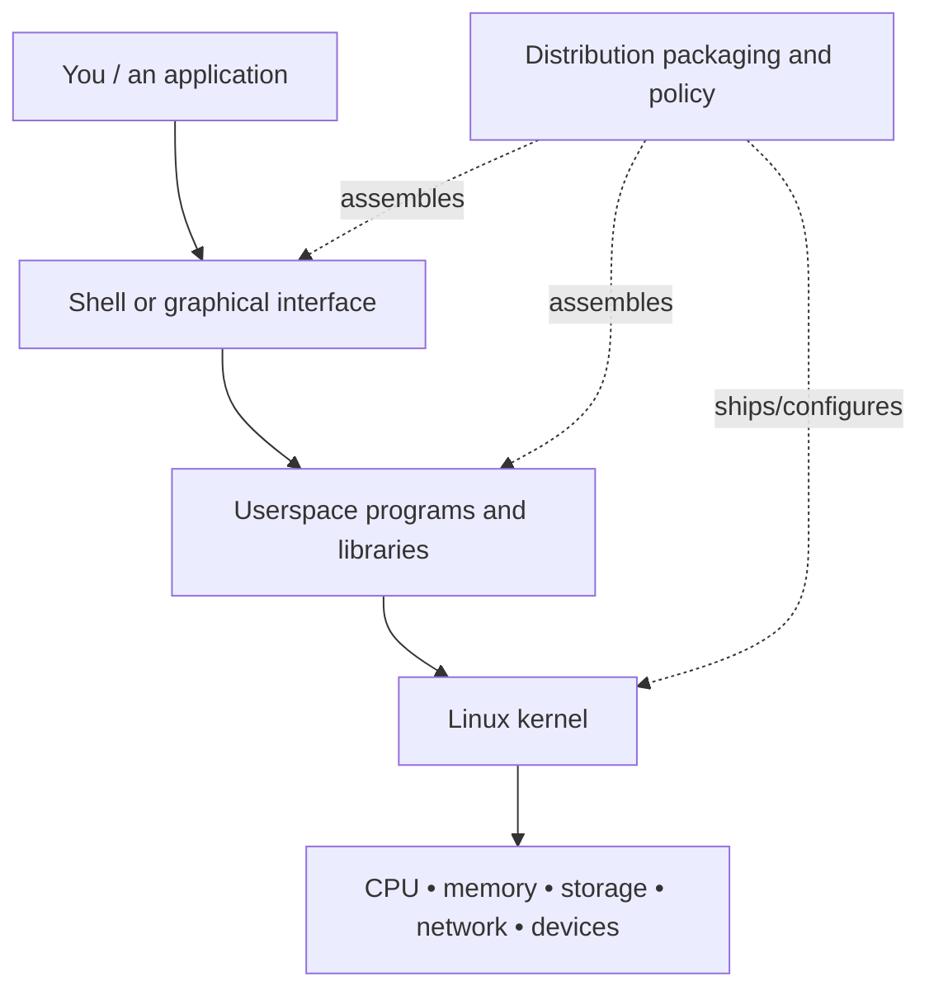

# What a Linux System Actually Is

## The problem worth understanding

A beginner often meets Linux as a black terminal window. A command is typed, text appears, and it is tempting to conclude that “Linux” is the command line. That mental model works only until the first confusing question: Is Fedora Linux? Is Bash Linux? Is GNOME Linux? Is `ls` part of the kernel? Why can the same Linux kernel sit under a server with no desktop, a laptop with a graphical interface, a container, or an embedded device?

The useful answer is that **a Linux system is a stack of cooperating layers**, not one program. This lesson builds the map that the rest of the track will keep refining.

## Mental model: a city rather than a single building

Think of a running computer as a city.

- **Hardware** is the physical terrain and machinery: CPU cores, memory chips, disks, network devices, timers, and controllers.
- **Firmware** performs early machine-specific setup and begins the boot path.
- **The Linux kernel** is the privileged core that arbitrates hardware, memory, processes, filesystems, networking, and other protected resources.
- **Userspace** contains ordinary programs that run with limited privilege and request kernel services through defined interfaces.
- **System libraries** provide reusable interfaces that programs call instead of reimplementing low-level operations.
- **Utilities and services** do everyday work: shells, text tools, login services, networking daemons, schedulers, loggers, and many more.
- **A distribution** assembles a kernel plus userspace software, package management, defaults, integration policy, release engineering, and support conventions.
- **Applications and graphical environments** are higher-level programs built on those foundations.

This layered view prevents a common category error: calling every piece of software on a Linux machine “the Linux kernel.”



## Precise concepts

### Kernel

The **kernel** executes in a privileged environment. It schedules runnable work, creates abstractions such as processes and virtual memory, mediates access to devices, implements filesystems and networking, and enforces many protection boundaries. It is not the entire operating environment.

### Userspace

**Userspace** is where ordinary processes run. Programs there cannot simply manipulate arbitrary physical memory or device registers. They ask the kernel to perform privileged operations on their behalf.

### System call

A **system call** is one controlled entry from a userspace program into kernel functionality. You do not need to memorize system-call names yet. The important idea is the boundary: a normal program requests a kernel-mediated operation rather than directly owning the machine.

### Distribution

A **Linux distribution** is an integrated operating environment built around the Linux kernel. Fedora, Debian, Ubuntu, Arch, openSUSE, and others make different choices about packaging, defaults, release cadence, tooling, and support. The kernel is central, but the distribution is much more than the kernel.

### Shell and terminal

A **terminal emulator** gives you an interactive text interface. A **shell** is a language interpreter and process launcher that reads commands, performs expansions and redirections, and starts programs. Bash is a shell. GNOME Terminal, Konsole, or another terminal program is not a shell. Neither is the Linux kernel.

## How a command crosses the layers

Consider:

```bash
printf 'hello\n' > hello.txt
```

At first glance, this looks like one “Linux command.” It is actually a chain of responsibilities.

1. Your terminal delivers characters to the shell process.
2. The shell parses the command line. It recognizes `>` as redirection syntax rather than passing the symbol as a normal argument.
3. The shell arranges for `hello.txt` to become the command's standard output destination.
4. A `printf` implementation produces the bytes for `hello` and a newline. Depending on the shell, `printf` may be a shell builtin rather than a separate executable; that distinction itself is worth learning later.
5. Userspace ultimately needs kernel-mediated file operations. The kernel resolves the path in a mounted filesystem, checks permissions, updates filesystem state, and passes data toward storage according to its buffering and I/O mechanisms.
6. Hardware controllers eventually participate in persistent storage, but the command did not talk to a disk controller directly.

The exact implementation details are deeper than this lesson. The durable model is the **chain of mediation**.

## Worked example 1: who owns `ls`?

If you run:

```bash
ls
```

three different questions can be asked:

- Who parsed the text `ls`? Usually your shell.
- Who implemented the directory-listing program? Commonly a userspace utility supplied by a package such as GNU Coreutils on GNU/Linux distributions.
- Who provides protected filesystem operations and process execution mechanisms? The kernel.

Saying “the kernel runs the `ls` command” is too vague to be a useful systems explanation.

## Worked example 2: what version of Linux am I running?

Different commands answer different questions:

```bash
uname -r
cat /etc/os-release
```

`uname -r` reports a kernel release string. `/etc/os-release` identifies the operating-system/distribution environment. A desktop's “About” dialog may show yet another version for the graphical environment. These are not contradictions; they label different layers.

## Where intuition breaks

### “Linux means the terminal”

A headless server may expose only a text shell; a workstation may use a full graphical desktop; both can be Linux systems. The terminal is one interface, not the definition of Linux.

### “Everything in `/bin` is part of the kernel”

Programs stored on a filesystem are normally userspace software. Kernel code is not simply “all the commands installed on the machine.”

### “A distribution is just a pretty skin”

A distribution makes consequential engineering choices: software versions, package dependency graphs, security updates, init/service integration, kernel configuration, filesystem defaults, installer behavior, repository policy, and more.

### “Containers contain another kernel”

Ordinary Linux containers usually share the host kernel while receiving isolated views of selected resources. This will matter much later when we study namespaces and cgroups.

## Active work

Without using a search engine, classify each item as primarily **hardware**, **firmware**, **kernel**, **userspace**, **distribution/integration**, or **application/interface**:

1. CPU
2. Bash
3. Fedora's package repositories
4. a network driver inside the kernel
5. Firefox
6. systemd
7. UEFI firmware
8. GNOME Terminal

Some items can participate in more than one architectural story. The goal is not memorization; it is to justify the most useful layer for the question being asked.

Then run, on a Linux machine where it is safe to do so:

```bash
uname -r
cat /etc/os-release
printf '%s\n' "$SHELL"
printf '%s\n' "$0"
```

Do not worry if the last two differ. Record what each command seems to identify. We will explain the subtleties later.

## Retrieval / self-explanation

Close the file and answer from memory:

1. Why is “Linux is an operating system” useful in casual speech but incomplete in a systems discussion?
2. What is the difference between a terminal and a shell?
3. Why does an ordinary userspace program need the kernel to mediate protected resources?
4. Give one example of a distribution responsibility that is not “the kernel.”
5. Trace one simple file-writing command through at least four layers.

If you cannot reconstruct the chain without looking back, reread only the section that broke your explanation and try again.

## Connections

This lesson establishes the system map used by every later Linux topic. The next node builds a safe experimental laboratory so that commands involving storage, processes, privileges, networking, and boot can be explored without treating your real machine as disposable.

Complete the companion exercise: [`LNX-EXR-0001`](../exercises/LNX-EXR-0001-build-the-linux-system-map.md).

## What this unlocks

You should now be able to ask a better question than “what does this Linux command do?” You can ask **which layer interprets it, which program implements it, which kernel service it needs, and which persistent or hardware state can change**. That question will become a recurring habit in this track.

## References

- The Open Group, *POSIX.1-2024 / The Open Group Base Specifications Issue 8*.
- Linux kernel development community, *The Linux Kernel Documentation*.
- Linux Foundation, *Introduction to Linux (LFS101)*.
- Linux man-pages project, system interface documentation.
