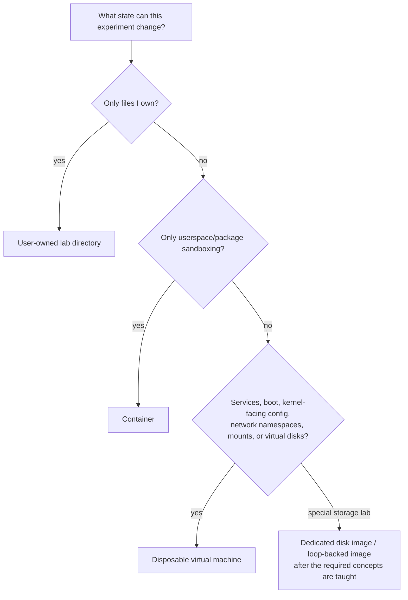

# Build a Safe Linux Learning Laboratory

## If you landed here directly

This lesson assumes only one earlier mental model: a Linux system contains layers—userspace, kernel, distribution integration, and hardware—and commands can change state at different layers. If that distinction is unfamiliar, read [`LNX-0001`](LNX-0001-what-a-linux-system-actually-is.md) first.

You do **not** need to reinstall your operating system, become root, repartition a disk, or buy another computer.

## The problem worth understanding

Linux becomes understandable by experimentation. Unfortunately, many of the most educational commands can also change packages, permissions, services, filesystems, networking, boot configuration, or disks.

Two bad learning strategies are common:

- never touching the system because every command feels dangerous;
- copying privileged commands from the internet and trusting that the machine will survive.

A better strategy is to design experiments so that **the cost of being wrong is small**.

That is the purpose of a learning laboratory.

## Mental model: choose the weakest isolation that makes failure cheap

Not every experiment needs a virtual machine. Not every experiment is safe in your normal home directory.



The principle is more important than the products:

> **Use the least powerful environment that contains the experiment's possible damage.**

## Four useful laboratory levels

### Level 1 — a normal user-owned directory

This is the default for early lessons involving:

- navigation;
- text files;
- redirection;
- shell expansion;
- scripts;
- permissions on files you own;
- process inspection;
- non-privileged programs.

Create one directory dedicated to the course:

```bash
mkdir -p ~/csf-labs/linux
cd ~/csf-labs/linux
pwd
```

Nothing about this command grants extra privilege. It simply creates directories under your own home directory.

A useful convention is one subdirectory per experiment:

```text
~/csf-labs/linux/
├── lnx-0002/
├── lnx-0003/
└── ...
```

This is not security isolation. It is **organizational containment**. A command such as `rm -rf /` does not become safe merely because your shell is currently inside `~/csf-labs/linux`.

### Level 2 — a container

A container is useful when you want a disposable userspace environment: install packages, inspect another distribution's userspace, create throwaway files, or test processes without filling your host with temporary software.

But a normal Linux container usually shares the **host kernel**. That makes it the wrong model for experiments whose point is to replace the kernel, study the machine's actual boot sequence, attach arbitrary real hardware, or treat the environment as a fully separate computer.

A container is therefore not “a tiny virtual machine.” It is an isolated process environment built using kernel mechanisms that we will study much later.

### Level 3 — a virtual machine

A VM gives you a virtual computer with its own guest kernel and virtual hardware. It is the best general-purpose laboratory for experiments involving:

- service configuration;
- package removal;
- bootloader changes;
- system-wide users and permissions;
- firewall configuration;
- filesystems and mounts;
- kernel parameters;
- deliberately breaking and recovering a system.

The critical feature for learning is not merely virtualization. It is **reversibility**.

If your VM software supports snapshots or checkpoints, take one before a destructive experiment. A snapshot turns “I hope this works” into “I can afford to find out why it fails.”

### Level 4 — a dedicated virtual disk image

Storage lessons eventually need raw block-device concepts, partition tables, filesystems, and sometimes loop devices. Those experiments deserve a file-backed image or a disposable VM disk, not a random device name copied from another person's tutorial.

We will not create or format one yet. The point today is the safety model: **a storage experiment should target an object created for that experiment**.

## The privilege boundary

A normal shell prompt and a root shell are not equivalent laboratories.

Commands run as your user are constrained by your identity and permissions. `sudo` asks the system to run a command with elevated authority according to configured policy.

The important beginner rule is:

> **Never add `sudo` merely because a command failed. First understand what permission was denied and why the operation needs more authority.**

A permission error is often useful evidence. Turning every error into a root command destroys that evidence and increases the blast radius.

## A safe read-only reconnaissance block

Inside your lab directory, these commands are useful observations:

```bash
id
pwd
uname -r
cat /etc/os-release
printf 'shell process: '
ps -p $$ -o comm=
```

They answer different questions:

- `id` — who the process is running as;
- `pwd` — where the shell is in the filesystem namespace;
- `uname -r` — which kernel release the system reports;
- `/etc/os-release` — distribution/OS identity;
- `ps -p $$` — which process is your current shell.

They are evidence-gathering commands, not system reconfiguration.

## Worked example 1: where should this experiment run?

Classify each task.

| Experiment | Good first environment | Why |
|---|---|---|
| learn `cp`, `mv`, and redirection | user-owned lab directory | only controlled files need to change |
| install and remove throwaway userspace packages | container or disposable VM | avoids polluting the host |
| intentionally break a systemd service | VM | system-wide service state is the subject |
| experiment with GRUB configuration | VM with snapshot | boot failure is a realistic outcome |
| practice filesystem creation | dedicated virtual disk/image inside a VM or later guided lab | wrong device selection can destroy real data |

The goal is not to memorize this table. Ask: **what can change, and what contains the consequences?**

## Worked example 2: a container is safer, but not magic

Suppose you launch a container and create `/tmp/demo` inside it. That path may be isolated from the host filesystem view.

Now suppose you explicitly mount a host directory into the container with write access. The container can potentially modify that mounted host data.

Isolation has boundaries. A laboratory is safe only when you understand which resources cross those boundaries.

This pattern will return throughout Linux: namespaces, mounts, capabilities, devices, network access, and cgroups all define parts of an isolation story.

## Where intuition breaks

### “I am in a test directory, so commands are safe”

The current directory is not a sandbox. Absolute paths, mounted filesystems, processes, network services, and privileged operations can reach beyond it.

### “A VM cannot hurt the host”

A VM is a strong boundary for many learning tasks, but shared folders, bridged networking, USB passthrough, clipboard integration, and mounted host resources can intentionally cross the boundary. Treat those as explicit trust links.

### “A container has its own Linux kernel”

Usually false. Ordinary Linux containers share the host kernel while isolating selected resource views.

### “Read-only-looking commands are always harmless”

Most inspection commands are low risk, but commands can trigger device access, read sensitive data, or consume resources. “Read-only” is a property to reason about, not a magic label.

### “`sudo` is an advanced mode”

`sudo` is an authorization mechanism. It does not make a command more correct.

## A destructive-command reading rule

You will eventually encounter commands involving tools such as:

```text
rm
chmod / chown
mkfs
fdisk / parted
dd
mount
systemctl
ip / nft
package-manager remove operations
bootloader tools
```

This list does **not** mean every use is destructive. It means arguments and targets matter enough that you should understand them before execution.

For a command that can destroy or reconfigure state, answer four questions first:

1. **Target:** exactly which file, process, service, network object, or block device will change?
2. **Authority:** under which user/capability/privilege will it run?
3. **Blast radius:** what is the largest plausible consequence of a mistake?
4. **Recovery:** what snapshot, copy, image, or reconstruction procedure restores the environment?

If you cannot answer those questions, the experiment is not ready to run.

## Interactive scenario: choose the lab

Pick the weakest sensible environment before revealing the suggested answer.

**A.** You want to learn quoting by creating filenames containing spaces.

<details><summary>Suggested environment</summary>
A user-owned lab directory. You need no extra isolation if you keep the exercise inside files you own.
</details>

**B.** You want to remove a network service package and observe dependency effects.

<details><summary>Suggested environment</summary>
A disposable VM is the clearest default. A container can work for a userspace-only package experiment, but may not reproduce service/boot integration faithfully.
</details>

**C.** You want to learn why an incorrect `/etc/fstab` entry can disrupt boot.

<details><summary>Suggested environment</summary>
A VM with a known-good snapshot. Breaking boot is part of the experiment, so recovery must be designed first.
</details>

## Active work: build your laboratory contract

Create:

```bash
mkdir -p ~/csf-labs/linux/lnx-0002
cd ~/csf-labs/linux/lnx-0002
```

Then write a small text file named `LAB-RULES.txt` containing your answers to:

- Which experiments will I allow directly in this directory?
- Which experiments require a container?
- Which experiments require a VM/snapshot?
- What will make me stop before using `sudo`?
- Where are files or data I must never use as test targets?

This is not bureaucracy. It converts safety from a vague feeling into an explicit experimental protocol.

## Retrieval / self-explanation

Without rereading:

1. Why is a current directory not a security sandbox?
2. What is the most important conceptual difference between a typical container and a VM?
3. Why is reversibility more useful for learning than merely being cautious?
4. What four questions should precede a destructive or privileged command?
5. Give one case where a permission error should make you investigate rather than immediately add `sudo`.

## Connections

The laboratory exists so the next lessons can become hands-on without turning the repository into a copy-paste command list. The next curriculum node is [`LNX-N-0003`](../ROADMAP.md): **The command line as a language interface**.

Complete the companion exercise: [`LNX-EXR-0002`](../exercises/LNX-EXR-0002-choose-the-right-isolation-boundary.md).

## What this unlocks

You can now separate two questions that beginners often mix:

- “Can I run this command?”
- “Have I designed an environment in which being wrong is acceptable?”

Linux expertise grows much faster when the second question becomes automatic.

## References

- Linux kernel development community, *The Linux Kernel Documentation*.
- Linux man-pages project.
- Linux Foundation, *Introduction to Linux (LFS101)*.
- Fedora Project documentation.
