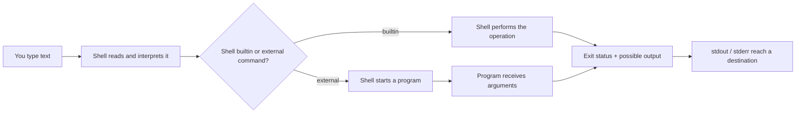
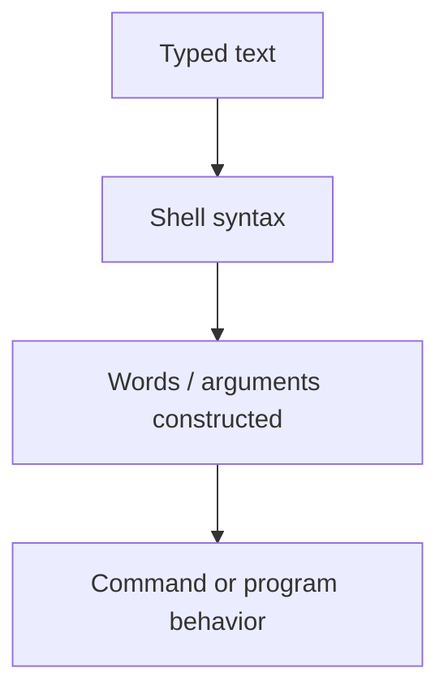
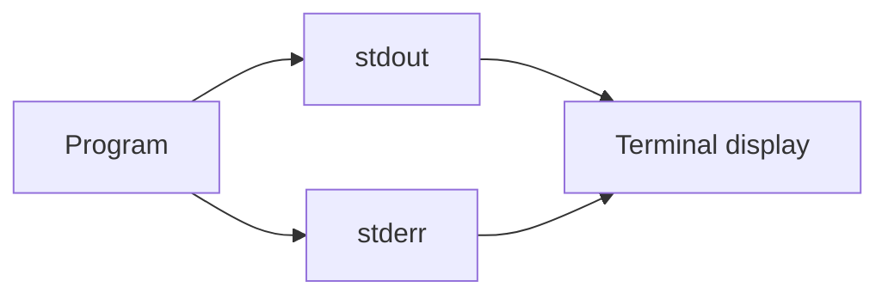

# The Command Line as a Language Interface

## If you landed here directly

You do not need to know Linux commands in advance.

This lesson assumes only two ideas:

1. a Linux system has layers, and a shell is a userspace program rather than “Linux itself”;
2. experiments should happen inside a safe environment where mistakes are cheap.

If those ideas are unfamiliar, start with [`LNX-0001`](LNX-0001-what-a-linux-system-actually-is.md) and [`LNX-0002`](LNX-0002-build-a-safe-linux-learning-laboratory.md).

The goal here is not to build a command vocabulary. It is to learn how to **read a command line as structured input**.

## The problem worth understanding

A beginner often sees this:

```bash
ls -l /etc
```

as one opaque spell: “`ls dash ell slash etc` means show files.”

That interpretation does not scale.

Later commands can look like this:

```bash
find /var/log -type f -name '*.log' -mtime -2
```

or this:

```bash
systemctl --user status example.service
```

or this:

```bash
python script.py --input data.csv --limit 50
```

Memorizing every complete string is hopeless. Understanding the **grammar of invocation** is reusable.

The command line is an interface where text is interpreted in stages. The shell reads what you type, recognizes words and shell syntax, and then either handles the command itself or invokes another program with a structured list of arguments.

That distinction is the beginning of command-line fluency.

## Mental model: from text to an invocation

At a high level, think of an interactive command like this:



Several later lessons will open individual boxes in this diagram:

- quoting and expansion;
- command lookup through `PATH`;
- process creation;
- redirection and pipelines;
- system calls.

For now, the useful model is simpler:

> **A command line is not a sentence sent directly to the kernel. The shell interprets text and constructs an invocation.**

## First distinction: the prompt is not part of the command

Documentation often shows commands like this:

```text
$ uname -r
```

The `$` is usually a **prompt symbol**, not something to type.

Likewise, some root-shell examples are shown with `#`:

```text
# some-command
```

That convention is meant to indicate privilege context. It is not universal, and your actual prompt may be long, colorful, or contain your username and directory.

For example, your terminal may show:

```text
zavira@fedora:~/csf-labs/linux/lnx-0003$
```

If the command is:

```bash
uname -r
```

then only `uname -r` is the command text.

### Interactive check

Which characters below belong to the command?

```text
student@lab:~$ printf '%s\n' hello
```

<details>
<summary>Reveal</summary>

The command text begins with `printf`. The visible `student@lab:~$` is the prompt produced by the shell environment.

</details>

## Command name, arguments, options, and operands

A useful first approximation is:

```text
command  argument  argument  argument ...
```

For many Unix-style utilities, some arguments act as **options** and others act as **operands**.

Consider:

```bash
ls -l /etc
```

A practical reading is:

| Part | Role |
|---|---|
| `ls` | command name |
| `-l` | option |
| `/etc` | operand |

The option changes *how* `ls` behaves. The operand identifies *what* it should operate on.

A common documentation notation looks like:

```text
utility [OPTION]... [OPERAND]...
```

The square brackets usually mean “optional” in documentation; you normally do **not** type the brackets.

But do not turn this pattern into a law of nature. Different programs define their own command-line interfaces. Unix conventions are strong, not absolute.

## What is an argument, precisely enough for now?

Suppose you run:

```bash
printf '%s\n' alpha beta gamma
```

You can think of the resulting invocation as roughly:

```text
program: printf
arguments:
  1: %s\n
  2: alpha
  3: beta
  4: gamma
```

The exact implementation path can differ because `printf` may be a shell builtin, but the **argument-list mental model** is still useful.

For an external program, the operating-system process ultimately receives an ordered sequence of argument strings. In C conventions this is commonly exposed as `argc` and `argv`; we will revisit that mechanism much later.

The important idea now is:

> Spaces and shell syntax help form words. Programs normally receive arguments, not the untouched line exactly as you typed it.

That is why quoting will matter later.

## Worked example 1: change one argument, change the request

Compare:

```bash
uname
```

and:

```bash
uname -r
```

The first asks `uname` for its default report. The second supplies an option that requests the kernel release.

Now compare:

```bash
printf '%s\n' alpha
```

and:

```bash
printf '%s\n' alpha beta
```

The command name has not changed. The argument list has.

This is more useful than remembering “what the whole command means.” You can inspect a new command by asking:

1. What is the command name?
2. How many arguments follow it?
3. Which arguments appear to configure behavior?
4. Which arguments appear to identify data or targets?

## Options are conventions, not punctuation magic

Many utilities use forms such as:

```text
-l
-r
-a
```

for short options and:

```text
--help
--version
--recursive
```

for long options.

But a leading hyphen does not have magical meaning to Linux. It is a convention interpreted by the program or command implementation.

This matters because something that *looks* like an option can sometimes be data.

Many utilities recognize `--` as an “end of options” marker. For example, if a filename begins with `-`, a form such as:

```bash
some-utility -- -strange-name
```

may tell the utility to stop treating later arguments as options.

Do not assume every program follows every convention. Check its documentation.

## A subtle but powerful distinction: shell syntax versus program arguments

Look at this line:

```bash
printf '%s\n' 'hello world'
```

The quotes are important to the **shell**. They tell the shell to keep `hello world` together as one word.

The receiving command does not normally get quote characters as part of that argument. Conceptually, it receives something like:

```text
argument 1: %s\n
argument 2: hello world
```

We are intentionally not learning quoting rules yet. That deserves its own lesson.

The lesson today is the boundary:



When a command behaves unexpectedly, ask **which stage misunderstood your intention**.

That question is far better than “Why is Linux weird?”

## Standard output and standard error

Commands often need to communicate two different kinds of information:

- normal result data;
- diagnostic or error information.

Unix-like processes conventionally have separate streams called:

- **standard output** (`stdout`);
- **standard error** (`stderr`).

For example:

```bash
printf '%s\n' hello
```

produces normal output.

Now try, inside your safe lab:

```bash
ls this-name-should-not-exist
```

You will probably see an error message.

Both may appear in the same terminal window, but that does **not** mean they are the same stream.



The terminal can display both channels, making them visually merge. Later, redirection will let us route them separately.

### Prediction before running

What kind of stream should contain each item?

1. the text requested from `printf`;
2. “No such file or directory” from a failed file lookup;
3. data produced by a successful reporting command.

<details>
<summary>Reasoning</summary>

Normal result data usually belongs on `stdout`; diagnostics normally belong on `stderr`. Individual programs can make poor or unusual choices, so this is a convention and interface contract rather than a physical law.

</details>

## Exit status: a second channel of meaning

Visible text is not the only result of a command.

A command also finishes with an **exit status**.

By Unix convention, status `0` means success, while nonzero values indicate some other outcome defined by the command.

Try:

```bash
true
printf 'status after true: %s\n' "$?"
```

Then:

```bash
false
printf 'status after false: %s\n' "$?"
```

`true` and `false` are tiny utilities or builtins designed mainly around exit status. They help expose an idea that becomes essential in shell scripting:

> A command can communicate through output **and** through its completion status.

`$?` is shell syntax for the most recent pipeline's status. We will explain shell parameters and expansion later; for now, treat it as a measurement instrument.

### Do not overinterpret nonzero

“Nonzero” does not always mean catastrophe. A utility may use different nonzero statuses to distinguish conditions such as:

- no match;
- invalid usage;
- missing input;
- permission failure;
- partial failure.

The program's documentation defines the meaning.

## Worked example 2: perform a command autopsy

Consider:

```bash
mkdir -p demo/subdir
```

Do not memorize it yet. Read it structurally:

```text
command name: mkdir
argument 1:   -p
argument 2:   demo/subdir
```

Likely roles:

```text
-p            option affecting creation behavior
demo/subdir   target operand
```

Now ask the safety questions from the previous lesson:

- What object can change? A directory path.
- Under whose authority? Your current user unless privilege is deliberately changed.
- What is the blast radius? The target path and parent creation behavior.
- Can you recover? In a dedicated user-owned lab directory, yes.

The command-line model and the safety model now reinforce each other.

## Worked example 3: text on screen can hide two results

Run:

```bash
printf '%s\n' 'normal-result'
ls definitely-not-present
printf 'last status: %s\n' "$?"
```

You may see three lines in one terminal:

```text
normal-result
ls: cannot access ...
last status: 2
```

But conceptually there are multiple channels and events:

1. `printf` writes normal data;
2. `ls` writes a diagnostic;
3. `ls` terminates with a status;
4. the next `printf` displays the captured status value.

A terminal is a **view**, not the complete structure of the interaction.

## Command versus program

The words are often used casually as synonyms, but a useful distinction is:

- a **program** is executable code that can be run;
- a **command** is an instruction accepted by the shell;
- some commands are implemented inside the shell itself;
- some commands cause an external program to be invoked.

For example, `cd` usually needs to affect the current shell's working directory, so shells typically implement it as a builtin. An external child process cannot simply change its parent's working directory.

We will learn how to discover whether something is a builtin, function, alias, or executable in later lessons. Today the important point is that **not every command name necessarily maps one-to-one to a separate executable file**.

## Where intuition breaks

### “Everything after the command is an option”

False. Arguments can be options, operands, values associated with options, subcommands, expressions, filenames, or application-specific data.

### “Anything beginning with `-` is definitely an option”

False. It is convention-dependent, and data can begin with `-` too.

### “The shell sends my exact line to the kernel”

False. The shell interprets syntax and usually constructs an invocation. The details become richer when expansion, redirection, pipelines, and command substitution enter the picture.

### “If I saw an error message, the exit status must be 1”

False. Nonzero statuses are command-specific. `1` is common, not universal.

### “If stdout and stderr both appear in my terminal, they are the same thing”

False. A terminal can be the destination of both independent streams.

### “Every command is a separate program on disk”

False. Shell builtins are the first important counterexample.

## Interactive command-reading drill

For each line, identify the command name first. Then make a **prediction** about the remaining words before revealing the notes.

### A

```bash
printf '%s\n' red green blue
```

<details>
<summary>Reveal</summary>

`printf` is the command name. The remaining words are arguments. The first argument acts as a format string; `red`, `green`, and `blue` are data consumed according to that format.

</details>

### B

```bash
uname -r
```

<details>
<summary>Reveal</summary>

`uname` is the command name and `-r` is an option requesting one particular part of the report.

</details>

### C

```bash
mkdir -p lab/day-1
```

<details>
<summary>Reveal</summary>

`mkdir` is the command. `-p` is an option. `lab/day-1` is the target operand. The path syntax itself is studied in the filesystem-path lessons.

</details>

### D

```bash
false
```

<details>
<summary>Reveal</summary>

There are no visible arguments. The important result is its nonzero exit status rather than normal text output.

</details>

## Active work: build an invocation table

Inside your safe lab directory, run:

```bash
printf '%s\n' alpha beta
uname -r
id -u
mkdir -p demo
ls -ld demo
true
false
```

For each command, make a table with these columns:

| typed line | command name | arguments | likely options | likely operands/data | visible output? | expected status class |
|---|---|---|---|---|---|---|

Do the classification **before** looking up documentation.

Then use documentation to correct your model.

Do not worry if the distinction between “operand” and “other data argument” is not always obvious. That ambiguity is part of learning real command interfaces.

## Retrieval / self-explanation

Without rereading the lesson, explain:

1. Why is the shell more than a keyboard-to-kernel pipe?
2. What is the difference between a command name and an argument?
3. How do options and operands differ conceptually?
4. Why can two independent streams appear in one terminal window?
5. What information does exit status provide that printed text may not?
6. Why is “every command is an executable file” an unsafe mental model?

Then reconstruct this diagram from memory:

```text
typed text → shell interpretation → invocation → output/status
```

If you can explain what changes at each arrow, you have the central idea.

## Connections

This lesson deliberately stops before the shell's deeper language rules.

Several branches now become meaningful:

- [`LNX-N-0004`](../ROADMAP.md) — learn to ask Linux for help;
- [`LNX-N-0005`](../ROADMAP.md) — paths, names, and the single filesystem tree;
- [`LNX-N-0009`](../ROADMAP.md) — quoting, globbing, and expansion;
- [`LNX-N-0013`](../ROADMAP.md) — first process/job/signal model.

Complete the companion exercise: [`LNX-EXR-0003`](../exercises/LNX-EXR-0003-autopsy-a-command-invocation.md).

## What this unlocks

You can now approach an unfamiliar command without treating it as an incantation.

Instead of asking only “What does this command do?”, you can ask:

> **What will the shell interpret, what invocation will be constructed, what arguments will the command receive, and how can the result be observed?**

That question will remain useful from beginner shell work all the way to process tracing and system-call analysis.

## References

- IEEE / The Open Group, *POSIX.1-2024* — utility syntax and shell/interface conventions.
- GNU Project, *GNU Coreutils Manual* — utility interfaces and exit-status behavior.
- GNU Project, *Bash Reference Manual* — command execution, shell syntax, builtins, parameters, and status semantics.
