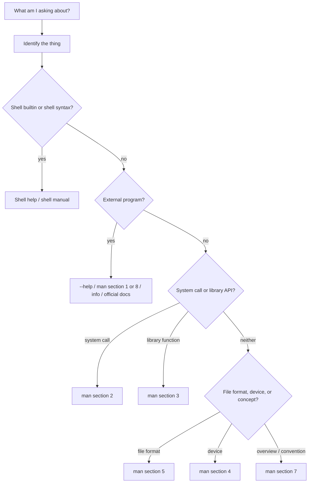

# Learn to Ask Linux for Help

## If you landed here directly

You do not need to know many Linux commands before reading this lesson.

You only need one prior mental model: a command line is interpreted by a **shell**, and the thing you name may be a shell feature, an external program, a system interface, a configuration format, or something else entirely. If that distinction is unfamiliar, [`LNX-0003`](LNX-0003-the-command-line-as-a-language-interface.md) builds it from zero.

This lesson teaches a skill that scales much better than memorizing commands:

> **Identify what kind of thing you are asking about, then ask the documentation layer that actually owns it.**

That habit is one of the dividing lines between command memorization and genuine Linux fluency.

## The problem worth understanding

Suppose you see five unfamiliar things:

```text
cd
ls
open
/etc/passwd
signal
```

A beginner may search the web for all five in exactly the same way.

But they are not the same kind of object.

- `cd` is commonly a **shell builtin**.
- `ls` is normally an **external user command** (and shells could theoretically provide something with the same name).
- `open` can name a **system call** documented in manual section 2.
- `/etc/passwd` is a **file format / system file** documented in section 5.
- `signal` is an **overview/conceptual topic** with documentation in section 7.

If you ask the wrong documentation layer, Linux can look fragmented or badly documented even when the exact answer is already installed locally.

The goal of this lesson is therefore not “learn `man`.” The goal is to build a **documentation-routing mental model**.

## Mental model: route the question before searching



Do not memorize the entire tree today. Memorize the first question:

> **What kind of thing is this?**

Everything else becomes easier once that is answered.

## First tool: ask the shell what a name resolves to

In Bash, try:

```bash
type cd
type ls
type printf
```

Possible answers include phrases such as:

```text
cd is a shell builtin
ls is /usr/bin/ls
printf is a shell builtin
```

Your exact output can differ.

A particularly useful form is:

```bash
type -a printf
```

Why `-a`?

Because one name can have **more than one available implementation**. On many systems Bash provides a builtin `printf`, while an external `/usr/bin/printf` also exists.

That creates an important principle:

> Documentation belongs to the implementation you are actually using, not merely to a word that happens to have the same spelling.

### A portable companion: `command -V`

POSIX-style shells provide `command -V` as another way to describe how a command name would be interpreted:

```bash
command -V cd
command -V ls
```

For this course, use `type` freely in Bash, but remember that `command -V` is useful when you care about portable shell behavior.

## Interactive prediction

Before running anything, predict which of these is most likely to be a Bash builtin:

```text
cd
uname
mkdir
```

<details>
<summary>Reveal</summary>

`cd` must affect the current shell's working directory. If a child process changed *its own* directory and then exited, the parent shell would remain where it was. That is a strong reason for `cd` to be implemented by the shell itself.

`uname` and `mkdir` are ordinarily external utilities, although command lookup should be checked rather than assumed blindly.

</details>

## Shell builtins: use the shell's own help

For a Bash builtin such as `cd`, the most direct local documentation is often:

```bash
help cd
```

Try also:

```bash
help printf
help type
help help
```

Notice what just happened: `help` can document itself.

This is not a joke. It demonstrates a general systems habit: **learn the discovery mechanism, not only the discovered items**.

For broader Bash behavior, the Bash manual and Bash man page are more appropriate than treating every shell feature as an external Linux command.

For example:

```bash
man bash
```

can be useful for shell syntax, expansion, builtins, variables, job control, and other shell-owned behavior.

## External programs: start local

For many external utilities, a fast first query is:

```bash
ls --help
```

or:

```bash
mkdir --help
```

GNU utilities commonly support `--help` and `--version`:

```bash
ls --version
```

This has an underrated advantage: you are asking **the version installed on your machine**.

An online article may describe a newer or older release. Local help is often the quickest way to answer:

- What options does *my* installed command accept?
- How does *my* installed version spell this option?
- What version am I actually running?

But do not universalize the convention. `--help` is common, especially among GNU tools, but not every Unix program is required to support that exact option.

## The manual is a library, not one giant page

Run:

```bash
man man
```

The Linux/Unix manual is divided into numbered sections. A practical beginner map is:

| Section | Main kind of documentation | Example |
|---:|---|---|
| 1 | user commands | `man 1 printf` |
| 2 | system calls | `man 2 open` |
| 3 | library functions | `man 3 printf` |
| 4 | special/device files | device interfaces |
| 5 | file formats and conventions | `man 5 passwd` |
| 6 | games | less central to this course |
| 7 | overviews, conventions, protocols | `man 7 signal` |
| 8 | system-administration commands | many privileged/admin tools |
| 9 | kernel routines | Linux-specific/nonstandard section |

You do **not** need to memorize all nine sections immediately.

The high-value distinction at this stage is:

```text
1 = command
2 = syscall
3 = library
5 = file format
7 = overview / convention
8 = administration
```

## Why the section number matters

Names collide.

For example, `printf` can refer to a user-facing command and also to a C library function.

Compare:

```bash
man 1 printf
```

with:

```bash
man 3 printf
```

Those pages are not duplicates. They document different interfaces that share a name.

Likewise:

```bash
man 2 open
```

means “show the system-call interface named `open`,” not “search for a random command named open.”

This is why experienced Linux users often write names as:

```text
open(2)
printf(3)
passwd(5)
signal(7)
```

The number is part of the reference. It tells you **which namespace of documentation** is intended.

## Read a man page structurally

Do not read every manual page from top to bottom like a novel.

A typical page contains recognizable sections such as:

- `NAME`
- `SYNOPSIS`
- `DESCRIPTION`
- `OPTIONS`
- `RETURN VALUE` or `EXIT STATUS`
- `ERRORS`
- `FILES`
- `ENVIRONMENT`
- `EXAMPLES`
- `SEE ALSO`

The exact set depends on the kind of page.

### The `SYNOPSIS` is a compact grammar

A synopsis might conceptually resemble:

```text
utility [OPTION]... FILE...
```

Common conventions include:

- bold/typewriter text: literal text;
- italic/placeholders: replace with an argument;
- `[ ... ]`: optional material;
- `...`: repeatable material;
- alternatives separated by `|`: choose among forms.

Do not type documentation brackets merely because you see them in the synopsis.

This connects directly to the previous lesson: documentation is describing the **shape of a valid invocation**.

## Search when you know the topic but not the page name

Sometimes the real problem is not “how does `chmod` work?” but:

> I know I need something related to permissions, but I do not know the command name.

That is where keyword search helps.

Try:

```bash
apropos permissions
```

or equivalently on many systems:

```bash
man -k permissions
```

`apropos` searches short manual-page descriptions.

For an exact known name, commands such as:

```bash
whatis passwd
```

or:

```bash
man -f passwd
```

can list matching one-line descriptions across sections.

If the local manual database is missing or stale, these commands may be unavailable or incomplete. That is an environment issue, not evidence that the documentation model is wrong.

## `info`: when GNU documentation is richer than the man page

GNU projects often publish detailed manuals in the Info system.

Try:

```bash
info coreutils
```

If `info` is not installed, do not panic. Your distribution may package it separately, and equivalent GNU manuals are also available online.

The useful distinction is:

- `--help`: fast option reminder from the installed program;
- `man`: compact reference and system-wide convention;
- `info` / project manual: often longer conceptual and task-oriented documentation;
- official online docs: useful for current project documentation, cross-version comparison, and material not installed locally.

None is universally “the best.” They answer different questions.

## Worked example 1: `cd`

Suppose you want to understand:

```bash
cd /tmp
```

Start with identity:

```bash
type cd
```

If Bash reports a builtin, route the question to Bash:

```bash
help cd
```

This is better than assuming `man cd` must describe an external executable.

### What did we learn?

The documentation decision followed from **ownership**:

```text
name -> shell builtin -> shell documentation
```

## Worked example 2: `ls`

Start again with identity:

```bash
type -a ls
```

Then:

```bash
ls --help
man 1 ls
ls --version
```

If you need detailed GNU Coreutils behavior, move to the Coreutils manual.

The route is now:

```text
name -> external utility -> local help / man / project manual
```

## Worked example 3: `open(2)`

Imagine a programming article says:

> “The process calls `open(2)`.”

The `(2)` is a huge clue.

Run:

```bash
man 2 open
```

You are now reading a system-call interface, not a shell command tutorial.

Look for sections such as:

- `SYNOPSIS`
- `DESCRIPTION`
- `RETURN VALUE`
- `ERRORS`
- `STANDARDS`

At this stage you do not need to understand C syntax. The objective is to recognize **what kind of contract is being documented**.

## Worked example 4: `/etc/passwd`

If the question is:

> What does each field in `/etc/passwd` mean?

then command help is the wrong direction.

Try:

```bash
man 5 passwd
```

Section 5 is about file formats and conventions.

This gives a reusable transformation:

```text
"What command reads this?"      <- often not the real question
"What format is this file?"     <- documentation section 5 may be the real route
```

## Worked example 5: an overview topic

Suppose the question is:

> What are signals conceptually, and what signal names exist?

Try:

```bash
man 7 signal
```

Section 7 pages often provide broad overviews, conventions, and protocols rather than documenting one command.

A later Linux course that only taught command names would leave you stranded here. A documentation model does not.

## Version-sensitive questions: ask which version you are reading about

Documentation can disagree because software changes.

Before concluding that “Linux documentation is inconsistent,” check:

```bash
command --version
```

when supported, and compare that version with the documentation source.

For local utilities, the locally installed man page and `--help` often correspond closely to the installed package.

Online documentation can be:

- newer than your machine;
- older than your machine;
- for a different distribution;
- for a related but different implementation.

This creates a general debugging question:

> **Is the disagreement semantic, or am I comparing different versions/implementations?**

That question will matter throughout Linux administration.

## Where intuition breaks

### Mistake 1: “Every command has a program file somewhere”

False.

Shell builtins such as `cd` can be implemented inside the shell process.

### Mistake 2: “If `man foo` shows a page, I now know what `foo` means everywhere”

Not necessarily.

The same name can occur in different manual sections or implementations.

### Mistake 3: “`--help` is part of the operating system standard”

No. It is a widespread convention, especially in GNU software, not a universal law for every executable.

### Mistake 4: “Online documentation is more authoritative because it is newer”

Newer documentation can be *less applicable* to an older installed version.

### Mistake 5: “A missing man page means Linux has no documentation”

The relevant package may not be installed; the component may use a different documentation system; or the authoritative source may be project documentation online.

### Mistake 6: “Section numbers are difficulty levels”

They are categories/namespaces, not beginner-to-advanced rankings.

`man 2 open` is not “level two open.” It is the `open` page in manual section 2.

## A reusable documentation ladder

When you meet an unfamiliar Linux name, use this sequence deliberately rather than mechanically:

```text
1. Identify it
   type / command -V

2. Ask local concise help
   help BUILTIN
   PROGRAM --help

3. Ask the manual
   man NAME
   man SECTION NAME

4. Search the manual database
   apropos KEYWORD
   man -k KEYWORD

5. Read the project manual / Info docs

6. Consult official online documentation
   while checking version and implementation
```

The order can change. What matters is that each step has a reason.

## Active work: documentation routing drill

Without searching first, choose the **most promising starting documentation route** for each question.

1. “What options does my installed GNU `ls` support?”
2. “How does Bash's `cd` builtin interpret `-P`?”
3. “What arguments and errors does the Linux `open` system call have?”
4. “What do the colon-separated fields of `/etc/passwd` mean?”
5. “What is a signal, conceptually?”
6. “I remember there is some command related to mounted filesystems, but I forgot its name.”

<details>
<summary>Reveal a strong routing answer</summary>

1. `ls --help`, then `man 1 ls` / Coreutils manual if needed.
2. `help cd`, then Bash documentation.
3. `man 2 open`.
4. `man 5 passwd`.
5. `man 7 signal` is a strong overview starting point.
6. `apropos mount` or a more precise keyword search can help discover candidate pages.

The important part is not the exact command sequence. It is the **classification that justified the route**.

</details>

## Mini-lab: build a documentation identity card

Run these read-only commands in your Linux lab:

```bash
type -a printf
help printf
man 1 printf
man 3 printf
```

Then write four sentences:

1. Which `printf` would Bash invoke by default?
2. Is another `printf` implementation available?
3. What does section 1 document?
4. What does section 3 document?

If one command is missing on your system, record the failure rather than hiding it. Environment differences are useful data.

For a more systematic practice set, use [`LNX-EXR-0004`](../exercises/LNX-EXR-0004-find-the-right-documentation-layer.md).

## Retrieval / self-explanation

Close the lesson and explain this from memory:

> Why is “What kind of thing is this?” often a better first question than “What command should I type?”

A strong answer should mention at least three documentation owners or namespaces, such as shell builtins, user utilities, system calls, file formats, or conceptual overview pages.

## Connections

- [`LNX-0001`](LNX-0001-what-a-linux-system-actually-is.md) separated kernel, userspace, shell, and applications.
- [`LNX-0003`](LNX-0003-the-command-line-as-a-language-interface.md) separated shell interpretation from program invocation.
- This lesson turns those distinctions into a **navigation strategy for documentation**.
- Later lessons will repeatedly depend on this skill rather than re-explaining every command from scratch.

## What this unlocks

You can now approach unfamiliar Linux interfaces without treating them as isolated trivia.

More importantly, you can distinguish questions such as:

```text
How do I invoke this program?
How does this shell feature work?
What does this system call guarantee?
What format does this file use?
What convention or subsystem is being described?
```

Those are different questions, and Linux has different documentation layers for them.

## References

- `LNX-REF-003` — Linux man-pages project.
- `LNX-REF-004` — GNU Coreutils 9.11 Manual.
- `LNX-REF-005` — Bash Reference Manual.
