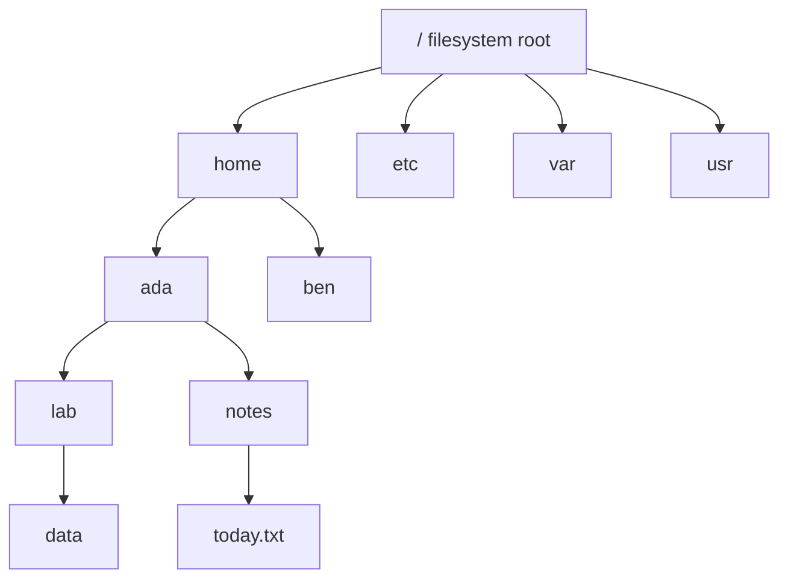
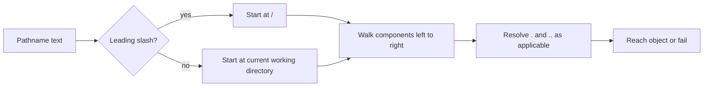

# Paths, Names, and the Single Filesystem Tree

## If you landed here directly

You do not need to know Linux administration, storage devices, permissions, or filesystem internals.

You only need two ideas:

1. a shell runs commands for you; and
2. processes have a **current working directory** that affects how relative pathnames are interpreted.

If the second idea is new, that is fine—we build it here. [`LNX-0003`](LNX-0003-the-command-line-as-a-language-interface.md) explains how a shell interprets command invocations, and [`LNX-0004`](LNX-0004-learn-to-ask-linux-for-help.md) shows how to inspect local documentation when a command or syntax is unfamiliar.

This lesson is about a deceptively small question:

> **When Linux sees a name such as `notes/today.txt`, how does it know which object you mean?**

The answer becomes the foundation for navigation, file manipulation, configuration, permissions, storage, scripting, and later filesystem internals.

## The problem worth understanding

Imagine these three commands are run from three different directories:

```bash
cat notes/today.txt
```

The text of the pathname is identical each time.

Yet it can refer to three different files—or fail entirely.

That tells us something important:

> A pathname is not merely a label printed on an object. It is an **instruction for navigating a namespace**.

The namespace is organized as one tree rooted at `/`.

Your current working directory supplies the starting point for relative pathnames.

## Mental model: one namespace, many starting points

A simplified Linux filesystem namespace might look like this:



A pathname tells the system how to walk through this namespace.

Two broad cases matter first:

```text
starts with /        → absolute pathname → start at filesystem root
otherwise            → relative pathname → start at current working directory
```

That single distinction explains a large fraction of beginner path errors.

## Names, pathnames, and components

Consider:

```text
/home/ada/notes/today.txt
```

The slash-separated pieces are **pathname components**:

```text
home
ada
notes
today.txt
```

The entire string is a **pathname**.

The final component is often the name of the object you are trying to reach, but the earlier components matter just as much because they determine how to get there.

A useful first approximation is:

> A filename is one component; a pathname is a route through components.

Linux permits many characters in filenames that beginners do not expect, including spaces and leading dots. Later shell lessons will explain why characters such as spaces, `*`, `?`, `$`, and quotes can require special treatment **before** the pathname is even handed to a program.

For now, keep shell parsing and pathname resolution conceptually separate.

## Absolute pathnames: anchor at `/`

An absolute pathname begins with `/`:

```text
/etc/passwd
/home/ada/notes/today.txt
/usr/bin/printf
```

The first slash means:

> Start pathname resolution at the root of the filesystem namespace.

This is the filesystem root:

```text
/
```

Do not confuse it with:

```text
/root
```

`/root` is conventionally the home directory of the administrative account named `root`.

The distinction is fundamental:

```text
/       filesystem namespace root
/root   one directory below /, conventionally root user's home
```

### Interactive prediction

Suppose your current working directory is:

```text
/home/ada/lab
```

Does changing your current directory alter what this absolute pathname means?

```text
/etc/passwd
```

<details>
<summary>Reveal</summary>

No. Because the pathname starts with `/`, resolution begins at the filesystem root rather than at the current working directory.

That does not guarantee the object exists or that you have permission to access it. It only fixes the starting point used for pathname resolution.

</details>

## Relative pathnames: anchor at the current working directory

Now consider:

```text
notes/today.txt
```

There is no leading `/`.

So Linux needs context.

If the process's current working directory is:

```text
/home/ada
```

then the pathname can be read conceptually as:

```text
/home/ada + notes/today.txt
```

which targets:

```text
/home/ada/notes/today.txt
```

If the process instead starts from:

```text
/home/ben
```

the same relative spelling refers toward:

```text
/home/ben/notes/today.txt
```

if such a path exists.

This is why `pwd` matters.

In Bash:

```bash
pwd
```

prints the shell's current working directory.

When a relative pathname behaves unexpectedly, one of the first debugging questions should be:

> **Where am I?**

not:

> **Why is Linux ignoring my filename?**

## The current working directory is process state

It is tempting to imagine that a terminal window itself “is inside” a directory.

A more accurate model is:

> The shell process associated with that interactive session has a current working directory.

When Bash executes:

```bash
cd /tmp
```

its own working-directory state changes.

That is one reason `cd` is normally a shell builtin: a separate child program changing *its* working directory would not move the parent shell.

This connects directly to the process mental model you will deepen later.

## Special pathname components: `.` and `..`

Two components have special pathname meaning:

```text
.    current directory
..   parent directory
```

Suppose:

```text
current working directory = /home/ada/lab
```

Then:

```text
./data
```

means, conceptually:

```text
current directory → data
```

and:

```text
../notes
```

means:

```text
parent of /home/ada/lab → notes
```

so the intended path is:

```text
/home/ada/notes
```

### Read a pathname like a route

Do not memorize `../` as “some weird syntax for going back.”

Trace it:

```text
start at /home/ada/lab
..       → /home/ada
notes    → /home/ada/notes
```

This tracing habit scales to long relative pathnames.

## Interactive trace

Assume the working directory is:

```text
/home/ada/lab/data
```

Predict the target of:

```text
../../notes/today.txt
```

<details>
<summary>Reveal</summary>

Trace one component at a time:

```text
/home/ada/lab/data
..       → /home/ada/lab
..       → /home/ada
notes    → /home/ada/notes
today.txt→ /home/ada/notes/today.txt
```

The important skill is not counting dots quickly. It is explicitly tracking the resolution state.

</details>

## `.` is not the same thing as “hidden”

Unix-like systems traditionally treat names beginning with a dot as hidden from ordinary directory listings.

Examples:

```text
.bashrc
.config
.git
```

This is much simpler than beginners often imagine.

A leading dot is part of the name.

There is no universal hidden-file database that secretly marks these objects invisible.

For example:

```bash
ls
```

normally omits many leading-dot names, while:

```bash
ls -a
```

includes them.

But do not collapse three different ideas:

```text
.          special pathname component meaning current directory
..         special pathname component meaning parent directory
.config    ordinary name whose first character is a dot
```

They look related because they use dots, but they play different roles.

## `~` is not the filesystem root and not a pathname component supplied by the kernel

In an interactive Bash session you will often type:

```bash
cd ~
```

or:

```bash
ls ~/Downloads
```

It is easy to learn the false rule:

> “`~` means home directory in Linux paths.”

More precisely, Bash performs **tilde expansion** before the resulting word is used as a pathname argument.

For a typical user named `ada`, the shell may transform:

```text
~/notes
```

into something like:

```text
/home/ada/notes
```

So keep these layers separate:

```text
~      shell syntax / expansion
/      root of filesystem namespace
HOME   shell/environment variable commonly naming a home directory
```

This distinction becomes important in scripts, programming languages, APIs, quoting, and tools that do not perform shell expansion for you.

## One tree does not mean one physical disk

The filesystem namespace appears as one hierarchy beginning at `/`.

That does **not** imply every object in that tree lives on one storage device or even on a traditional disk.

Later lessons will introduce mounts, virtual filesystems such as `/proc` and `/sys`, removable devices, network filesystems, and other namespaces.

For now, the key abstraction is:

> Programs navigate one pathname tree even though many different backing mechanisms can be attached beneath it.

This is one of the most powerful Unix/Linux design ideas: the namespace hides much of the storage topology from ordinary pathname use.

## Safe laboratory: build a tiny namespace of your own

Work only inside a directory you own.

Create a disposable lab:

```bash
mkdir -p "$HOME/csf-path-lab/alpha/beta"
mkdir -p "$HOME/csf-path-lab/alpha/notes"
cd "$HOME/csf-path-lab/alpha/beta"
pwd
```

Do not rush to the output.

Before each command below, predict the resulting working directory:

```bash
cd ..
pwd
```

Then:

```bash
cd ./notes
pwd
```

Then:

```bash
cd ../beta
pwd
```

Now inspect everything, including dot-prefixed names:

```bash
mkdir .hidden-demo
ls -la
```

Finally return home:

```bash
cd ~
pwd
```

Nothing here requires `sudo`.

### Why this lab is useful

You are not practicing `cd` as a magic command.

You are testing a model:



## Path resolution can fail in more than one way

A pathname is a route, so failure can occur before the final component.

Suppose you ask for:

```text
/home/ada/projects/demo/output.txt
```

Possible problems include:

- `/home/ada/projects` does not exist;
- `demo` exists but is not a directory;
- permission rules prevent traversal of an intermediate directory;
- the final file does not exist;
- a symbolic link changes resolution in a way you did not expect;
- the pathname was transformed by the shell before the program received it.

You do not need the full mechanics yet.

The important debugging habit is:

> **Trace the pathname component by component instead of treating the whole string as one indivisible filename.**

## A subtle edge: logical versus physical working directories

Bash supports logical and physical views of the current working directory.

You may encounter:

```bash
pwd -L
pwd -P
```

The difference becomes visible around symbolic links.

This lesson does not require you to master symlink semantics yet. Just record the warning:

> A textual path and the physical route through the filesystem can diverge when symbolic links are involved.

That is why “simplifying” every path by blindly deleting `..` components is not always a sound model of what the system will do.

The Bash manual documents `cd -L`, `cd -P`, `pwd -L`, and `pwd -P`; later filesystem lessons will make the distinction concrete.

## Where intuition breaks

### Mistake 1: “A path is the file's permanent full name”

No. Multiple pathnames can sometimes reach the same underlying object, and pathnames can stop resolving when namespace structure changes.

### Mistake 2: “Relative paths begin at my home directory”

No. They begin at the process's current working directory unless some shell feature or program-specific rule changes the input first.

### Mistake 3: “`/` and `/root` are synonyms”

They are not.

### Mistake 4: “`~` is another spelling of `/`”

No. In Bash, `~` is expanded by the shell toward a home directory; `/` is the filesystem root.

### Mistake 5: “Dotfiles have a special hidden attribute”

The common Unix convention is based primarily on the leading dot in the name and on tools choosing not to show such names by default.

### Mistake 6: “If the final filename exists, the path must work”

Every intermediate component must be traversable and must resolve appropriately.

## Worked example: same spelling, different target

Assume these both exist:

```text
/home/ada/lab/report.txt
/home/ada/archive/lab/report.txt
```

Session A:

```text
cwd = /home/ada
pathname = lab/report.txt
```

Target:

```text
/home/ada/lab/report.txt
```

Session B:

```text
cwd = /home/ada/archive
pathname = lab/report.txt
```

Target:

```text
/home/ada/archive/lab/report.txt
```

The pathname text did not change.

The **resolution context** did.

## Worked example: absolute versus relative is a property of the pathname spelling

From:

```text
/home/ada/lab
```

compare:

```text
notes/today.txt
/home/ada/notes/today.txt
```

The first depends on the current directory.

The second starts at `/`.

Neither is inherently “better.”

Relative paths are useful when you want a route expressed from a known context. Absolute paths are useful when you need an anchor independent of the current working directory.

Good scripts and programs choose deliberately rather than reflexively.

## Active work

Without executing commands, resolve these from:

```text
cwd = /home/ada/projects/csf
```

1. `README.md`
2. `./README.md`
3. `../notes.txt`
4. `/etc/hosts`
5. `../../ada/projects`

Then answer:

- Which depend on the current working directory?
- Which begin at the namespace root?
- Which use a special component?
- Which might fail even if the final component name exists somewhere else on the machine?

<details>
<summary>Reasoning check</summary>

1. `README.md` → relative to `/home/ada/projects/csf`.
2. `./README.md` → also relative to the same directory; `.` explicitly denotes the current directory.
3. `../notes.txt` → start at `/home/ada/projects/csf`, move to `/home/ada/projects`, then look for `notes.txt`.
4. `/etc/hosts` → absolute; current working directory does not choose its starting point.
5. `../../ada/projects` → relative; tracing gives `/home/ada/ada/projects` from the stated cwd, which is probably not what a hurried reader intended.

The last example demonstrates why component-by-component tracing beats visual guessing.

</details>

## Retrieval / self-explanation

Close the lesson and explain these six terms without looking:

```text
filesystem root
absolute pathname
relative pathname
current working directory
.
..
```

Then explain why these three are **not** equivalent:

```text
/
/root
~
```

If you cannot articulate which layer gives each one meaning, revisit that section.

## Connections

This lesson uses:

- the shell/process distinction from [`LNX-0001`](LNX-0001-what-a-linux-system-actually-is.md);
- command invocation reasoning from [`LNX-0003`](LNX-0003-the-command-line-as-a-language-interface.md);
- documentation lookup from [`LNX-0004`](LNX-0004-learn-to-ask-linux-for-help.md) when you want to inspect `cd`, `pwd`, `ls`, or Coreutils behavior.

It prepares you for later lessons on:

- creating, copying, moving, and deleting filesystem objects;
- quoting and expansion;
- permissions and directory traversal;
- symbolic links;
- mount points and filesystem types;
- `/proc`, `/sys`, and `/dev`;
- filesystem internals such as inodes and directory entries.

## What this unlocks

You should now be able to read a pathname as a route through a namespace instead of as an opaque string.

That is enough to reason deliberately about where commands operate—even before you know many commands.

## References

- **LNX-REF-001 — The Open Group Base Specifications Issue 8 / POSIX.1-2024.** Used for portable pathname and current-directory semantics.
- **LNX-REF-004 — GNU Coreutils Manual.** Used for local user-space pathname tools and conventions.
- **LNX-REF-005 — Bash Reference Manual.** Used for `cd`, `pwd`, `PWD`, `HOME`, tilde expansion, and logical/physical directory behavior.
