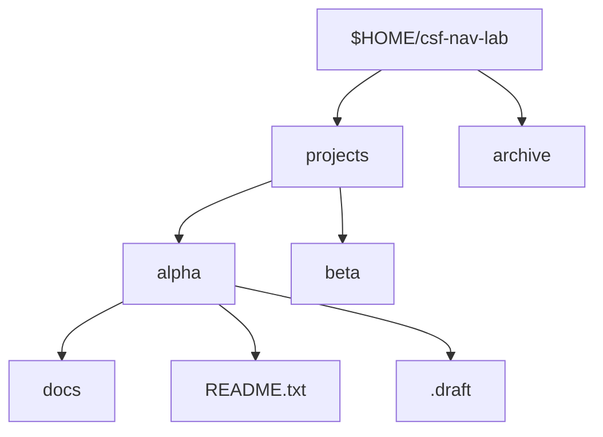

# Navigate and Inspect Directories

## If you landed here directly

You do not need to know Linux administration, permissions, storage, or shell scripting.

You do need one mental model from the previous lesson: a pathname tells Linux **where to start and which components to walk through**. If absolute versus relative paths, `.` and `..`, or the filesystem root `/` are unfamiliar, read [`LNX-0005`](LNX-0005-paths-names-and-the-single-filesystem-tree.md) first.

This lesson turns that model into a practical skill:

> **Move through a directory tree deliberately, inspect what is actually there, and predict the effect of a navigation command before you run it.**

The goal is not to memorize a handful of commands. It is to stop treating navigation as a trial-and-error activity.

## The problem worth understanding

Beginners often navigate like this:

```bash
cd ..
ls
cd something
ls
cd ..
cd other
```

The commands may work, but the reasoning is weak. After several steps, the user often no longer knows:

- what the current working directory is;
- whether `ls` is showing a directory itself or the directory's contents;
- whether hidden entries exist;
- whether a path is absolute or relative;
- whether `cd ..` will go where they expect;
- whether the shell is showing a logical or physical path through symbolic links.

A better operator keeps an explicit state model:

```text
current directory
      +
pathname argument
      +
command semantics
      ↓
predicted result
```

Then the command is run to test the prediction.

## Mental model: navigation changes state; inspection observes state

Three commands form the core loop:

```text
pwd   → Where am I?
cd    → Change where this shell is working.
ls    → What entries or objects should I inspect here?
```

The distinction matters:

- `cd` changes the shell's current working directory;
- `pwd` reports the current working directory;
- `ls` reports information about directory entries or named files.

A useful loop is:


This turns navigation into a small experiment rather than random movement.

## Build one safe directory tree

Use a disposable directory under your home directory:

```bash
mkdir -p "$HOME/csf-nav-lab/projects/alpha/docs"
mkdir -p "$HOME/csf-nav-lab/projects/beta"
mkdir -p "$HOME/csf-nav-lab/archive"
touch "$HOME/csf-nav-lab/projects/alpha/README.txt"
touch "$HOME/csf-nav-lab/projects/alpha/.draft"
```

Nothing in this lesson requires `sudo`.

The tree is conceptually:



Before running the next command, predict what `pwd` should print:

```bash
cd "$HOME/csf-nav-lab/projects/alpha"
pwd
```

<details>
<summary>Check your reasoning</summary>

The shell changes its current working directory to the absolute pathname you supplied. `pwd` should therefore report the `alpha` directory under your home directory, subject to the usual logical/physical-path distinction discussed later.

</details>

## `pwd`: inspect location, do not infer it

`pwd` means **print working directory**.

```bash
pwd
```

This should become a reflex whenever relative path behavior surprises you.

Do not rely on the terminal prompt as your only source of truth. Prompts are configurable and may:

- show only the final component;
- abbreviate your home directory as `~`;
- omit the path entirely;
- display stale or custom information.

The command:

```bash
pwd
```

asks the shell or utility directly for the working-directory pathname.

### Interactive prediction

Suppose:

```text
cwd = /home/ada/csf-nav-lab/projects/alpha
```

What will this sequence do?

```bash
cd docs
pwd
```

<details>
<summary>Reveal</summary>

`docs` is relative, so resolution begins at the current working directory. The new directory is conceptually:

```text
/home/ada/csf-nav-lab/projects/alpha/docs
```

The exact home prefix depends on the account and system.

</details>

## `cd`: change the shell's working directory

The basic form is:

```bash
cd PATH
```

Examples:

```bash
cd /etc
cd "$HOME/csf-nav-lab"
cd projects/alpha
cd ..
cd ../beta
```

The important thing is not the spelling of `cd`; it is the state transition:

```text
old cwd + pathname resolution → new cwd
```

If resolution fails, the shell stays where it was.

### Failed `cd` does not partially move you

From:

```text
$HOME/csf-nav-lab/projects/alpha
```

try predicting this:

```bash
cd does-not-exist
pwd
```

The `cd` should fail and the current working directory should remain unchanged.

That gives you a useful debugging habit:

```bash
cd some/path
printf 'status=%s\n' "$?"
pwd
```

You do not need to master exit statuses yet. The point is simply that navigation commands can fail, and you should verify state rather than assume success.

## `cd` with no argument

In Bash, plain:

```bash
cd
```

uses the shell's home-directory value and normally returns you to your home directory.

That means these are related but not identical ideas:

```text
~       shell expansion commonly referring to home
$HOME   shell variable containing the home pathname
cd      shell builtin that uses the home directory when no argument is given
```

The previous lesson separated shell syntax from pathname syntax. Keep that separation here.

## `cd -`: switch to the previous working directory

Bash tracks the previous working directory in `OLDPWD`.

A successful:

```bash
cd -
```

switches back to that previous directory.

Try:

```bash
cd "$HOME/csf-nav-lab/projects/alpha"
pwd
cd "$HOME/csf-nav-lab/archive"
pwd
cd -
pwd
```

Before running the last two lines, predict whether you return to `alpha`.

This is more than a convenience. It reveals that a shell carries navigation state beyond the single `PWD` value.

## `ls`: inspect directory entries

At its simplest:

```bash
ls
```

lists the current directory's non-hidden entries.

If no pathname operand is supplied, GNU `ls` behaves as though it is listing `.`—the current directory.

So:

```bash
ls
```

and conceptually:

```bash
ls .
```

operate on the same directory.

From:

```bash
cd "$HOME/csf-nav-lab/projects/alpha"
```

run:

```bash
ls
```

You should see entries such as:

```text
README.txt
 docs
```

The exact formatting depends on terminal settings, aliases, locale, and implementation.

## Why `.draft` disappeared

We created:

```text
.draft
```

but plain `ls` normally omits directory entries whose names begin with `.`.

Use:

```bash
ls -a
```

or, with GNU `ls`:

```bash
ls -A
```

The conceptual difference is:

```text
ls       omit dot-prefixed entries
ls -a    include dot-prefixed entries, including . and ..
ls -A    include most dot-prefixed entries, but omit . and ..
```

### Prediction checkpoint

Before running:

```bash
ls -a
```

write down at least these expected names:

```text
.
..
.draft
README.txt
docs
```

<details>
<summary>Why are `.` and `..` shown?</summary>

They are special directory entries/pathname components representing the current and parent directory. `-a` asks `ls` not to ignore names beginning with a dot, so they become visible in the listing.

</details>

## Listing a directory versus listing its contents

This distinction causes many mistakes.

Suppose you are in:

```text
$HOME/csf-nav-lab/projects
```

and run:

```bash
ls alpha
```

Because `alpha` is a directory operand, ordinary `ls` lists **its contents**.

But sometimes you want information about the directory entry `alpha` itself.

With GNU `ls`:

```bash
ls -d alpha
```

means: treat the directory like another named file operand rather than descending into its contents for the listing.

Combine that with long format:

```bash
ls -ld alpha
```

This becomes useful later when inspecting permissions and ownership on a directory itself.

For now, remember the conceptual split:

```text
ls DIRECTORY      → normally list entries inside it
ls -d DIRECTORY   → list the DIRECTORY operand itself
```

## Long listings are metadata views, not “more truth”

A common command is:

```bash
ls -l
```

It prints a long-format view containing several metadata fields.

At this point, do **not** try to memorize every column. Later lessons will teach permissions, ownership, sizes, timestamps, and links properly.

For now, use long format for two purposes:

1. notice that directory entries have metadata beyond their names;
2. distinguish regular files and directories using the leading file-type character.

You may see lines beginning with:

```text
d...
-...
```

A leading `d` indicates a directory; a leading `-` commonly indicates a regular file.

That is enough for this lesson.

## Names can mislead; metadata can correct you

Linux does not require directories to end with `/` in their stored name.

These names alone do not guarantee type:

```text
reports
backup.txt
images
archive
```

A file could be named `images`; a directory could be named `backup.txt`.

Do not infer object type solely from naming convention.

Use inspection.

For example:

```bash
ls -ld -- "$HOME/csf-nav-lab/projects/alpha"
```

The `--` marker is a common command-line convention meaning “stop parsing options after this point.” We will study option parsing and awkward filenames more deeply later; here it simply makes the intent explicit.

## Current directory, target directory, and displayed directory are different concepts

Suppose your current working directory is:

```text
/home/ada
```

You run:

```bash
ls /etc
```

Your shell does **not** move to `/etc`.

`ls` receives `/etc` as an operand and inspects it while your shell remains in `/home/ada`.

Check:

```bash
pwd
ls /etc
pwd
```

Both `pwd` outputs should identify the same current directory.

This is a fundamental distinction:

```text
cd TARGET  → changes shell working directory
ls TARGET  → inspects target; does not change shell working directory
```

### Interactive classification

Classify each command as **changes cwd**, **observes cwd**, or **inspects another pathname without changing cwd**:

```bash
cd /tmp
pwd
ls /etc
ls .
cd ..
```

<details>
<summary>Answer</summary>

- `cd /tmp` — changes cwd.
- `pwd` — observes/reports cwd.
- `ls /etc` — inspects another pathname without changing cwd.
- `ls .` — inspects the current directory without changing cwd.
- `cd ..` — changes cwd to the resolved parent.

</details>

## Navigation is easier when you predict before typing

Consider this tree:

```text
lab/
├── data/
│   ├── raw/
│   └── clean/
├── notes/
└── results/
```

Assume:

```text
cwd = lab/data/raw
```

Predict the final cwd after:

```bash
cd ..
cd clean
cd ../../notes
```

Reason component by component:

```text
lab/data/raw
→ lab/data
→ lab/data/clean
→ lab/data
→ lab
→ lab/notes
```

Only after writing the path should you run a real equivalent in the safe lab.

This habit scales. Later, the same style of reasoning will help with shell scripts, mounts, containers, build systems, permissions, and relative configuration paths.

## A compact inspection routine

When entering an unfamiliar directory, a useful low-risk sequence is:

```bash
pwd
ls
ls -A
```

Then, for a specific object:

```bash
ls -ld -- NAME
```

That sequence answers progressively different questions:

```text
pwd      Where am I?
ls       What ordinary entries are visible here?
ls -A    What dot-prefixed entries exist too?
ls -ld   What is this particular named object?
```

Do not blindly use `ls -la` everywhere just because it is common. Ask what information you need.

## Logical and physical working directories: a preview

Bash supports logical and physical views of the working directory with `pwd -L` and `pwd -P`.

Why can there be two views?

Because symbolic links can let one pathname reach a directory through an alias-like path.

For now, only retain this:

```text
logical path   → may preserve symbolic-link path components
physical path  → resolves through them to the underlying directory path
```

Do not build a mental model of symbolic links from this paragraph alone. They deserve their own treatment later.

The reason to mention the distinction now is practical: if two commands appear to disagree about “where you are,” do not immediately assume corruption. Check whether logical versus physical path semantics are involved.

## Where intuition breaks

### “`ls` shows everything in the directory”

Not by default. Dot-prefixed names are normally omitted.

### “If I run `ls /etc`, I am now in `/etc`”

No. `ls` inspects an operand. `cd` changes the shell's working directory.

### “A name ending in `.txt` must be a file”

No. Filename extensions are conventions, not object-type enforcement.

### “`cd ..` means go to the directory I visited previously”

No. `..` means the parent in pathname traversal. `cd -` is the Bash feature that switches to the previous working directory.

### “My prompt shows `~/project`, so that must be the exact kernel-level physical path”

Not necessarily. Prompts can abbreviate, and logical paths may preserve symbolic-link components.

### “`ls -l` is a universal parser-friendly data format”

No. Long listings are designed primarily for human inspection and vary with options, locale, implementation details, and filename contents. Later scripting lessons will teach safer machine-oriented techniques.

## Worked example 1: diagnose the wrong directory

A user types:

```bash
cat config.yaml
```

and gets a “no such file” error.

Instead of immediately searching the whole machine, inspect the local state:

```bash
pwd
ls -A
```

If `pwd` reveals:

```text
/home/ada/project/src
```

but the file is actually in:

```text
/home/ada/project/config.yaml
```

then the problem is not that Linux “lost” the file. The relative pathname was resolved from the wrong starting directory.

## Worked example 2: inspect a directory itself

You want to know whether `archive` is a directory entry, but:

```bash
ls archive
```

shows a list of names inside it.

Use:

```bash
ls -ld archive
```

Now the target of inspection is the `archive` entry itself.

This distinction becomes critical when we later ask questions about directory permissions.

## Worked example 3: hidden does not mean secret

A project directory contains:

```text
.env
.git
README.md
src
```

Plain:

```bash
ls
```

may show only:

```text
README.md
src
```

Using:

```bash
ls -A
```

reveals the dot-prefixed entries.

The leading dot is primarily a listing convention. It is not an access-control mechanism. A hidden name is not protected merely because ordinary `ls` omits it.

## Active work: predict, run, explain

Use the companion exercise [`LNX-EXR-0006`](../exercises/LNX-EXR-0006-navigate-inspect-and-verify.md).

Before every `cd`, write the expected destination.

Before every `ls`, write whether you expect:

- the named object itself;
- the contents of a directory;
- hidden names to be included;
- the current working directory to remain unchanged.

If your prediction differs from reality, do not just correct the command. Identify **which part of your model was wrong**.

## Retrieval / self-explanation

Without looking back, answer:

1. What state does `cd` change?
2. What question does `pwd` answer?
3. Why can `ls directory` and `ls -d directory` show fundamentally different things?
4. Why does plain `ls` not prove a directory contains no dot-prefixed names?
5. What is the difference between `cd ..` and `cd -`?
6. Why should you not infer file type solely from a filename suffix?
7. If `ls /etc` succeeds, what does that tell you about your current working directory?

## Connections

This lesson operationalizes the pathname model from [`LNX-0005`](LNX-0005-paths-names-and-the-single-filesystem-tree.md).

It also relies on the command-invocation distinction from [`LNX-0003`](LNX-0003-the-command-line-as-a-language-interface.md): `cd` is a shell builtin because changing a separate child process's working directory would not relocate the parent interactive shell.

When an option is unfamiliar, use the documentation workflow from [`LNX-0004`](LNX-0004-learn-to-ask-linux-for-help.md) rather than memorizing flags from screenshots or blog posts.

## What this unlocks

You can now move through a directory tree with an explicit state model and inspect directories without confusing:

- where the shell is;
- what pathname a command is inspecting;
- a directory entry with its contents;
- visible names with all names;
- naming convention with actual file type.

That makes the next core lesson possible: **creating, copying, moving, and removing files safely**. File mutation is much less dangerous once location and target selection are predictable.

## References

- The Open Group Base Specifications Issue 8 / POSIX.1-2024 — portable command/interface context.
- GNU Coreutils 9.11 Manual — `ls` and `pwd` behavior and directory-listing options.
- Bash Reference Manual — `cd`, `pwd`, `PWD`, `OLDPWD`, and logical/physical navigation behavior.
