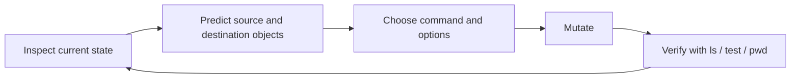
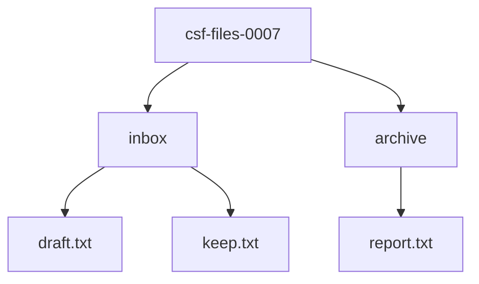
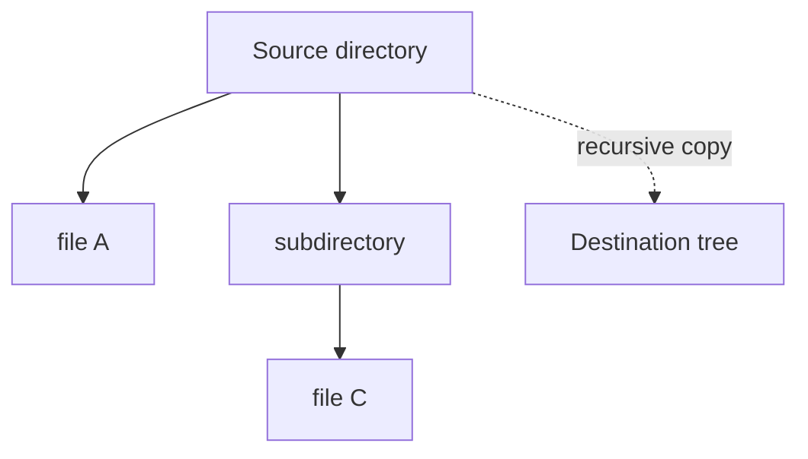
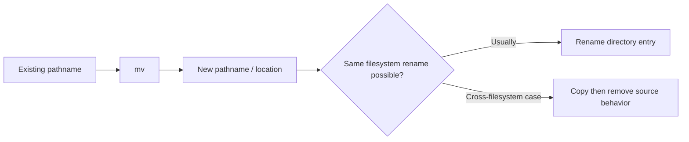
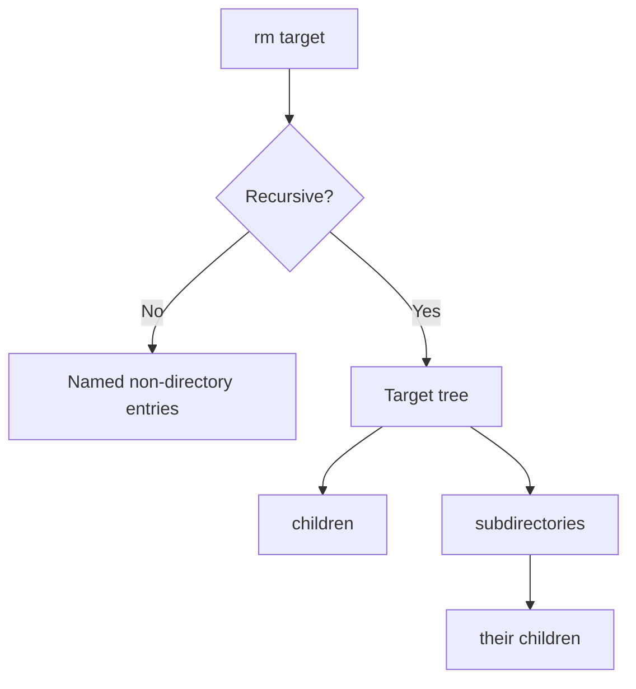
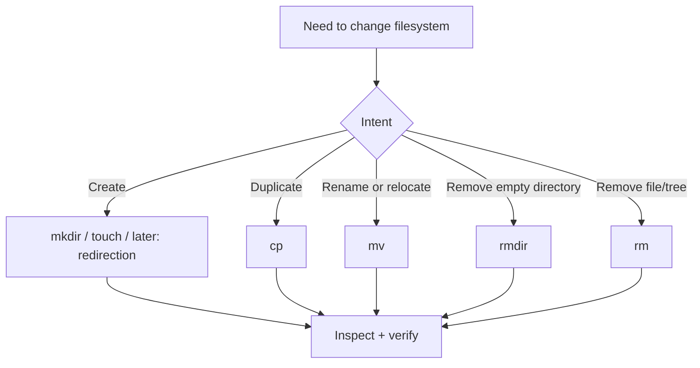

# Create, Copy, Move, and Remove Files Safely

## If you landed here directly

You do not need Linux administration or shell scripting for this lesson.

You should already understand two ideas:

1. a pathname is resolved from either `/` or the current working directory; and
2. commands such as `pwd`, `cd`, and `ls` let you navigate and inspect the filesystem deliberately.

If those ideas are unfamiliar, read [`LNX-0005`](LNX-0005-paths-names-and-the-single-filesystem-tree.md) and [`LNX-0006`](LNX-0006-navigate-and-inspect-directories.md) first.

This lesson adds a more consequential skill:

> **Change the filesystem while predicting exactly which object will be created, copied, renamed, replaced, or removed.**

The commands are short. The reasoning is the real subject.

## Why this deserves a full lesson

A navigation mistake is often reversible: run `pwd`, inspect the tree, and move somewhere else.

A mutation mistake can overwrite or delete data.

The dangerous beginner habit is therefore not merely “using `rm`.” It is executing a mutating command while uncertain about:

- the source pathname;
- the destination pathname;
- whether the destination already exists;
- whether a directory's **entry** or **contents** are being targeted;
- whether recursion is involved;
- whether replacement can occur.

A safer workflow is:



The important transition is **prediction before mutation**.

## Build a disposable laboratory

Everything in this lesson can happen under your home directory.

```bash
mkdir -p "$HOME/csf-files-0007/inbox"
mkdir -p "$HOME/csf-files-0007/archive"
printf 'draft one\n' > "$HOME/csf-files-0007/inbox/draft.txt"
printf 'keep me\n' > "$HOME/csf-files-0007/inbox/keep.txt"
printf 'old report\n' > "$HOME/csf-files-0007/archive/report.txt"
cd "$HOME/csf-files-0007"
pwd
ls -R
```

Do not use `sudo` in this lab.

Conceptually:



Before each mutation below, stop and point to the node or pathname you expect to change.

## Creation is already a filesystem mutation

You have already used `mkdir` and `touch`, but now treat them as operations with explicit semantics.

### `mkdir`: create directory entries

```bash
mkdir projects
mkdir projects/demo
```

If an intermediate directory may not exist:

```bash
mkdir -p projects/demo/data/raw
```

`-p` is convenient, but it also broadens what the command may create. Read the pathname before pressing Enter.

### `touch`: a subtle name

A common beginner description is:

> “`touch` creates files.”

That is incomplete.

If the named file does not exist, a normal `touch filename` can create an empty file. If the file already exists, `touch` updates timestamps rather than replacing its contents.

Try:

```bash
touch scratch.txt
ls -l scratch.txt
touch scratch.txt
```

The same command name can therefore mean “create an empty file entry” or “update timestamps,” depending on existing state.

### Interactive check

Suppose `notes.txt` already contains important text. Does this destroy it?

```bash
touch notes.txt
```

<details>
<summary>Reveal</summary>

Ordinary `touch notes.txt` does not truncate the existing file. It updates timestamps. This is different from shell redirection such as `> notes.txt`, which can truncate a file. Redirection gets its own treatment later.

</details>

## `cp`: copying creates an independent destination object

The simplest form is:

```bash
cp SOURCE DESTINATION
```

For example:

```bash
cp inbox/draft.txt archive/draft-copy.txt
```

Verify:

```bash
ls -l inbox archive
cat inbox/draft.txt
cat archive/draft-copy.txt
```

At this level, keep the mental model simple:

```text
source file data
      |
      | cp
      v
new destination file
```

The destination is not merely a second display name for the same ordinary file contents in the sense a hard link would be. We will study links later.

If you edit one ordinary copied file afterward, the other is not automatically changed.

### Destination interpretation matters

Compare these two shapes:

```bash
cp inbox/draft.txt archive/new-name.txt
cp inbox/draft.txt archive/
```

In the first form, the second operand names a destination pathname.

In the second, because `archive/` is an existing directory, `cp` places a copy inside it using the source's basename:

```text
archive/draft.txt
```

This is a general source of mistakes: **the same-looking second argument can mean a target filename or a target directory depending on filesystem state.**

### Predict before running

Assume this tree:

```text
lab/
├── inbox/
│   └── draft.txt
└── archive/
```

What pathname will exist after:

```bash
cp inbox/draft.txt archive/
```

<details>
<summary>Reveal</summary>

`archive/draft.txt`.

`archive/` is an existing directory, so the basename `draft.txt` is used inside that directory.

</details>

## Copying directories requires recursive intent

This fails on GNU `cp` in the ordinary form:

```bash
cp projects backup
```

when `projects` is a directory and you have not requested recursive copying.

A common form is:

```bash
cp -R projects backup
```

or:

```bash
cp -r projects backup
```

For this lesson, the important idea is not memorizing a preferred spelling. It is recognizing that copying a directory implies traversing a tree of entries.



Before using recursive copy, inspect both source and destination. A one-character pathname error can duplicate much more than one file.

## Replacement is where `cp` becomes dangerous

Suppose:

```text
archive/report.txt      contains: old report
inbox/draft.txt         contains: draft one
```

Now consider:

```bash
cp inbox/draft.txt archive/report.txt
```

The destination already exists.

On a normal GNU Coreutils invocation, the copy can replace the destination's file contents. There is no universal desktop-style “Are you sure?” prompt by default.

For interactive practice, GNU `cp` supports:

```bash
cp -i SOURCE DESTINATION
```

which asks before overwriting an existing destination.

Do not turn `-i` into magical armor. Scripts, aliases, other systems, and other options can differ. The durable habit is still:

```text
inspect → predict → mutate → verify
```

### A safer training pattern

Before a potentially replacing copy:

```bash
ls -l inbox/draft.txt archive/report.txt
cp -i inbox/draft.txt archive/report.txt
ls -l archive/report.txt
```

The first `ls` is not bureaucracy. It is a state check.

## `mv`: rename or relocate

`mv` uses a familiar operand shape:

```bash
mv SOURCE DESTINATION
```

A rename in the same directory:

```bash
mv inbox/draft.txt inbox/draft-v2.txt
```

A move into another directory:

```bash
mv inbox/draft-v2.txt archive/
```

A useful mental model is:



At beginner level, remember the visible contract: after a successful move, the source pathname normally no longer names the item at its old location.

The implementation can be especially efficient when the operation is a rename within one filesystem; across filesystems GNU `mv` may need copy-and-remove behavior. This matters later when reasoning about performance, failure modes, metadata, and atomicity.

## `mv` can also replace

Do not assume “move” means “safe rename.”

If the destination file already exists, replacement may occur depending on the situation and options.

For interactive practice:

```bash
mv -i SOURCE DESTINATION
```

requests confirmation before replacing an existing destination.

Again, the key lesson is not “always type `-i`.” It is:

> **Know whether the destination already exists before you mutate it.**

## `rm`: remove names without a trash-can promise

Basic form:

```bash
rm FILE
```

For example, create a disposable file:

```bash
touch disposable.txt
ls -l disposable.txt
rm disposable.txt
ls -l disposable.txt
```

The final `ls` should fail because the pathname no longer refers to that file.

Do not build a mental model where command-line `rm` moves the file into a desktop Trash folder. Ordinary `rm` removes directory entries according to filesystem semantics. Recovery, if possible at all, is a separate storage/filesystem problem and is not guaranteed.

### `rm` normally refuses directories

A plain:

```bash
rm some-directory
```

normally refuses to remove a directory.

Recursive removal changes the scope dramatically:

```bash
rm -r some-directory
```

Now the operation can descend through a tree.

That is why `-r` deserves a conceptual warning, not just a syntax note.



A wrong top-level target multiplies the blast radius.

## `rmdir`: remove only empty directories

For an empty directory:

```bash
mkdir empty-dir
rmdir empty-dir
```

`rmdir` refuses a non-empty directory.

That restriction can be useful: when you only intend to remove something empty, `rmdir` expresses that intent more narrowly than recursive `rm`.

This illustrates a broader systems principle:

> **Prefer the narrowest operation that matches your intent.**

## Interactive options: useful guardrails, not proofs

GNU Coreutils provides interactive modes such as:

```bash
cp -i
mv -i
rm -i
rm -I
```

They can reduce accidental replacement or deletion during interactive work.

But relying only on prompts has weaknesses:

- a command may not be the GNU implementation you expected;
- aliases can change behavior;
- scripts should not depend blindly on interactive prompts;
- users can reflexively answer `y` without understanding the target;
- some destructive operations happen through tools other than `rm`.

Therefore use prompts as a **secondary barrier**.

The primary barrier is a correct model of the pathname and destination state.

## Three questions before `cp` or `mv`

For:

```bash
cp SOURCE DEST
```

or:

```bash
mv SOURCE DEST
```

ask:

1. **What exact object does `SOURCE` resolve to?**
2. **Does `DEST` already exist, and is it a file or directory?**
3. **What exact pathname(s) should exist afterward?**

If you cannot answer all three, inspect first.

Example:

```bash
pwd
ls -ld SOURCE DEST
```

The exact inspection command depends on the paths, but the reasoning pattern is stable.

## Two questions before `rm`

For:

```bash
rm TARGET
```

ask:

1. **What exact pathname does `TARGET` resolve to from here?**
2. **How broad is the operation—one non-directory entry or a recursive tree?**

For recursive removal, add a third:

3. **Have I inspected the top-level target immediately before deletion?**

For a disposable lab directory you might deliberately do:

```bash
printf '%s\n' "$HOME/csf-files-0007"
ls -ld "$HOME/csf-files-0007"
ls -R "$HOME/csf-files-0007"
```

before cleanup.

## Why `rm -rf` is not a beginner convenience command

You will see:

```bash
rm -rf PATH
```

frequently in build scripts, container cleanup, CI jobs, and tutorials.

Its components broadly mean:

- recursive traversal;
- force-oriented behavior with fewer complaints/prompts.

That combination is useful when the target is definitely correct and intentionally disposable. It is dangerous when pathname construction is wrong.

Do not learn this as:

> “If `rm` complains, add `-rf`.”

Learn it as:

> “This deliberately removes a tree with weak interactive resistance; therefore target verification matters more, not less.”

## Filename begins with `-`: operands can look like options

Suppose a file is literally named:

```text
-i
```

Then:

```bash
rm -i
```

looks like an option, not a filename operand.

Many GNU/POSIX-style utilities accept `--` to end option parsing:

```bash
rm -- -i
```

or use a pathname that cannot be mistaken for an option:

```bash
rm ./-i
```

This is not primarily a quoting problem. The shell can pass the characters correctly and the program can still interpret an operand beginning with `-` as an option.

We will study shell quoting and expansion later.

## Worked example: copy without accidentally replacing

Suppose:

```text
cwd = /home/ada/csf-files-0007

inbox/
└── keep.txt

archive/
└── keep.txt
```

You want a second archival copy but must preserve the existing `archive/keep.txt`.

This command is wrong for that goal:

```bash
cp inbox/keep.txt archive/keep.txt
```

because the destination pathname already exists.

A deliberate process is:

```bash
ls -l inbox/keep.txt archive/keep.txt
cp inbox/keep.txt archive/keep-2.txt
ls -l archive/keep.txt archive/keep-2.txt
```

The safety comes from choosing a non-colliding destination after inspecting state—not from hoping `cp` will infer your intention.

## Worked example: move versus copy

You want the original to remain in `inbox` and a duplicate to appear in `archive`.

Which operation matches the requirement?

```text
A. cp inbox/keep.txt archive/
B. mv inbox/keep.txt archive/
```

<details>
<summary>Reveal</summary>

`cp` matches the stated requirement because the source should remain.

`mv` changes the source's pathname/location relationship; after a successful move, the source should not remain at the old pathname.

</details>

## Worked example: deleting one empty directory versus a tree

You intend to remove an empty directory called `old-empty`.

Which expresses narrower intent?

```bash
rmdir old-empty
```

or:

```bash
rm -r old-empty
```

<details>
<summary>Reveal</summary>

`rmdir old-empty` is narrower. It succeeds only if the target is empty. If your assumption is wrong and files are present, it refuses rather than recursively deleting them.

</details>

## A small mutation state machine

Before a filesystem-changing command, classify it:



This is not a complete taxonomy of Linux filesystem operations. It is a beginner-safe decision framework.

## Common misconceptions

### “`cp source dir/` and `cp source dir` always mean the same thing”

No. Interpretation depends on whether the destination exists and is a directory, and trailing slash details can matter in edge cases. Inspect destination state.

### “`mv` just changes bytes from one place to another”

Not necessarily. Within a filesystem it can often be implemented as a rename of directory entries; cross-filesystem moves can require copying then removing the source.

### “`rm` sends things to Trash”

Ordinary command-line `rm` does not promise desktop Trash behavior.

### “If a command is dangerous, Linux will ask first”

Do not assume that. Many replacements/removals happen without a prompt unless an interactive mode or other safeguard is requested.

### “`rm -rf` is just stronger `rm`”

It changes the scope and interactive behavior enough that target validation becomes essential.

### “Quotes solve filenames beginning with `-`”

Quotes control shell parsing and expansion. They do not necessarily stop a utility from interpreting a resulting argument such as `-i` as an option. `--` or `./-i` addresses that different layer.

## Active lab: mutate, narrate, verify

Reset a fresh tree:

```bash
rm -rf "$HOME/csf-files-0007"
mkdir -p "$HOME/csf-files-0007/source/sub"
mkdir -p "$HOME/csf-files-0007/destination"
printf 'alpha\n' > "$HOME/csf-files-0007/source/a.txt"
printf 'beta\n' > "$HOME/csf-files-0007/source/b.txt"
cd "$HOME/csf-files-0007"
```

For each command below, **predict the tree first**, then run it, then verify with `ls -R`:

```bash
cp source/a.txt destination/
cp source/b.txt destination/b-copy.txt
mv source/a.txt source/a-renamed.txt
mkdir source/empty
rmdir source/empty
cp -R source/sub destination/sub-copy
```

Now create a disposable target:

```bash
mkdir -p throwaway/inside
touch throwaway/inside/file.txt
```

Before deleting it, inspect:

```bash
pwd
ls -ld throwaway
ls -R throwaway
```

Then, only because this target is the disposable tree you just created:

```bash
rm -r throwaway
```

Verify:

```bash
ls -ld throwaway
```

The expected failure is evidence that the pathname no longer exists.

## Failure analysis: what went wrong?

A user intended to preserve `archive/report.txt` but ran:

```bash
cp new-report.txt archive/report.txt
```

and lost the previous destination contents.

The weak diagnosis is:

> “`cp` is dangerous.”

The stronger diagnosis is:

1. the destination pathname already existed;
2. the operator did not inspect replacement state;
3. the chosen command was allowed to write that destination;
4. no separate backup/versioned destination existed.

That diagnosis produces better prevention.

## Retrieval check

Without looking back, answer:

1. Why can `cp SOURCE DIR/` create `DIR/basename(SOURCE)`?
2. What is the conceptual difference between `cp` and `mv`?
3. Why is `rmdir` sometimes safer than recursive `rm`?
4. Why is `rm -rf` especially sensitive to pathname mistakes?
5. What problem does `--` solve for a filename such as `-i`?
6. What three questions should you answer before a `cp` or `mv`?

<details>
<summary>Compact answer check</summary>

1. An existing directory destination causes the source basename to be used inside it.
2. `cp` creates a destination copy while leaving the source; `mv` relocates/renames so the old source pathname normally disappears.
3. `rmdir` refuses non-empty directories and therefore expresses narrower intent.
4. Recursion broadens the target to an entire tree while force-oriented behavior reduces friction/prompts.
5. It terminates option parsing for utilities that support the convention, allowing a following `-`-prefixed operand to be treated as a pathname.
6. Resolve the source, inspect destination state/type, and predict exact post-command pathnames.

</details>

## What this lesson deliberately did not cover

We have not yet studied:

- permissions and ownership;
- hard links and symbolic links in depth;
- shell redirection and pipelines;
- quoting/globbing/expansion rules;
- inode/link-count internals;
- atomic rename guarantees and crash consistency;
- filesystems and mount boundaries in depth.

Those topics change or deepen the model later. The beginner foundation is already useful:

> **A mutating command combines pathname resolution with command semantics. Safety comes from knowing both before execution.**

## Cleanup

Only after verifying the path:

```bash
printf '%s\n' "$HOME/csf-files-0007"
ls -ld "$HOME/csf-files-0007"
```

remove the disposable lab:

```bash
rm -rf "$HOME/csf-files-0007"
```

Do not copy that cleanup pattern onto an unverified pathname.

## Continue

The next core lesson is [`LNX-0008` once published](../ROADMAP.md): **Read and edit text without losing context**.

You now have enough filesystem control to create and manage small working sets of files. The next step is to inspect and edit their contents deliberately rather than treating every text file as something to dump blindly onto the terminal.
