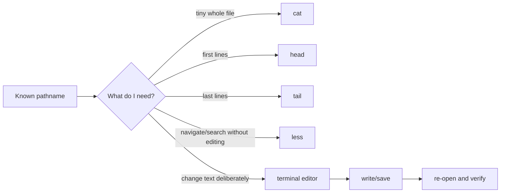
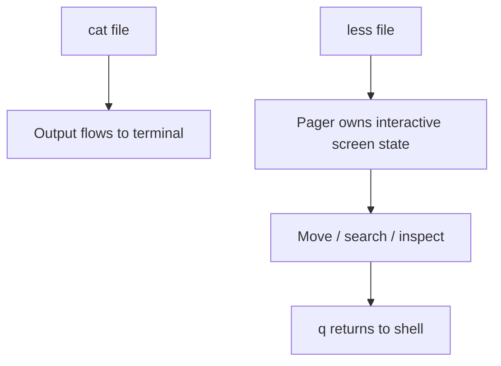
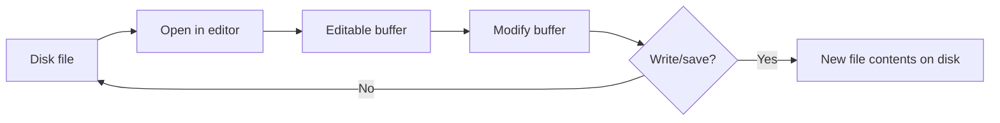

# Read and Edit Text Without Losing Context

## If you landed here directly

This lesson assumes only basic Linux navigation and safe file operations. You should be comfortable with:

- resolving a pathname;
- using `pwd`, `cd`, and `ls` to establish where you are;
- creating or copying a file without guessing which pathname will change.

If those ideas are unfamiliar, the most relevant prerequisites are [`LNX-0005`](LNX-0005-paths-names-and-the-single-filesystem-tree.md), [`LNX-0006`](LNX-0006-navigate-and-inspect-directories.md), and [`LNX-0007`](LNX-0007-create-copy-move-and-remove-files-safely.md).

This lesson adds a new distinction:

> **Looking at text is not the same operation as changing text.**

The goal is not to memorize four viewers and one editor. The goal is to choose an inspection or editing tool according to the **amount of context you need** and the **risk of changing the file**.

## The problem worth understanding

Suppose a program stops working after you edit a configuration file.

A common beginner workflow is:

```text
open file
scroll around
change something
save
hope
```

That workflow mixes several separate questions:

1. What file did I actually open?
2. How large is it?
3. Do I need the whole file, only the beginning, only the end, or a searchable view?
4. Am I still inspecting, or have I entered a state where keystrokes can modify text?
5. If I edit, what exactly will be written back to disk?
6. How will I verify the result?

Linux text work becomes much safer when those questions are explicit.

## Mental model: text work has modes

Use this model before choosing a command:



The tools overlap. That is normal.

The useful question is not:

> “Which command displays a file?”

It is:

> “What view gives me enough context for this task with the least accidental complexity?”

## Build a disposable text laboratory

Work entirely inside your home directory:

```bash
rm -rf "$HOME/csf-text-0008"
mkdir -p "$HOME/csf-text-0008"
cd "$HOME/csf-text-0008"

printf 'mode=development\nport=8080\nworkers=2\nlog_level=info\n' > app.conf

printf 'alpha\nbeta\ngamma\ndelta\nepsilon\nzeta\neta\ntheta\niota\nkappa\nlambda\nmu\n' > sequence.txt

pwd
ls -l
```

No command in this lab requires `sudo`.

Before reading a file, predict its pathname. Before editing a file, inspect it first.

## `cat`: send file contents to standard output

For a small text file, this is often the simplest inspection:

```bash
cat app.conf
```

GNU `cat` reads the named file and writes its contents to standard output.

That sounds trivial, but the stream model matters:


`cat` is not “opening a text viewer” in the interactive sense. It is writing bytes from input to output.

That is why it composes naturally with redirection and pipelines later in the curriculum.

### When `cat` is a good fit

Use it when:

- the file is short enough that seeing all of it at once is useful;
- you want the entire contents sent to standard output;
- you do not need interactive search or navigation.

### When `cat` is a poor fit

Imagine a log with 300,000 lines.

```bash
cat enormous.log
```

The command may be valid, but the terminal can become a torrent of text. The problem is not command correctness; the problem is **context management**.

A technically successful command can still be a poor tool choice.

### Interactive check

You need to inspect a four-line configuration file. Which is the more direct default: `cat` or an interactive pager?

<details>
<summary>Reveal</summary>

`cat` is often the more direct choice for a tiny file when the entire contents fit comfortably on screen. An interactive pager is not wrong, but it adds navigation state you may not need.

</details>

## `head`: inspect the beginning

Run:

```bash
head sequence.txt
```

GNU `head` prints the first 10 lines by default.

Ask for a specific number:

```bash
head -n 4 sequence.txt
```

Expected output:

```text
alpha
beta
gamma
delta
```

The key idea is **sampling by position**.

You are not saying:

> “Find lines that contain some content.”

You are saying:

> “Show me the beginning.”

That distinction becomes important when we later introduce searching and filtering tools.

### Useful questions for `head`

- Does this CSV appear to have a header row?
- What format does this generated file begin with?
- Did a report start with the expected metadata?
- What are the first few records without flooding the terminal?

### Prediction

What will this print?

```bash
head -n 2 app.conf
```

<details>
<summary>Reveal</summary>

```text
mode=development
port=8080
```

The option changes how much of the beginning is emitted; it does not search for particular keys.

</details>

## `tail`: inspect the end

Now run:

```bash
tail sequence.txt
```

By default, GNU `tail` prints the last 10 lines.

For the final three:

```bash
tail -n 3 sequence.txt
```

Expected:

```text
kappa
lambda
mu
```

The mental symmetry is useful:

```text
head  -> beginning
cat   -> whole file
tail  -> end
```

The end of a file often carries special operational meaning:

- latest appended log entries;
- final rows of a generated output;
- recent lines in an append-oriented file.

GNU `tail` has follow modes for growing files, but live log-following belongs later, when process/service/logging context is in place. At this stage, learn the simpler question: **what is at the end right now?**

## `less`: inspect more text while preserving navigation context

For a file too large to dump comfortably, use a pager:

```bash
less sequence.txt
```

`less` is interactive. The file does not simply rush past and leave your shell prompt underneath it.

Typical navigation:

```text
Space / PageDown   move forward
b / PageUp         move backward
/word              search forward for word
n                  repeat the search
q                  quit the pager
```

Use the built-in help inside `less` when needed rather than treating this list as complete.

### Why a pager is conceptually different

Compare:



A pager is a **viewing session**.

That creates useful temporary state:

- where you are in the file;
- what search term you entered;
- which match you are viewing.

But ordinary navigation in `less` does not rewrite the file.

### Search without switching to an editor

Open:

```bash
less app.conf
```

Then type:

```text
/log
```

and press Enter.

You are asking the pager to navigate to matching text, not modifying the file.

Press `q` when finished.

This separation is powerful:

> **Search first; edit only after you know what you intend to change.**

## Inspection tools answer different questions

Use this decision table as a starting point, not a rigid law:

| Task | Good first tool | Reason |
|---|---|---|
| Show a tiny complete file | `cat` | entire contents are useful |
| Check only the beginning | `head` | positional sample from the start |
| Check only the end | `tail` | positional sample from the end |
| Browse/search a longer file | `less` | interactive context without editing |
| Change content | editor | deliberate mutation |

### Active classification

Choose a first tool for each task before revealing the answer.

1. A 6-line config file.
2. A 40,000-line log where you need to search for `timeout`.
3. A data export where you only need to confirm the column header.
4. A generated report where you want the final 20 lines.

<details>
<summary>Reveal</summary>

Reasonable first choices:

1. `cat`
2. `less`
3. `head`
4. `tail -n 20`

Other tools may work. The point is to justify the choice from the information need.

</details>

## Reading is not editing

So far the commands have not intentionally changed file contents.

An editor crosses a boundary:



The exact implementation details vary between editors, but this model is enough for safe beginner reasoning:

1. open a known pathname;
2. inspect the text in an editable interface;
3. make a deliberate change;
4. explicitly write/save;
5. exit;
6. reopen or print the file to verify.

The dangerous mistake is collapsing all six into “I edited the file.”

## A terminal editor: GNU `nano` as a concrete beginner interface

Different Linux systems and users prefer different editors. This curriculum does not declare one editor to be universally correct.

For a concrete first terminal-editing lab, we use GNU `nano` **if it is installed** because its basic actions are visible and its manual is explicit.

Check first:

```bash
command -v nano
```

If this prints a pathname, continue with `nano`. If it prints nothing, do not install software just for this lesson; use an already-installed terminal editor or perform the inspection-only parts and return to editing when your environment has one.

### Never practice first on a valuable configuration file

Make a copy:

```bash
cp app.conf app.practice.conf
cat app.practice.conf
```

Now open only the practice copy:

```bash
nano app.practice.conf
```

Change:

```text
workers=2
```

to:

```text
workers=3
```

In standard `nano` bindings:

- `Ctrl+O` writes the buffer;
- Enter confirms the displayed filename;
- `Ctrl+X` exits.

The status/help lines at the bottom are part of the interface. Read them instead of memorizing a mystery keystroke sequence.

Then verify from the shell:

```bash
cat app.practice.conf
```

You should see `workers=3`.

### What did not happen

Editing the copy did not alter `app.conf`:

```bash
cat app.conf
```

This is a useful application of the independent-copy model from `LNX-0007`.

## File identity still matters inside an editor

Suppose your shell is in:

```text
/home/ada/project
```

and you run:

```bash
nano config/app.conf
```

The editor receives a pathname resolved from the shell's current working directory.

If you accidentally start from:

```text
/home/ada/project/archive
```

then the same relative string can refer to a different object or fail entirely.

An editor does not rescue a bad pathname model.

Before editing, use:

```bash
pwd
ls -l config/app.conf
```

when there is any uncertainty.

## Context can be lost even when the command is correct

Consider a 20,000-line source file. You want to change one line near a particular function.

This is a poor process:

```text
cat huge-file
scroll terminal history
open editor
search by memory
edit
```

A better process preserves context:

```text
inspect/search in pager
      ↓
identify exact pathname and text
      ↓
open exact file in editor
      ↓
search again inside editor
      ↓
make one deliberate change
      ↓
write
      ↓
re-inspect
```

The word **context** in this lesson means more than surrounding lines. It includes:

- pathname context;
- location in the file;
- whether you are in a read-only viewing mode or an editing mode;
- what you expect to change;
- how you will verify it.

## Where intuition breaks: `cat` is not “the command for text files”

Unix-like tools generally operate on byte streams. `cat` can output non-text data too.

If you point it at arbitrary binary content, your terminal may display unreadable or control-like output.

Therefore:

> A pathname ending in a familiar extension is not proof that blindly printing the entire file is a good idea.

At this level, inspect files you intentionally created or whose format you know.

Later lessons introduce richer file-type inspection.

## Where intuition breaks: line count is not file size

Two files can each contain ten lines while one is tiny and the other contains extremely long lines.

Likewise, “only 100 lines” does not guarantee a pleasant terminal dump.

Tool choice should depend on the actual task and scale, not only an arbitrary line threshold.

## Where intuition breaks: `less` can be configured

`less` has options, environment configuration, and version-specific features. A machine can therefore behave somewhat differently from a screenshot or tutorial.

When behavior matters:

```bash
less --version
man less
```

or consult the project's documentation.

This is another application of the documentation lesson: local behavior outranks a memorized tutorial.

## Where intuition breaks: editing syntax-sensitive text is not merely typing

Configuration files and source code have grammars.

Changing:

```text
workers=2
```

to:

```text
workers=3
```

may be valid.

Changing it to:

```text
workers===three
```

may make the consumer reject the file.

The editor can successfully save invalid content.

So there are at least three separate notions of success:

```text
editor wrote bytes successfully
        ≠
file syntax is valid
        ≠
program behavior is correct
```

Validation of particular file formats belongs with the programs that consume them.

## Where intuition breaks: permissions are a separate layer

You may inspect a file but be unable to save changes to it.

Do not respond reflexively by adding `sudo`.

The correct question is:

> Why does this identity have read permission but not write permission on this object?

Ownership and permission reasoning has its own curriculum node. For now, keep practice inside your own home-directory lab.

## Worked example: inspect before editing a configuration copy

Start:

```bash
cd "$HOME/csf-text-0008"
cp app.conf experiment.conf
```

Step 1 — whole-file context:

```bash
cat experiment.conf
```

Step 2 — identify the intended change:

```text
log_level=info
```

should become:

```text
log_level=debug
```

Step 3 — open the exact copy:

```bash
nano experiment.conf
```

Step 4 — make only the intended change and write it.

Step 5 — verify:

```bash
cat experiment.conf
```

Step 6 — verify the original remained unchanged:

```bash
cat app.conf
```

The educational pattern is:


## Worked example: choose partial views deliberately

Create a numbered file:

```bash
printf '01 start\n02 load\n03 parse\n04 validate\n05 compute\n06 store\n07 report\n08 cleanup\n09 done\n10 end\n11 footer\n12 checksum\n' > pipeline.txt
```

Now answer before running:

- Which command should show only `01 start`, `02 load`, and `03 parse`?
- Which command should show only `11 footer` and `12 checksum`?

Then verify:

```bash
head -n 3 pipeline.txt
tail -n 2 pipeline.txt
```

The important skill is predicting the **view**, not celebrating that output appeared.

## Worked example: direct-entry debugging

A reader says:

> “I edited `settings.conf`, but the application did not change.”

Do not immediately blame caching or the application.

First reconstruct the file identity:

```text
What was pwd?
What exact pathname was passed to the editor?
Did that pathname exist before editing?
Did the editor actually write/save?
What pathname is the application configured to read?
```

A perfectly successful edit of the wrong file is still the wrong change.

## Active work: tool selection without execution

For each scenario, choose the first tool and justify it.

### Scenario A

You receive a 7-line environment file and need to see all of it.

### Scenario B

You receive a long service log and need to inspect the most recent 30 lines currently present.

### Scenario C

You receive a 50,000-line generated report and need to search interactively for `FAILED` without modifying anything.

### Scenario D

You must change one known key in a disposable configuration copy.

<details>
<summary>Reasonable answers</summary>

- A: `cat`
- B: `tail -n 30`
- C: `less`, then search
- D: terminal editor after inspecting the exact pathname

The justification matters more than the command name.

</details>

## Active work: mode awareness

Classify each state as **shell**, **pager**, or **editor**.

1. You type `/timeout` and move to the next matching line without changing the file.
2. You type characters and they become part of the document buffer.
3. You type `tail -n 5 app.log` and receive output followed by a shell prompt.
4. You press `q` to return to the shell from an interactive text view.

<details>
<summary>Reveal</summary>

1. pager (`less` in this lesson)
2. editor
3. shell running a noninteractive utility
4. pager exiting to shell

Mode confusion causes many beginner mistakes, especially when the same terminal window hosts all three interfaces.

</details>

## Active work: identify the unsafe leap

A learner does this:

```bash
sudo nano /etc/some-service.conf
```

as their first attempt to learn editing.

List at least four questions that should have come first.

<details>
<summary>Possible reconstruction</summary>

- Is this the correct file?
- What does it currently contain?
- What documentation defines its syntax?
- Why is elevated privilege required?
- Can the change be practiced on a user-owned copy?
- How will the configuration be validated before a service consumes it?
- How will the original be recovered if necessary?

The lesson's lab deliberately avoids this situation.

</details>

## Retrieval / self-explanation

Without rereading the tables, explain the difference among these five actions:

```text
cat file
head file
tail file
less file
editor file
```

Your explanation should mention:

- amount/location of context;
- interactive versus noninteractive viewing;
- viewing versus mutation;
- verification after writing.

If your explanation reduces to “they all show text,” reconstruct the mental model again.

## A compact decision procedure

Before working with an unfamiliar text pathname:

```text
1. Identify the exact pathname.
2. Decide whether the task is inspection or mutation.
3. If inspection, decide how much positional/search context you need.
4. Choose cat, head, tail, or less accordingly.
5. If mutation is necessary, inspect first.
6. Open the exact pathname or a safe copy in an editor.
7. Write deliberately.
8. Re-inspect the saved result.
```

That procedure scales better than “always use my favorite editor.”

## Cleanup

Verify the lab pathname first:

```bash
pwd
ls -ld "$HOME/csf-text-0008"
```

Then remove only that disposable tree:

```bash
rm -rf "$HOME/csf-text-0008"
```

The cleanup itself should reuse the prediction-before-mutation discipline from the previous lesson.

## Connections

This lesson deepens several earlier ideas:

- [`LNX-0003`](LNX-0003-the-command-line-as-a-language-interface.md): standard output explains why `cat`, `head`, and `tail` behave as stream-producing utilities.
- [`LNX-0004`](LNX-0004-learn-to-ask-linux-for-help.md): local manuals and `--version` matter when pager/editor behavior differs.
- [`LNX-0005`](LNX-0005-paths-names-and-the-single-filesystem-tree.md): every file you inspect or edit is still reached through pathname resolution.
- [`LNX-0007`](LNX-0007-create-copy-move-and-remove-files-safely.md): writing an edited buffer is a filesystem mutation and should be verified.

## What this unlocks

You can now:

- choose between full, beginning, end, and interactive-search views of text;
- keep viewing mode distinct from editing mode;
- practice terminal editing on a known user-owned file;
- verify a saved change instead of trusting editor state;
- preserve pathname and task context while reading or changing text.

Run `python scripts/csf.py next linux-systems` to see the graph-valid next nodes rather than inferring readiness from lesson numbers alone.

## References

- `LNX-REF-004` — GNU Coreutils 9.11 Manual (`cat`, `head`, `tail`, stream-oriented file output).
- `LNX-REF-021` — Less project documentation (interactive paging and search behavior).
- `LNX-REF-022` — GNU nano manual (editor model and standard editing controls used in the disposable lab).
