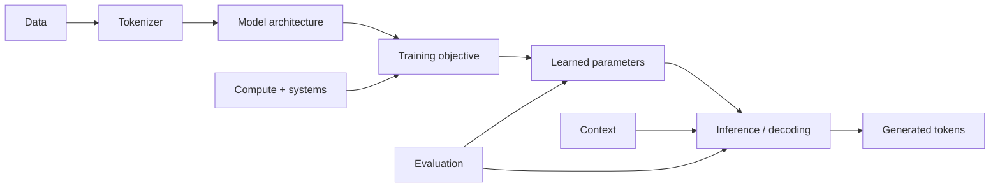

# What a Language Model Is

## The problem worth understanding

Modern language models can write code, continue prose, answer questions, summarize documents, call tools, and participate in long conversations. Those behaviors make it easy to begin with the wrong mental model: “the model is a database of answers,” “it searches the internet internally,” or “it thinks of a sentence and then types it out.”

A much stronger starting point is simpler and more precise:

> **A language model assigns probabilities to sequences of linguistic symbols. Modern autoregressive LLMs generate text by repeatedly estimating a probability distribution for the next token given the tokens already in context.**

That sentence does not explain everything an LLM can do. It gives us the mechanism from which the rest of the track can be built without magic.

## Mental model: a conditional probability engine

Suppose the visible context is:

> The capital of France is

A language model does not need to emit a single word as an absolute fact. Internally, at the generation boundary, we can think of it as producing scores that become a probability distribution over possible next tokens. A toy distribution might look like:

| candidate token | toy probability |
|---|---:|
| ` Paris` | 0.94 |
| ` Lyon` | 0.02 |
| ` located` | 0.01 |
| everything else | 0.03 |

These numbers are invented for explanation; they are not measurements from a real model. The important structure is real: **context in, distribution over the next token out**.

After a token is selected, it joins the context and the model runs again:

```text
context:  The capital of France is
predict:  distribution over next token
choose:   Paris

context:  The capital of France is Paris
predict:  distribution over next token
choose:   .
```

Generation is therefore an iterative process, not a hidden paragraph being revealed character by character.

## Precise concepts

### Language model

A **language model** is a model of probability over sequences. For a sequence of tokens $x_1, x_2, \ldots, x_T$, the chain rule lets an autoregressive model represent the sequence probability as

$$ P(x_1,\ldots,x_T)=\prod_{t=1}^{T}P(x_t\mid x_1,\ldots,x_{t-1}). $$

You do not need calculus or advanced probability to use this equation yet. Read it as: **the plausibility of a whole sequence can be decomposed into a succession of next-token predictions.**

### Token

A **token** is one unit from the model's discrete vocabulary. It is not necessarily a word. A tokenizer may represent common words as one token, rarer words as several pieces, punctuation as tokens, and whitespace together with adjacent text. Later we will study why tokenization choices matter.

### Context

The **context** is the sequence of tokens currently available to the model for the prediction being made. In a chat application, the context can contain system instructions, previous messages, tool outputs, retrieved documents, and the text generated so far. “What the model knows in its parameters” and “what is currently present in context” are different ideas.

### Autoregressive prediction

**Autoregressive** means that prediction proceeds using earlier elements to predict a later one. In the common decoder-only LLM setup, the training objective teaches the model to predict each next token from preceding tokens.

### Probability distribution

The output is not merely “the next word.” It is a **distribution**: many tokens receive nonzero probability. A decoding rule then selects or samples a token. This separation between *model distribution* and *decoding procedure* becomes crucial later.

## What makes a language model “large”?

There is no timeless scientific threshold at which a language model becomes an LLM. In practice, “large language model” refers to language models with sufficiently large learned parameter counts, data/compute budgets, and general-purpose capabilities that scale and system design become central concerns.

Size alone is not the curriculum. We will study the interacting system:



A serious understanding of LLMs therefore requires more than memorizing Transformer diagrams. It needs data, probability, optimization, architectures, distributed systems, evaluation, post-training, inference, interpretability, and safety.

## How training differs from generation

During **training**, the model sees many token sequences. It makes predictions, receives a numerical loss indicating how poorly the predictions match target tokens, and an optimization algorithm changes the parameters to reduce loss over data.

During **inference**, parameters are normally held fixed. The model receives a context, computes next-token scores, and a decoding procedure selects continuations.

This distinction blocks another common misconception: the model usually does not “learn permanently from every chat message” merely because the message appeared in context. Context can alter the current computation without updating the trained parameters.

## Worked example 1: context changes the distribution

Compare:

> The capital of France is

with

> The capital of France was moved in my fictional novel to

A competent model should not assign exactly the same next-token distribution to both contexts. The second context changes what continuation is plausible. This is the essence of **conditional** prediction.

## Worked example 2: probability is not certainty

Imagine a toy vocabulary:

```text
[" cat", " dog", " fox", "."]
```

After the context `The quick brown`, suppose a toy model produces:

```text
fox  0.80
cat  0.10
dog  0.07
.    0.03
```

Greedy decoding picks `fox`. Sampling may occasionally choose another token. The model distribution and the selection rule are separate layers of the generation system.

## Worked example 3: a model is not a lookup table

A lookup table could memorize exact prefixes and continuations, but natural text has effectively unbounded combinations. Modern neural language models learn parameterized patterns that generalize across contexts. The difficult questions—what representations they learn, when generalization succeeds, when they memorize, and how capabilities change with scale—will occupy much of this track.

## Where intuition breaks

### “Next-token prediction is obviously too simple for reasoning”

The training objective is local—predict the next token—but satisfying it across diverse data can require internal computations that capture syntax, semantics, world regularities, code patterns, and multi-step structures. The objective tells us what signal trains the system; it does not by itself tell us the full complexity of the learned computation.

### “High probability means true”

A language model estimates patterns under its training/post-training regime and current context. Fluency and probability are not guarantees of factual truth. Later evaluation lessons will separate likelihood, calibration, factuality, robustness, and task success.

### “The model stores the web and retrieves the nearest sentence”

Models can memorize some training material, but neural inference is not equivalent to a conventional document database lookup. Retrieval-augmented systems explicitly add external retrieval; we will study that distinction later.

### “One prompt reveals what the model can do”

Observed behavior depends on prompt/context, decoding, system configuration, model version, tools, and evaluation design. Single anecdotes are weak evidence about capability.

## Active work

For each statement, label it **model**, **context**, **decoding**, **training**, or **evaluation** and explain why:

1. changing temperature from 0.2 to 1.0;
2. adding a retrieved document to the prompt;
3. updating parameters after computing cross-entropy loss;
4. measuring exact-match accuracy on a held-out benchmark;
5. replacing one tokenizer vocabulary with another.

Then perform the companion exercise [`LLM-EXR-0001`](../exercises/LLM-EXR-0001-next-token-prediction-by-hand.md).

## Retrieval / self-explanation

Without looking back, explain:

1. What exactly is the input and output of an autoregressive LM at one generation step?
2. Why is a token not necessarily a word?
3. What is the difference between parameters and context?
4. What separates the model's distribution from the decoding procedure?
5. Why does “trained to predict the next token” not imply “stores only trivial local patterns”?

## Connections

The next lessons make the current black box explicit. We will build tokens, elementary probability, logits/softmax, vectors, gradients, optimization, and a tiny language model before touching a full Transformer. That ordering is deliberate: when attention arrives, every mathematical and computational object in it should already have a reason to exist.

## What this unlocks

You now have a falsifiable mental model of the core generative loop. Future terms—tokenizer, logits, softmax, attention, loss, fine-tuning, RLHF, KV cache, RAG—will be attached to a specific place in the system rather than accumulated as AI vocabulary.

## References

- Stanford CS336, *Language Modeling from Scratch*, Spring 2026.
- Vaswani et al., *Attention Is All You Need* (2017).
- Brown et al., *Language Models are Few-Shot Learners* (2020).
- PyTorch documentation for the computational framework used later in the track.
