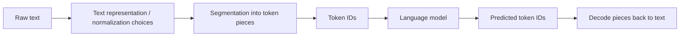
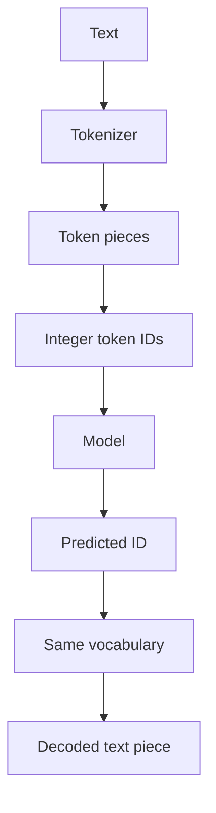

# Text, Symbols, Tokens, and Vocabularies

## If you landed here directly

You do not need machine learning, calculus, Python, or prior NLP knowledge for this lesson.

You only need one idea from [`LLM-0001`](LLM-0001-what-a-language-model-is.md): an autoregressive language model repeatedly predicts a distribution over the **next token** given tokens already in context.

That immediately raises a question the first lesson deliberately postponed:

> **What exactly is a token, and how does ordinary text become the discrete objects a model can predict?**

This lesson answers that question without treating tokenization as a magical preprocessing box.

## The problem worth understanding

Humans see text such as:

```text
Tokenization matters.
```

A neural network does not receive that visual sentence as an abstract human idea.

At some point, the system needs a finite set of discrete symbols it can identify with integers. A tokenizer provides that interface.

A useful first pipeline is:



The details vary by tokenizer, but the architectural role is stable:

> **Tokenization maps text into a sequence of discrete vocabulary entries, usually represented to the model as integer IDs.**

The model then operates on those IDs through learned numerical representations later in the pipeline.

## Four layers that beginners often collapse together

These terms are related but not interchangeable.

### Text

**Text** is linguistic content represented by a computer in some character encoding and software representation.

Example:

```text
café
```

Humans may think of it as one word. A computer system may encounter Unicode characters, encoded bytes, normalization choices, and finally tokenizer-specific pieces.

### Symbol

A **symbol** is a deliberately broad term for a discrete unit used at some representation layer.

Depending on the layer, a symbol might be:

- a Unicode code point;
- a byte value;
- a character-like unit;
- a subword piece;
- a special control token;
- a token ID.

Do not assume that every system uses the word *symbol* in exactly the same formal way. Here we use it to prevent an early mistake: **there are several discrete layers between visible text and model computation**.

### Token

A **token** is one discrete unit produced or recognized by a tokenizer from its vocabulary.

It might correspond to:

```text
a whole word
part of a word
punctuation
whitespace plus neighboring text
one character
one or more bytes
special metadata/control markers
```

A token is therefore **not defined as a word**.

### Vocabulary

The **vocabulary** is the finite inventory of token types the tokenizer/model interface recognizes.

A toy vocabulary might be:

```text
ID  token piece
0   <BOS>
1   <EOS>
2   the
3   cat
4   c
5   at
6   .
```

Real modern vocabularies can contain many thousands or more entries, and the pieces need not line up with human word boundaries.

The important invariant is:

```text
vocabulary entry ↔ token ID
```

That ID is what later becomes an index into learned model parameters such as an embedding table.

## Mental model: tokenization is an interface contract

Think of the tokenizer and model as two components that must agree on a contract.



If the tokenizer says:

```text
ID 4187 means a particular piece
```

then the model's learned parameters associated with ID 4187 are tied to that tokenizer definition.

You cannot safely replace the tokenizer with a different vocabulary and expect the same model weights to preserve their meaning.

That is why tokenizer choice is part of a model specification, not just a cosmetic text utility.

## The same visible text can become different token sequences

Suppose the text is:

```text
unbelievable
```

Three hypothetical tokenizers might encode it as:

```text
Tokenizer A: ["unbelievable"]
Tokenizer B: ["un", "believ", "able"]
Tokenizer C: ["u", "n", "b", "e", "l", "i", "e", "v", "a", "b", "l", "e"]
```

All three can represent the same visible text.

But they produce different sequence lengths:

```text
1 token
3 tokens
12 tokens
```

That difference matters because language models operate over token sequences, not directly over the human concept “one word.”

Sequence length affects later concerns such as:

- context-window usage;
- training/inference compute;
- how linguistic patterns are distributed across positions;
- how many prediction steps are needed to emit text.

We will study those consequences later. For now, notice the interface dependency.

## Why not use only whole words?

Imagine a fixed word vocabulary:

```text
cat
dog
run
happy
```

What happens when the text contains:

```text
microarchitecture
Zavira
unhappiness
GPT-17
```

A pure fixed-word vocabulary either needs an enormous inventory or a strategy for unknown words.

This is one reason subword tokenization became important: many rare or unseen word forms can be represented as combinations of reusable smaller pieces.

A toy segmentation could be:

```text
un + happy + ness
```

The real segmentation depends on the tokenizer and its learned or constructed vocabulary. The point is not that English morphology always determines token boundaries—it does not. The point is that **subword vocabularies trade sequence length against vocabulary coverage**.

## Why not use only characters?

Character-level tokenization avoids many unknown-word problems because the basic inventory can be relatively small.

But consider:

```text
internationalization
```

A character tokenizer may require many prediction positions for one human-perceived word.

A subword tokenizer might encode frequent patterns in fewer tokens.

So there is a design tension:

```text
small vocabulary
    ↕
longer sequences

large vocabulary
    ↕
shorter sequences, larger discrete inventory
```

This is not a universal one-dimensional optimization problem—language coverage, scripts, bytes, normalization, model size, data distribution, and implementation choices matter too—but the tradeoff is foundational.

## Bytes, Unicode, and why “character” is slippery

A common beginner statement is:

> “Just split the string into characters.”

That sounds simpler than it is.

Modern text is usually represented through Unicode, and storage/transmission often uses encodings such as UTF-8. A visible character may correspond to:

- one Unicode code point;
- multiple code points that render together;
- multiple bytes under UTF-8.

For example, accented text can sometimes have canonically related Unicode representations that look similar while differing in underlying code points.

You do **not** need to master Unicode normalization here. The lesson is narrower:

> Visible glyphs, Unicode code points, encoded bytes, and tokenizer tokens are different representation layers.

Do not use the word “character” casually when a mechanism depends on the exact layer.

## Token IDs are labels, not meanings

Suppose a tokenizer maps:

```text
" cat" → 3912
" dog" → 872
"."    → 13
```

The numbers do not mean:

```text
3912 is more cat-like than 872
```

or:

```text
3912 > 872 therefore cat > dog
```

Token IDs are categorical identifiers.

Their numerical magnitude has no semantic ordering by itself.

Later, an embedding table will map each token ID to a learned vector. **That learned vector** can carry distributed information used by the model. The raw ID is merely an index.

### Interactive check

A tokenizer changes the ID for `" cat"` from 3912 to 17 but all model weights are left untouched.

Is this just a harmless relabeling?

<details>
<summary>Reveal</summary>

Not if the model's embedding/output parameters still interpret index 17 as the old token associated with that index. Token IDs and model parameters must share the same vocabulary contract.

A consistent permutation of vocabulary IDs **and all corresponding model parameters** could preserve behavior in principle, but changing only the tokenizer mapping breaks the interface.

</details>

## Whitespace can be part of tokenization

Human writing often treats spaces as separators. Tokenizers do not all represent whitespace the same way.

For example, a tokenizer may distinguish pieces conceptually like:

```text
"hello"
" hello"
```

or use a visible marker internally to represent whitespace boundaries.

SentencePiece, for example, is designed to work from raw text and represents whitespace explicitly in its piece representation so tokenization/detokenization can be handled consistently.

The practical consequence:

> A token displayed as a word fragment may implicitly include preceding or boundary whitespace.

That explains why inspecting tokenizer pieces can look strange if you expect one token to equal one printed word.

## Punctuation is not “free”

Consider:

```text
hello
hello!
"hello"
hello-world
```

A tokenizer might assign punctuation separate pieces, combine it with nearby text in some contexts, or segment the strings differently depending on learned merges/pieces and pre-tokenization rules.

Never infer token count from word count alone.

This matters especially when someone says:

> “The context window is N words.”

Modern model context limits are typically specified in tokens, not ordinary words.

## Special tokens are part of the discrete interface too

Some vocabularies contain entries that do not correspond to ordinary user-visible text fragments.

Examples can include conceptual roles such as:

```text
beginning of sequence
end of sequence
padding
separator
unknown token
chat/control markers
```

The exact set and semantics are model-specific.

A special token can influence the model because it occupies a vocabulary ID with learned significance, even if the user never types that literal text.

This is one reason chat formatting is not always “just a string prefix.” A serving system may transform structured messages into tokenizer/model-specific control tokens or templates.

We will study chat templates and post-training interfaces much later. For now, special tokens demonstrate that a vocabulary is a machine interface, not just a dictionary of visible words.

## A toy tokenizer by hand

Let the vocabulary be:

```text
0  <BOS>
1  <EOS>
2  " the"
3  " cat"
4  " sat"
5  " on"
6  " mat"
7  "."
8  " m"
9  "at"
```

Suppose the text is:

```text
 the cat sat on the mat.
```

One valid encoding under this toy design might be:

```text
[2, 3, 4, 5, 2, 6, 7]
```

A different tokenizer could represent `mat` as:

```text
[8, 9]
```

giving:

```text
[2, 3, 4, 5, 2, 8, 9, 7]
```

The language model does not see “same sentence, basically.” It sees two different sequences under two different vocabulary contracts.

## Encode and decode are distinct directions

Conceptually:

```text
encode(text)  → token IDs
decode(ids)   → text
```

A well-designed tokenizer often aims for reliable reconstruction over supported input, but details such as normalization can affect whether “decode(encode(text))” reproduces the exact original code-point sequence or a normalized equivalent.

Do not assume losslessness without knowing the tokenizer's specification.

SentencePiece explicitly emphasizes reversible handling and its own normalization/tokenization conventions. Other tokenizers can make different choices.

## Tokenization is learned or constructed before ordinary LM inference

For many systems, the tokenizer vocabulary is created or selected before the main language model is trained.

A simplified development sequence is:

```text
collect representative text
        ↓
choose/train tokenizer
        ↓
freeze vocabulary + ID mapping
        ↓
convert training text to token IDs
        ↓
train language model on those IDs
```

This explains why vocabulary construction is a modeling/data decision.

It can affect how efficiently different languages, scripts, code, numbers, and domain-specific strings are represented.

## Subword tokenization: the key idea without the algorithmic details

Two influential families you will encounter are:

- Byte Pair Encoding (BPE)-style subword tokenization;
- unigram-language-model tokenization.

SentencePiece supports both among its tokenization modes.

At L0, you only need the common objective:

> Build a finite vocabulary of reusable pieces that can represent raw text more flexibly than a fixed whole-word dictionary.

We are **not** yet deriving BPE merge training or the unigram pruning objective. Those algorithmic details are useful later but are not required to understand the tokenizer/model interface.

## Same sentence, unequal token efficiency across languages

Suppose two translations express comparable information, but one language or script is represented with many more tokens under a particular tokenizer.

Then, under a fixed token context window, that language may consume more context capacity for comparable semantic content.

This does **not** mean one language is intrinsically “more verbose to a computer.” It means the tokenizer vocabulary and training data distribution interact with the text representation.

Tokenizer quality is therefore also a multilingual and fairness concern, not merely a compression trick.

## Code and numbers expose token boundaries too

Strings such as:

```text
std::vector<int>
0x7ffd42
1234567890
snake_case_identifier
```

can segment very differently from ordinary prose.

A tokenizer trained heavily on code may contain pieces that make common programming substrings efficient. Another vocabulary may fragment them more aggressively.

Similarly, digit sequences may be grouped or split according to tokenizer rules.

This matters later for arithmetic, code modeling, and sequence efficiency.

## Where intuition breaks

### “A token is a word”

No. It may be a word, subword, punctuation fragment, whitespace-associated piece, byte-derived unit, or special token.

### “Token IDs contain semantic magnitude”

No. IDs are categorical labels. Meaningful numerical geometry appears later in learned vectors and model states.

### “One tokenizer is just as good as another if both decode the same text”

No. They can produce different sequence lengths, frequency distributions, language coverage, and learned model interfaces.

### “I can change the tokenizer after training without touching the model”

Not generally. The learned embedding/output parameters are indexed according to the original vocabulary mapping.

### “Unicode character = byte = token”

No. These are different representation layers.

### “Whitespace does not matter because language is made of words”

Whitespace can be represented explicitly or bundled into token pieces and can change segmentation.

### “Tokenizer behavior is an objective property of the sentence”

No. It depends on the tokenizer implementation, vocabulary, normalization, and model configuration.

## Worked example 1: word count is not token count

Text:

```text
reindustrialization
```

Human word count:

```text
1
```

Hypothetical tokenizer A:

```text
["reindustrialization"]
```

Hypothetical tokenizer B:

```text
["re", "industrial", "ization"]
```

Hypothetical tokenizer C:

```text
["re", "ind", "ustr", "ial", "ization"]
```

The model sees sequence lengths 1, 3, and 5 respectively.

## Worked example 2: token IDs are a reversible codebook only with the right vocabulary

Vocabulary A:

```text
17 → " hello"
23 → " world"
91 → "!"
```

Encoded sequence:

```text
[17, 23, 91]
```

Under Vocabulary A, decoding yields:

```text
 hello world!
```

If Vocabulary B assigns those IDs to different pieces, the same integer sequence decodes differently.

So an integer token sequence is not self-describing. You need the vocabulary/tokenizer specification.

## Worked example 3: special tokens versus ordinary text

Suppose a model reserves:

```text
100001 → <BOS>
100002 → <EOS>
```

Those IDs participate in the model's discrete sequence even though they are not ordinary prose words.

A prompt may therefore become conceptually:

```text
<BOS> + user text + other control structure
```

before the language model sees token IDs.

This is why “the exact string I typed” and “the exact token sequence delivered to the model” are not always identical concepts in an application stack.

## A practical tokenizer inspection experiment

If you later install a tokenizer library, do not begin by asking only:

> “How many tokens?”

Inspect at least four things:

```text
1. original text
2. token IDs
3. token pieces / decoded token bytes if available
4. round-trip decoded text
```

Then compare inputs designed to challenge your assumptions:

```text
hello
 hello
hello!
unbelievable
café
你好
1234567890
std::vector<int>
```

The point is not to memorize one model's token IDs. Token IDs are tokenizer-specific and can change across vocabularies.

The durable skill is learning to inspect the representation layer explicitly.

## Active work

Complete [`LLM-EXR-0002`](../exercises/LLM-EXR-0002-build-and-audit-a-toy-tokenizer.md).

You will:

- design a tiny vocabulary;
- encode several strings by hand;
- compare word-, character-, and subword-style representations;
- detect an out-of-vocabulary failure in a deliberately naive word tokenizer;
- test whether your encode/decode rules are reversible;
- explain why raw IDs are meaningless without the vocabulary mapping.

## Retrieval / self-explanation

Without looking back, explain:

1. Why is a token not the same thing as a word?
2. What is the difference among visible text, Unicode/code-point representation, bytes, token pieces, and token IDs?
3. Why does the model need a finite vocabulary interface?
4. Why are token IDs categorical rather than ordinal quantities?
5. Why can two tokenizers assign different sequence lengths to the same visible text?
6. What tradeoff motivates subword tokenization relative to pure word or pure character vocabularies?
7. Why can replacing a tokenizer break an already-trained model?
8. Why can tokenization quality differ across languages or code domains?

## Connections

[`LLM-0001`](LLM-0001-what-a-language-model-is.md) described next-token prediction. This lesson makes the word **token** operational: a token is a discrete vocabulary entry represented by an ID under a specific tokenizer contract.

The next lesson, `LLM-N-0003`, introduces **probability from counts**. Now that we have a finite vocabulary, we can ask a concrete question:

> Given previous tokens, how should probability mass be distributed over the possible next token IDs?

Later:

- `LLM-N-0011` will build a tiny character-level language model;
- `LLM-N-0012` will map token IDs into learned embedding vectors;
- later tokenization/data lessons will revisit BPE, vocabulary construction, efficiency, and multilingual consequences at greater depth.

## What this unlocks

You can now trace the representation boundary:

```text
human-readable text
→ tokenizer-specific pieces
→ vocabulary IDs
→ model input sequence
```

and explain why:

- tokenization changes sequence length;
- a vocabulary is finite;
- IDs are not semantic numbers;
- tokens need not be words;
- tokenizer and model parameters must agree on the same discrete interface.

That gives us the discrete sample space needed for the next lesson: **probability from counts, without mystery**.

## References

- Stanford CS336, *Language Modeling from Scratch*, Spring 2026 — the course begins its from-scratch language-model stack with tokenization.
- Kudo and Richardson, *SentencePiece: A simple and language independent subword tokenizer and detokenizer for Neural Text Processing* (2018) — raw-text subword tokenization, vocabulary IDs, and language-independent tokenizer design.
