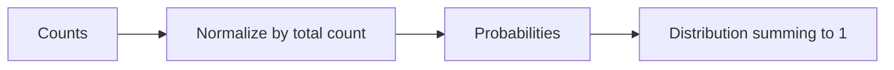
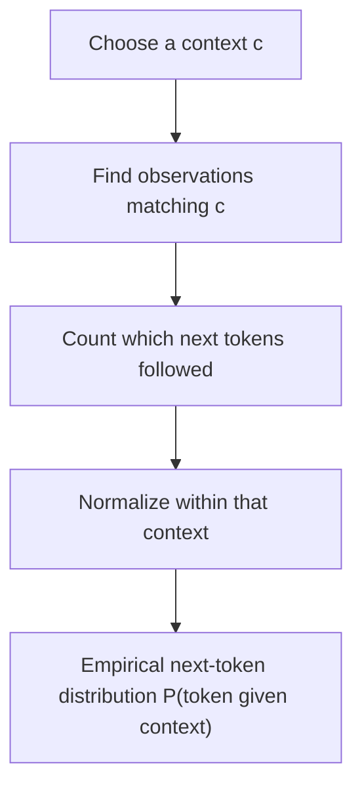

# Probability from Counts: Uncertainty Without Mystery

## If you landed here directly

You do not need calculus, machine learning, or statistics for this lesson.

You need only two ideas from the earlier LLM lessons:

1. a language model predicts what token comes next; and
2. text is represented as a sequence of tokenizer-defined discrete token IDs.

Now we face the next question:

> **If several next tokens are plausible, how can a model represent that uncertainty numerically?**

Probability is the language we will use.

This lesson starts from counts rather than abstract axioms. That is not the whole theory of probability, but it is a concrete route to the specific intuition language modeling needs.

## The problem worth understanding

Suppose you repeatedly observe this context:

```text
the cat
```

and in a small dataset it is followed by:

```text
sat
slept
sat
ran
sat
```

A deterministic rule such as:

```text
next token = sat
```

throws away useful information.

The observations say something richer:

```text
sat      happened 3 times
slept    happened 1 time
ran      happened 1 time
```

The uncertainty is not mysterious. We can first summarize it with **relative frequencies**.

## From counts to a distribution

There are five observations total.

So the empirical relative frequencies are:

$$ P(\text{sat}) = \frac{3}{5} = 0.6, $$

$$ P(\text{slept}) = \frac{1}{5} = 0.2, $$

and

$$ P(\text{ran}) = \frac{1}{5} = 0.2. $$

They sum to one:

$$ 0.6 + 0.2 + 0.2 = 1. $$

That collection of nonnegative values summing to one is a **probability distribution** over the possible outcomes we are considering.



This is our first bridge from observed data to probabilistic prediction.

## Event, outcome, and sample space — enough vocabulary to reason clearly

We will keep the terminology lightweight.

An **outcome** is one possible result of the experiment or prediction step.

For a next-token prediction, outcomes might be token IDs such as:

```text
sat
slept
ran
```

The **sample space** is the set of outcomes under consideration.

An **event** is a set or condition involving outcomes. In a simple next-token example, the event may be:

```text
next token is "sat"
```

At this stage, do not get lost in notation. The key distinction is:

```text
possible outcome  ≠  observed count  ≠  probability assigned to outcome
```

## A basic count estimate

If an event $A$ occurred $n_A$ times in $N$ relevant observations, a simple empirical estimate is:

$$ \hat{P}(A) = \frac{n_A}{N}. $$

The hat on $\hat{P}$ is useful notation: it reminds us that we are talking about an estimate derived from finite data, not necessarily an unknowable perfect “true” probability.

For the earlier example:

$$ n_{\text{sat}} = 3, \qquad N = 5, $$

so:

$$ \hat{P}(\text{sat}) = \frac{3}{5}. $$

## Important distinction: frequency is evidence, not certainty

Suppose a coin is tossed only twice and both outcomes are heads.

The empirical frequency is:

$$ \hat{P}(\text{heads}) = \frac{2}{2} = 1. $$

Does that prove the physical process can never produce tails?

No.

A finite sample can be unrepresentative. The count-based estimate describes the observed sample exactly, but inference about an underlying process requires additional reasoning.

This distinction will matter constantly in machine learning:

```text
training observations
        ↓
finite-data estimate
        ↓
model / generalization assumptions
        ↓
predictions on new cases
```

Do not collapse those layers.

## Interactive check: normalize the counts

A tokenizer vocabulary has four candidate next tokens with observed counts:

```text
A: 6
B: 2
C: 1
D: 1
```

Before opening the answer, compute the probability estimate for each token.

<details>
<summary>Reveal</summary>

The total is:

$$ N = 6+2+1+1 = 10. $$

So:

$$ \hat{P}(A)=0.6, \quad \hat{P}(B)=0.2, \quad \hat{P}(C)=0.1, \quad \hat{P}(D)=0.1. $$

The values sum to one.

</details>

## Why probabilities must add to one

If our sample space contains mutually exclusive next-token outcomes and one of them must occur, all probability mass has to be allocated across that set.

For outcomes $x_1,\dots,x_k$:

$$ \sum_{i=1}^{k} P(x_i) = 1. $$

and each individual probability obeys:

$$ 0 \le P(x_i) \le 1. $$

For language models, the sample space at one prediction step will eventually be the model vocabulary.

That is an enormous categorical choice compared with our three-token toy example, but the normalization idea is the same.

## Probability is not a score with arbitrary scale

Suppose someone proposes:

```text
cat: 8
sat: 4
ran: 2
```

These numbers may be useful **scores** or counts, but they are not yet a probability distribution because:

$$ 8 + 4 + 2 \ne 1. $$

If they are counts, normalize them:

$$ N = 8+4+2 = 14. $$

Then:

$$ \hat{P}(\text{cat}) = \frac{8}{14}, \qquad \hat{P}(\text{sat}) = \frac{4}{14}, \qquad \hat{P}(\text{ran}) = \frac{2}{14}. $$

Later, model outputs called **logits** will also be unnormalized scores. The next lesson explains how softmax converts those scores into a categorical probability distribution.

For now, remember:

> **Probability has normalization constraints; arbitrary scores do not.**

## Language modeling needs conditional probability

The probability of a token depends strongly on what came before it.

Compare:

```text
I drink hot ...
```

with:

```text
The server is ...
```

The same token may be plausible in one context and implausible in another.

So language modeling is not mainly interested in an unconditional statement such as:

$$ P(\text{token} = t). $$

It needs a context-sensitive statement:

$$ P(\text{next token}=t \mid \text{context}=c). $$

Read the vertical bar as:

> “given” or “conditioned on.”

So:

$$ P(t \mid c) $$

means:

> the probability assigned to token $t$ **given** context $c$.

## Conditional probability from matching counts

Suppose a tiny corpus contains these token sequences:

```text
<BOS> the cat sat
<BOS> the cat slept
<BOS> the dog sat
<BOS> the cat sat
```

Look only at cases where the current context token is `the`.

The next token is:

```text
cat
cat
dog
cat
```

So:

$$ \mathrm{count}(\text{the} \rightarrow \text{cat}) = 3, $$

$$ \mathrm{count}(\text{the} \rightarrow \text{dog}) = 1, $$

and:

$$ \mathrm{count}(\text{the as context}) = 4. $$

The empirical conditional estimates are:

$$ \hat{P}(\text{cat} \mid \text{the}) = \frac{3}{4}, $$

$$ \hat{P}(\text{dog} \mid \text{the}) = \frac{1}{4}. $$

This is the central language-modeling move in miniature:



## Why conditioning changes the denominator

A common mistake is to divide by the total number of tokens in the whole corpus.

But for:

$$ P(\text{cat} \mid \text{the}), $$

we care about the subset of observations in which the condition `the` is satisfied.

Conceptually:

$$ \hat{P}(t \mid c) = \frac{\mathrm{count}(c \rightarrow t)}{\mathrm{count}(c)}. $$

The denominator is therefore the number of relevant context occurrences, not every token observation everywhere.

## Interactive check: same token, different context

Suppose the dataset yields:

```text
context = "the"
cat: 9
dog: 1

context = "a"
cat: 2
dog: 8
```

Compute:

$$ \hat{P}(\text{cat}\mid\text{the}) $$

and:

$$ \hat{P}(\text{cat}\mid\text{a}). $$

<details>
<summary>Reveal</summary>

For `the`, there are ten matching observations:

$$ \hat{P}(\text{cat}\mid\text{the}) = \frac{9}{10}=0.9. $$

For `a`, there are also ten:

$$ \hat{P}(\text{cat}\mid\text{a}) = \frac{2}{10}=0.2. $$

The outcome token is the same. The condition changes the distribution.

</details>

## Context can be longer than one token

Real autoregressive language models condition on a sequence of previous tokens, not merely one previous token.

We can write a token sequence as:

$$ x_1, x_2, \dots, x_t. $$

The next-token distribution is conceptually:

$$ P(x_{t+1} \mid x_1, x_2, \dots, x_t). $$

A compact notation is:

$$ P(x_{t+1} \mid x_{\le t}). $$

You do **not** need to manipulate this notation yet. Read it as:

> “a probability distribution for the next token given the tokens already seen.”

This connects directly back to LLM-0001.

## Why raw counting eventually fails

At first, direct counting looks like a complete language model:

```text
memorize every context
count following tokens
normalize
```

But the number of possible contexts explodes.

If you require an exact long context such as:

```text
in the middle of the surprisingly cold afternoon we decided to
```

it may never appear exactly in the training data again.

Then direct counts give little or no evidence for that exact context.

This is one reason learned neural language models are interesting: they try to **generalize across related contexts** rather than store an independent table for every complete sequence.

We are not ready to explain how yet. The important conceptual bridge is:

```text
counting model
    ↓ exposes the target object
conditional next-token distribution
    ↓
neural model learns a function that produces such distributions for many contexts
```

## Zero counts do not automatically mean impossibility

Suppose token `otter` was never observed after a particular context in a tiny sample.

Then the naive empirical estimate is:

$$ \hat{P}(\text{otter}\mid c)=0. $$

That statement means:

> “zero occurrences in the observations used by this estimator.”

It does not automatically prove:

> “this continuation is logically or physically impossible.”

This is another finite-data issue.

Classical language models developed smoothing methods partly to avoid brittle zero-probability behavior. Neural models address generalization differently, though zero or near-zero modeled probabilities can still arise in various ways.

We will revisit these issues after the foundational mechanics are in place.

## Probability versus confidence language

People casually say:

> “The model is 80% confident.”

Be cautious.

A next-token probability of $0.8$ means the model assigned probability mass $0.8$ to that token under its current predictive distribution.

It does **not** automatically mean:

- the model has an 80% chance of being factually correct;
- the whole generated sentence is 80% correct;
- the model is well calibrated;
- the probability reflects epistemic truth rather than learned predictive behavior.

Those are different questions.

For now, use the precise phrase:

> “The predictive distribution assigns probability $p$ to this next token under this context.”

## A probability table is a compressed statement of alternatives

Consider:

| Next token | Probability |
|---|---:|
| `cat` | 0.50 |
| `dog` | 0.25 |
| `bird` | 0.15 |
| `fish` | 0.10 |

This table says more than “cat is most likely.”

It tells us:

- which alternatives are represented;
- their relative mass;
- how concentrated or diffuse the uncertainty is;
- that the mass sums to one.

Two models can choose the same most-likely token but have very different uncertainty:

```text
Model A: cat 0.95, others total 0.05
Model B: cat 0.30, others total 0.70
```

Argmax alone hides that difference.

## Sampling from a distribution

A distribution can be used in more than one way.

One simple decision is:

```text
choose the highest-probability token
```

Another is to **sample** according to the distribution.

If:

```text
cat: 0.6
dog: 0.3
bird: 0.1
```

repeated sampling does not mean every ten samples must contain exactly six cats, three dogs, and one bird. Those proportions are long-run tendencies, not a rigid schedule for short runs.

This is why probability is about structured uncertainty, not deterministic percentages per batch.

Decoding strategies will come much later. Here we only need to understand what a distribution makes possible.

## Product rule preview: a sequence is built from conditional steps

An autoregressive language model predicts one token at a time.

For a short token sequence:

$$ x_1, x_2, x_3, $$

a probability model can factor the sequence probability as:

$$ P(x_1,x_2,x_3) = P(x_1) P(x_2\mid x_1) P(x_3\mid x_1,x_2). $$

You do not need to derive this yet.

The reason to see it now is architectural:


“Language modeling” can therefore turn a sequence problem into repeated conditional prediction problems.

## A miniature count-based language model

Consider the tiny corpus:

```text
red fox runs
red fox sleeps
blue fox runs
red bird flies
```

### Step 1: choose a context

Use the one-token context:

```text
red
```

### Step 2: collect matching next tokens

They are:

```text
fox
fox
bird
```

### Step 3: count

```text
fox: 2
bird: 1
```

### Step 4: normalize

$$ \hat{P}(\text{fox}\mid\text{red}) = \frac{2}{3}, $$

$$ \hat{P}(\text{bird}\mid\text{red}) = \frac{1}{3}. $$

### Step 5: ask what the table cannot do

What is:

$$ \hat{P}(\text{runs}\mid\text{green dragon})? $$

The exact context never appears. A pure exact-count table has no observations to normalize for that context.

That limitation points toward generalization rather than invalidating probability itself.

## A tiny implementation without machine-learning libraries

You can make the count-to-probability mechanism concrete with plain Python:

```python
from collections import Counter

next_tokens = ["sat", "slept", "sat", "ran", "sat"]
counts = Counter(next_tokens)
total = sum(counts.values())

probs = {token: count / total for token, count in counts.items()}

print(counts)
print(probs)
print(sum(probs.values()))
```

The core transformation is:

```python
count / total
```

Nothing in this example is a neural network.

That is useful: it isolates the probabilistic object before we add learned parameters.

## Common misconceptions

### “Probability is just a fancy percentage”

Percentages are one representation of probabilities, but probability theory also defines how events, conditioning, joint outcomes, expectation, and many other structures behave. This lesson uses only the first layer.

### “If a continuation happened most often, its probability is 1”

No. Being the most frequent outcome does not imply certainty.

### “A zero empirical count proves impossibility”

No. It proves zero observations in the relevant finite sample used by that estimator.

### “The denominator is always the whole dataset”

Not for a conditional estimate. The denominator corresponds to the observations satisfying the condition.

### “The token with probability 0.6 must appear exactly six times in every ten samples”

No. Probability describes a distribution over random outcomes; short finite samples fluctuate.

### “Next-token probability equals factual confidence”

No. Predictive token probability and factual correctness/calibration are different concepts.

## Active reasoning set

### Problem 1 — normalize

Counts:

```text
x: 12
y: 6
z: 2
```

Compute the empirical distribution.

<details>
<summary>Answer</summary>

The total is $20$.

$$ \hat{P}(x)=0.6, \qquad \hat{P}(y)=0.3, \qquad \hat{P}(z)=0.1. $$

</details>

### Problem 2 — condition correctly

Observed continuations:

```text
context "red":  fox, fox, bird, fox
context "blue": bird, bird, fox, bird, bird, fox
```

Compute:

$$ \hat{P}(\text{fox}\mid\text{red}) $$

and:

$$ \hat{P}(\text{fox}\mid\text{blue}). $$

<details>
<summary>Answer</summary>

For `red`, fox appears $3$ of $4$ times:

$$ \frac{3}{4}=0.75. $$

For `blue`, fox appears $2$ of $6$ times:

$$ \frac{2}{6}=\frac{1}{3}. $$

</details>

### Problem 3 — diagnose the wrong denominator

Someone computes:

$$ P(\text{cat}\mid\text{the}) = \frac{\mathrm{count}(\text{the followed by cat})}{\mathrm{count}(\text{all tokens in corpus})}. $$

What is wrong?

<details>
<summary>Answer</summary>

The denominator should count the relevant conditioning cases—occurrences of the context `the` for the estimator being constructed—not all tokens in the corpus.

</details>

### Problem 4 — uncertainty, not only winner

Which predictive distribution is more concentrated?

```text
A: [0.90, 0.05, 0.05]
B: [0.40, 0.35, 0.25]
```

Both choose the first outcome under argmax. Explain what argmax hides.

<details>
<summary>Answer</summary>

Distribution A places almost all mass on the first outcome. Distribution B spreads substantial mass across alternatives. Argmax retains only the identity of the largest entry and discards that uncertainty structure.

</details>

## What this means for a neural language model

A modern neural language model will not literally scan a corpus and count exact long contexts at inference time.

Instead, it learns parameters from training data and computes a vector of scores for the vocabulary. The next lesson explains how those scores—**logits**—become a probability distribution through **softmax**.

But the target object is already clear:

```text
context tokens
      ↓
model computation
      ↓
probability distribution over next vocabulary token
```

That is why probability is not an optional mathematical decoration around language models. It is part of what the model is asked to produce.

## Retrieval check

Without looking back, answer:

1. How do counts become empirical probabilities?
2. Why must a complete categorical distribution sum to one?
3. What does the bar mean in $P(t\mid c)$?
4. Why does conditioning change the denominator?
5. Why can zero observed count differ from impossibility?
6. Why is argmax not a full description of uncertainty?
7. What does an autoregressive language model conceptually predict at each step?

<details>
<summary>Compact answer check</summary>

1. Divide each relevant count by the total relevant count.
2. The mutually exclusive candidate outcomes exhaust the considered prediction event, so total mass is one.
3. “Given” or “conditioned on.”
4. We restrict attention to observations satisfying the context/condition.
5. Finite data may simply not contain an outcome that remains possible.
6. Argmax discards the rest of the probability mass and how concentrated the distribution is.
7. A probability distribution over the next token conditioned on prior context.

</details>

## What this lesson deliberately did not cover

We have not yet explained:

- logits;
- softmax;
- logarithms and log probabilities;
- cross-entropy loss;
- maximum likelihood;
- Bayes' rule in depth;
- expectation and variance;
- calibration;
- sampling temperature;
- smoothing methods in detail.

Those ideas come later in the dependency graph.

The durable foundation is:

> **Probability is a normalized representation of alternatives under uncertainty; language modeling needs conditional distributions because plausible next tokens depend on context.**

## Continue

The next lesson is `LLM-0004`: **Logits, softmax, and categorical prediction**.

There we will answer the next mechanical question:

> If a neural network emits arbitrary real-valued scores, how are those scores transformed into probabilities that are nonnegative and sum to one?
