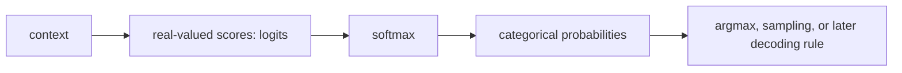

# LLM-0004 — Logits, softmax, and categorical prediction

## If you landed here directly

The direct prerequisite is [`LLM-0003 — Probability from counts: uncertainty without mystery`](LLM-0003-probability-from-counts-uncertainty-without-mystery.md).

You should already understand that:

- a language model assigns probabilities to possible next tokens;
- a probability distribution is nonnegative and sums to $1$;
- empirical conditional probabilities can be estimated from counts;
- changing the context changes the relevant denominator;
- choosing the most frequent continuation is not the same as representing uncertainty.

Now we need a mechanism that can turn **arbitrary real-valued scores** into a valid probability distribution over a vocabulary.

That mechanism is softmax.

---

## The problem worth understanding

Suppose the current context is:

```text
the cat sat on the
```

and the vocabulary candidates include:

```text
mat
floor
moon
```

A model might internally produce scores such as:

```text
mat     2.0
floor   1.0
moon    0.0
```

Those numbers are not yet probabilities.

They do not sum to $1$.

They are not restricted to the interval from $0$ to $1$.

A different context might produce:

```text
mat      7.4
floor    3.1
moon    -2.6
```

Negative scores are perfectly allowed.

The model therefore needs a transformation:



This lesson explains every arrow in that pipeline.

---

## From counts to scores

In `LLM-0003`, we could estimate a next-token distribution directly from observed counts.

If:

- `cat` followed a context $3$ times;
- `dog` followed it $1$ time;

then the empirical probabilities were:

$$ P(\mathrm{cat}\mid c)=\frac{3}{4}=0.75 $$

and:

$$ P(\mathrm{dog}\mid c)=\frac{1}{4}=0.25. $$

That works when the context has been observed enough times and we are willing to store count tables.

Modern neural language models instead learn a function that maps context to a vector of scores.

Those scores are called **logits**.

---

## What a logit is in this lesson

For a vocabulary of $K$ possible next tokens, let the model produce:

$$ z_1,z_2,\ldots,z_K. $$

Each $z_i$ is a real number.

At this stage:

- $z_i$ can be negative;
- $z_i$ can be zero;
- $z_i$ can be greater than $1$;
- the logits do not need to sum to anything special.

The logits are **relative scores**.

Larger logits should correspond to larger probabilities after normalization.

---

## Logits are not probabilities

Suppose:

$$ z=[2,1,0]. $$

It would be wrong to say:

> “The first token has probability 2.”

Probabilities cannot exceed $1$.

It would also be wrong to divide by the raw sum:

$$ \frac{2}{2+1+0},\quad \frac{1}{2+1+0},\quad \frac{0}{2+1+0}. $$

That procedure fails badly when logits are negative or their raw sum is zero.

Softmax uses a different idea.

---

## Softmax

For logits:

$$ z_1,z_2,\ldots,z_K, $$

softmax defines:

$$ p_i=\frac{\exp(z_i)}{\sum_{j=1}^{K}\exp(z_j)}. $$

This performs two steps:

1. exponentiate each logit;
2. divide by the sum of all exponentiated logits.

The result is a valid categorical probability distribution.

---

## Why exponentiation helps

For every finite real number $z_i$:

$$ \exp(z_i)>0. $$

So after exponentiation, every unnormalized weight is positive.

Then dividing by the common sum guarantees:

$$ 0<p_i<1 $$

for finite logits, and:

$$ \sum_{i=1}^{K}p_i=1. $$

Softmax therefore converts unconstrained real scores into points on the probability simplex.

At L0, you can think of the simplex simply as:

> the set of all nonnegative probability vectors whose entries sum to one.

---

## Worked example LLM-EX-010 — softmax by hand

Take:

$$ z=[2,1,0]. $$

Exponentiate:

$$ \exp(2)\approx 7.389, $$

$$ \exp(1)\approx 2.718, $$

and:

$$ \exp(0)=1. $$

The normalizing denominator is:

$$ 7.389+2.718+1=11.107. $$

Therefore:

$$ p_1\approx \frac{7.389}{11.107}\approx 0.665, $$

$$ p_2\approx \frac{2.718}{11.107}\approx 0.245, $$

and:

$$ p_3\approx \frac{1}{11.107}\approx 0.090. $$

The probabilities sum to approximately:

$$ 0.665+0.245+0.090=1.000. $$

The largest logit produced the largest probability.

But the smaller options did not disappear.

---

## Softmax preserves ordering

If:

$$ z_a>z_b, $$

then:

$$ \exp(z_a)>\exp(z_b). $$

Because every category is divided by the same positive denominator:

$$ p_a>p_b. $$

So softmax preserves the ranking of logits.

The token with the largest logit also has the largest softmax probability.

This means you do not need to compute softmax merely to identify the top-scoring category.

You do need probabilities when the probability values themselves matter.

---

## Only relative differences matter

Suppose:

$$ z=[2,1,0]. $$

Now add $100$ to every logit:

$$ z'=[102,101,100]. $$

The softmax probabilities are unchanged.

Why?

For any constant $c$:

$$ \frac{\exp(z_i+c)}{\sum_j\exp(z_j+c)}=\frac{\exp(c)\exp(z_i)}{\exp(c)\sum_j\exp(z_j)}. $$

The common factor cancels:

$$ \mathrm{softmax}(z+c)=\mathrm{softmax}(z). $$

This is called **shift invariance**.

The absolute baseline of all logits does not matter.

Their differences do.

---

## Worked example LLM-EX-011 — shifting every logit changes nothing

Compare:

$$ z=[2,1,0] $$

with:

$$ z'=[102,101,100]. $$

The second vector looks numerically much larger.

But every pairwise difference is unchanged:

$$ 2-1=102-101=1, $$

$$ 1-0=101-100=1, $$

and:

$$ 2-0=102-100=2. $$

Therefore both vectors represent the same softmax distribution.

This is why a logit should not be interpreted in isolation.

A logit becomes meaningful relative to the other logits competing in the same prediction.

---

## Logit differences encode probability ratios

Softmax gives:

$$ p_i=\frac{\exp(z_i)}{Z} $$

and:

$$ p_j=\frac{\exp(z_j)}{Z}, $$

where $Z$ is the same normalizing denominator.

Therefore:

$$ \frac{p_i}{p_j}=\exp(z_i-z_j). $$

Taking the natural logarithm:

$$ \log\left(\frac{p_i}{p_j}\right)=z_i-z_j. $$

So a difference in logits corresponds to a log probability ratio.

This is one reason logits are such a natural scoring language for categorical prediction.

You do not need to memorize this identity yet.

Use it as a mental model:

> probability competition is controlled by score differences.

---

## Equal logits mean equal probabilities

Suppose four tokens receive:

$$ z=[0,0,0,0]. $$

Then every exponentiated score is:

$$ \exp(0)=1. $$

So:

$$ p_i=\frac{1}{4}. $$

The softmax distribution is uniform.

The same would be true for:

$$ z=[7,7,7,7]. $$

Equal scores mean equal probabilities, regardless of the common offset.

---

## Worked example LLM-EX-012 — uniform prediction from tied logits

For:

$$ z=[5,5,5], $$

softmax gives:

$$ p=\left[\frac{1}{3},\frac{1}{3},\frac{1}{3}\right]. $$

A large common score does not make the model more certain.

Only differences between category scores create preference.

---

## Larger gaps make the distribution more concentrated

Compare:

$$ z_A=[1,0] $$

with:

$$ z_B=[10,0]. $$

In the first case, the first category is preferred.

In the second case, the preference is dramatically stronger because:

$$ \exp(10)\gg \exp(0). $$

Softmax turns additive score differences into multiplicative probability ratios.

That can make a distribution very peaked.

---

## Finite logits do not create exact certainty

For finite logits, every exponentiated weight is positive.

Therefore every category receives a positive softmax probability.

A model can assign a token probability extremely close to $1$ and other tokens probabilities extremely close to $0$.

But with ordinary finite logits, softmax does not produce mathematically exact zeros and ones.

That distinction matters for numerical reasoning.

---

## Connecting directly back to counts

Suppose the empirical count distribution from `LLM-0003` is:

$$ P(\mathrm{cat}\mid c)=\frac{3}{4} $$

and:

$$ P(\mathrm{dog}\mid c)=\frac{1}{4}. $$

Choose logits:

$$ z_{\mathrm{cat}}=\log 3 $$

and:

$$ z_{\mathrm{dog}}=0. $$

Then:

$$ \exp(z_{\mathrm{cat}})=3 $$

and:

$$ \exp(z_{\mathrm{dog}})=1. $$

Softmax gives:

$$ P(\mathrm{cat}\mid c)=\frac{3}{3+1}=\frac{3}{4} $$

and:

$$ P(\mathrm{dog}\mid c)=\frac{1}{3+1}=\frac{1}{4}. $$

The count weights and the exponentiated logits play the same normalization role here.

---

## Worked example LLM-EX-013 — reconstructing a count ratio with logits

Suppose observed relative weights are:

```text
red    9
blue   3
```

The normalized probabilities are:

$$ P(\mathrm{red})=\frac{9}{12}=0.75 $$

and:

$$ P(\mathrm{blue})=\frac{3}{12}=0.25. $$

Because only ratios matter, divide both weights by $3$:

```text
red    3
blue   1
```

Then one matching logit choice is:

$$ z=[\log 3,0]. $$

Softmax recovers the same $3:1$ probability ratio.

This does **not** mean neural language models literally store count logs for every context.

It shows how softmax generalizes the normalization pattern from positive weights to learned real-valued scores.

---

## The categorical distribution

After softmax, we have:

$$ p_1,p_2,\ldots,p_K $$

with:

$$ p_i\ge 0 $$

and:

$$ \sum_i p_i=1. $$

This defines a **categorical distribution** over $K$ mutually exclusive outcomes.

For next-token prediction:

- each category corresponds to one token in the vocabulary;
- one next-token event selects one category;
- the probability vector describes uncertainty over which category occurs.

---

## Categorical does not mean “category label in ordinary language”

The word **categorical** is mathematical.

It means there are finitely many discrete alternatives and one outcome is selected on a draw.

Examples include:

- one of several next tokens;
- one of several image classes;
- one of several actions;
- one of several symbols.

The categories do not need to be semantically similar.

They only need to be distinct outcomes in the modeled event.

---

## Distribution versus decision

A probability distribution is not yet a decision rule.

Suppose:

$$ p=[0.70,0.20,0.10]. $$

There are multiple ways to turn that distribution into an output.

### Argmax

Choose the most probable category every time.

Here that is category 1.

### Sampling

Draw randomly according to the categorical probabilities.

Across many repeated draws, category 1 should appear most often, but categories 2 and 3 can also appear.

These are different operations.

Softmax creates the distribution.

It does not decide which decoding policy you must use.

---

## Worked example LLM-EX-014 — argmax is not sampling

Suppose the next-token probabilities are:

```text
cat    0.70
dog    0.20
fox    0.10
```

Argmax always returns:

```text
cat
```

A categorical sample can return:

```text
cat
dog
fox
```

with different frequencies.

A single sample that returns `dog` does not mean the model believed `dog` was most likely.

It means `dog` had nonzero probability and happened to be drawn.

This distinction becomes central later when we discuss generation and decoding.

---

## Softmax is not a knowledge guarantee

A clean probability vector can still be wrong.

Softmax guarantees mathematical normalization.

It does **not** guarantee:

- factual correctness;
- calibration;
- good training data;
- adequate context;
- semantic understanding;
- robustness;
- safety.

A model can confidently assign high probability to an incorrect token.

Probability format and prediction quality are different questions.

---

## Numerical stability: subtract the maximum

Mathematically, softmax is shift-invariant.

That gives us a practical computation trick.

Suppose logits are very large:

$$ z=[1000,999,998]. $$

Directly computing $\exp(1000)$ can overflow in ordinary finite-precision arithmetic.

Let:

$$ m=\max_j z_j. $$

Subtract $m$ from every logit:

$$ z-m=[0,-1,-2]. $$

Because softmax is shift-invariant, the probability distribution is unchanged.

So a numerically safer form is:

$$ p_i=\frac{\exp(z_i-m)}{\sum_j\exp(z_j-m)}. $$

This is not a different model.

It is the same mathematics written in a more stable computational form.

---

## Why “subtract the maximum” does not change the prediction

For:

$$ z=[1000,999,998], $$

subtracting $1000$ gives:

$$ z'=[0,-1,-2]. $$

The score differences are unchanged.

Therefore:

- category ranking is unchanged;
- probability ratios are unchanged;
- softmax probabilities are unchanged.

Only the numerical scale entering the exponential becomes manageable.

---

## Do not confuse logits with log probabilities after normalization

Different libraries sometimes expose a field called `logits` with slightly different normalized representations.

At the conceptual level of this lesson:

> logits are the real-valued scores supplied to softmax before probability normalization.

After probabilities are computed, their logarithms are:

$$ \log p_i. $$

Those normalized log probabilities are related to logits by a shared offset.

The shared offset is exactly why adding the same constant to every logit does not matter.

---

## PyTorch's categorical interface

A widely used implementation perspective is that a categorical distribution can be parameterized by:

- probabilities;
- or logits.

A library can accept logits directly and normalize them internally.

That is useful because many models naturally output logits.

This lesson is framework-independent, but the software interface reflects the same mathematics.

---

## Softmax needs a dimension of competition

Imagine a batch containing several contexts.

Each context has one vector of vocabulary logits.

Softmax must normalize **across the vocabulary categories for each context**, not across unrelated examples in the batch.

That means implementations need to know which tensor dimension represents competing categories.

This shape discipline will become important when we reach tensor programming.

---

## Common failure mode: normalize raw logits by their sum

Wrong idea:

$$ p_i=\frac{z_i}{\sum_j z_j}. $$

Why it fails:

- logits can be negative;
- the denominator can be zero;
- resulting values can be negative;
- resulting values can lie outside the probability range.

Softmax exponentiates before normalizing.

---

## Common failure mode: softmax makes all scores equally likely

Softmax normalizes scores.

It does not erase differences.

If one logit is much larger than the others, its probability can dominate.

Equal probabilities arise from equal logits, not from softmax itself.

---

## Common failure mode: the largest logit is already a probability

A logit of $8$ is not an $800\%$ probability.

A logit has no direct standalone probability interpretation.

It must be compared with the competing logits.

---

## Common failure mode: adding 100 to every logit increases confidence

It does not.

Softmax is shift-invariant:

$$ \mathrm{softmax}(z+100)=\mathrm{softmax}(z). $$

Adding a common constant changes no probability.

Changing **differences** between logits changes the distribution.

---

## Common failure mode: multiply all logits and nothing changes

Unlike adding a common constant, multiplying all logits generally changes the gaps.

For example:

$$ [1,0] $$

and:

$$ [10,0] $$

do not have the same softmax distribution.

The second is much more concentrated.

This fact later connects to temperature scaling.

We will not develop temperature decoding here.

---

## Common failure mode: argmax and sampling are equivalent

Argmax is deterministic for a unique maximum.

Sampling is stochastic.

A token with probability $0.2$ will never win argmax if another token has probability $0.7$, but it can still be sampled.

Keep the distribution separate from the output-selection rule.

---

## Common failure mode: softmax confidence means calibrated confidence

A model can output:

$$ p=0.99 $$

and still be wrong.

Calibration asks whether predicted probabilities correspond to empirical frequencies across comparable cases.

Softmax alone does not enforce calibration.

That belongs to later evaluation work.

---

## Common failure mode: probabilities explain where the logits came from

Softmax explains how scores become a distribution.

It does not explain how the model computed the scores.

Later lessons will build that machinery:

- vectors;
- dot products;
- matrices;
- neural layers;
- embeddings;
- Transformers.

For now, treat the logit vector as the model's score output for one categorical prediction.

---

## A practical reasoning workflow

When you see a categorical model output:

1. identify the competing categories;
2. locate the logit vector;
3. do not interpret raw logits as probabilities;
4. subtract a common maximum if computing numerically;
5. exponentiate the shifted logits;
6. normalize by their sum;
7. verify probabilities are nonnegative;
8. verify they sum to $1$;
9. distinguish the probability distribution from the decoding rule;
10. interpret score differences, not isolated logit magnitudes.

---

## A compact numerical check

Suppose:

$$ z=[3,3,1]. $$

Before calculating exact probabilities, you already know:

- category 1 and category 2 must have equal probability;
- both must have higher probability than category 3;
- the probabilities must sum to $1$.

These structural predictions are valuable debugging checks.

If your calculation violates them, inspect the implementation.

---

## Active work

### Exercise 1 — valid logits

Which of these can be a logit vector?

```text
A: [0.2, 0.3, 0.5]
B: [-4.0, 0.0, 8.1]
C: [100, 100, 100]
D: [-2, -3, -4]
```

Explain why.

### Exercise 2 — softmax ordering

Without calculating exact probabilities, rank the categories for:

$$ z=[-1,3,2]. $$

### Exercise 3 — tied logits

What distribution results from:

$$ z=[4,4,4,4,4]? $$

### Exercise 4 — shift invariance

Explain why:

$$ [1,2,3] $$

and:

$$ [-9,-8,-7] $$

have the same softmax probabilities.

### Exercise 5 — probability ratio

If two logits differ by:

$$ z_a-z_b=\log 4, $$

what is:

$$ \frac{p_a}{p_b}? $$

### Exercise 6 — counts bridge

A context is followed by token A $5$ times and token B once.

Find one two-logit vector whose softmax reproduces the empirical $5:1$ ratio.

### Exercise 7 — argmax versus sampling

For:

$$ p=[0.6,0.3,0.1], $$

what can argmax return?

What can categorical sampling return?

### Exercise 8 — stability

Why is subtracting the maximum useful for:

$$ [1200,1199,1198] $$

before exponentiation?

Why does it not change the probability distribution?

---

## Retrieval check

Without looking back:

1. What is a logit?
2. Why can a logit be negative?
3. Why is a logit not a probability?
4. What two operations define softmax?
5. Why are softmax outputs positive?
6. Why do softmax outputs sum to $1$?
7. Does softmax preserve category ordering?
8. What happens if the same constant is added to every logit?
9. What do equal logits imply?
10. What is a categorical distribution?
11. What is the difference between argmax and categorical sampling?
12. Why does subtracting the maximum improve numerical stability?
13. Does softmax guarantee that a model is correct or calibrated?
14. Which matters more for probabilities: an isolated logit value or differences among competing logits?

---

## Connections

### Backward: LLM-0003

`LLM-0003` built conditional probabilities from counts.

This lesson keeps the same core requirement:

> competing next-token alternatives need nonnegative weights normalized to a total probability of one.

The difference is that a learned model can produce real-valued logits instead of relying on a literal count table.

### Forward: LLM-N-0005

The next canonical lesson is:

`LLM-N-0005 — Vectors and dot products as similarity and scoring`.

That lesson begins explaining how useful scores can be constructed from vector representations.

Here, we treated logits as given.

Next, we start building the machinery that can produce them.

### Long-range connection

Later, a decoder-only Transformer will repeatedly produce a vocabulary-sized logit vector.

At each position:

```text
hidden representation
        ↓
output scores
        ↓
logits
        ↓
softmax
        ↓
next-token distribution
```

So softmax is not an isolated classification trick.

It is one of the final mathematical steps in next-token language modeling.

---

## What this unlocks

You should now be able to:

- distinguish logits from probabilities;
- explain why logits may be any real numbers;
- compute softmax on a small vector;
- explain why softmax outputs form a probability distribution;
- reason from relative logit differences;
- explain shift invariance;
- recognize equal-logit uniform distributions;
- use subtract-the-maximum for numerical stability;
- connect count normalization to learned-score normalization;
- define a categorical next-token distribution;
- distinguish a distribution from argmax or sampling;
- avoid interpreting softmax confidence as guaranteed correctness.

---

## References

- **LLM-REF-020** — *Dive into Deep Learning*, §4.1, *Softmax Regression*.
- **LLM-REF-021** — PyTorch documentation, `torch.nn.Softmax`.
- **LLM-REF-022** — PyTorch documentation, `torch.distributions.Categorical`.
