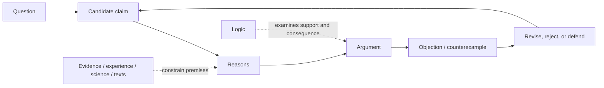

# What Philosophy and Logic Are Actually Doing

## If you landed here directly

You need no prior philosophy, history of philosophy, or symbolic logic.

You also do **not** need to begin by memorizing philosophers, schools, or Greek words.

This lesson starts with a more useful question:

> **What kind of activity are people doing when they do philosophy, and what role does logic play inside that activity?**

By the end, you should be able to take an ordinary philosophical question and turn it into something that can be examined: a claim, reasons for it, an objection, and a possible revision.

## The problem worth understanding

Consider three questions:

1. If every physical part of an old ship is gradually replaced, is it still the same ship?
2. Is breaking a promise wrong when doing so would create better consequences?
3. Could an artificial system ever genuinely be conscious?

These questions are very different.

The first concerns **identity through change**.

The second concerns **what we ought to do**.

The third mixes questions about **mind, concepts, evidence, and possibly technology**.

Yet all three can trigger the same bad conversation:

```text
Person A: I think yes.
Person B: I think no.
Person A: That's just your opinion.
Person B: That's just yours.
```

Nothing has been examined.

Philosophy begins to become interesting when “I think” is not the end of the conversation but the beginning of a demand:

> **Why?**

## Mental model: philosophy as a revision loop

A useful first model is:



This diagram is deliberately a **loop**, not a pipeline that ends after one answer.

Philosophical progress often comes from discovering that:

- a question was badly framed;
- a term was ambiguous;
- two claims that sounded similar are different;
- an argument needs a hidden premise;
- a counterexample defeats a proposed principle;
- evidence supports one premise but not another;
- a conclusion is stronger than the reasons justify;
- rival views survive but pay different costs.

That is why good philosophy can improve even when everyone does not converge on one final doctrine.

## Philosophy is not merely “having deep thoughts”

People naturally wonder about death, freedom, fairness, knowledge, reality, consciousness, and meaning.

Wonder matters, but philosophy is not defined by a dramatic topic.

A conversation about an ordinary word can be philosophical if it exposes a difficult conceptual or normative structure. A conversation about “the meaning of life” can remain philosophically shallow if it never moves beyond slogans.

A first approximation is:

> **Philosophy is disciplined inquiry into fundamental conceptual, normative, epistemic, metaphysical, and related questions using explicit reasons, distinctions, arguments, objections, and—where relevant—evidence and formal tools.**

Do not treat that sentence as a sacred definition. Later philosophy of philosophy can challenge parts of it.

For now, it identifies the activity we want to practice.

## Logic is not “the part of philosophy that tells you what is true”

This misconception causes trouble early.

Logic is centrally concerned with **patterns of inference and consequence**: when some claims are given, what follows from them, what fails to follow, and why?

Suppose someone argues:

```text
All whales are mammals.
All mammals are warm-blooded.
Therefore whales are warm-blooded.
```

Logic can help us study the structure that connects premises to conclusion.

But logic alone does not go into the ocean and biologically establish that whales are mammals.

That requires empirical knowledge.

So keep two questions separate:

```text
Are the premises acceptable?
        versus
Does the conclusion follow from them?
```

Later lessons will sharpen this into distinctions among **truth, validity, and soundness**.

For now, remember:

> Logic evaluates inferential structure; it does not magically supply all true premises.

## Philosophy uses more than one kind of tool

Different philosophical problems require different combinations of methods.

### Conceptual distinction

Someone asks:

> “Can I know something without being certain?”

Before looking for data, we may need to distinguish:

- knowledge;
- certainty;
- confidence;
- justification.

If those concepts are collapsed into one, the question may be impossible to discuss clearly.

### Argument

Someone claims:

> “Punishment is justified only if it prevents future harm.”

A philosopher can ask:

- Why only that condition?
- Does desert matter?
- What about restitution?
- What counterexample would test the principle?

### Empirical input

Questions about perception, cognition, artificial intelligence, social institutions, or science may depend on facts discovered outside philosophy.

Philosophy does not gain authority by ignoring relevant psychology, physics, biology, computer science, economics, history, or linguistics.

### Formal tools

Logic, probability, decision theory, models, and mathematics can make some philosophical assumptions and consequences precise.

Precision helps—but formalization also abstracts. A beautiful formal model can answer the wrong question if its assumptions do not match the philosophical problem.

### Historical and textual interpretation

When asking what Aristotle, Nāgārjuna, Ibn Sīnā, Kant, Confucius, Du Bois, or another thinker argued, textual and historical evidence matters.

You cannot settle an interpretive question by inventing the most convenient version of a philosopher's view.

This track will therefore distinguish:

> **What does the text historically support?**

from:

> **Is the reconstructed argument philosophically good?**

Those are related but different questions.

## Worked example 1: the Ship of Theseus

Imagine a wooden ship.

Over many years, each damaged plank is replaced. Eventually none of the original planks remain.

Question:

> Is it still the same ship?

A shallow response is:

> “Obviously yes.”

or:

> “Obviously no.”

A philosophical response begins exposing the hidden principle.

### Candidate claim A

> The ship remains the same object because its change is gradual and its history is continuous.

Now we can ask for a reason.

Perhaps:

> Ordinary objects survive many replacements of parts, so identity cannot require keeping every original component.

Now pressure-test it.

### Objection

Suppose someone stored every removed original plank and later reconstructed another ship from them.

Which ship is the original now?

The objection does not merely “disagree.” It attacks a proposed **criterion of identity**.

This is already much more productive than exchanging intuitions.

### Interactive check

Which of these is a stronger philosophical move?

A. “Everyone knows the continuously repaired ship is the original.”
B. “Continuity of history may explain identity, but the reconstructed-original-parts case pressures that criterion.”

<details>
<summary>Reveal</summary>

B is stronger because it names a candidate principle and shows how a case tests it. It remains possible that continuity wins—but now there is an argument to evaluate.

</details>

## Worked example 2: promises and consequences

Suppose you promised a friend you would keep a private story confidential.

Later, revealing the story would prevent a small but real harm.

There are at least two kinds of question here:

### Factual

What harm would actually occur?

How reliable is that prediction?

Who would be affected?

### Normative

How should consequences be weighed against promises, trust, rights, or duties?

A philosophical mistake would be to answer the normative question merely by collecting more facts.

Facts matter enormously, but even perfect factual information does not automatically state the **normative rule** for how those facts should be valued.

Conversely, a moral theory applied to imaginary facts can also mislead.

Good reasoning keeps both layers visible.

## Worked example 3: could an AI system be conscious?

This is a good example of why philosophical questions often split into subquestions.

Ask:

```text
What do we mean by consciousness?
What evidence would count for consciousness?
Is behavioral equivalence sufficient?
Does implementation matter?
What does neuroscience tell us?
What would a theory of mind predict?
What logical consequences follow from a proposed criterion?
```

Some of those questions are conceptual.

Some are empirical.

Some are metaphysical.

Some concern evidence and inference.

Some may require computer science or neuroscience.

A serious philosophical treatment does **not** mean sitting in an armchair and ignoring all outside knowledge. It means understanding which part of the problem each kind of evidence or reasoning can actually address.

## Philosophy versus history of philosophy

Suppose you learn:

> Descartes defended a form of mind-body dualism.

That is a historical/philosophical fact worth understanding.

But knowing it is not yet the same as evaluating dualism.

There are at least three activities:

1. **historical reconstruction** — What did Descartes actually argue, in context?
2. **logical reconstruction** — What is the structure of the argument?
3. **philosophical evaluation** — Are the premises defensible? Does the conclusion follow? What objections survive?

All three matter.

This repository will not treat philosophy as a museum of quotations from famous people.

## Philosophy versus “critical thinking”

Critical thinking is part of philosophy, but the fields are not identical.

If you learn to detect weak evidence, ambiguity, bad inference, and rhetorical manipulation, you gain useful general reasoning skills.

Philosophy then pushes further into questions such as:

- What is evidence?
- What makes an inference rational?
- What is truth?
- What exists?
- What makes a person the same person through time?
- What makes an action right?
- What gives political authority legitimacy?
- What is meaning?
- What is consciousness?
- What makes a scientific explanation explanatory?

So the track will not become a catalogue of fallacy names.

## The role of disagreement

Philosophy is famous for disagreement.

That can look like failure if you expect every field to produce answers the way a measurement produces a number.

But disagreement can have several sources:

- different premises;
- different concepts;
- different standards of evidence;
- different values;
- different background theories;
- genuine uncertainty;
- hidden ambiguity;
- mistakes.

A productive philosopher asks:

> **Where exactly does the disagreement enter?**

That question transforms “people disagree” into an analyzable structure.

## A minimal anatomy of an argument

For now, use this simple shape:

```text
Reason / premise 1
Reason / premise 2
        ↓
     conclusion
```

Example:

```text
P1: If a rule cannot be justified to the people burdened by it, that counts against its legitimacy.
P2: This rule cannot be justified to the people burdened by it.
C: Therefore this fact counts against the rule's legitimacy.
```

The next lessons will teach you how to identify premises and conclusions carefully and how not to confuse a persuasive sentence with a logically strong argument.

## Where intuition breaks

### “Philosophy is just opinion”

People can hold opinions about philosophical questions, but philosophy evaluates reasons, distinctions, consistency, consequences, counterexamples, evidence, and objections.

Not every position is equally well supported merely because disagreement exists.

### “Logic proves your worldview”

Logic can reveal consequences of assumptions. It does not automatically certify those assumptions as true or morally acceptable.

### “If science can investigate something, philosophy is unnecessary”

Many philosophical questions are informed by science, and some supposed philosophical questions may become empirical. But interpreting evidence, clarifying concepts, asking normative questions, and examining inference often remain philosophical tasks.

### “If a question has no final consensus, there has been no progress”

Progress can include better distinctions, stronger arguments, exposed contradictions, eliminated positions, more precise formal models, new evidence, or a clearer map of the disagreement.

### “A famous philosopher said it, so it is a philosophical reason”

Authority can matter for accurately reporting history. It does not replace argument when evaluating whether a claim is true or justified.

### “Western textbook categories are the natural shape of all philosophy”

No. Categories such as epistemology, metaphysics, and ethics are useful navigation devices, but philosophical traditions organize questions differently. Later comparative work must preserve those differences rather than forcing every tradition into one inherited taxonomy.

## Active work: turn a question into philosophy

Choose one question:

- Can a lie ever be morally required?
- Are you the same person you were ten years ago?
- Can you know something based only on testimony?
- Could a machine deserve moral consideration?

Write four lines:

```text
Question:
Candidate claim:
One reason:
One serious objection:
```

Do **not** try to solve the whole problem.

The objective is to transform a vague debate into an examinable structure.

<details>
<summary>Example transformation</summary>

```text
Question: Can knowledge depend entirely on testimony?
Candidate claim: Some knowledge can be acquired through testimony without independently verifying the reported fact.
One reason: Much ordinary and scientific knowledge depends on reliable specialists whose evidence we cannot personally reproduce.
One serious objection: If the hearer has no independent basis for judging the speaker reliable, testimony may appear to transmit belief rather than justification.
```

Notice that this does not settle the epistemology of testimony. It creates a better object for inquiry.

</details>

For a fuller version, use [`PHL-EXR-0001`](../exercises/PHL-EXR-0001-turn-a-question-into-an-argument.md).

## Retrieval / self-explanation

Without rereading, explain the difference among these three statements:

1. Philosophy asks difficult questions.
2. Philosophy develops and criticizes reasons for candidate answers.
3. Logic studies structures of inference and consequence within that broader activity.

If your explanation makes logic equal to all reasoning or philosophy equal to personal opinion, refine it.

## Connections

This first lesson intentionally sits before both the informal and formal branches of the track.

It will feed directly into:

- explicit arguments and premise/conclusion structure;
- truth, validity, and soundness;
- counterexamples and conceptual distinctions;
- philosophical reading and writing;
- propositional and predicate logic;
- later work in epistemology, metaphysics, ethics, mind, language, science, and global philosophical traditions.

## What this unlocks

You now have a minimal standard for what counts as *doing* philosophy rather than merely naming a topic or reporting an opinion:

```text
question
→ candidate claim
→ reasons
→ argument
→ objection / counterexample
→ revision or defense
```

And you have a first role for logic:

> logic helps us examine what follows from what, while philosophy also asks whether the premises, concepts, evidence, values, and interpretations deserve acceptance.

The next node makes the argument structure explicit: **questions, claims, reasons, and arguments**.

## References

- `PHL-REF-001` — OpenStax, *Introduction to Philosophy*.
- `PHL-REF-002` — MIT OpenCourseWare, *Problems of Philosophy*.
- `PHL-REF-005` — Stanford Encyclopedia of Philosophy.
- `PHL-REF-006` — Stanford Encyclopedia of Philosophy, *Informal Logic*.
