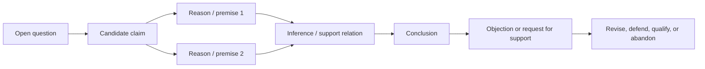

# Questions, Claims, Reasons, and Arguments

## If you landed here directly

You need no symbolic logic and no history of philosophy.

This lesson assumes only the basic orientation from [`PHL-0001`](PHL-0001-what-philosophy-and-logic-are-actually-doing.md): philosophy becomes more than opinion exchange when we make claims explicit, give reasons, expose assumptions, invite objections, and revise.

Here we slow that process down.

The target skill is small but foundational:

> **Take an open question and turn one candidate answer into an argument that another person can actually inspect.**

Before we ask whether an argument is valid, sound, strong, weak, deductive, inductive, or fallacious, we first need to know **what the argument is**.

## The problem worth understanding

Consider this exchange:

```text
Question: Should universities use AI proctoring in online exams?

A: No. It is invasive.
B: But cheating is unfair.
A: Privacy matters more.
B: That's just your opinion.
```

There are several genuine issues here:

- privacy;
- fairness;
- reliability;
- academic integrity;
- alternatives;
- empirical error rates;
- the meaning of “invasive”;
- how competing values should be weighed.

But the conversation never exposes enough structure to evaluate any of them.

The first philosophical improvement is not a more sophisticated vocabulary.

It is **argument reconstruction**.

## Mental model: from inquiry to inspectable structure



The crucial transition is:

```text
What do you think?
        ↓
What exactly are you claiming?
        ↓
Why should anyone accept it?
```

## A question is not yet a claim

Questions can guide inquiry:

```text
Is punishment justified by deterrence?
Can a person survive radical memory loss?
Do future people have rights?
Could an artificial system have moral status?
```

But a question, by itself, is not an answer that can be true or false.

Compare:

```text
Question: Can memory continuity explain personal identity?
```

with:

```text
Claim: Memory continuity is sufficient for personal identity.
```

The second commits to something.

That commitment creates a target for reasoning.

### Interactive check

Which are claims rather than questions or commands?

1. `Is deception always wrong?`
2. `Some deceptive acts are morally permissible.`
3. `Explain what justice means.`
4. `A fair procedure can still produce an unjust outcome.`

<details>
<summary>Reveal</summary>

2 and 4 are claims. They assert something that can be assessed as true or false, defensible or indefensible.

1 asks a question. 3 issues an instruction.

Later logic lessons will use the more technical language of statements/propositions where appropriate, but the practical distinction comes first.

</details>

## Claims need enough precision to be challenged

A sentence can grammatically look like a claim while remaining too vague to evaluate well.

For example:

> “Technology is bad for freedom.”

Questions immediately appear:

- Which technology?
- What kind of freedom?
- Bad in every case or some cases?
- Compared with what alternative?
- Is the claim causal, moral, political, or conceptual?

A more inspectable candidate might be:

> “A university should not require remote-proctoring software that records students' private living spaces when a comparably effective less-intrusive assessment method is available.”

You may still disagree.

That is good.

The point of precision is not to make disagreement disappear. It is to make disagreement **locatable**.

## A reason is not merely another sentence nearby

Suppose someone says:

> “Universities should not require invasive proctoring because students dislike it.”

There is at least a recognizable reason structure:

```text
claim      → universities should not require invasive proctoring
reason     → students dislike it
```

But identifying a reason does not yet show that it is a **good** reason.

Maybe dislike is relevant. Maybe it is too weak. Maybe a stronger normative bridge is missing.

This yields a vital distinction:

> **Argument identification asks what is being offered as support. Argument evaluation asks whether that support succeeds.**

This lesson mostly trains identification and reconstruction.

Later lessons evaluate the support relation more rigorously.

## Premises and conclusions

In philosophical logic, the claims offered as reasons are commonly called **premises**.

The claim they are offered to support is the **conclusion**.

A simple argument can be written:

```text
Premise 1: Assessments should avoid unnecessary serious intrusions into students' privacy.
Premise 2: This form of proctoring creates a serious privacy intrusion that is unnecessary when a comparably effective alternative exists.
Conclusion: Therefore, the university should not require this form of proctoring when that alternative is available.
```

Notice what numbering accomplishes.

It makes the inferential structure visible enough to challenge.

A critic can now ask:

- Why accept Premise 1?
- Is Premise 2 empirically accurate?
- What counts as “comparably effective”?
- Does the conclusion follow even if both premises are granted?

That is already a better disagreement.

## Reasons can have different jobs

Premises are not all the same kind of thing.

A philosophical argument may use:

### Empirical premises

```text
This policy produces a measurable rate of false flags.
```

That claim should be supported by appropriate empirical evidence.

### Normative premises

```text
Institutions should not impose serious privacy costs without sufficient justification.
```

That needs normative defense, not merely a measurement.

### Conceptual premises

```text
A voluntary choice requires a genuine option to refuse.
```

That may require conceptual analysis and counterexamples.

### Background assumptions

Some premises are not written at all.

An argument may silently depend on them.

The ability to uncover those assumptions is central to careful reading.

## Worked example: reconstruct instead of paraphrase

Consider this short passage:

> A theory of personal identity that treats memory as the only thing that matters is too strong. People can forget ordinary events without becoming numerically different people. So some memory loss is compatible with remaining the same person.

A summary might say:

> “The author talks about memory and identity.”

That is not an argument map.

A better reconstruction is:

```text
P1. People can lose some memories while remaining the same person.
P2. If memory continuity were required in the strongest possible sense, such memory loss would break personal identity.
C. Therefore, personal identity cannot require complete memory continuity.
```

Now we can inspect it.

Notice something else: P2 is partly a **bridge premise** introduced by the reconstruction. The passage may not state it in exactly those words.

This is normal.

Argument reconstruction often requires making implicit structure explicit.

But reconstruction creates a responsibility:

> Do not improve an author's argument so aggressively that you replace it with a different argument.

Faithfulness and charity must be balanced.

## Indicator words are clues, not proof

Words such as these often introduce conclusions:

```text
therefore
thus
so
hence
consequently
```

Words such as these often introduce reasons:

```text
because
since
given that
for
```

They are useful clues.

But language is flexible.

For example:

> “Since 2020, the library has opened earlier.”

Here `since` expresses time, not a premise indicator.

And many excellent arguments contain no indicator words at all.

So the deeper questions are:

```text
What is the author trying to get me to accept?
What is offered in support of that claim?
```

## Argument versus explanation

This distinction is subtle and extremely useful.

Compare:

### Argument

```text
The forecast reports a 90% chance of heavy rain.
If heavy rain is very likely, carrying an umbrella is prudent.
Therefore I should carry an umbrella.
```

The premises are offered to support accepting the conclusion.

### Explanation

```text
The pavement is wet because heavy rain fell an hour ago.
```

Here the wet pavement may already be accepted as a fact. The task is to explain **why it occurred**.

The same sentence shape can participate in either activity depending on conversational role.

A useful question is:

> Are these reasons trying to show **that** I should accept the claim, or to explain **why/how** an already accepted fact happened?

Later courses in philosophy of science and abductive reasoning will complicate the boundary. At L0, the distinction prevents many reading errors.

## Interactive check: support or explanation?

Classify each as primarily argumentative or explanatory in context.

### Case A

> The server is probably overloaded because response times increased sharply exactly when traffic tripled.

### Case B

> The server crashed because a memory leak exhausted available memory; the crash itself is already confirmed in the logs.

<details>
<summary>Reveal</summary>

A is primarily offering evidence for accepting a diagnosis: it functions argumentatively.

B primarily explains an already accepted event: the crash is treated as given, and the memory leak is offered as its cause.

Real discourse can mix both roles. The exercise is about identifying what the speaker is trying to accomplish with the reasons.

</details>

## Do not confuse repetition with support

Consider:

```text
Claim: This policy is unjust.
Reason: It is unfair.
```

Maybe “unjust” and “unfair” mean nearly the same thing in context.

If so, the reason has not added much support; it may simply restate the claim.

A useful self-test is:

> If someone denied my conclusion, could they accept my reason without contradiction?

If the answer is obviously no because the “reason” merely rephrases the conclusion, you may not have supplied an independent premise.

This anticipates later work on circular reasoning and begging the question.

## Relevance matters before formal validity

Suppose:

```text
P1. Paris is the capital of France.
P2. Whales are mammals.
C. Therefore, punishment is morally justified only when it deters future harm.
```

The premises can be true while providing no visible support for the conclusion.

This lesson does not yet formalize deductive validity.

But you can already ask a primitive and powerful question:

> **Why would accepting these reasons move me toward accepting that conclusion?**

If you cannot answer, the alleged argument may have a relevance problem or an unstated bridge premise.

## From open question to argument: a repeatable procedure

Use this six-step workflow.

### Step 1 — write the question

Example:

```text
Should a university use AI proctoring for every online exam?
```

### Step 2 — give one candidate answer

```text
No university should require AI proctoring for every online exam.
```

### Step 3 — narrow ambiguous or universal terms

“Every,” “AI proctoring,” “require,” and “online exam” may need clarification.

A more cautious claim:

```text
Universities should not require high-surveillance remote proctoring when a comparably reliable, materially less intrusive assessment method is available.
```

### Step 4 — write reasons as separate claims

```text
P1. Institutions should avoid imposing serious privacy intrusions when less intrusive alternatives achieve the relevant educational goal comparably well.
P2. High-surveillance remote proctoring imposes a serious privacy intrusion.
P3. In the cases under discussion, a less intrusive alternative achieves the relevant goal comparably well.
```

### Step 5 — write the conclusion

```text
C. Therefore, in those cases, universities should not require high-surveillance remote proctoring.
```

### Step 6 — mark what still needs defense

Do not pretend the work is finished.

For example:

```text
P1 needs normative defense.
P2 needs conceptual clarification and perhaps evidence.
P3 needs empirical evidence for the actual assessment context.
The inference itself still needs evaluation.
```

That last step is philosophically healthy.

A transparent argument shows where future work belongs.

## Where intuition breaks

### Mistake 1: “An argument means a fight”

In philosophy and logic, an argument is centrally a reason-giving structure, not a measure of emotional conflict.

### Mistake 2: “If I have a reason, my conclusion is proven”

No. A reason can be irrelevant, false, ambiguous, circular, too weak, or insufficient.

### Mistake 3: “A true conclusion means the argument is good”

A conclusion can be true for reasons completely unrelated to the premises offered.

Later lessons make this precise.

### Mistake 4: “Indicator words mechanically reveal the argument”

They help, but context determines function.

### Mistake 5: “Reconstruction lets me rewrite the author's view however I like”

No. Reconstruction should make implicit structure explicit while remaining faithful to the text or speaker.

### Mistake 6: “Every reason is empirical evidence”

Philosophical arguments also use normative principles, conceptual claims, definitions, formal assumptions, testimony, historical evidence, and other forms of support.

## Active work: reconstruct a compressed paragraph

Read:

> People often change their political opinions without becoming different persons. Political belief therefore cannot by itself determine personal identity.

Without looking at the suggested reconstruction, write:

```text
Question:
Candidate conclusion:
Premise 1:
Possible bridge premise:
What would need further defense:
```

<details>
<summary>One defensible reconstruction</summary>

```text
Question: Does having the same political beliefs determine whether someone is the same person over time?
P1. A person can change political beliefs while remaining the same person.
Bridge premise. If a feature can change while personal identity persists, that feature alone is not necessary for that identity.
C. Therefore, sameness of political belief does not by itself determine personal identity.
```

The bridge premise is philosophically important. Once exposed, it can be examined instead of silently doing work in the background.

</details>

## Active work: strengthen a bad reason

Start with:

```text
Claim: Public institutions should publish reasons for high-impact automated decisions.
Reason: Transparency is good.
```

Improve the argument by doing all four:

1. specify what kind of decision counts as high-impact;
2. replace “good” with a more precise normative reason;
3. add one premise connecting reasons to a protected interest such as contestability or accountability;
4. state one circumstance in which your conclusion might need qualification.

The goal is not to settle AI governance here. It is to practice converting slogans into inspectable support.

## Retrieval / self-explanation

Without looking back, explain the difference among:

```text
question
claim
reason
premise
conclusion
argument
explanation
```

Then answer:

> Why is “I gave a reason” weaker than “I gave a good argument”?

A strong answer should distinguish **offered support** from **successful support**.

## Connections

This lesson deepens the revision loop introduced in [`PHL-0001`](PHL-0001-what-philosophy-and-logic-are-actually-doing.md).

It prepares you for later lessons on:

- premises and conclusions in greater detail;
- truth, validity, and soundness;
- deductive, inductive, and abductive reasoning;
- hidden premises and charitable reconstruction;
- ambiguity and definition;
- counterexamples;
- informal fallacies;
- formal symbolic logic;
- close reading and philosophical writing.

## What this unlocks

You can now take a philosophical question and produce an explicit candidate structure:

```text
Question
    ↓
Claim / conclusion
    ↑
Premises / reasons
```

That structure is not automatically correct.

Its value is that it is now **inspectable**.

Once an argument is visible, logic can begin doing more precise work on it.

## References

- **PHL-REF-001 — OpenStax, Introduction to Philosophy.** Used for the introductory distinction among claims, premises, conclusions, evidence, and argument reconstruction.
- **PHL-REF-003 — MIT OpenCourseWare, Logic I.** Used as the formal-logic progression target that later lessons will develop beyond this preformal reconstruction skill.
- **PHL-REF-006 — Stanford Encyclopedia of Philosophy, Informal Logic.** Used for the broader conception of analyzing arguments in ordinary discourse rather than only already-symbolized formal arguments.
