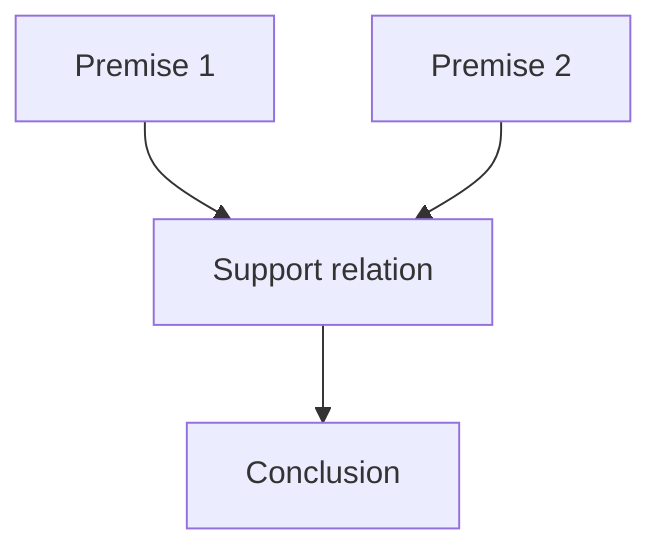
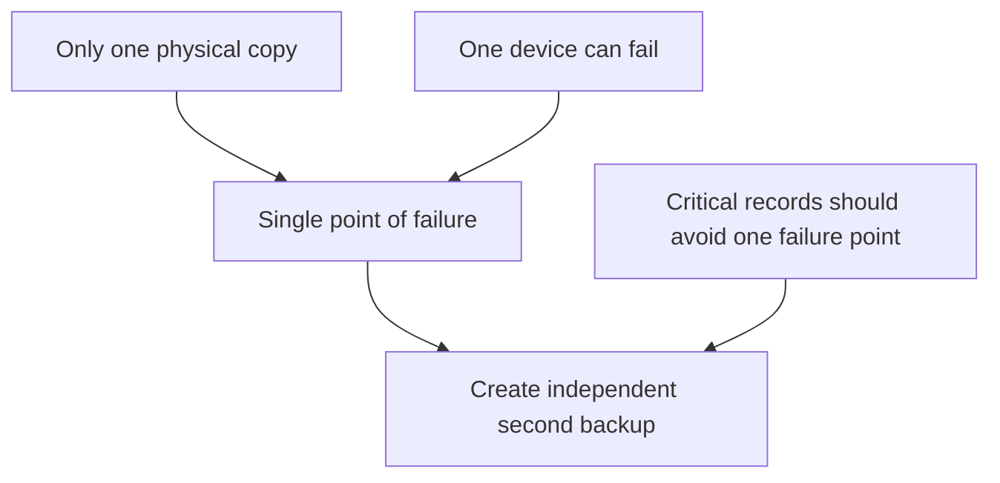

# Premises, conclusions, and argument indicators

## If you landed here directly

The formal prerequisite is:

- **[`PHL-0002 — Questions, claims, reasons, and arguments`](PHL-0002-questions-claims-reasons-and-arguments.md).**

That lesson established a practical structure:

```text
premises / reasons
        ↓
support
        ↓
conclusion
```

It also warned that words such as `because`, `since`, `therefore`, and `so` are clues rather than mechanical labels.

This lesson turns that warning into a repeatable reading skill.

The target is:

> identify what is functioning as a premise and what is functioning as a conclusion even when sentence order, grammar, or indicator words are misleading.

You do not need symbolic logic yet.

You do need to learn to read for **inferential role** rather than surface position.

---

## The problem worth understanding

Consider:

> The city should add shade structures at major bus stops. Summer heat regularly exposes waiting passengers to dangerous temperatures, and many stops have no nearby shelter.

Which sentence is the conclusion?

The first one.

The reasons come afterward.

Now consider:

> Summer heat regularly exposes waiting passengers to dangerous temperatures. Many stops have no nearby shelter. The city should therefore add shade structures at major bus stops.

Same basic support structure.

Different order.

Now remove `therefore`:

> Summer heat regularly exposes waiting passengers to dangerous temperatures. Many stops have no nearby shelter. The city should add shade structures at major bus stops.

The argument can still be recognizable.

So neither sentence position nor indicator vocabulary can be the fundamental definition.

The deeper question is:

> Which claim is being offered for acceptance, and which claims are being offered in support of it?

---

## Mental model: argument roles, not sentence species

A premise is not a special grammatical kind of sentence.

A conclusion is not a special grammatical kind of sentence.

They are **roles inside an argument**.

Use this model:



The same proposition can occupy different roles in different arguments.

For example:

```text
Argument A
P1. The road is covered with black ice.
P2. Driving on black ice is dangerous.
C. We should delay the trip.
```

Now place that conclusion inside a larger argument:

```text
Argument B
P1. We should delay the trip.
P2. If we delay the trip, we should notify the people waiting for us.
C. We should notify the people waiting for us.
```

The claim:

```text
We should delay the trip.
```

was a conclusion in Argument A and a premise in Argument B.

That single fact prevents a major beginner mistake:

> "premise" and "conclusion" name inferential jobs, not permanent sentence identities.

---

## What exactly is a premise?

A **premise** is a claim offered as support for another claim in an argument.

At this level, "support" is intentionally broad.

We are not yet deciding whether the support is:

- deductively valid;
- inductively strong;
- factually true;
- relevant;
- sufficient;
- circular;
- charitable;
- persuasive.

Those questions come later.

First identify the proposed structure.

Example:

```text
P1. The archive is the only surviving copy of these records.
P2. Destroying the only surviving copy would permanently eliminate access to them.
C. Therefore the archive should be preserved.
```

P1 and P2 function as premises because they are offered to support C.

Calling them premises does **not** certify them as true.

Calling C a conclusion does **not** certify it as correct.

Role identification comes before argument evaluation.

---

## What exactly is a conclusion?

A **conclusion** is the claim that an argument presents as supported by its premise or premises.

Ask:

```text
What is the speaker or author trying to get me to accept on the basis of the other claims?
```

That question is usually more reliable than:

```text
Which sentence comes last?
```

A conclusion may appear:

- first;
- last;
- in the middle;
- more than once in paraphrased form;
- implicitly rather than explicitly.

Natural language is not standardized proof notation.

---

## Conclusion first

Example:

> We should postpone the outdoor event, because the heat index is forecast to reach a dangerous level and there is no shaded recovery area at the site.

Structure:

```text
C. We should postpone the outdoor event.

P1. The heat index is forecast to reach a dangerous level.
P2. There is no shaded recovery area at the site.
```

The conclusion appears before the premises.

`because` helps reveal the structure, but sentence order would mislead you.

---

## Conclusion last

Example:

> The heat index is forecast to reach a dangerous level, and there is no shaded recovery area at the site. Therefore, we should postpone the outdoor event.

Structure:

```text
P1. The heat index is forecast to reach a dangerous level.
P2. There is no shaded recovery area at the site.
C. We should postpone the outdoor event.
```

Same basic inference.

Different presentation.

---

## Conclusion in the middle

Natural prose can embed conclusions between supporting material.

Example:

> The current backup has failed two integrity checks. We should not delete the older backup yet. Until a new verified backup exists, deletion would remove our last independently checked copy.

A defensible reconstruction is:

```text
P1. The current backup has failed two integrity checks.
P2. Until a new verified backup exists, deleting the older backup would remove the last independently checked copy.
C. We should not delete the older backup yet.
```

The conclusion is the middle sentence.

Position is evidence only in special writing conventions, not a definition.

---

## Premise indicators

Certain expressions often introduce supporting reasons.

Common examples include:

```text
because
since
given that
as
for
after all
in view of the fact that
assuming that
```

Example:

> We should preserve the raw measurements **because** they may be needed to audit the analysis.

A plausible reconstruction:

```text
P. The raw measurements may be needed to audit the analysis.
C. We should preserve the raw measurements.
```

The word `because` is a useful signal.

But it is not infallible.

---

## Conclusion indicators

Common conclusion indicators include:

```text
therefore
thus
hence
so
consequently
it follows that
which shows that
we can conclude that
```

Example:

> The two records have identical identifiers but different timestamps. **Therefore**, identifier equality alone does not establish record identity across versions.

The indicator strongly suggests that the following clause functions as a conclusion.

Again: clue, not definition.

---

## Why indicator words cannot be used mechanically

Language reuses words.

### `Since` can indicate time

> Since 2020, the laboratory has archived its raw calibration files.

There is no premise indicator here.

`Since 2020` is temporal.

### `For` can be a preposition

> The replacement part is for the cooling system.

No argument role is introduced by `for`.

### `So` can be conversational

> So, what should we test next?

This `so` does not introduce a conclusion.

### `Because` can participate in explanation

> The pavement is wet because it rained overnight.

If the wet pavement is already accepted and the rain is offered to explain why it is wet, the sentence may function explanatorily rather than as an argument for believing the pavement is wet.

Context determines the inferential job.

---

## Worked example PHL-EX-007 — find the conclusion when it comes first

Read:

> The museum should extend weekend hours. Many people who work standard weekday schedules cannot visit before closing, and weekend attendance already shows unmet demand.

Do not ask first:

```text
Where is "therefore"?
```

There is none.

Ask instead:

```text
Which claim is the author trying to support?
```

A reconstruction:

```text
P1. Many people who work standard weekday schedules cannot visit before closing.
P2. Weekend attendance already shows unmet demand.
C. The museum should extend weekend hours.
```

Now separate two tasks.

### Task 1 — reconstruct

What claims play premise and conclusion roles?

### Task 2 — evaluate

Are the premises true?
Are they relevant?
Are they enough to justify the proposed extension?
What costs or alternatives matter?

This lesson focuses on Task 1.

Do not smuggle evaluation into identification.

---

## Worked example PHL-EX-008 — indicator vocabulary under pressure

Classify each occurrence of the highlighted word by function.

### Case A

> **Since** the sensor has failed two independent calibration checks, we should not use its measurements in the final analysis.

Here `since` plausibly introduces a premise.

```text
P. The sensor has failed two independent calibration checks.
C. We should not use its measurements in the final analysis.
```

### Case B

> **Since** Monday, the sensor has been stored in the dry cabinet.

Here `since` is temporal.

No argument follows merely from the word.

### Case C

> The instrument was removed from service, **so** the maintenance record should now show its status as inactive.

`so` plausibly introduces a conclusion.

### Case D

> **So**, which calibration file should we inspect first?

Here `so` is a discourse marker in a question.

No conclusion is asserted.

The lesson:

> indicator words change your probability about a passage's structure; they do not remove the need to interpret the passage.

---

## Worked example PHL-EX-009 — the same claim changes role

Start with:

```text
P1. The backup is the only independently verified copy.
P2. Deleting the only independently verified copy creates an avoidable recovery risk.
C. We should retain the backup.
```

Now embed the conclusion in another argument:

```text
P1. We should retain the backup.
P2. Retaining it requires allocating additional storage.
C. We should allocate additional storage.
```

The sentence:

```text
We should retain the backup.
```

is:

- a conclusion in the first argument;
- a premise in the second.

This is why "premise" and "conclusion" are relational terms.

A claim is a premise **of an argument** or a conclusion **of an argument**.

It is not born as one forever.

---

## Intermediate conclusions

Longer reasoning often has more than one layer.

Example:

```text
P1. The only verified backup is stored on one physical device.
P2. A single-device copy can be lost through one hardware failure.
C1. Therefore, the current backup arrangement has a single point of failure.

C1. The current backup arrangement has a single point of failure.
P3. Critical records should not depend on one avoidable point of failure.
C2. Therefore, an independent second backup should be created.
```

`C1` is an **intermediate conclusion**.

It is supported by earlier premises and then used as a premise for a further conclusion.

Graphically:



This makes argument structure look more like a network than a flat list.

At L0, you only need to recognize the possibility.

Later argument-mapping and formal-logic lessons will make structure more precise.

---

## Linked premises versus independent reasons

Sometimes two premises work together.

Example:

```text
P1. This key opens the archive cabinet.
P2. The archive cabinet contains the signed originals.
C. This key gives access to the signed originals.
```

P1 alone is not enough.
P2 alone is not enough.

Their support is linked.

Other arguments provide several partly independent reasons:

```text
P1. The proposal lowers energy use.
P2. The proposal reduces maintenance downtime.
P3. The proposal has lower lifecycle cost.
C. The proposal is preferable.
```

Each premise may provide some independent support.

You do not need a full argumentation theory yet.

The point is simply:

> several sentences before a conclusion are not automatically interchangeable items in a list; their support relations matter.

---

## Implicit premises and implicit conclusions

Real arguments often leave something unsaid.

Example:

> The forecast shows freezing rain before sunrise, so the morning route should be delayed.

A hidden bridge might be:

```text
If the route has a serious avoidable ice risk, it should be delayed.
```

That premise may need qualification.

Similarly, someone may state reasons without writing the conclusion:

> The current copy has no checksum, the storage device is failing, and no second copy exists.

In context, the implied conclusion might be:

```text
We should create and verify another copy now.
```

Be careful.

Reconstruction can expose implicit structure, but it can also invent structure that the author never intended.

Mark additions honestly:

```text
Implicit premise:
Possible conclusion:
One charitable reconstruction:
```

Do not silently rewrite the source.

---

## Argument identification is not argument approval

Suppose:

```text
P1. All birds can breathe underwater.
P2. Penguins are birds.
C. Penguins can breathe underwater.
```

You can identify the premises and conclusion even though P1 is false.

That is important.

The labels answer:

```text
What role does each claim play?
```

not:

```text
Is the reasoning good?
```

The next lesson, **PHL-N-0004 — Truth, validity, and soundness**, begins separating those evaluation questions.

---

## A repeatable reconstruction procedure

When reading a short argumentative passage, use this order.

### Step 1 — identify the issue

What question or disagreement is the passage addressing?

Do not yet label every sentence.

### Step 2 — propose the main conclusion

Ask:

```text
What does the author want me to accept?
```

Write one candidate conclusion in neutral language.

### Step 3 — find offered support

Ask:

```text
What reasons are given for that conclusion?
```

List them separately.

### Step 4 — use indicator words as evidence

Look for:

```text
because
since
given that
therefore
thus
so
hence
```

But check their contextual function.

### Step 5 — remove rhetorical packaging

Natural prose may contain:

- examples;
- repetition;
- background;
- emotional emphasis;
- definitions;
- questions;
- concessions;
- explanations.

Not every sentence is a premise.

### Step 6 — test the proposed structure

Ask:

```text
If I accepted these premises, would that move me toward accepting this conclusion?
```

You are not yet asking whether the movement is enough.

You are checking whether the proposed roles make sense.

### Step 7 — mark what you supplied

If you added an implicit bridge premise, label it.

If the conclusion is inferred rather than stated, label it as a possible reconstruction.

---

## Indicator words can point backward or forward

Compare:

> Because the archive is incomplete, the report should not claim full coverage.

The premise follows `because`.

Now:

> The report should not claim full coverage, because the archive is incomplete.

Same basic roles.

The location of the indicator relative to the conclusion changed.

Similarly:

> The archive is incomplete. Therefore, the report should not claim full coverage.

and:

> Therefore, given the incomplete archive, the report should not claim full coverage.

Natural language permits many surface forms.

Inferential role is the stable target.

---

## Not every paragraph with claims is an argument

Example:

> The archive contains twelve boxes. The oldest box is dated 1984. The records are stored in two rooms.

These are claims.

But as written, none is clearly presented as support for another.

It may be a description rather than an argument.

Do not manufacture an inference merely because several declarative sentences appear together.

A passage becomes argumentative when some claim or claims are offered as reasons for another claim.

---

## Not every `because` passage is an argument

Compare:

### Argumentative use

> We should replace the battery because repeated capacity tests show severe degradation.

Context:

```text
Is replacement warranted?
```

The test result supports accepting the replacement conclusion.

### Explanatory use

> The device shut down because the battery voltage fell below the controller's cutoff threshold.

Context:

```text
The shutdown is already established. Why did it happen?
```

The clause explains the accepted event.

Words alone do not settle function.

The broader communicative question matters.

---

## Where intuition breaks

### Mistake 1 — "The conclusion is always last"

False.

It can appear first, middle, last, or remain implicit.

---

### Mistake 2 — "A premise is whatever comes after `because`"

Often useful, not infallible.

`Because` can occur in explanation, and natural syntax can be more complex.

---

### Mistake 3 — "`Since` means premise"

Sometimes.

It can also mark time.

---

### Mistake 4 — "`Therefore` guarantees a real conclusion"

It strongly signals intended conclusion role, but a speaker can misuse the word or present an unsupported conclusion.

Indicator vocabulary shows intended structure more reliably than successful reasoning.

---

### Mistake 5 — "True sentence = premise"

No.

Truth is not the criterion for premise role.

A premise can be false.

---

### Mistake 6 — "Conclusion = sentence I agree with"

No.

You can strongly reject a claim and still correctly identify it as the author's conclusion.

---

### Mistake 7 — "One sentence has one permanent role"

No.

The same claim can be a conclusion in one inference and a premise in another.

---

### Mistake 8 — "Every sentence in an argument paragraph is a premise or conclusion"

No.

Passages can include background, examples, definitions, questions, concessions, and explanations.

---

### Mistake 9 — "If I can reconstruct a better argument, that must be what the author meant"

No.

Faithful reconstruction and charitable improvement are related but distinct tasks.

Mark supplied material.

---

## Active work

### Exercise 1 — conclusion first

Reconstruct:

> We should keep the older dataset for now, because the new export has not yet passed the same integrity checks.

Write:

```text
P:
C:
indicator:
```

---

### Exercise 2 — conclusion last without an indicator

Reconstruct:

> The new export has not passed the integrity checks used on the archived dataset. The archived dataset should remain available during validation.

Is there an explicit conclusion indicator?

How do you identify the likely conclusion anyway?

---

### Exercise 3 — temporal `since`

Does this contain an argument merely because it contains `since`?

> Since January, the lab has stored calibration records in a separate archive.

Explain the function of `since`.

---

### Exercise 4 — premise-indicator `since`

Now compare:

> Since two independent calibration checks failed, the instrument should remain out of service.

What role does the clause after `since` play?

---

### Exercise 5 — same claim, different role

Construct two short arguments in which:

```text
The experiment should be repeated.
```

is:

1. a conclusion;
2. a premise supporting a further conclusion.

---

### Exercise 6 — identify non-argument material

Passage:

> The building opened in 1998. It contains four laboratories. Because the ventilation system no longer meets the new safety requirement, laboratory work should pause until the required upgrade is completed. The eastern laboratory was renovated last year.

Identify:

- premise;
- conclusion;
- background statements.

---

### Exercise 7 — intermediate conclusion

Reconstruct:

> The only backup is on the same failing drive as the original. So the current setup has no independent recovery copy. Critical records need an independent recovery copy, so another verified backup should be created.

Label:

```text
P1:
P2:
C1:
P3:
C2:
```

---

### Exercise 8 — argument or explanation?

Classify the function of `because`:

> We know the battery is degraded because three capacity tests produced less than half the rated capacity.

versus:

> The controller shut down because battery voltage fell below its cutoff threshold.

Explain what is treated as needing support in each context.

---

### Exercise 9 — remove indicator words

Rewrite this argument without `therefore`, while preserving its inferential structure:

> The archive is incomplete. Therefore, the report should not claim comprehensive coverage.

Then explain how a reader can still identify the conclusion.

---

### Exercise 10 — resist over-reconstruction

Passage:

> Remote work increased in the department last year. Employee turnover decreased.

Can you infer that the author is arguing:

```text
Remote work caused the decrease in turnover.
```

from those two sentences alone?

Why or why not?

---

## Retrieval / self-explanation

Without looking back, answer:

1. What makes a claim a premise?
2. What makes a claim a conclusion?
3. Are "premise" and "conclusion" grammatical sentence types?
4. Can the conclusion appear first?
5. Can a premise be false?
6. Can a conclusion be false?
7. What are premise indicators?
8. What are conclusion indicators?
9. Why is `since` not a reliable mechanical premise label?
10. Why can `because` occur in an explanation rather than an argument?
11. Can the same claim be a premise in one argument and a conclusion in another?
12. What is an intermediate conclusion?
13. What is an implicit premise?
14. Why should supplied bridge premises be marked explicitly?
15. Why is identifying argument structure different from evaluating argument quality?
16. What question should you ask when indicator words are absent?
17. Why shouldn't every declarative sentence in a paragraph be labeled as a premise?
18. What does the next lesson add that this one deliberately postpones?

If you cannot answer 1, 2, 9, 11, and 15 clearly, revisit the worked examples before moving on.

---

## Connections

### Backward: questions, claims, reasons, and arguments

PHL-0002 taught how to turn an open question into an inspectable reason-giving structure.

This lesson makes the internal roles more precise.

Instead of merely noticing "there are reasons," you can now ask:

```text
Which claims are premises?
Which claim is the conclusion?
How are the roles signaled?
What is only background?
What did I add in reconstruction?
```

---

### Forward: truth, validity, and soundness

The immediate next core lesson is:

**PHL-N-0004 — Truth, validity, and soundness.**

That lesson separates questions that beginners often collapse:

```text
Are the premises true?
        versus
Does the conclusion follow?
        versus
Is the deductive argument sound?
```

You cannot evaluate those properties reliably until you know which claims are premises and which claim is the conclusion.

---

### Forward: deduction, induction, and abduction

PHL-N-0005 will compare different kinds of inferential support.

Today's role vocabulary remains stable across them:

```text
premises
    ↓
some kind of support relation
    ↓
conclusion
```

What changes is the nature and strength of that support.

---

### Forward: charitable reconstruction

PHL-N-0009 and later PHL-N-0028 deepen reconstruction.

Today's warning becomes essential there:

> expose implicit structure without silently replacing the author's reasoning with your own better argument.

---

## What this unlocks

You should now be able to:

- define premise and conclusion by inferential role rather than sentence position;
- identify conclusions that appear first, middle, last, or implicitly;
- use premise and conclusion indicators as defeasible clues;
- avoid misreading temporal or conversational uses of indicator words;
- distinguish role identification from truth or argument-quality evaluation;
- recognize an intermediate conclusion;
- see that the same claim can change role across nested arguments;
- distinguish argumentative content from background material;
- mark reconstructed implicit premises honestly;
- prepare passages for later validity and soundness analysis.

The immediate next core lesson is:

**PHL-0004 — Truth, validity, and soundness.**

---

## References

- **PHL-REF-001 — OpenStax, Introduction to Philosophy.** Used for introductory argument terminology and the distinction between premises and conclusions.
- **PHL-REF-003 — MIT OpenCourseWare, Logic I.** Used as the progression target for increasingly precise argument analysis and later formal validity.
- **PHL-REF-006 — Stanford Encyclopedia of Philosophy, Informal Logic.** Used for the broader treatment of real-world argument identification, reconstruction, and context-sensitive reasoning.
