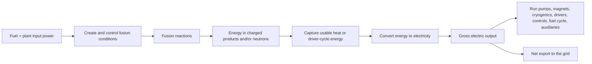

# FUS-0001 — What fusion energy is actually trying to achieve

## If you landed here directly

You do not need prior nuclear physics, plasma physics, calculus, or reactor engineering for this lesson.

You should be comfortable with ordinary ideas such as energy, power, temperature, and ratios. Even those will be made precise where the distinction matters.

This lesson has one central job: build the system-level mental model that prevents a common mistake in fusion discussions—treating every statement of “energy gain” as if it meant “a power plant generated net electricity.”

Those are not the same claim.

---
## The problem worth understanding

Imagine three headlines:

1. **A fusion target released more energy than the laser energy delivered to the target.**
2. **A magnetic-confinement experiment is designed to produce ten times as much fusion power as the external heating power delivered to its plasma.**
3. **A power plant exports more electricity to the grid than the entire facility consumes.**

All three can involve an “output divided by input” ratio greater than one.

They still describe different physical boundaries.

The first can be a major fusion-physics milestone without being a net-electric facility. The second can demonstrate a high-gain burning plasma without generating electricity at all. The third is the plant-level condition that matters to an electricity customer.

So before asking whether fusion “works,” we need a sharper question:

> **Which part of the system works, by what metric, across which boundary, and for how long?**

That question will remain useful through the entire track.

---
## The mental model: fusion is an energy-conversion chain

A fusion power plant would not be a box in which a reaction directly emits electricity.

The useful mental model is a chain:



Different experiments study different links of this chain.

A plasma experiment may focus almost entirely on the box labeled **Create and control fusion conditions**. An inertial-confinement experiment may focus on whether a tiny target produces more fusion energy than the energy arriving at that target. A future power station must close the entire loop repeatedly, reliably, maintainably, and economically.

This gives us the first concept of the track:

> **A fusion reaction is not yet a fusion power plant.**

---
## What fusion means physically

Atomic nuclei contain positively charged protons and, except for ordinary hydrogen, neutrons. Because two positively charged nuclei repel electrically, bringing them close enough to fuse is difficult.

If sufficiently light nuclei do get close enough, a more tightly bound nuclear configuration can be formed. The products can have lower total mass-energy than the separated reactants. The difference appears as kinetic energy of the reaction products and, after interactions with surrounding matter, can become heat.

For near-term controlled-fusion research, the most important fuel pair is deuterium and tritium, two isotopes of hydrogen.

A deuterium-tritium reaction can be written as

$$ {}^{2}_{1}\mathrm{H}+{}^{3}_{1}\mathrm{H} \rightarrow {}^{4}_{2}\mathrm{He}+n+17.6\ \mathrm{MeV}. $$

The approximately $17.6\ \mathrm{MeV}$ is shared mainly between:

- a helium-4 nucleus, often called an **alpha particle**, with about $3.5\ \mathrm{MeV}$;
- a neutron with about $14.1\ \mathrm{MeV}$.

The alpha particle is electrically charged. In a magnetic-confinement plasma, the magnetic field can keep it associated with the plasma long enough for it to help heat the fuel.

The neutron is uncharged. A magnetic field does not confine it. It leaves the plasma and deposits energy in surrounding structures.

That difference becomes central later. The alpha particle helps make a self-heated or burning plasma possible; the neutron is both a potential route for extracting fusion energy and a severe materials and shielding challenge.

---
## Why “just fuse the nuclei” is not a recipe

The reaction equation is compact. The physical conditions are not.

Two deuterium and tritium nuclei are both positively charged. At ordinary temperatures they do not simply fall together. They repel through the Coulomb interaction.

Fusion research therefore needs a population of nuclei with enough kinetic energy and enough opportunities to approach one another closely.

For magnetic-confinement D-T fusion, this means an extremely hot **plasma**: matter in which electrons are no longer bound to individual atoms in the ordinary way and the fuel behaves as a collection of charged particles.

A tokamak is one major magnetic-confinement geometry. The sectional view below is a useful physical anchor for the word *confinement*: the plasma occupies the toroidal vacuum-vessel region while large magnetic-coil systems surround it. The picture is not a generic diagram of every fusion approach; it is specifically an ITER tokamak cross-section.


*Visual anchor — sectional view of ITER. Source: [Wikimedia Commons — Sectional-view-of-ITER-tokamak-reactor.jpg](https://commons.wikimedia.org/wiki/File:Sectional-view-of-ITER-tokamak-reactor.jpg), A. M. Miri, S. Fink, and W. H. Fietz; CC BY 4.0. Registry: `FUS-REF-007`.*

But high temperature alone is not enough.

A useful first approximation is that three things must work together:

- **temperature** — particles need a useful distribution of collision energies;
- **density** — there must be enough fuel particles for fusion collisions to occur at a useful rate;
- **confinement time** — the energetic fuel must remain in a useful state long enough before its energy escapes.

Later we will make this quantitative through the Lawson criterion and the fusion triple product. For now, the important point is structural:

> A spectacular temperature is not a fusion-energy result by itself.

The temperature, density, confinement, reaction rate, losses, and usable output have to be considered together.

---
## Power and energy are not interchangeable

Fusion reporting often switches between **energy** and **power**. They are related but not identical.

Energy is an amount. Power is a rate of energy transfer:

$$ P=\frac{\Delta E}{\Delta t}. $$

A short experiment can have enormous instantaneous power and still release a modest total amount of energy because the duration is tiny.

Conversely, a power plant matters because it must deliver useful power for long periods with acceptable downtime.

When you see a number in megajoules, ask about total energy and duration. When you see a number in megawatts, ask whether it is instantaneous, averaged over a pulse, or sustained.

---
## The most important habit: draw the boundary

Suppose someone defines a gain ratio

$$ G=\frac{\text{useful output}}{\text{required input}}. $$

This equation is meaningless until **output** and **input** are named.

A boundary tells you what is inside the accounting system and what is outside it.

Consider a laser-driven fusion experiment. One possible boundary surrounds only the target:


Another boundary surrounds the whole facility:


Those two diagrams do not have the same input.

Laser systems are not perfectly efficient. A target can therefore have an energy gain greater than one while the facility as a whole still consumes much more energy than the fusion yield.

Nothing contradictory has happened. The boundary changed.

---
## FUS-EX-001 — One phrase, three different gains

### Boundary A: target gain

For an inertial-confinement target, a useful ratio is

$$ G_{\text{target}} = \frac{E_{\text{fusion}}}{E_{\text{driver delivered to target}}}. $$

Lawrence Livermore National Laboratory reports that the National Ignition Facility has repeatedly achieved ignition. As of the current reference snapshot, the June 20, 2026 experiment was reported as the eleventh ignition result, with a measured fusion yield of about $7.9\ \mathrm{MJ}$ and a target gain of approximately $3.8$.

That is a real and important experimental result.

It does **not** mean NIF exported net electricity to the grid. The denominator is energy delivered to the target, not all electricity required by the laser facility.

### Boundary B: plasma fusion gain

In magnetic-confinement discussions, $Q$ commonly means

$$ Q = \frac{P_{\text{fusion}}}{P_{\text{external plasma heating}}}. $$

ITER is designed for a programmatic target of $Q\ge 10$: roughly $500\ \mathrm{MW}$ of fusion power from $50\ \mathrm{MW}$ of external heating power delivered to the plasma.

Again, that denominator is not the electricity consumed by the entire site.

### Boundary C: net-electric plant output

For an electricity-producing facility, a different quantity matters:

$$ P_{\text{net,electric}} = P_{\text{gross,electric}} - P_{\text{recirculating}}. $$

Here $P_{\text{recirculating}}$ includes electricity consumed by the plant itself: pumps, cryogenics, magnets or drivers, heating/current-drive systems where applicable, vacuum systems, fuel processing, controls, cooling, and other auxiliaries.

A plant exports net power only if

$$ P_{\text{net,electric}}>0. $$

These three ratios answer different questions. Comparing them as if they were the same metric is a category error.

---
## FUS-EX-002 — ITER can target Q = 10 without generating electricity

ITER is a particularly clean example of why system boundaries matter.

Its stated design mission includes producing a high-gain, self-heated D-T plasma. The familiar design point is

$$ P_{\text{fusion}}\approx 500\ \mathrm{MW}, \qquad P_{\text{external heating}}\approx 50\ \mathrm{MW}, $$

so

$$ Q = \frac{500}{50} =10. $$

If those numbers are achieved, the result would be a major magnetic-fusion milestone.

But ITER explicitly states that it is **not designed to generate electricity**. It is an experimental device. Its purpose is to investigate burning-plasma physics and integrated technologies needed before an electricity-producing demonstration plant.

So the following inference is invalid:

```text
Q = 10
therefore
10 units of electricity leave the plant for every 1 unit of electricity consumed
```

The first line uses the plasma-heating boundary. The second line silently replaces it with a whole-facility electrical boundary.

The algebra is not the problem. The accounting boundary is.

---
## FUS-EX-003 — A hypothetical power plant

Now consider a deliberately simple hypothetical fusion power plant.

Suppose its generators produce

$$ P_{\text{gross,electric}}=1000\ \mathrm{MW}. $$

Suppose the plant itself requires

$$ P_{\text{recirculating}}=300\ \mathrm{MW}. $$

Then

$$ \begin{aligned} P_{\text{net,electric}} &=P_{\text{gross,electric}}-P_{\text{recirculating}}\\ &=1000\ \mathrm{MW}-300\ \mathrm{MW}\\ &=700\ \mathrm{MW}. \end{aligned} $$

The plant exports $700\ \mathrm{MW}$ in this simplified example.

Its recirculating fraction would be

$$ f_{\text{recirc}} = \frac{P_{\text{recirculating}}}{P_{\text{gross,electric}}} = 0.30. $$

These numbers are hypothetical. They are not a claim about any existing fusion plant.

The example exists to force the right bookkeeping habit: once we care about electricity, plasma gain is only one term inside a larger energy system.

---
## From fusion products to electricity

For a D-T magnetic-confinement power plant, the energy path would roughly be:

1. fusion reactions create energetic alpha particles and neutrons;
2. alpha-particle energy helps heat the plasma;
3. neutrons leave the magnetic confinement region;
4. surrounding blanket structures absorb much of the neutron energy as heat;
5. a coolant removes heat;
6. a power-conversion system turns part of that thermal energy into electricity;
7. some electricity runs the plant itself;
8. the remainder, if positive, can be exported.

Every arrow can lose useful energy or create an engineering constraint.

This is why a complete fusion-energy argument eventually has to discuss more than plasma temperature:

- confinement quality;
- heat exhaust;
- neutron damage;
- tritium breeding and recovery;
- component lifetime;
- remote maintenance;
- thermal conversion efficiency;
- plant availability;
- recirculating power;
- safety and licensing;
- cost and manufacturability.

Those are not distractions from “the real fusion problem.” They are parts of the fusion-energy problem.

---
## What a burning plasma means

In D-T fusion, the alpha particle carries a fraction of the reaction energy and is charged. In magnetic confinement it can transfer energy back to the plasma.

As alpha heating becomes strong, the plasma can require less external heating to maintain fusion conditions.

A **burning plasma** is a regime in which fusion-produced alpha heating becomes a dominant source of plasma heating.

This creates a feedback structure:


The loop is desirable because fusion begins to help sustain its own conditions.

It is also scientifically demanding because a strongly self-heated plasma is less like a passive object controlled entirely from outside. Its dynamics, stability, exhaust, and control become more tightly coupled.

Later lessons will unpack this feedback quantitatively.

---
## Why the Sun is not a reactor blueprint

Fusion powers the Sun, but the Sun solves confinement with enormous gravitational pressure and astronomical scale.

A terrestrial device does not have the Sun's gravity.

So “the Sun does fusion” tells us that fusion reactions are physically possible. It does not provide an engineering recipe for a terrestrial power plant.

On Earth, researchers create different combinations of temperature, density, and confinement time:

- magnetic-confinement devices use relatively low-density plasma held for comparatively long times;
- inertial-confinement systems compress tiny fuel targets to extreme density for extremely short times.

These approaches can pursue the same underlying nuclear reaction while living in very different regions of parameter space.

That is why comparing only temperature or only instantaneous power between devices is usually misleading.

---
## What “ignition” means depends on context

The word **ignition** is powerful and easy to misuse.

In general, ignition refers to a regime in which fusion self-heating is sufficient to sustain or strongly amplify the burn under the relevant definition and timescale.

But experimental communities can operationalize the threshold with specific metrics. In NIF reporting, ignition and target gain are tied to the target-level energy balance. In magnetic fusion, burning-plasma and $Q$ language emphasizes plasma heating and sustained confinement.

So do not treat the bare word `ignition` as a complete quantitative result.

Ask:

- ignition of what system?
- by which formal criterion?
- for how long?
- how repeatably?
- with what driver or heating energy?
- with what facility energy consumption?

The same discipline applies to `breakeven`, `gain`, and `net energy`.

---
## Where intuition breaks

### 1. “The reaction releases energy, so a power plant is easy after that”

No.

The reaction is one necessary step. A practical energy system also needs controlled reaction rates, energy capture, fuel closure, materials survival, heat removal, electricity conversion, maintainability, and positive whole-plant performance.

---
### 2. “Hotter always means closer to useful fusion”

No.

Temperature interacts with density, confinement, reaction cross-sections, radiation and transport losses, stability, and engineering limits. A hotter plasma with poor confinement can be less useful than a cooler plasma with a better overall performance product.

---
### 3. “Q greater than one means net electricity”

Not unless $Q$ has explicitly been defined using the whole plant's electrical boundary.

ITER's conventional $Q$ does not use that boundary.

---
### 4. “Target gain greater than one means the laser facility had net energy gain”

No.

Target gain compares fusion yield with energy delivered to the target. Wall-plug electricity is a larger upstream input.

---
### 5. “If an experiment lasts only a tiny fraction of a second, it is scientifically irrelevant”

No.

A short experiment can demonstrate crucial physics. But duration and repetition rate become essential when translating that physics into an energy system.

Scientific relevance and plant readiness are different axes.

---
### 6. “Fusion has no radioactivity”

That is too broad.

D-T fusion uses radioactive tritium, and high-energy fusion neutrons can activate structural materials. Fusion has a different radiological profile from fission, but “no radioactivity” is not an accurate general statement.

We will treat inventories, activation, shielding, waste, and safety explicitly later rather than turning them into slogans.

---
### 7. “One record number tells us which fusion approach will win”

No.

A practical energy system is multi-objective. Gain, duration, repetition rate, fuel cycle, component lifetime, availability, efficiency, capital intensity, maintainability, and manufacturability all matter.

A record can be real and important without deciding the entire technology question.

---
## A compact claim-audit protocol

Whenever you encounter a fusion headline, run this sequence.

### Step 1 — identify the quantity

Is the claim about energy, power, temperature, density, confinement time, gain, pulse duration, repetition rate, neutron yield, gross electricity, or net electricity?

### Step 2 — write the units

A missing unit is an immediate warning sign.

### Step 3 — draw the boundary

What exactly counts as input? What exactly counts as output?

### Step 4 — identify the time basis

Single shot, pulse average, steady-state target, annual energy, or something else?

### Step 5 — identify the source

Primary paper, laboratory report, project organization, government agency, company release, secondary journalism, or social-media paraphrase?

### Step 6 — ask what the result does **not** prove

A good scientific result is stronger, not weaker, when its boundary is stated honestly.

---
## Active work

Do these before looking up additional explanations.

### Exercise 1 — name the boundary

For each statement, identify the numerator, denominator, and physical boundary.

1. A target produced $8\ \mathrm{MJ}$ of fusion energy after receiving $2\ \mathrm{MJ}$ of laser energy.
2. A plasma produced $400\ \mathrm{MW}$ of fusion power while receiving $80\ \mathrm{MW}$ of external heating.
3. A facility generated $900\ \mathrm{MW}$ gross electricity and consumed $350\ \mathrm{MW}$ internally.

Then explain why the three resulting ratios should not all be called the same kind of gain.

---
### Exercise 2 — compute, then interpret

For the hypothetical facility in statement 3 above, compute net electric output.

Then answer:

- Is the result energy or power?
- What would you still need to know before estimating annual electricity generation?
- Why would plant availability matter?

---
### Exercise 3 — debug the headline

A headline says:

> “Fusion experiment reaches gain of 3, proving a commercial plant can return three units of grid electricity for every unit it consumes.”

Write at least four questions that must be answered before that conclusion is justified.

---
### Exercise 4 — reconstruct the D-T reaction

From memory, write the D-T reaction and identify which product is charged and which is neutral.

Then explain why that charge difference matters in a magnetic-confinement device.

---
### Exercise 5 — temperature is not enough

Suppose Experiment A reports a higher temperature than Experiment B.

List at least five additional quantities or conditions you would want before claiming A is closer to useful fusion-energy performance.

---
### Exercise 6 — build a system diagram

Draw your own energy-flow diagram for a hypothetical D-T magnetic-confinement power plant.

Your diagram must include at least:

- external startup/heating power;
- plasma;
- fusion products;
- blanket or heat capture;
- power conversion;
- gross electricity;
- recirculating plant loads;
- net grid output.

Mark where you think the largest uncertainties or losses might occur. Do not research the answer yet; the purpose is to expose your current mental model.

---
### Exercise 7 — source discipline

Open an authoritative fusion source and find one current performance claim.

Record:

- exact date;
- organization;
- metric;
- value and units;
- numerator;
- denominator;
- duration or shot basis;
- one thing the claim does not establish.

This exercise matters because fusion records and project baselines change. A memorized number without a date is not durable knowledge.

---
## Retrieval / self-explanation

Close the lesson and answer from memory.

1. Why is a fusion reaction not yet a fusion power plant?
2. What makes the D-T reaction important for controlled-fusion research?
3. What are the two main D-T reaction products?
4. Why does the neutron behave differently from the alpha particle in a magnetic field?
5. Why are temperature, density, and confinement time coupled requirements?
6. What is the difference between energy and power?
7. What does the conventional magnetic-fusion $Q$ compare?
8. Why can target gain greater than one coexist with facility-level net energy loss?
9. Why can ITER target $Q\ge10$ while not generating electricity?
10. What does net-electric output subtract from gross-electric output?
11. Why should `ignition` or `breakeven` never be accepted without a definition?
12. What six-step protocol can you use to audit a fusion headline?

If questions 7–11 are weak, revisit the sections on system boundaries before moving to the nuclear details. Those distinctions are foundational for the rest of the track.

---
## Connections

### Forward: atoms and nuclei

The next lesson, **FUS-0002 — Atoms, nuclei, isotopes, and nuclear bookkeeping**, slows down and builds the nuclear vocabulary used here. We will distinguish atomic number, mass number, isotope, proton, neutron, electron, and nuclear notation without assuming prior chemistry or nuclear physics.

### Forward: binding energy

After the bookkeeping is clear, we can explain precisely why some fusion reactions release energy and why `E=mc^2` is an energy-accounting relation rather than a magic incantation.

### Forward: plasma physics

The temperature-density-confinement problem leads naturally to plasma behavior, charged-particle motion, magnetic geometry, transport, and stability.

### Forward: engineering

The neutron in the D-T equation leads to blankets, shielding, activation, materials damage, heat extraction, and tritium breeding.

### Forward: research literacy

The gain-boundary distinction introduced here becomes a permanent rule for reading current fusion results. Later L5 and L6 work will require comparing primary and authoritative sources without mixing incompatible metrics.

---
## What this unlocks

You should now be able to:

- explain fusion energy as a full conversion chain rather than a single nuclear reaction;
- distinguish the D-T reaction products at a first conceptual level;
- explain why terrestrial fusion requires a controlled combination of temperature, density, and confinement;
- distinguish energy from power;
- insist on an explicit system boundary before interpreting any gain ratio;
- separate target gain, plasma $Q$, and net-electric plant performance;
- explain why a high-gain experiment can be scientifically decisive without yet being a power plant;
- read current fusion headlines with much less risk of being misled by an undefined word such as `gain`, `ignition`, `breakeven`, or `net energy`.

The immediate next lesson is:

**FUS-0002 — Atoms, nuclei, isotopes, and nuclear bookkeeping.**

---
## References

- **FUS-REF-001** — ITER Organization, *What is Fusion?*
- **FUS-REF-002** — U.S. Department of Energy, *DOE Explains...Fusion Energy Science*.
- **FUS-REF-003** — International Atomic Energy Agency, *Fusion Physics*.
- **FUS-REF-005** — Lawrence Livermore National Laboratory / NIF, *Achieving Fusion Ignition*.
- **FUS-REF-006** — ITER Organization, *FAQs* on fusion gain, engineering breakeven, and electricity generation.

Current experimental and project-status claims in this lesson are version-sensitive. Re-check the registered authoritative sources after the review date rather than carrying record numbers forward indefinitely.
