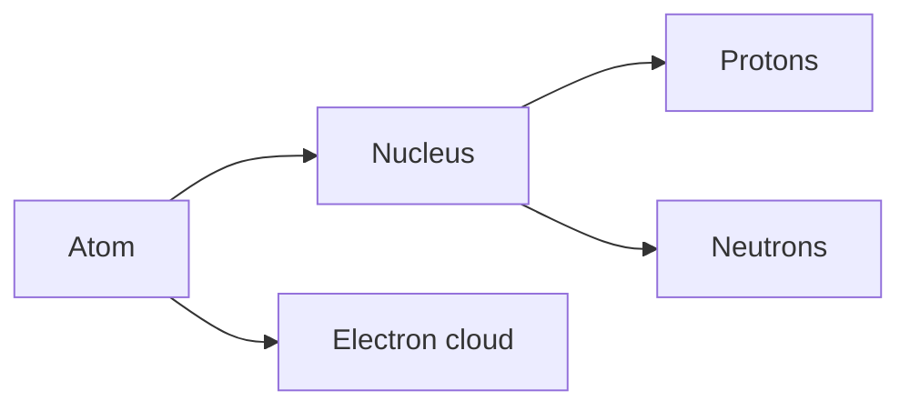

# FUS-0002 — Atoms, nuclei, isotopes, and nuclear bookkeeping

## If you landed here directly

This lesson assumes only the system-level picture from `FUS-0001`: fusion means changing nuclear configurations, and a fusion reaction is only one link in a larger energy system.

You do **not** need chemistry, nuclear physics, quantum mechanics, or calculus.

The goal here is narrower and foundational: learn how to read the symbols in a nuclear reaction without treating them as mysterious notation.

By the end, a line such as

$$ {}^{2}_{1}\mathrm{H}+{}^{3}_{1}\mathrm{H}\rightarrow{}^{4}_{2}\mathrm{He}+{}^{1}_{0}\mathrm{n} $$

should look like a piece of bookkeeping you can audit, not a formula you have to memorize.

---

## The problem worth understanding

Fusion discussions quickly use names such as:

- hydrogen;
- deuterium;
- tritium;
- helium-4;
- alpha particle;
- neutron.

Those names refer to different nuclear compositions.

If we do not know what is being counted, it becomes easy to make mistakes such as:

- thinking an isotope is a different chemical element;
- confusing mass number with measured atomic mass;
- confusing an ion with an isotope;
- reading a nuclear reaction without checking whether the nuclear counts balance.

The important habit is:

> **Before asking where the energy comes from, first know exactly what nuclei are on each side of the reaction.**

Energy bookkeeping comes next in `FUS-0003`. This lesson builds the ledger that makes that later discussion possible.

---

## The smallest useful model of an atom

For this track, an atom can initially be modeled as two regions:

The nucleus contains almost all of the atom's mass.

- A **proton** has positive electric charge.
- A **neutron** has no net electric charge.
- An **electron** has negative electric charge and is much lighter than a proton or neutron.

For fusion, the nucleus is the main object of interest.

Chemical reactions mainly rearrange electrons.

Nuclear reactions can change nuclei.

That difference is why ordinary combustion and nuclear fusion live on very different energy scales.

---

## The element is identified by proton number

The most important integer is the number of protons in the nucleus.

Call it $Z$.

$Z$ is the **atomic number**.

If a nucleus has:

- $Z=1$, it is hydrogen;
- $Z=2$, it is helium;
- $Z=6$, it is carbon.

Changing the number of neutrons does **not** change the element.

Changing the number of protons **does**.

This is the core definition behind isotopes.

---

## Mass number counts nucleons

Protons and neutrons are collectively called **nucleons**.

Let:

- $Z$ = number of protons;
- $N$ = number of neutrons;
- $A$ = mass number.

Then

$$ A=Z+N. $$

Therefore

$$ N=A-Z. $$

The word **mass** in *mass number* can be misleading.

$A$ is an integer count of nucleons.

It is **not** the same thing as the experimentally measured mass of the nucleus or atom.

That distinction becomes essential in the next lesson, because fusion energy depends on small differences in actual mass-energy, not on pretending that every nucleus has mass exactly equal to its integer mass number.

---

## Nuclide notation

A compact notation for a nucleus is

$$ {}^{A}_{Z}\mathrm{X}. $$

Here:

- $\mathrm{X}$ is the element symbol;
- $Z$ is proton number;
- $A$ is proton-plus-neutron number.

For example,

$$ {}^{2}_{1}\mathrm{H} $$

means:

- element: hydrogen;
- $Z=1$ proton;
- $A=2$ nucleons;
- therefore $N=2-1=1$ neutron.

Similarly,

$$ {}^{3}_{1}\mathrm{H} $$

has:

- one proton;
- two neutrons.

And

$$ {}^{4}_{2}\mathrm{He} $$

has:

- two protons;
- two neutrons.

---

## Isotopes: same element, different neutron count

**Isotopes** are nuclei of the same element with different numbers of neutrons.

Same element means same $Z$.

Different isotope means different $N$, and therefore usually different $A$.

Hydrogen gives the cleanest fusion-relevant example.

*Visual anchor — the three hydrogen isotopes. All have one proton, while the neutron count changes from 0 to 1 to 2. Source: [Wikimedia Commons — Hydrogen Deuterium Tritium Nuclei Schmatic-en.svg](https://commons.wikimedia.org/wiki/File:Hydrogen_Deuterium_Tritium_Nuclei_Schmatic-en.svg), Dirk Hünniger; English derivative by Balajijagadesh; CC BY-SA 3.0. Registry: `FUS-REF-008`.*

The three nuclei are:

| Name | Symbol | Protons $Z$ | Neutrons $N$ | Mass number $A$ |
| --- | --- | ---: | ---: | ---: |
| protium | ${}^{1}_{1}\mathrm{H}$ | 1 | 0 | 1 |
| deuterium | ${}^{2}_{1}\mathrm{H}$ | 1 | 1 | 2 |
| tritium | ${}^{3}_{1}\mathrm{H}$ | 1 | 2 | 3 |

All three are hydrogen because all three have $Z=1$.

The DOE isotope overview uses exactly this distinction: isotopes of an element have the same number of protons and different numbers of neutrons.

---

## Why deuterium and tritium are still hydrogen

A common beginner mistake is to think:

> “If deuterium has an extra neutron, maybe it is a different element.”

It is not.

The element label is controlled by proton count.

Deuterium has one proton, so it is hydrogen.

Tritium has one proton, so it is also hydrogen.

The additional neutrons alter nuclear properties dramatically, but they do not change $Z$.

This distinction will later matter when we compare:

- isotope stability;
- nuclear reaction probabilities;
- fuel availability;
- radioactive decay;
- reaction products.

---

## Isotope versus ion

An **isotope** differs by neutron count.

An **ion** differs by electron count.

These are different ideas.

Suppose we begin with deuterium:

$$ {}^{2}_{1}\mathrm{H}. $$

If its electron is removed, we have a positively charged deuterium ion.

The nucleus still contains one proton and one neutron.

Its isotope identity has not changed.

That is especially important in plasma physics: a hot fusion plasma contains ionized fuel, but ionization does not magically convert deuterium into another isotope.

---

## Nuclear notation is a ledger

Now return to the deuterium-tritium reaction:

$$ {}^{2}_{1}\mathrm{H}+{}^{3}_{1}\mathrm{H}\rightarrow{}^{4}_{2}\mathrm{He}+{}^{1}_{0}\mathrm{n}. $$

Before discussing energy, perform two checks.

### Check 1 — mass-number bookkeeping

Left side:

$$ A_{\text{left}}=2+3=5. $$

Right side:

$$ A_{\text{right}}=4+1=5. $$

So the nucleon count balances.

### Check 2 — charge/proton-number bookkeeping

Left side:

$$ Z_{\text{left}}=1+1=2. $$

Right side:

$$ Z_{\text{right}}=2+0=2. $$

So the nuclear charge count balances.

The free neutron carries $Z=0$.

This bookkeeping does not yet explain the $17.6\ \mathrm{MeV}$ released by the reaction.

That requires actual nuclear masses and binding energy, which is the subject of `FUS-0003`.

---

## FUS-EX-004 — Decode a nucleus instead of memorizing it

Consider

$$ {}^{7}_{3}\mathrm{Li}. $$

Read it mechanically:

1. $Z=3$, so the element is lithium.
2. $A=7$, so the nucleus contains seven nucleons.
3. The neutron count is

$$ N=A-Z=7-3=4. $$

So lithium-7 contains three protons and four neutrons.

Notice what we did **not** need:

- a drawing of electron shells;
- a measured atomic mass;
- a nuclear-force model.

At this stage, notation alone is enough.

---

## FUS-EX-005 — Two symbols that are the same element

Compare:

$$ {}^{12}_{6}\mathrm{C} $$

and

$$ {}^{14}_{6}\mathrm{C}. $$

Both have $Z=6$.

Therefore both are carbon.

Their neutron counts differ:

$$ N_{12}=12-6=6, $$

$$ N_{14}=14-6=8. $$

They are different isotopes of carbon.

This is the precise meaning of “same element, different isotope.”

---

## FUS-EX-006 — Audit a deliberately wrong fusion equation

Suppose someone writes

$$ {}^{2}_{1}\mathrm{H}+{}^{3}_{1}\mathrm{H}\rightarrow{}^{4}_{2}\mathrm{He}+{}^{2}_{0}\mathrm{n}. $$

Do not ask whether the reaction is physically likely yet.

First audit the ledger.

Mass-number count:

$$ A_{\text{left}}=2+3=5, $$

but

$$ A_{\text{right}}=4+2=6. $$

The proposed equation fails the most basic bookkeeping check.

That alone is enough to reject the equation as written.

The skill is simple but powerful: **check the counts before interpreting the physics.**

---

## What is actually conserved?

At this introductory level, it is useful to say that ordinary nuclear-reaction equations must balance:

- total electric charge;
- total nucleon/baryon number for the reactions we are considering;
- total energy and momentum.

But be careful with the shortcut “the number of protons and neutrons individually stays fixed.”

That is not a universal law.

In beta processes, for example, a neutron can transform into a proton or a proton into a neutron while other particles carry the required conserved quantities.

So the robust habit is not:

> “count protons and neutrons separately forever.”

It is:

> **Identify the conserved quantities appropriate to the reaction and include every emitted or absorbed particle in the accounting.**

For the D-T fusion reaction, balancing $A$ and $Z$ is the right first check.

---

## Mass number is not measured mass

This distinction deserves repetition.

For ${}^{4}_{2}\mathrm{He}$:

- the mass number is exactly $A=4$ by definition;
- the actual physical mass is not “exactly four atomic mass units because $A=4$.”

Nuclear binding changes the total mass-energy of a bound nucleus.

That is the door into the next lesson.

If you remember only one bridge to `FUS-0003`, make it this:

> **Nucleon counts can balance perfectly while the actual rest masses of reactants and products differ.**

That mass-energy difference is where the fusion-energy story becomes quantitative.

---

## A compact bookkeeping workflow

When you meet an unfamiliar nuclear symbol or reaction:

1. **Read $Z$.** What element is it?
2. **Read $A$.** How many nucleons are present?
3. **Compute $N=A-Z$.**
4. **Distinguish isotope identity from ionization state.**
5. **For a reaction, sum $A$ on both sides.**
6. **Sum charge/$Z$ on both sides, including all particles.**
7. Only after the ledger is consistent, ask about energy, probability, rates, and engineering relevance.

This workflow prevents a surprising number of later mistakes.

---

## Where intuition breaks

### “Heavier isotope means different element”

No. Element identity is set by proton number $Z$.

### “Mass number is the exact physical mass”

No. Mass number is a count of nucleons.

### “Ionized deuterium is a new isotope”

No. Ionization changes electrons, not the proton/neutron composition of the nucleus.

### “If $A$ and $Z$ balance, the reaction must happen”

No. Bookkeeping consistency is necessary, not sufficient. Reaction probability, energy, conservation laws, and dynamics still matter.

### “Every nuclear process keeps proton count and neutron count separately fixed”

No. Weak interactions can convert protons and neutrons into one another while total conserved quantities remain balanced.

---

## Active work

### Exercise 1 — decode notation

For each nucleus, find $Z$, $A$, and $N$:

1. ${}^{3}_{1}\mathrm{H}$
2. ${}^{4}_{2}\mathrm{He}$
3. ${}^{16}_{8}\mathrm{O}$
4. ${}^{235}_{92}\mathrm{U}$

Do not look up neutron counts. Derive them.

### Exercise 2 — isotope or element change?

For each pair, decide whether they are isotopes of the same element:

1. ${}^{2}_{1}\mathrm{H}$ and ${}^{3}_{1}\mathrm{H}$
2. ${}^{12}_{6}\mathrm{C}$ and ${}^{14}_{6}\mathrm{C}$
3. ${}^{14}_{6}\mathrm{C}$ and ${}^{14}_{7}\mathrm{N}$

Explain using $Z$, not by naming conventions alone.

### Exercise 3 — reaction audit

Check $A$ and $Z$ for:

$$ {}^{2}_{1}\mathrm{H}+{}^{2}_{1}\mathrm{H}\rightarrow{}^{3}_{2}\mathrm{He}+{}^{1}_{0}\mathrm{n}. $$

### Exercise 4 — find the error

A student says:

> Tritium is not hydrogen because it has three nucleons instead of one.

Give the shortest technically correct correction.

### Exercise 5 — ion versus isotope

Explain why a fully ionized deuterium nucleus in a fusion plasma is still deuterium.

---

## Retrieval check

Without looking back, answer:

1. What does $Z$ count?
2. What does $A$ count?
3. How do you compute neutron number $N$?
4. What makes two nuclei isotopes of the same element?
5. What is the difference between an isotope and an ion?
6. Why is mass number not the same as measured mass?
7. In the D-T reaction, what are the left and right totals of $A$?
8. In the D-T reaction, what are the left and right totals of $Z$?
9. Why does bookkeeping consistency not prove that a reaction will occur?
10. What question does `FUS-0003` answer that this lesson deliberately does not?

---

## Connections

### Backward: FUS-0001

`FUS-0001` treated fusion as one link in an energy-conversion system.

This lesson zoomed into the “fusion reactions” box and identified what the nuclear symbols actually mean.

### Forward: FUS-0003

Now we can count nuclei correctly.

The next problem is more subtle:

> If the counts balance, how can energy be released?

The answer requires binding energy, actual nuclear masses, mass defect, and $E=mc^2$.

That is exactly where `FUS-0003` begins.

---

## What this unlocks

After this lesson you should be able to:

- decode standard nuclide notation;
- distinguish element, isotope, and ion;
- compute neutron count from $A$ and $Z$;
- audit simple fusion reaction equations;
- identify why mass number alone cannot explain released energy.

You are now ready for **FUS-0003 — Binding energy, mass defect, and where fusion energy comes from**.

---

## References

- **FUS-REF-001** — ITER Organization, *What is Fusion?*
- **FUS-REF-003** — IAEA, *Fusion Physics*.
- **FUS-REF-008** — Wikimedia Commons, *Hydrogen Deuterium Tritium Nuclei Schmatic-en.svg*.
- **FUS-REF-009** — U.S. Department of Energy, *DOE Explains...Isotopes*.
