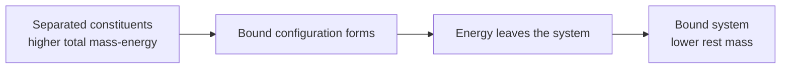

# FUS-0003 — Binding energy, mass defect, and where fusion energy comes from

## If you landed here directly

The direct prerequisite is [`FUS-0002 — Atoms, nuclei, isotopes, and nuclear bookkeeping`](FUS-0002-atoms-nuclei-isotopes-and-nuclear-bookkeeping.md).

You should already be able to read nuclide notation such as ${}^{2}_{1}\mathrm{H}$ and check the $A$ and $Z$ bookkeeping of a simple nuclear reaction.

This lesson asks the question that `FUS-0002` deliberately postponed:

> If the nuclear counts balance, how can a fusion reaction release energy?

The answer is not that matter mysteriously disappears. The answer is that **mass is one form of energy bookkeeping**, and different bound nuclear configurations have different total mass-energy.

---

## The apparent contradiction

Consider the deuterium-tritium reaction:

$$ {}^{2}_{1}\mathrm{H}+{}^{3}_{1}\mathrm{H}\rightarrow{}^{4}_{2}\mathrm{He}+{}^{1}_{0}\mathrm{n}. $$

The previous lesson showed that the reaction balances:

$$ A_{\text{left}}=2+3=5, $$

$$ A_{\text{right}}=4+1=5, $$

and

$$ Z_{\text{left}}=1+1=2, $$

$$ Z_{\text{right}}=2+0=2. $$

So the nucleon and charge bookkeeping works.

Yet the reaction releases about $17.6\ \mathrm{MeV}$.

Where did that energy come from?

Not from creating extra nucleons.

Not from violating conservation of energy.

The key is that **the mass of a bound system is not generally equal to the sum of the masses of the same constituents when they are separated**.

---

## A bound system can have less mass-energy

Suppose we have several particles far apart and at rest.

Now imagine that an attractive interaction allows them to settle into a lower-energy bound state.

If energy leaves the system while the bound state forms, then the final bound system has less total energy than the initial separated system.

Because

$$ E=mc^2, $$

a reduction in the system's rest energy also appears as a reduction in its rest mass.

This is not a special loophole invented for fusion.

It is the normal consequence of treating mass and energy consistently.

The phrase **mass defect** refers to the difference between the summed masses of separated constituents and the mass of the bound system.

---

## Binding energy

The **binding energy** of a nucleus is the energy required to separate that nucleus into its constituent protons and neutrons, with the separated particles taken sufficiently far apart that the nuclear binding is gone.

If the bound nucleus has mass $m_{\text{nucleus}}$, while the corresponding separated protons and neutrons have total mass

$$ m_{\text{separated}}=Zm_p+Nm_n, $$

then the mass defect is

$$ \Delta m=m_{\text{separated}}-m_{\text{nucleus}}. $$

The corresponding binding energy is

$$ B=\Delta m\,c^2. $$

For an ordinary bound nucleus,

$$ \Delta m>0 $$

and therefore

$$ B>0. $$

The nucleus has lower mass-energy than the same constituents separated.

---

## Do not read “mass defect” as missing matter

The word *defect* is historical and can invite the wrong mental model.

Nothing failed to conserve.

A better causal sequence is:

The final system weighs slightly less because some of the original system energy is no longer stored in the final bound object's rest energy.

If we reverse the process and completely separate the bound nucleus into free nucleons, we must supply that energy again.

---

## Why mass number cannot answer the energy question

In `FUS-0002`, mass number was defined as

$$ A=Z+N. $$

That is an integer count.

For the D-T reaction, $A$ is 5 on both sides.

But $A$ does not tell us the exact physical mass.

Two nuclear configurations can contain the same total number of nucleons and still have different total binding energies and therefore different total masses.

That is why this statement is wrong:

> “Five nucleons go in and five nucleons come out, so the masses must be identical.”

The counts match.

The mass-energy of the configurations does not have to match in the same form.

---

## Atomic mass units and nuclear energy units

Nuclear masses are conveniently expressed in unified atomic mass units, symbol $u$.

A very useful conversion is approximately

$$ 1\ u\,c^2\approx931.494\ \mathrm{MeV}. $$

That means a mass difference that looks tiny in atomic mass units can correspond to millions of electronvolts of energy.

Remember:

- `u` is a mass unit;
- `eV`, `keV`, `MeV`, and `J` are energy units;
- multiplying a mass by $c^2$ converts the mass equivalent into energy.

At this scale, a mass difference of only

$$ 0.001\ u $$

corresponds to roughly

$$ 0.9315\ \mathrm{MeV}. $$

Small mass differences are therefore energetically significant.

---

## Nuclear masses versus atomic masses: choose one convention consistently

A common source of mistakes is mixing:

- bare nuclear masses;
- neutral atomic masses;
- proton masses;
- hydrogen-atom masses;
- electron masses.

The safest beginner rule is:

> **Use a consistent mass convention and verify that any electron bookkeeping cancels correctly.**

For a binding-energy calculation using bare nuclear masses,

$$ \Delta m=Zm_p+Nm_n-m_{\text{nucleus}}. $$

If tabulated neutral atomic masses are used instead, a common convenient form is

$$ \Delta m=Zm_{\mathrm{H}}+Nm_n-m_{\text{atom}}, $$

where $m_{\mathrm{H}}$ is the mass of a neutral hydrogen atom.

Why does this work?

The $Z$ hydrogen atoms contribute $Z$ electrons, and the neutral target atom also contains $Z$ electrons, so the electron rest masses cancel to excellent approximation in the bookkeeping.

Small electronic binding energies exist, but they are tiny compared with the nuclear-energy scale being introduced here.

---

## FUS-EX-007 — A deliberately simple bound-state ledger

Suppose a fictional set of separated constituents has total rest mass

$$ m_{\text{separated}}=10.000\ u. $$

After binding, the composite object has mass

$$ m_{\text{bound}}=9.998\ u. $$

The mass defect is

$$ \Delta m=10.000\ u-9.998\ u=0.002\ u. $$

The binding energy is therefore approximately

$$ B=(0.002)(931.494\ \mathrm{MeV})\approx1.86\ \mathrm{MeV}. $$

Interpretation:

- the bound object is not “missing” $0.002\ u$ of material;
- the bound object's rest energy is lower by about $1.86\ \mathrm{MeV}$;
- at least that much energy must be supplied to fully separate the constituents again.

This fictional example isolates the bookkeeping before we use real isotope data.

---

## Reaction energy: compare the complete initial and final states

For a nuclear reaction, define the reaction energy, or $Q$-value, by the mass difference between the complete initial and final states:

$$ Q=(m_{\text{initial}}-m_{\text{final}})c^2. $$

If

$$ Q>0, $$

the reaction is **exothermic**: energy is released into kinetic energy, radiation, or other allowed forms.

If

$$ Q<0, $$

the reaction requires net energy input.

This is a reaction-level statement.

Binding energy is a property of a bound state.

The two ideas are connected because a reaction can move the nucleons into a more strongly bound final configuration.

---

## FUS-EX-008 — Derive the D-T fusion energy from masses

Use neutral atomic masses for deuterium, tritium, and helium-4.

NIST lists approximately:

| Species | Relative atomic mass |
| --- | ---: |
| deuterium, ${}^{2}\mathrm{H}$ | $2.01410177812\ u$ |
| tritium, ${}^{3}\mathrm{H}$ | $3.0160492779\ u$ |
| helium-4, ${}^{4}\mathrm{He}$ | $4.00260325413\ u$ |

For the free neutron, the 2022 CODATA value is approximately

$$ m_n=1.00866491606\ u. $$

The reaction is

$$ {}^{2}_{1}\mathrm{H}+{}^{3}_{1}\mathrm{H}\rightarrow{}^{4}_{2}\mathrm{He}+n. $$

The initial atomic mass is

$$ m_i=2.01410177812+3.0160492779=5.03015105602\ u. $$

The final mass is

$$ m_f=4.00260325413+1.00866491606=5.01126817019\ u. $$

Therefore

$$ \Delta m=m_i-m_f\approx0.01888288583\ u. $$

Convert that mass difference to energy:

$$ Q\approx(0.01888288583)(931.494\ \mathrm{MeV})\approx17.59\ \mathrm{MeV}. $$

Rounded in ordinary fusion discussions,

$$ Q\approx17.6\ \mathrm{MeV}. $$

That is the origin of the familiar D-T reaction energy.

### Why neutral atomic masses were safe here

The initial side contains two neutral hydrogen-isotope atoms, for a total of two electrons.

The helium-4 atom on the final side also contains two electrons.

The free neutron contains none.

So the electron rest masses cancel between the two sides.

We did not secretly turn electron mass into fusion energy.

---

## Where does the 17.6 MeV go?

Energy release does not mean that a glowing packet labeled “17.6 MeV” appears.

The products emerge with kinetic energy.

For the D-T reaction, the energy is shared primarily between:

- the alpha particle, ${}^{4}\mathrm{He}^{2+}$;
- the neutron.

Because momentum must also be conserved, the lighter neutron receives the larger share of the kinetic energy.

The familiar approximate split is:

- alpha particle: about $3.5\ \mathrm{MeV}$;
- neutron: about $14.1\ \mathrm{MeV}$.

Their sum is approximately

$$ 3.5+14.1=17.6\ \mathrm{MeV}. $$

Later lessons will care deeply about this split because charged alpha particles and neutrons interact with a reactor in very different ways.

For now, the key point is simpler:

> The reaction's mass-energy difference becomes energy carried by the products.

---

## Binding energy per nucleon

Total binding energy tends to increase as nuclei contain more nucleons, so total binding energy alone is not the cleanest way to compare how tightly different nuclei are bound.

A useful normalized quantity is **binding energy per nucleon**:

$$ \frac{B}{A}. $$

It asks:

> On average, how much binding energy is associated with each nucleon in this nucleus?

This is not a complete description of nuclear structure.

But it gives a powerful first map of why fusion can release energy for light nuclei and fission can release energy for very heavy nuclei.

---

## Visual anchor — the binding-energy curve

*Visual anchor — binding energy per nucleon versus nucleon number for selected nuclides. The curve rises steeply for light nuclei and reaches a broad maximum in the iron/nickel region before slowly declining for heavier nuclei. Source: [Wikimedia Commons — Binding energy curve of common isotopes.svg](https://commons.wikimedia.org/wiki/File:Binding_energy_curve_of_common_isotopes.svg), ScottMars; CC0 1.0. Registry: `FUS-REF-012`.*

Do not memorize every point on the curve.

Read its shape.

For very light nuclei, moving toward somewhat heavier nuclei can move the nucleons into more tightly bound configurations.

That means the final state can have:

- greater binding energy;
- lower total rest mass;
- released energy.

This is the energetic direction exploited by fusion of light nuclei.

---

## The curve does not say “everything below iron fuses easily”

This is one of the most important limitations of the picture.

The binding-energy curve tells us about **energetic favorability**.

It does not tell us the **reaction rate**.

A reaction can be energetically favorable and still occur extraordinarily slowly because nuclei must first get close enough for the strong nuclear interaction to matter.

Positively charged nuclei repel one another electrically.

At fusion-relevant energies, quantum tunneling also matters.

Those barriers belong to the next lesson:

**FUS-0004 — Coulomb repulsion, collision energy, and quantum tunneling.**

So keep two questions separate:

1. If the reaction happens, is the final configuration lower in mass-energy?
2. How likely is the reaction to happen under given conditions?

This lesson answers the first.

The next lesson begins answering the second.

---

## FUS-EX-009 — Read the curve without overclaiming

Suppose two candidate reactions both combine light nuclei.

Reaction A moves the products toward a region of noticeably higher binding energy per nucleon.

Reaction B produces a final state with nearly the same average binding energy per nucleon as its reactants.

Which reaction has the stronger **energetic** reason to release energy?

Reaction A.

But can we conclude that Reaction A will occur faster in a plasma?

No.

Rate depends on nuclear cross sections, collision energies, tunneling probabilities, resonances, and the fuel distribution.

The binding-energy curve is not a reaction-rate graph.

---

## FUS-EX-010 — Why mass number alone fails

Imagine two sides of a nuclear reaction each have total

$$ A=8. $$

A student concludes:

> “The total mass must be identical because both sides contain eight nucleons.”

The conclusion is wrong.

Mass number tells us the count of nucleons, not the exact mass-energy of the bound configurations.

To decide the reaction energy, we need actual masses or equivalent binding-energy data.

The correct reaction-energy test is

$$ Q=(m_i-m_f)c^2, $$

not

$$ Q=(A_i-A_f)c^2. $$

In a properly balanced reaction, $A_i-A_f$ may be zero while $Q$ is nonzero.

---

## Energy conservation is not mass conservation plus an exception

Older introductory language sometimes says “mass is converted into energy.”

That phrase can be useful, but it can also suggest that mass and energy are two separately conserved substances.

Relativity gives a cleaner picture.

For a closed system, total energy and momentum are conserved.

Rest mass is part of the energy accounting.

When a reaction releases energy into kinetic energy or radiation, the rest masses of the initial and final composite configurations can differ while total energy remains conserved.

At L0, the practical bookkeeping remains:

$$ Q=(m_i-m_f)c^2. $$

Later physics can make the relativistic energy-momentum treatment more formal.

---

## Why nuclear energies are so much larger than ordinary chemical energies

Chemical reactions mostly rearrange electrons and electronic bonds.

Nuclear reactions rearrange nuclear binding.

Typical chemical energies are often measured in electronvolts per molecule or bond.

Nuclear binding energies are commonly measured in millions of electronvolts, or MeV, per nucleus.

That difference in scale is why a very small amount of fusion fuel can in principle release a very large amount of energy.

This does **not** mean that a fusion power plant is automatically compact, cheap, or easy.

The reaction energy is only one part of the system.

A plant must still:

- create the reaction conditions;
- confine or compress the fuel;
- manage heat and particles;
- survive neutron exposure;
- handle tritium;
- convert thermal power to electricity;
- power its own supporting systems.

The system boundary from `FUS-0001` still matters.

---

## A compact reasoning workflow

When someone claims that a nuclear reaction releases energy:

1. **Check the reaction bookkeeping.** Does the particle inventory make sense?
2. **Identify the mass convention.** Nuclear masses or atomic masses?
3. **Sum the complete initial masses.**
4. **Sum the complete final masses.**
5. Compute

$$ \Delta m=m_i-m_f. $$

6. Convert with

$$ Q=\Delta m\,c^2. $$

7. Interpret the sign of $Q$.
8. Only then ask whether the reaction occurs at a useful rate.

This sequence separates accounting from kinetics.

---

## Where intuition breaks

### “Binding energy is energy stored like fuel inside the nucleus”

Not quite. Binding energy is the energy required to separate the bound system into the specified free constituents. The bound state's mass-energy is lower.

### “A more strongly bound nucleus has more mass because it contains more binding energy”

For the same specified constituents, stronger binding means a lower bound-state mass.

### “Mass defect means conservation of mass failed”

The complete mass-energy accounting is conserved. Rest mass of a composite system can differ between configurations.

### “The binding-energy curve proves which fusion fuel is best”

No. It gives energetic context, not reaction probability, engineering feasibility, fuel-cycle practicality, or plant performance.

### “If $A$ balances, $Q=0$”

No. $A$ counts nucleons; exact masses depend on binding.

### “A positive $Q$ means the reaction happens spontaneously at an appreciable rate”

No. Energetics and kinetics are different questions.

---

## Active work

### Exercise 1 — mass defect direction

A set of free constituents has mass $5.0000\ u$ and a bound state has mass $4.9950\ u$.

1. Find $\Delta m$.
2. Estimate the binding energy using $931.494\ \mathrm{MeV}/u$.
3. State whether energy must be supplied or released to form the bound state from separated constituents.

### Exercise 2 — reaction $Q$

A fictional reaction has

$$ m_i=8.0140\ u $$

and

$$ m_f=8.0100\ u. $$

Estimate $Q$ in MeV.

### Exercise 3 — sign reasoning

Without calculating a number, interpret:

1. $m_i>m_f$
2. $m_i=m_f$
3. $m_i<m_f$

in terms of $Q$.

### Exercise 4 — mass number trap

Explain why the equality

$$ A_i=A_f $$

does not imply

$$ m_i=m_f. $$

### Exercise 5 — atomic mass bookkeeping

Why is it legitimate to use neutral atomic masses for the D-T reaction without separately subtracting two electron masses from the initial side?

### Exercise 6 — curve interpretation

Look at the binding-energy-per-nucleon figure.

Write two statements that the figure supports and two statements that it does **not** support.

---

## Retrieval check

Without looking back:

1. What is nuclear binding energy?
2. What is mass defect?
3. Why is the mass of a bound nucleus smaller than the sum of separated constituent masses?
4. What does $1\ u\,c^2$ correspond to approximately?
5. What is the reaction $Q$-value?
6. What does $Q>0$ mean?
7. Why can $A$ balance while exact mass does not?
8. Why can neutral atomic masses be convenient in some reaction calculations?
9. What does binding energy per nucleon help compare?
10. Why does energetic favorability not guarantee a useful fusion rate?

---

## Connections

### Backward: FUS-0002

`FUS-0002` taught us how to count the nuclear inventory correctly.

This lesson added the missing energy layer:

> equal nucleon counts do not imply equal rest mass because nuclear binding changes the total mass-energy of the configuration.

### Backward: FUS-0001

The $17.6\ \mathrm{MeV}$ released by a D-T reaction belongs to the **reaction boundary**.

It is not yet the net electricity delivered by a plant.

The system-boundary discipline from `FUS-0001` remains essential.

### Forward: FUS-0004

We now know why a successful light-nucleus fusion event can release energy.

But an energetically favorable reaction can still be extremely difficult to initiate.

Next we ask why positive nuclei repel each other, what collision energy means, and how quantum tunneling changes the classical picture.

---

## What this unlocks

You should now be able to:

- explain binding energy without saying that matter simply vanishes;
- distinguish mass number from exact mass;
- compute a simple mass defect;
- convert a mass difference in $u$ into MeV;
- interpret a reaction $Q$-value;
- explain qualitatively why fusion of light nuclei can release energy;
- separate energetic favorability from reaction probability.

You are ready for **FUS-0004 — Coulomb repulsion, collision energy, and quantum tunneling**.

---

## References

- **FUS-REF-001** — ITER Organization, *What is Fusion?*
- **FUS-REF-003** — IAEA, *Fusion Physics*.
- **FUS-REF-010** — NIST, *Atomic Weights and Isotopic Compositions for All Elements*.
- **FUS-REF-011** — NIST/CODATA, *CODATA Recommended Values of the Fundamental Physical Constants: 2022*.
- **FUS-REF-012** — Wikimedia Commons, *Binding energy curve of common isotopes.svg*.
- **FUS-REF-013** — U.S. Department of Energy, *DOE Explains...Fusion Reactions*.
