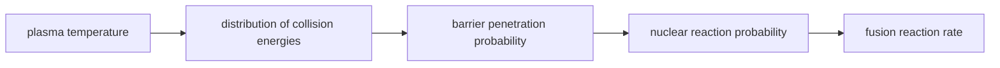

# FUS-0004 — Coulomb repulsion, collision energy, and quantum tunneling

## If you landed here directly

The direct prerequisite is [`FUS-0003 — Binding energy, mass defect, and where fusion energy comes from`](FUS-0003-binding-energy-mass-defect-and-where-fusion-energy-comes-from.md).

That lesson answered an energetic question:

> If a light-nucleus fusion reaction succeeds, why can the final state release energy?

This lesson asks a different question:

> If fusion can release energy, why is it so difficult to make two positively charged nuclei fuse in the first place?

The central distinction is **energetics versus access**.

A final nuclear configuration may be lower in mass-energy, yet the reactants may still face a large electrostatic barrier before the short-range nuclear interaction can bind them.

---

## The problem worth understanding

Consider two deuterium or tritium nuclei approaching each other.

Each nucleus carries positive electric charge.

Like charges repel.

At large nuclear separations, the electrostatic interaction dominates the approach.

At very short separations, the strong nuclear interaction can become attractive enough to bind the nuclei into a new nuclear configuration.

So the approach looks conceptually like this:

```text
far apart                                         nuclear range
    |                                                  |
    v                                                  v

positive nucleus  --->        repulsion        <--- positive nucleus
                         [Coulomb barrier]
                                      \
                                       \  if they reach very short range,
                                        \ strong nuclear interaction matters
```

The difficulty is getting from the left-hand situation to the short-range nuclear region.

Classical mechanics says that a particle with too little collision energy cannot cross a potential-energy barrier.

Quantum mechanics changes that conclusion.

---

## Why the repulsion exists

Suppose two nuclei carry charges

$$ q_1=Z_1e $$

and

$$ q_2=Z_2e. $$

Here:

- $Z_1$ and $Z_2$ are the proton numbers of the nuclei;
- $e$ is the elementary charge.

At separations where a point-charge approximation is useful, the electrostatic potential energy is

$$ U_C(r)=\frac{1}{4\pi\epsilon_0}\frac{Z_1Z_2e^2}{r}. $$

The important structure is:

$$ U_C\propto\frac{Z_1Z_2}{r}. $$

So:

- decreasing separation $r$ raises the electrostatic potential energy;
- larger nuclear charges raise the barrier;
- the product $Z_1Z_2$ matters.

This is the **Coulomb repulsion** part of the fusion problem.

---

## The Coulomb barrier is an energy landscape, not a physical wall

The phrase **Coulomb barrier** can sound like there is a literal shell around a nucleus.

There is not.

The barrier is a way of describing the potential-energy landscape for the relative motion of charged nuclei.

A crude conceptual sketch is:

```text
potential
energy
  ^
  |                      Coulomb-dominated region
  |                           /\
  |                          /  \
  |                         /    \
  |------------------------/------\----------  collision energy E
  |                       /        \
  |                      /          \___
  |                                     \  nuclear attraction
  +--------------------------------------------------> separation r
          small r                               large r
```

The exact nuclear potential is more complicated than this sketch.

The useful idea is that the approaching pair sees a region where the potential energy is high compared with its incoming relative kinetic energy.

---

## Why the nuclear force does not simply pull the nuclei together from far away

The strong nuclear interaction is powerful, but it is short-ranged.

At ordinary atomic or plasma separations, two nuclei do not feel a strong long-range nuclear attraction that cancels their electrostatic repulsion.

They must get extremely close first.

That is why saying

> “The strong force is stronger than electromagnetism, so fusion should be easy”

misses the relevant geometry.

**Strength and range are different properties.**

The electromagnetic repulsion acts over much larger distances.

The strong nuclear attraction becomes decisive only once the nuclei approach nuclear scales.

---

## Collision energy

When two particles approach one another, the energy relevant to their relative motion is not merely “the energy of one particle” in an arbitrary laboratory frame.

For reaction physics, the natural two-body quantity is the **center-of-mass collision energy**.

At this level, the essential meaning is:

> Collision energy measures how much kinetic energy is available in the relative motion that can carry the nuclei toward one another.

For two particles of masses $m_1$ and $m_2$, the relative-motion problem uses the reduced mass

$$ \mu=\frac{m_1m_2}{m_1+m_2}. $$

If their relative speed is $v_{\text{rel}}$, then the relative kinetic energy is

$$ E_{\text{rel}}=\frac{1}{2}\mu v_{\text{rel}}^2. $$

You do not need to master center-of-mass transformations yet.

The conceptual point is that **fusion cares about the energy of the collision between the nuclei**, not about an arbitrary observer's motion of the whole pair.

---

## FUS-EX-011 — Why charge product matters

Compare two approaching pairs at the same separation:

1. deuterium-tritium, with $Z_1=1$ and $Z_2=1$;
2. deuterium-helium-3, with $Z_1=1$ and $Z_2=2$.

The Coulomb potential scales with $Z_1Z_2$.

For D-T:

$$ Z_1Z_2=1. $$

For D-${}^{3}\mathrm{He}$:

$$ Z_1Z_2=2. $$

At the same separation in the same simplified electrostatic model,

$$ U_{D\,{}^{3}\mathrm{He}}\approx2U_{DT}. $$

This does **not** by itself tell us the complete fusion rate.

Nuclear structure and reaction cross sections matter too.

But it correctly tells us that the electrostatic approach problem is harder when the charge product is larger.

---

## The classical prediction

Imagine a classical particle approaching a barrier of height $U_0$.

If its total energy is

$$ E>U_0, $$

it can cross the barrier.

If

$$ E<U_0, $$

classical mechanics predicts reflection.

For a classical ball approaching a hill, this is ordinary intuition.

If the ball does not have enough kinetic energy to reach the top, it rolls back.

If nuclei behaved only as classical point particles, sub-barrier fusion would be impossible.

But nuclei are quantum systems.

---

## Quantum tunneling changes the question

A quantum particle is not described only by a point following one classical trajectory.

Its state is represented by a wave function.

When that quantum state encounters a **finite** potential barrier, the wave function can penetrate into the classically forbidden region.

If the barrier is finite in width, a nonzero amplitude can emerge on the other side.

That phenomenon is **quantum tunneling**.

OpenStax states the basic result directly: a quantum particle can penetrate a potential barrier whose height exceeds the particle's total energy.

For fusion, this means:

> Two nuclei do not necessarily need enough classical collision energy to climb completely over the Coulomb barrier.

They can have a finite probability of reaching the short-range nuclear region by tunneling through the barrier.

---

## Tunneling does not mean the nucleus “borrows energy”

A common popular explanation says:

> “The particle borrows energy for a moment, crosses the barrier, and pays it back.”

That is not a good physical model.

The tunneling particle does not need to temporarily violate energy conservation.

The energy of the stationary quantum state remains well defined.

What changes is the quantum probability amplitude across a region that classical mechanics would forbid.

The correct lesson is:

> **Quantum mechanics assigns a nonzero transmission probability to some finite barriers even when $E<U_0$.**

No energy-conservation loophole is required.

---

## A simple barrier model

The Coulomb barrier is not a rectangular wall.

Still, a simple rectangular barrier teaches an important mathematical pattern.

For a barrier with height $U_0$, width $L$, and a particle with energy $E<U_0$, the wave function decays inside the classically forbidden region.

A common parameter is

$$ \kappa=\frac{\sqrt{2m(U_0-E)}}{\hbar}. $$

For a sufficiently opaque barrier, the transmission probability has an approximate exponential dependence of the form

$$ T\propto e^{-2\kappa L}. $$

Do not memorize this as the fusion formula.

It is a **generic tunneling lesson**:

- a wider barrier greatly suppresses tunneling;
- a higher barrier suppresses tunneling;
- a lower incident energy suppresses tunneling;
- a larger particle mass tends to suppress tunneling in the same simple barrier model.

The exponential dependence is the crucial intuition.

---

## FUS-EX-012 — Why exponential sensitivity matters

Suppose two toy barriers have the same $\kappa$, but one has width $L$ and the other width $2L$.

Using the simplified scaling,

$$ T(L)\propto e^{-2\kappa L}, $$

while

$$ T(2L)\propto e^{-4\kappa L}. $$

Therefore

$$ \frac{T(2L)}{T(L)}\propto e^{-2\kappa L}. $$

Doubling the width does not merely halve the transmission probability.

It can suppress it by an exponentially large factor.

This is why apparently modest changes in collision conditions can produce large changes in nuclear reaction probability.

---

## The actual fusion barrier is not rectangular

For two positively charged nuclei, the long-range part of the interaction roughly follows

$$ U_C(r)\propto\frac{1}{r}. $$

As the nuclei approach very closely, the nuclear interaction changes the potential.

So realistic barrier penetration requires integrating through a curved potential landscape rather than using a square wall.

The simplified rectangular formula is useful because it reveals the exponential nature of tunneling.

It is not a precision fusion-rate model.

---

## FUS-EX-013 — Classically forbidden does not mean impossible

Suppose a collision energy lies below the peak of a simplified Coulomb barrier.

Classical prediction:

```text
approach -> turn around -> separate
```

Quantum prediction:

```text
approach
  |
  +--> reflected component
  |
  +--> finite tunneling amplitude
           |
           +--> reaches short nuclear range
```

The quantum prediction does not say that every collision fuses.

It says that the probability is not automatically zero merely because the collision energy is below the classical barrier height.

This is a probability statement, not a guarantee.

---

## The barrier is only one filter

Even if two nuclei reach short range, fusion is not automatically guaranteed.

The complete probability depends on nuclear physics:

- available quantum states;
- angular momentum;
- nuclear structure;
- resonances;
- reaction channels;
- energy;
- particle species.

The **fusion cross section** packages much of that reaction probability into an experimentally useful quantity.

A later lesson can make cross sections and reaction rates quantitative.

For this lesson, do not collapse everything into tunneling.

Tunneling helps nuclei access the short-range region.

The nuclear reaction still has its own dynamics.

---

## Why temperature enters fusion discussions

A hot plasma does not contain ions all moving at one identical speed.

It contains a distribution of particle velocities and collision energies.

Raising temperature changes that distribution.

That generally increases the number of collisions in energy ranges where barrier penetration is less strongly suppressed.

But the statement

> “The plasma must be hot enough to overcome the Coulomb barrier”

is too classical and too literal.

Fusion-relevant ions often react at collision energies below a naive classical barrier estimate because tunneling matters.

A better sentence is:

> **Heating changes the collision-energy distribution, while quantum tunneling makes sub-barrier reactions possible.**

---

## Temperature is not a single-particle energy label

Another common mistake is to say:

> “The plasma temperature is 10 keV, so every ion has 10 keV.”

No.

Temperature characterizes a statistical distribution.

Individual particles have a range of kinetic energies.

Reaction rates depend on how that energy distribution overlaps the energy dependence of the fusion cross section.

That overlap becomes one of the central quantitative ideas of fusion plasma physics.

For now, keep the layers separate:



Each arrow hides physics that later lessons will unpack.

---

## FUS-EX-014 — Reject a misleading sentence

Claim:

> “D-T fusion starts once the ions have more energy than the Coulomb barrier.”

Why is this misleading?

Because it suggests a sharp classical threshold.

In reality:

1. collision energies are distributed;
2. tunneling gives nonzero sub-barrier penetration probability;
3. the nuclear reaction cross section varies continuously with energy;
4. useful fusion operation is about reaction **rates**, not a single on/off collision threshold.

A better statement is:

> D-T fusion becomes more probable as collision conditions move into a range where the combination of the ion energy distribution, barrier penetration, and nuclear reaction physics produces an appreciable reaction rate.

---

## Electrostatic barrier versus nuclear energy release

This distinction connects directly to `FUS-0003`.

### Before reaction

The approaching nuclei face electrostatic repulsion.

This controls **access** to short range.

### After successful fusion

The final nuclear configuration can have lower total mass-energy.

This controls **reaction energy release**.

These are different questions.

A reaction can be:

- energetically favorable;
- yet kinetically difficult.

That pattern appears throughout physics and chemistry.

Fusion is an extreme nuclear example.

---

## Why D-T is attractive without saying “because it has no barrier”

D-T nuclei are both singly charged:

$$ Z_D=1,\qquad Z_T=1. $$

So their Coulomb charge product is relatively small compared with reactions involving higher-$Z$ nuclei.

But D-T fusion absolutely still has a Coulomb barrier.

Its practical attractiveness also depends on the nuclear reaction cross section at achievable plasma energies and the large positive reaction $Q$-value studied in `FUS-0003`.

Therefore avoid the shortcut:

> “D-T is easy because the barrier is low.”

Relative to many alternatives, its combination of barrier and nuclear reaction behavior is favorable.

“Easy” is not an accurate reactor-engineering description.

---

## Coulomb repulsion does not disappear in a plasma

A plasma is ionized.

Ionization removes or redistributes electrons.

It does not remove the positive nuclear charge.

Two deuterium nuclei in a plasma still carry positive nuclear charge and still repel electrostatically as they approach.

Collective plasma screening can modify interactions at longer ranges, but it does not turn the nuclei into neutral classical billiard balls.

At this level, the correct default is:

> **Ionization makes nuclei available as charged plasma particles; it does not eliminate the fusion barrier.**

---

## A compact reasoning workflow

When you encounter a claim about “how nuclei get close enough to fuse,” ask:

1. What are $Z_1$ and $Z_2$?
2. What is the relevant relative collision energy?
3. What does the Coulomb potential do as separation decreases?
4. At what scale does short-range nuclear physics become important?
5. Is the claim using classical barrier crossing or quantum tunneling?
6. Is tunneling being confused with guaranteed fusion?
7. Is a single collision energy being confused with a thermal distribution?
8. Is reaction probability being confused with reaction energy release?

This prevents several recurring misconceptions at once.

---

## Where intuition breaks

### “The strong force is stronger, so it cancels Coulomb repulsion everywhere”

No. Its effective nuclear range is short.

### “The Coulomb barrier is a shell surrounding the nucleus”

No. It is an energy-landscape description.

### “Below the barrier, fusion probability is exactly zero”

That is the classical prediction, not the quantum one.

### “Tunneling violates conservation of energy”

No.

### “Tunneling guarantees fusion”

No. Barrier penetration and nuclear reaction probability are related but distinct.

### “Every ion in a plasma has energy $kT$”

No. Temperature describes a distribution.

### “If a reaction releases energy, it should happen by itself”

Energetic favorability does not imply a large reaction rate.

---

## Active work

### Exercise 1 — charge-product comparison

Rank the Coulomb factor $Z_1Z_2$ for:

1. D-T;
2. D-${}^{3}\mathrm{He}$;
3. p-${}^{11}\mathrm{B}$.

Do not claim a complete reaction-rate ranking from this alone.

### Exercise 2 — separation

Using

$$ U_C(r)\propto\frac{1}{r}, $$

what happens to the Coulomb potential energy if the separation is halved in the same point-charge approximation?

### Exercise 3 — collision energy

Explain why the motion of the center of mass is not the same thing as the collision energy available for bringing the nuclei together.

### Exercise 4 — tunneling language

Rewrite this sentence accurately:

> “The nucleus borrows energy to jump through the Coulomb wall.”

### Exercise 5 — barrier width

In the toy model

$$ T\propto e^{-2\kappa L}, $$

what happens qualitatively when $L$ increases?

Why is “slightly wider means slightly less tunneling” a dangerous intuition?

### Exercise 6 — energetics versus kinetics

A hypothetical fusion reaction has $Q>0$ but an extremely tiny cross section at accessible energies.

Explain why both statements can be true simultaneously.

### Exercise 7 — temperature

Why does increasing plasma temperature not mean that every ion suddenly crosses a single energy threshold?

---

## Retrieval check

Without looking back:

1. What causes Coulomb repulsion between nuclei?
2. How does the simplified Coulomb potential scale with $Z_1Z_2$ and $r$?
3. Why does the strong nuclear interaction not pull nuclei together from ordinary plasma separations?
4. What does collision energy mean conceptually?
5. What does classical mechanics predict for $E<U_0$?
6. What does quantum tunneling change?
7. Why is “borrowing energy” a poor tunneling explanation?
8. Why is exponential dependence important?
9. Why does successful tunneling not guarantee a fusion reaction?
10. Why is plasma temperature not the energy of every individual ion?

---

## Connections

### Backward: FUS-0003

`FUS-0003` established why a successful light-nucleus fusion reaction can have

$$ Q>0. $$

This lesson established why reaching the reacting configuration is difficult.

Together they form a two-question framework:

```text
Can the products be energetically favored?
                +
Can the reactants access the reaction region often enough?
```

Both are necessary for understanding fusion.

### Backward: FUS-0002

The charge product $Z_1Z_2$ comes directly from proton-number bookkeeping.

The nuclear notation learned there now affects reaction accessibility.

### Forward

The next stages of the fusion curriculum can now treat distributions, cross sections, reaction rates, plasma temperature, and confinement without pretending that fusion is a simple classical threshold process.

---

## What this unlocks

You should now be able to:

- explain the Coulomb barrier as an energy landscape;
- connect barrier strength to nuclear charge and separation;
- distinguish collision energy from arbitrary laboratory motion;
- explain quantum tunneling without invoking energy violation;
- understand why sub-barrier fusion is possible;
- distinguish barrier penetration from fusion probability;
- distinguish reaction probability from reaction energy release;
- explain why plasma temperature enters fusion through a distribution of collision energies.

---

## References

- **FUS-REF-003** — IAEA, *Fusion Physics*.
- **FUS-REF-013** — U.S. Department of Energy, *DOE Explains...Fusion Reactions*.
- **FUS-REF-014** — IAEA, *Cyclotron Produced Radionuclides: Principles and Practice*, Technical Reports Series No. 468.
- **FUS-REF-015** — OpenStax, *University Physics Volume 3*, §7.6, *The Quantum Tunneling of Particles through Potential Barriers*.
