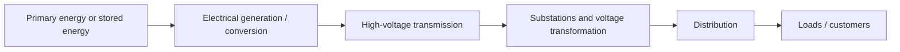
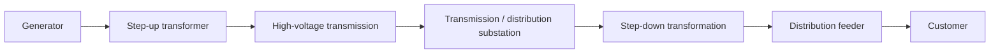
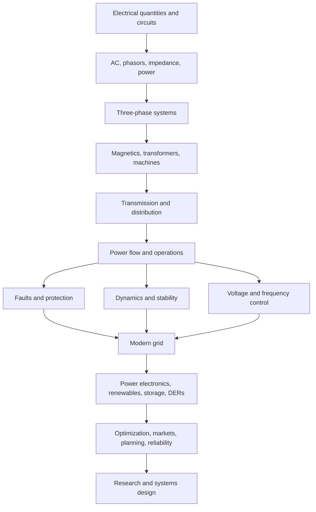

# PWR-0001 — What electrical power engineering is actually studying

## If you landed here directly

You do not need prior circuit theory, electromagnetics, calculus, phasors, machines, or power-system analysis.

This track starts below the usual university prerequisite line.

The first lesson has one job: build a system-level picture of **what power engineers are trying to make happen** before we introduce the mathematics used to analyze it.

---

## The problem worth understanding

A wall outlet looks simple.

You connect a device, and electrical energy is available.

But the outlet is the visible edge of a much larger engineered system.

At the same moment that you turn on a load, many things elsewhere must remain acceptable:

- generators and converters must inject enough power;
- transmission lines and transformers must stay within limits;
- voltages must remain usable;
- system frequency must remain controlled;
- faults must be detected and isolated;
- equipment must not overheat;
- the system must survive credible disturbances;
- operators must know what is happening;
- economic decisions must still respect physical laws.

Power engineering studies this coupled problem.

> **How do we generate, convert, transmit, distribute, control, protect, and use electrical power reliably across an interconnected system?**

That is much larger than “learning about wires.”

---

## The first mental model: an electric power system is a chain and a network

A simplified chain is:

Real grids are not always one-way chains.

They are increasingly networks with:

- multiple generators;
- solar and wind resources;
- batteries;
- industrial loads;
- electric vehicles;
- distributed generation;
- bidirectional power flow;
- local and wide-area control.

Still, the chain is a useful first map.

The U.S. Department of Energy describes the electricity supply chain using the same broad segmentation: generation, transmission, and distribution to end users.

---

## A visual anchor: what the physical hierarchy looks like

The following schematic is not a universal grid design and its example voltage/power labels are illustrative rather than rules.

Its value is spatial: it helps connect words such as *generation*, *transmission*, *substation*, *distribution*, and *customer* to a physical system.

*Visual anchor — a generic electric-grid schematic. Source: [Wikimedia Commons — Electricity Grid Schematic English.svg](https://commons.wikimedia.org/wiki/File:Electricity_Grid_Schematic_English.svg), MBizon; CC BY 3.0. Registry: `PWR-REF-007`.*

Do not memorize the particular megawatt or kilovolt labels in the image.

Instead, notice the architecture:

1. electrical power is produced or converted;
2. voltage is often raised for bulk transmission;
3. substations connect and transform portions of the network;
4. distribution brings power toward end users;
5. loads consume electrical energy;
6. control and protection must operate across the whole structure.

---

## Power engineering is about energy transfer — but power and energy are different

This distinction is foundational.

**Energy** is an amount.

**Power** is a rate of energy transfer.

In simple form,

$$ P=\frac{\Delta E}{\Delta t}. $$

If power is approximately constant,

$$ E=P\Delta t. $$

This is why:

- kilowatts (`kW`) measure power;
- kilowatt-hours (`kWh`) measure energy.

Confusing them creates errors immediately.

---

## PWR-EX-001 — A 2 kW load running for 3 hours

Suppose an appliance draws approximately

$$ P=2\ \mathrm{kW}. $$

If it runs for

$$ \Delta t=3\ \mathrm{h}, $$

then the energy used is

$$ E=P\Delta t=(2\ \mathrm{kW})(3\ \mathrm{h})=6\ \mathrm{kWh}. $$

The appliance is **2 kW**, not 6 kW.

It consumed **6 kWh** over the three-hour interval.

This distinction will reappear in:

- generators;
- batteries;
- transmission capacity;
- demand;
- markets;
- storage;
- plant economics.

---

## The grid must balance on more than one timescale

Imagine a city that consumes a certain total amount of energy over a year.

Knowing only annual energy is not enough to operate the system.

At 7:00 p.m. on a hot day, the city may need far more instantaneous power than it needs at 3:00 a.m.

A power system therefore has to satisfy time-dependent demand.

At a high level:

> generation and other active-power resources must continually track the electrical demand and system losses closely enough that frequency remains controlled.

The phrase “supply must equal demand” is useful, but later we will make it more precise.

The grid stores some energy in rotating machines, electromagnetic fields, batteries, and other devices, so balancing is dynamic rather than a magical instantaneous algebraic equality.

---

## PWR-EX-002 — Trace one delivery path

Imagine electrical power produced by a large generator.

A simplified path might be:

At each stage, ask a different engineering question.

### Generator

Can electrical power be produced at the required voltage, frequency, and operating condition?

### Transformer

Can voltage be changed efficiently while respecting insulation, heating, and magnetic limits?

### Transmission

Can large amounts of power move over distance without violating thermal, voltage, or stability constraints?

### Substation

Can power paths be transformed, switched, measured, protected, and controlled?

### Distribution

Can customers receive acceptable voltage safely and reliably?

### Load

How much power is demanded, when, and with what electrical characteristics?

Power engineering is the study of these questions **together**.

---

## Why high voltage appears in transmission

We will derive this properly later.

For now, consider the simple power relation for a DC-like intuition:

$$ P=VI. $$

For the same transferred power, increasing voltage can reduce current.

If resistive line loss behaves approximately as

$$ P_{\text{loss}}=I^2R, $$

then reducing current strongly reduces resistive loss.

This is one reason high-voltage transmission is so important.

But this explanation is only a first approximation.

Real AC transmission also involves:

- reactive power;
- inductance and capacitance;
- electric and magnetic fields;
- insulation limits;
- stability;
- corona and other effects;
- system economics.

The useful conclusion for now is not “higher voltage is always better.”

It is:

> **Voltage level is an engineering choice that changes current, losses, insulation requirements, equipment design, and system behavior.**

---

## A power system has several coupled layers

One reason power engineering feels difficult at first is that multiple kinds of constraints exist simultaneously.

### Physical layer

- voltage;
- current;
- frequency;
- electromagnetic fields;
- mechanical torque and speed;
- heat;
- insulation.

### Network layer

- lines;
- transformers;
- buses;
- generators;
- loads;
- switches;
- converters.

### Dynamic/control layer

- frequency regulation;
- voltage control;
- generator control;
- inverter control;
- system stability.

### Protection/safety layer

- fault detection;
- relay logic;
- circuit breakers;
- grounding;
- equipment protection;
- personnel safety.

### Reliability layer

- reserve;
- contingency handling;
- redundancy;
- restoration;
- emergency operation.

### Economic/operational layer

- which resources run;
- how much they produce;
- network congestion;
- losses;
- markets;
- operating cost.

These layers interact.

A low-cost dispatch that overloads a transmission line is not a valid operating solution.

A mathematically balanced network that becomes unstable after a disturbance is not acceptable either.

---

## PWR-EX-003 — Enough energy, not enough power

Suppose a storage system can hold

$$ E_{\max}=100\ \mathrm{MWh}. $$

A load suddenly requires an additional

$$ P=80\ \mathrm{MW}. $$

The storage system may have enough **energy capacity** to sustain that load for more than an hour.

But imagine its inverter can deliver only

$$ P_{\max}=20\ \mathrm{MW}. $$

Then it cannot supply the required 80 MW at that moment.

The system has enough stored energy but insufficient power capability.

This is why power-system design needs both energy and power ratings.

---

## Frequency is a system variable, not merely a label on an appliance

In an AC grid, frequency is connected to the time evolution of electrical phase and, in systems with synchronous machines, to mechanical rotor speed.

A large mismatch between mechanical/electrical input and demanded electrical power affects system frequency.

Later we will study:

- inertia;
- governor response;
- primary frequency control;
- automatic generation control;
- inverter-based frequency support.

For now, remember:

> **Frequency is one visible symptom of the system-wide power balance and dynamics.**

---

## Voltage is local as well as system-wide

Frequency across a strongly interconnected AC system is closely coupled.

Voltage behaves differently.

Voltage can vary significantly by location.

Reactive power, transformer taps, line impedance, generator excitation, capacitor banks, inverters, and load behavior all matter.

That is why a grid can have acceptable frequency while suffering a local voltage problem.

Later this becomes a major branch of the track.

---

## Protection changes the topology

A fault is not merely “a large current.”

The protection system has to decide:

1. what abnormal condition occurred;
2. where it occurred;
3. which breakers should open;
4. how quickly they must open;
5. what healthy equipment should remain connected.

When a breaker opens, the network topology changes.

So protection is not an add-on after the “real” power-system analysis.

Protection participates directly in how the system evolves during disturbances.

---

## Reliability is not the same as “nothing ever fails”

Real equipment fails.

Lightning occurs.

Trees contact lines.

Generators trip.

Loads change.

Control equipment malfunctions.

Power systems are therefore engineered to tolerate credible failures and limit their consequences.

NERC reliability standards are organized into families that explicitly include areas such as:

- resource and demand balancing;
- emergency preparedness;
- protection and control;
- transmission operations;
- transmission planning;
- voltage and reactive control;
- critical infrastructure protection.

This is a useful reminder that “keep the lights on” is not one calculation.

It is a coordinated engineering discipline.

---

## What power engineering is not

### It is not only circuit analysis

Circuit analysis is essential, but a continental-scale grid is not just a larger homework circuit.

### It is not only generation

A perfect generator is useless if the network cannot transfer its power safely.

### It is not only transmission lines

Loads, generators, transformers, controls, protection, markets, and operators matter.

### It is not only renewable energy

Wind, solar, and storage are major modern topics, but they enter an existing discipline with deep foundations in circuits, AC systems, machines, networks, protection, and control.

### It is not only “big electricity”

Power engineering also includes distribution, microgrids, industrial systems, distributed resources, converters, motors, and local energy systems.

---

## A map of this track

The curriculum intentionally moves from local quantities to system-level behavior.

You are not expected to understand the boxes yet.

The point is to see why the order exists.

A concept such as “grid-forming inverter” makes much more sense after you know what voltage, frequency, AC power, network impedance, and stability mean.

---

## Where intuition breaks

### “Electricity is produced and then stored in the wires until someone uses it”

No. Transmission and distribution networks transfer electromagnetic energy; they are not giant batteries.

### “If total yearly generation equals total yearly consumption, the grid is balanced”

No. Timing matters.

### “Power flows along the route operators choose”

Not in ordinary meshed AC networks. Power flow follows network physics and impedances; operators influence it through generation, topology, transformers, controllers, and other devices.

### “If a line is below its thermal rating, the system is safe”

Not necessarily. Voltage, transient stability, protection, contingency, and other constraints may be limiting.

### “Renewables invented the need for control”

No. Power systems have always required balancing, voltage control, protection, and stability. Converter-dominated resources change the mechanisms and models.

---

## Active work

### Exercise 1 — power or energy?

Classify each quantity:

- 5 kW
- 20 kWh
- 500 MW
- 2 GWh

Then explain the difference without using the words *rate* or *amount* until your final sentence.

### Exercise 2 — trace the system

Pick one appliance in your room.

Work backward conceptually:

customer → distribution → substation → transmission → generation/resources.

At each arrow, write one engineering question.

### Exercise 3 — constraint spotting

A transmission line is carrying current below its thermal rating.

Give three reasons why the operating condition might still be unacceptable.

### Exercise 4 — system boundary

A battery contains 100 MWh of stored energy.

What additional information do you need before claiming that it can support an 80 MW load?

### Exercise 5 — why power engineering?

Explain in five sentences why a power engineer needs to understand both individual devices and the interconnected system.

---

## Retrieval check

Without looking back:

1. What is the central problem power engineering studies?
2. What is the difference between power and energy?
3. Why does transmission commonly use high voltage?
4. What are the broad stages from generation to an end user?
5. Why is annual energy balance insufficient for grid operation?
6. Why can voltage be acceptable in one location and poor in another?
7. What does protection do besides “detect faults”?
8. Why is reliability not equivalent to preventing every component failure?
9. Why is power engineering more than circuit analysis?
10. Which subject comes next in the curriculum?

---

## Connections

### Forward: PWR-0002

This lesson intentionally used words such as:

- current;
- voltage;
- energy;
- power.

We used them only at the level necessary to build the system map.

The next lesson starts from first principles and asks:

> What are charge, current, voltage, energy, and power physically and operationally?

That is where the quantitative foundation begins.

### Neighbor tracks

Later topics will naturally connect to:

- **Linear Algebra** for network equations, state estimation, eigenvalue methods, and optimization;
- **Complex Analysis / complex-number methods** for AC phasor work;
- **C++ / Computer Systems** for larger simulation and tooling projects;
- **Fusion Energy** where a future fusion plant must ultimately connect to and operate within a power system.

Cross-track prerequisites should be explicit when they become real prerequisites.

---

## What this unlocks

You should now have a map of the discipline rather than a bag of disconnected terms.

You can explain why power engineering simultaneously cares about:

- electrical quantities;
- equipment;
- networks;
- control;
- protection;
- reliability;
- economics;
- time-dependent operation.

You are ready for **PWR-0002 — Charge, current, voltage, energy, and power**.

---

## References

- **PWR-REF-001** — MIT OpenCourseWare, *Introduction to Electric Power Systems (6.061)*.
- **PWR-REF-003** — U.S. Department of Energy, *How It Works: Electric Transmission & Distribution and Protective Measures*.
- **PWR-REF-005** — NERC, *Reliability Standards*.
- **PWR-REF-006** — PJM Learning Center, *Electricity Basics*.
- **PWR-REF-007** — Wikimedia Commons, *Electricity Grid Schematic English.svg*.
