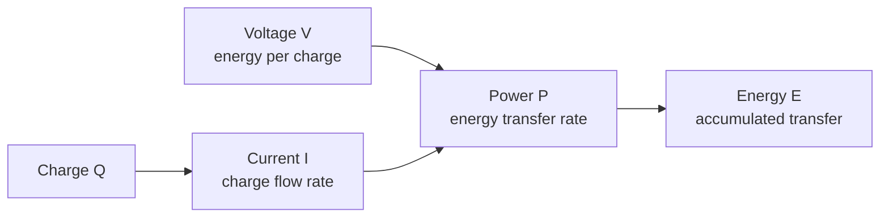
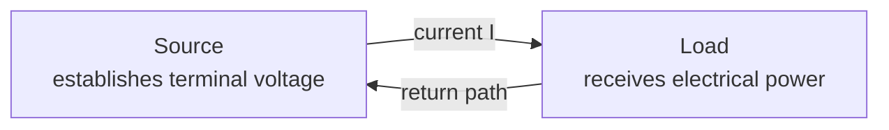

# PWR-0002 — Charge, current, voltage, energy, and power

## If you landed here directly

The direct prerequisite is [`PWR-0001 — What electrical power engineering is actually studying`](PWR-0001-what-electrical-power-engineering-is-actually-studying.md).

That lesson built the system map: generation, transmission, substations, distribution, loads, control, protection, and operation.

Now we zoom in.

Before we can analyze a generator, transformer, transmission line, motor, battery, or inverter, we need five quantities that appear almost everywhere in electrical engineering:

- charge;
- current;
- voltage;
- energy;
- power.

This lesson starts from zero subject-specific knowledge.

---

## The problem worth understanding

Consider a phone charger labeled with a voltage and current rating.

A household electricity bill reports kilowatt-hours.

A generator is rated in megawatts.

A transmission line carries current at a high voltage.

All of those statements use related quantities, but the quantities are **not interchangeable**.

A beginner who treats voltage as “how much electricity,” current as “how strong the voltage is,” and power as “stored energy” will quickly lose the physical structure.

The goal is to build one coherent chain:



The relationships are compact.

Understanding what each symbol means is the real work.

---

## Charge: the electrical property being counted

**Electric charge** is a physical property of matter.

We use the symbol $Q$ or $q$ for charge.

The SI unit is the **coulomb**, symbol $\mathrm{C}$.

A proton carries positive elementary charge.

An electron carries negative elementary charge.

The magnitude of the elementary charge is exactly

$$ e=1.602176634\times10^{-19}\ \mathrm{C}. $$

Therefore one coulomb corresponds to an enormous number of elementary charges:

$$ \frac{1\ \mathrm{C}}{e}\approx6.24\times10^{18}. $$

So when an ordinary circuit moves coulombs of charge, it is collectively moving vast numbers of charge carriers.

---

## Charge has a sign

Charge can be positive or negative.

This is not the same thing as saying that current itself is “made of positive particles.”

Different materials can have different charge carriers.

In metallic conductors, mobile electrons are usually the important microscopic carriers.

In electrolytes, positive and negative ions can move.

In semiconductors, electron and hole descriptions both matter.

Circuit theory deliberately abstracts away much of that microscopic detail.

It tracks **net charge flow** and chosen current directions.

---

## Current: charge flow rate

Electric current measures how rapidly charge crosses a chosen surface or point in a circuit model.

For an average over a time interval,

$$ I=\frac{\Delta Q}{\Delta t}. $$

The SI unit is the **ampere**, symbol $\mathrm{A}$.

Because

$$ 1\ \mathrm{A}=1\ \mathrm{C/s}, $$

a current of $1\ \mathrm{A}$ means that one coulomb of net charge passes the chosen cross-section each second.

For a continuously changing current, later mathematics refines this to

$$ I=\frac{dQ}{dt}. $$

You do not need calculus yet to use the average form.

---

## PWR-EX-004 — Turn charge flow into current

Suppose

$$ \Delta Q=3\ \mathrm{C} $$

passes through a wire cross-section in

$$ \Delta t=2\ \mathrm{s}. $$

The average current is

$$ I=\frac{3\ \mathrm{C}}{2\ \mathrm{s}}=1.5\ \mathrm{A}. $$

This equation says nothing yet about:

- the wire resistance;
- the voltage across a load;
- the power being delivered.

Current is one quantity in the system, not a complete description of the electrical condition.

---

## Conventional current direction

In circuit diagrams, **conventional current** is defined as the direction positive charge would move.

In a metal, the mobile electrons drift in the opposite direction.

That is not a contradiction.

It is a sign convention that was established before the electron was understood.

Both descriptions give the same circuit predictions when used consistently.

Later, reference directions will become formal in `PWR-0004`.

For now:

> An arrow labeled $I$ is a chosen positive reference direction for current.

The actual numerical current can later turn out to be positive or negative relative to that arrow.

---

## Current is not “used up”

A light bulb does not consume current the way a fuel tank consumes fuel.

In an ordinary steady circuit, charge does not continuously disappear inside the load.

The load transfers **energy** from the electrical system into other forms such as heat and light.

This distinction becomes clearer once we introduce voltage and power.

---

## Voltage: energy difference per unit charge

Voltage is always about a **difference between two points**.

At this level, a useful operational definition is:

$$ V_{ab}=\frac{\Delta E}{Q}, $$

where $V_{ab}$ describes an energy difference per unit charge between points $a$ and $b$.

The SI unit is the **volt**, symbol $\mathrm{V}$.

By definition,

$$ 1\ \mathrm{V}=1\ \mathrm{J/C}. $$

So if moving one coulomb between two circuit points corresponds to an energy change of five joules, the voltage difference has magnitude five volts.

Voltage is therefore not “electricity pressure” as a literal substance.

Pressure can be a useful analogy in restricted situations, but the precise electrical quantity is energy per charge between two locations.

---

## Voltage needs a reference

Saying

> “This point is at 12 volts”

is incomplete unless a reference is understood.

Twelve volts **relative to what?**

A circuit may say:

$$ V_{ab}=V_a-V_b. $$

If point $b$ is chosen as the reference or ground, then people may shorten the language and say “$V_a=12\ \mathrm{V}$.”

But the underlying quantity remains a difference.

This matters enormously in power systems, where:

- phase-to-neutral voltage;
- phase-to-phase voltage;
- bus voltage;
- transformer winding voltage;
- line voltage

all require clear reference definitions.

---

## PWR-EX-005 — Translate voltage into energy per charge

A source maintains a voltage magnitude of

$$ V=12\ \mathrm{V}. $$

Suppose

$$ Q=5\ \mathrm{C} $$

is transferred through a process in which each coulomb gives up $12\ \mathrm{J}$.

The associated energy transfer magnitude is

$$ E=VQ=(12\ \mathrm{J/C})(5\ \mathrm{C})=60\ \mathrm{J}. $$

This example connects three concepts:

- charge tells us how much charge participates;
- voltage tells us energy transfer per unit charge;
- energy tells us the total transferred amount.

---

## A two-terminal mental model

For early circuit reasoning, it helps to think of a source and a load connected through two terminals.



The diagram is deliberately abstract.

A real power network can contain many branches, phases, electromagnetic fields, converters, transformers, and distributed sources.

But the two-terminal model lets us connect voltage and current to energy transfer without hiding the units.

---

## Energy: the accumulated transfer

Energy is measured in **joules**, symbol $\mathrm{J}$, in SI.

In electric-power practice, larger accumulated electrical-energy quantities are often expressed in:

- watt-hours;
- kilowatt-hours;
- megawatt-hours.

The relation between power and energy is

$$ E=P\Delta t $$

when power is constant over the interval.

Because

$$ 1\ \mathrm{W}=1\ \mathrm{J/s}, $$

one watt-hour is

$$ 1\ \mathrm{Wh}=3600\ \mathrm{J}. $$

Therefore

$$ 1\ \mathrm{kWh}=3.6\times10^6\ \mathrm{J}=3.6\ \mathrm{MJ}. $$

A kilowatt-hour is an **energy** unit, not a power unit.

---

## Power: energy transfer rate

Power measures how rapidly energy is transferred.

For an average over an interval,

$$ P=\frac{\Delta E}{\Delta t}. $$

The SI unit is the **watt**, symbol $\mathrm{W}$.

One watt means one joule per second:

$$ 1\ \mathrm{W}=1\ \mathrm{J/s}. $$

In a simple two-terminal electrical situation, voltage and current combine to give electrical power:

$$ P=VI. $$

For now, use this relation as a magnitude relation for simple examples.

The sign of $P$, voltage polarity, current reference direction, and the difference between absorbing and delivering power will be treated carefully in `PWR-0004`.

---

## Why $P=VI$ makes dimensional sense

Voltage is energy per charge:

$$ [V]=\mathrm{J/C}. $$

Current is charge per time:

$$ [I]=\mathrm{C/s}. $$

Multiply them:

$$ [VI]=\frac{\mathrm{J}}{\mathrm{C}}\frac{\mathrm{C}}{\mathrm{s}}=\frac{\mathrm{J}}{\mathrm{s}}=\mathrm{W}. $$

The coulombs cancel.

That is a powerful conceptual interpretation:

> Voltage tells us energy transfer per unit charge, current tells us charge transfer per unit time, and their product tells us energy transfer per unit time.

---

## PWR-EX-006 — From voltage and current to power and energy

Suppose an appliance operates at approximately

$$ V=230\ \mathrm{V} $$

and draws

$$ I=2.0\ \mathrm{A}. $$

Its electrical power magnitude is

$$ P=VI=(230)(2.0)=460\ \mathrm{W}. $$

If it runs at that power for half an hour,

$$ \Delta t=0.5\ \mathrm{h}. $$

The energy used is

$$ E=(460\ \mathrm{W})(0.5\ \mathrm{h})=230\ \mathrm{Wh}. $$

Equivalently,

$$ E=0.230\ \mathrm{kWh}. $$

The power rating and energy consumption answer different questions.

---

## PWR-EX-007 — Same power, different voltage and current

Consider two idealized operating points.

Case A:

$$ V_A=5\ \mathrm{V},\qquad I_A=2\ \mathrm{A}. $$

Then

$$ P_A=10\ \mathrm{W}. $$

Case B:

$$ V_B=10\ \mathrm{V},\qquad I_B=1\ \mathrm{A}. $$

Then

$$ P_B=10\ \mathrm{W}. $$

The power is the same.

The voltage and current are not.

This is an early hint of why power engineers care about voltage level.

For a specified transmitted power, changing voltage changes current, and current strongly affects resistive losses and equipment requirements.

`PWR-0001` previewed that idea with $I^2R$ loss.

Later lessons will derive it more carefully.

---

## The five quantities in one table

| Quantity | Symbol | Meaning at this stage | SI unit | Useful identity |
| --- | --- | --- | --- | --- |
| charge | $Q$ | amount of electric charge | coulomb, $\mathrm{C}$ | — |
| current | $I$ | charge flow rate | ampere, $\mathrm{A}$ | $1\ \mathrm{A}=1\ \mathrm{C/s}$ |
| voltage | $V$ | energy difference per charge | volt, $\mathrm{V}$ | $1\ \mathrm{V}=1\ \mathrm{J/C}$ |
| energy | $E$ | transferred/stored energy | joule, $\mathrm{J}$ | $1\ \mathrm{kWh}=3.6\ \mathrm{MJ}$ |
| power | $P$ | energy transfer rate | watt, $\mathrm{W}$ | $1\ \mathrm{W}=1\ \mathrm{J/s}$ |

And for a simple electrical transfer,

$$ P=VI. $$

---

## Do electrons carry energy from a generator like trucks on a road?

This analogy is tempting but incomplete.

In metallic conductors, individual electrons have a drift motion that can be quite slow.

Yet an electrical system can respond on much faster electromagnetic timescales.

The complete energy-transfer picture involves electric and magnetic fields around conductors and components, not merely electrons carrying packets of energy from the distant generator to the load at their drift speed.

At L0, the important correction is:

> **Do not equate electron drift speed with the speed at which an electrical disturbance or energy transfer propagates through a circuit.**

Electromagnetic fields will return later in the track.

---

## Current through, voltage across

A useful language habit:

- current is described **through** a branch or component;
- voltage is described **across** or **between** two points.

For a two-terminal load:

```text
          I →
     ┌──────────┐
  +  │          │  -
─────┤   load   ├─────
     │          │
     └──────────┘
       V across
```

This vocabulary helps prevent a common category error.

A component does not “have current across it” in the same sense that it has a voltage difference across its terminals.

---

## Conservation of charge

Charge is conserved.

In ordinary lumped-circuit analysis, that fact becomes the foundation of current-balance rules.

If charge is not accumulating at a junction, current flowing into the junction must balance current flowing out.

Later, `PWR-0003` formalizes this as Kirchhoff's Current Law.

For now, the conceptual bridge is:

> **Current accounting comes from charge conservation.**

---

## Voltage is not current's cause in every possible model

At beginner level, we often say that a voltage difference “drives current.”

That is useful in simple resistive circuits.

But do not turn it into a universal law that current must always equal “voltage divided by something.”

Different devices have different current-voltage relationships.

Examples later include:

- resistors;
- capacitors;
- inductors;
- semiconductor switches;
- controlled converters;
- electric machines.

Voltage and current are variables.

A device model tells us how they are related.

---

## Power can flow in either direction

A battery can deliver power while discharging and absorb power while charging.

A motor usually absorbs electrical power and converts part of it to mechanical power.

A generator converts mechanical power into electrical power.

A grid-connected inverter can operate in more than one direction depending on its design and operating state.

So the equation

$$ P=VI $$

needs a sign convention before “positive power” has a universal interpretation.

We deliberately postpone that formalism to:

**PWR-0004 — Reference directions, signs, and passive-versus-active power.**

For this lesson, the magnitude relation is enough.

---

## Units are part of the reasoning, not decoration

Suppose someone writes

$$ E=5\ \mathrm{kW}. $$

That should immediately look suspicious.

Kilowatts are units of power, not energy.

Likewise,

$$ I=10\ \mathrm{V}. $$

is dimensionally wrong because volts measure potential difference, not current.

Unit checking is one of the fastest debugging tools in engineering.

Whenever you calculate, ask:

1. What physical quantity should the answer represent?
2. What unit should that quantity have?
3. Do the algebraic units reduce to that unit?

This habit will become increasingly valuable as equations become more complicated.

---

## Scale prefixes

Power engineering spans enormous ranges.

Common SI prefixes include:

| Prefix | Symbol | Multiplier |
| --- | --- | ---: |
| milli | m | $10^{-3}$ |
| kilo | k | $10^3$ |
| mega | M | $10^6$ |
| giga | G | $10^9$ |

Examples:

$$ 1\ \mathrm{kV}=1000\ \mathrm{V}, $$

$$ 1\ \mathrm{MW}=10^6\ \mathrm{W}, $$

$$ 1\ \mathrm{GWh}=10^9\ \mathrm{Wh}. $$

Capitalization matters.

`mW` means milliwatt.

`MW` means megawatt.

Those differ by a factor of one billion.

---

## Where intuition breaks

### “Voltage is the amount of electricity”

No. Voltage is an energy-per-charge difference between two points in the circuit model.

### “Current is consumed by the load”

Charge is not normally destroyed in the load. The load transforms energy.

### “A battery stores current”

A battery stores energy chemically and establishes terminal electrical conditions. Current describes charge flow during operation.

### “A kilowatt-hour is a power rating”

No. It is energy.

### “If two devices use the same power, they must have the same current”

No. Different combinations of voltage and current can produce the same power.

### “Electrons must travel from the power station to my appliance almost instantly”

Do not equate microscopic carrier drift with electromagnetic propagation and energy transfer.

### “Voltage at one point is absolute”

Circuit voltage is defined relative to another point or chosen reference.

---

## Active work

### Exercise 1 — charge to current

A conductor transfers $12\ \mathrm{C}$ in $3\ \mathrm{s}$.

Find the average current.

### Exercise 2 — current to charge

A constant current of $4\ \mathrm{A}$ flows for $5\ \mathrm{s}$.

How much charge passes the chosen cross-section?

### Exercise 3 — voltage to energy

A charge transfer of $2\ \mathrm{C}$ occurs across an energy difference of $24\ \mathrm{J}$.

What is the voltage magnitude?

### Exercise 4 — electrical power

A DC load operates at $48\ \mathrm{V}$ and $10\ \mathrm{A}$.

Find its power magnitude.

### Exercise 5 — power to energy

The same $480\ \mathrm{W}$ load runs for $2.5\ \mathrm{h}$.

Express its energy use in:

1. Wh;
2. kWh;
3. MJ.

### Exercise 6 — unit debugging

Which are dimensionally sensible?

1. $I=5\ \mathrm{A}$
2. $V=12\ \mathrm{J/C}$
3. $P=600\ \mathrm{J}$
4. $E=2\ \mathrm{kWh}$
5. $Q=8\ \mathrm{C/s}$

Correct the ones that are wrong.

### Exercise 7 — explain the distinction

In one paragraph, explain why “a 100 MW plant generated 100 MWh” is incomplete without a time interval.

---

## Retrieval check

Without looking back:

1. What does electric charge measure?
2. What is one ampere in coulombs per second?
3. What does voltage measure?
4. Why must voltage involve two points or a reference?
5. What is one watt?
6. Why does $VI$ have units of watts?
7. What is the difference between power and energy?
8. How many joules are in one kilowatt-hour?
9. Why is conventional current direction not necessarily electron drift direction?
10. Which conservation principle leads toward Kirchhoff's Current Law?

---

## Connections

### Backward: PWR-0001

`PWR-0001` showed that a power system must transfer electrical energy while respecting network and operating constraints.

This lesson supplied the local quantities used to describe that transfer.

We can now distinguish:

- how much charge participates;
- how fast charge flows;
- how much energy is transferred per charge;
- how much energy is transferred in total;
- how fast energy is transferred.

### Forward: PWR-0003

The next lesson connects these quantities into actual DC circuit models.

We will introduce:

- sources;
- loads;
- resistance;
- branches and nodes;
- Kirchhoff's Current Law;
- Kirchhoff's Voltage Law.

The conceptual foundations are already in place:

- KCL grows from charge conservation;
- KVL organizes voltage relationships around a circuit;
- device equations relate current and voltage.

### Forward: PWR-0004

After basic DC-circuit structure, we will make reference directions and signs precise so that $P=VI$ can distinguish absorbed and delivered power consistently.

---

## What this unlocks

You should now be able to:

- distinguish charge, current, voltage, energy, and power;
- use their SI units correctly;
- calculate average current from charge transfer;
- interpret voltage as energy per charge;
- calculate simple electrical power with $P=VI$;
- convert between constant power and accumulated energy;
- explain why kW and kWh answer different questions;
- recognize why current direction and voltage polarity are reference choices that need a later sign convention.

You are ready for **PWR-0003 — DC circuits: sources, loads, resistance, KCL, and KVL**.

---

## References

- **PWR-REF-001** — MIT OpenCourseWare, *Introduction to Electric Power Systems (6.061)*.
- **PWR-REF-002** — James L. Kirtley Jr. / MIT OpenCourseWare, *Introduction to Electric Power Systems — Open Textbook*.
- **PWR-REF-008** — NIST, *Guide to the SI, Chapter 4: The Two Classes of SI Units and the SI Prefixes*.
- **PWR-REF-009** — NIST, *Ampere: Introduction*.
