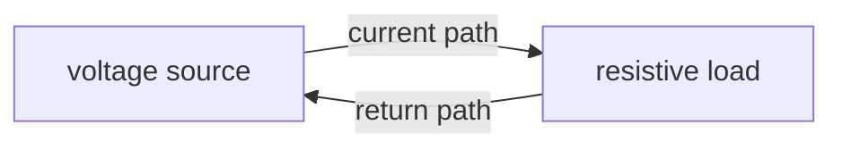
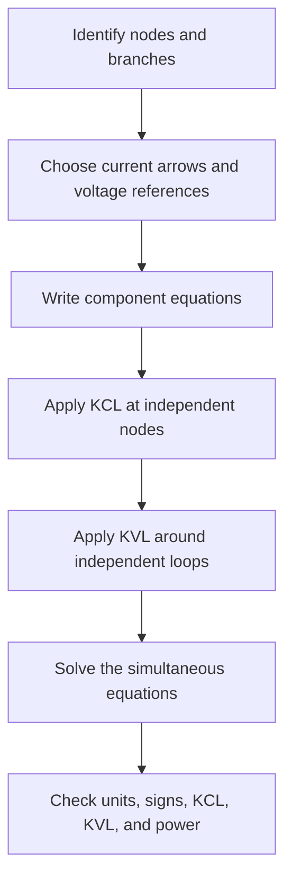

# PWR-0003 — DC circuits: sources, loads, resistance, KCL, and KVL

## If you landed here directly

The direct prerequisite is [`PWR-0002 — Charge, current, voltage, energy, and power`](PWR-0002-charge-current-voltage-energy-and-power.md).

You should already be able to distinguish:

- charge $Q$;
- current $I$;
- voltage $V$;
- energy $E$;
- power $P$.

Now we connect those quantities into the first real circuit model.

The goal is not to memorize a bag of resistor formulas.

The goal is to see a DC circuit as a **network constrained by device equations plus conservation laws**.

---

## The problem worth understanding

Suppose a battery is connected to several resistive loads.

Questions immediately appear:

- What current leaves the source?
- How does current split at a junction?
- Which points have the same voltage?
- What voltage appears across each load?
- Why does current not vanish after passing through a resistor?
- Why do voltage rises and drops around a closed loop balance?
- How can one solve a circuit that cannot be simplified by inspection?

The core toolkit is surprisingly compact:

1. describe the network;
2. write device relationships;
3. apply conservation of charge;
4. apply conservation of energy.

At L0, that becomes:

- ideal wires and nodes;
- sources and loads;
- resistance and Ohm's law;
- Kirchhoff's Current Law;
- Kirchhoff's Voltage Law.

---

## What “DC” means here

**DC** means direct current.

In the simplest steady DC model:

- voltages are constant in time;
- currents are constant in time;
- resistors are linear and time-invariant;
- the circuit is represented as a lumped network.

Real systems can deviate from these assumptions.

Batteries have internal dynamics.

Power converters switch rapidly.

Wires have inductance and capacitance.

Loads can be nonlinear.

But the steady resistive DC circuit is the right first model because it exposes the network logic cleanly.

---

## A circuit needs a closed conducting path

A simple source-load circuit can be drawn as:



The important word is **path**.

If the conducting loop is opened, the idealized steady current through that path becomes zero.

A voltage difference can still exist across the open terminals.

So:

> voltage can exist without a conducting current path.

That immediately corrects the misconception that voltage and current are the same phenomenon.

---

## Circuit diagrams are topology, not physical geometry

A schematic diagram does not try to reproduce the physical shape of the wires on a table.

It records electrical connectivity.

These two drawings may represent the same electrical node even if the lines are drawn differently on the page.

What matters is:

- which terminals are connected by ideal conductors;
- which components sit between nodes;
- where branches split and rejoin.

Circuit analysis begins with topology.

---

## Nodes, branches, and loops

### Node

A **node** is a set of electrically connected points treated as having the same potential in the ideal-wire model.

### Branch

A **branch** is a path between two nodes containing a circuit element or series of elements carrying the same branch current.

### Loop

A **loop** is a closed path through the network.

These words let us describe circuit structure without depending on the drawing style.

---

## Ideal wires

At L0, an ideal wire has:

- zero resistance;
- no voltage drop along the wire;
- no energy dissipation.

Therefore all points connected by uninterrupted ideal wire belong to the same node.

If points $a$ and $b$ are on the same ideal node,

$$ V_a=V_b. $$

Real conductors are not perfect.

Their resistance, inductance, heating, and electromagnetic fields matter in real power systems.

The ideal-wire approximation is a modeling choice, not a claim about matter.

---

## Sources and loads

A **source** is modeled as an element that establishes or controls an electrical condition and can deliver energy to the circuit.

A **load** receives electrical power and converts it into another form.

Examples of load behavior include:

- heating;
- light;
- motion;
- computation;
- electrochemical storage.

These are roles, not permanent identities.

A battery can deliver power while discharging and absorb power while charging.

The precise sign conventions for absorbed versus delivered power belong to the next lesson.

---

## Ideal voltage source

An ideal voltage source imposes a specified voltage between its terminals.

For a source of value $V_s$,

$$ V_+-V_-=V_s. $$

The source does **not** independently specify the current.

The rest of the connected circuit determines the current required by the model.

This is an important modeling distinction:

> an ideal voltage source constrains voltage, not both voltage and current simultaneously.

---

## Ideal current source

An ideal current source imposes a specified branch current.

It does not independently specify its terminal voltage.

The surrounding circuit determines the voltage required to satisfy the network equations.

Real power systems use controlled devices rather than perfect ideal sources, but ideal sources are foundational analysis models.

---

## Resistance

A resistor is a circuit element that relates voltage and current.

For an ideal linear resistor,

$$ V=IR. $$

This is **Ohm's law** for the resistor model.

The SI unit of resistance is the ohm:

$$ 1\ \Omega=1\ \mathrm{V/A}. $$

If $R$ is fixed:

- larger voltage magnitude produces larger current magnitude;
- larger resistance produces smaller current magnitude for the same applied voltage.

---

## Resistance is a device relation, not a conservation law

This distinction matters.

The equation

$$ V=IR $$

describes a particular ideal component model.

Kirchhoff's laws describe network constraints tied to conservation principles.

So do not classify all three equations as interchangeable “circuit laws.”

A useful hierarchy is:

```text
network topology
    +
component/device equations
    +
conservation constraints
    =
circuit solution
```

---

## PWR-EX-008 — The first one-loop circuit

Suppose an ideal $12\ \mathrm{V}$ source is connected across a $4\ \Omega$ resistor.

The resistor sees

$$ V_R=12\ \mathrm{V}. $$

Using Ohm's law,

$$ I=\frac{V_R}{R}. $$

Therefore

$$ I=\frac{12\ \mathrm{V}}{4\ \Omega}=3\ \mathrm{A}. $$

The circuit has one branch current of magnitude $3\ \mathrm{A}$.

The current is not “used up” by the resistor.

The resistor converts electrical energy into heat at a power magnitude

$$ P=VI=(12)(3)=36\ \mathrm{W}. $$

The energy transfer is what the load consumes, not electric charge.

---

## Series connection

Two components are in **series** when the same branch current must pass through them because there is no junction between them that allows current to split.

For two series resistors,

```text
source --- R1 --- R2 --- return
             same I
```

The same current flows through both.

Kirchhoff's Voltage Law will then connect their voltage drops.

---

## Parallel connection

Two components are in **parallel** when both are connected between the same pair of nodes.

Therefore they have the same voltage across them.

```text
        +--- R1 ---+
node A -+          +- node B
        +--- R2 ---+
```

So:

$$ V_{R1}=V_{R2}=V_{AB}. $$

The currents can differ.

Kirchhoff's Current Law connects those branch currents.

---

## Kirchhoff's Current Law

Kirchhoff's Current Law, or **KCL**, expresses current balance at a node.

A useful signed form is

$$ \sum I_k=0, $$

where currents entering and leaving are assigned opposite signs according to a consistent convention.

Equivalent language is:

$$ \sum I_{\text{in}}=\sum I_{\text{out}}. $$

Why?

Because current is charge flow.

If charge is not accumulating at the idealized node in steady state, charge conservation requires the inflow and outflow rates to balance.

So:

> **KCL is the circuit-network expression of charge conservation.**

---

## PWR-EX-009 — A current-splitting node

Suppose $6\ \mathrm{A}$ enters a node.

Two branch currents leave.

One is $2\ \mathrm{A}$.

Call the other $I_x$.

KCL gives

$$ 6=2+I_x. $$

Therefore

$$ I_x=4\ \mathrm{A}. $$

The node did not manufacture or destroy current.

It redistributed charge flow among branches.

---

## KCL also handles guessed directions

Suppose you guess a branch current direction before solving the circuit.

That is allowed.

If the solution produces

$$ I_x=-2\ \mathrm{A}, $$

the negative sign means the actual current is $2\ \mathrm{A}$ opposite to the reference arrow you chose.

A wrong initial arrow does not make the mathematics invalid.

This becomes more systematic in the next lesson on reference directions and signs.

---

## Kirchhoff's Voltage Law

Kirchhoff's Voltage Law, or **KVL**, says that the algebraic sum of voltage changes around a closed loop is zero:

$$ \sum \Delta V_k=0. $$

In a simple source-resistor loop:

$$ +V_s-V_R=0. $$

Therefore

$$ V_s=V_R. $$

In a loop with one source and two resistor drops:

$$ +V_s-V_{R1}-V_{R2}=0. $$

KVL is the circuit-level energy bookkeeping rule for the lumped/quasistatic situations being modeled here.

---

## PWR-EX-010 — Two series resistors

Connect a $12\ \mathrm{V}$ ideal source to:

$$ R_1=2\ \Omega $$

and

$$ R_2=4\ \Omega $$

in series.

The same current $I$ flows through both.

KVL gives

$$ 12-IR_1-IR_2=0. $$

Substitute:

$$ 12-2I-4I=0. $$

So

$$ 12=6I, $$

and

$$ I=2\ \mathrm{A}. $$

The voltage drops are

$$ V_1=IR_1=(2)(2)=4\ \mathrm{V}, $$

and

$$ V_2=IR_2=(2)(4)=8\ \mathrm{V}. $$

Check:

$$ 12-4-8=0. $$

The loop closes both electrically and algebraically.

---

## Series resistance as a consequence

From the previous example,

$$ V_s=I(R_1+R_2). $$

So the two-resistor series network behaves, from the source terminals, like one equivalent resistor

$$ R_{\text{eq}}=R_1+R_2. $$

This is not a separate magical rule.

It follows from:

- same current through series elements;
- Ohm's law;
- KVL.

That is a useful pattern throughout circuit theory:

> many shortcut formulas are consequences of deeper network constraints.

---

## PWR-EX-011 — Parallel branches

Suppose a $12\ \mathrm{V}$ ideal source is connected across two parallel resistors:

$$ R_1=6\ \Omega, $$

$$ R_2=3\ \Omega. $$

Because the resistors are connected between the same two nodes,

$$ V_1=V_2=12\ \mathrm{V}. $$

Their branch currents are

$$ I_1=\frac{12}{6}=2\ \mathrm{A}, $$

and

$$ I_2=\frac{12}{3}=4\ \mathrm{A}. $$

At the source node, KCL gives the total current:

$$ I_s=I_1+I_2. $$

Therefore

$$ I_s=6\ \mathrm{A}. $$

The lower-resistance branch carries more current at the same voltage.

---

## Parallel resistance as a consequence

For the parallel network,

$$ I_s=\frac{V}{R_1}+\frac{V}{R_2}. $$

If we define an equivalent resistance by

$$ I_s=\frac{V}{R_{\text{eq}}}, $$

then

$$ \frac{1}{R_{\text{eq}}}=\frac{1}{R_1}+\frac{1}{R_2}. $$

Again, the shortcut comes from:

- common voltage in parallel;
- Ohm's law;
- KCL.

---

## A complete circuit solution uses several equation types

Consider this conceptual workflow:



For simple circuits, many steps collapse mentally.

For larger networks, this structure becomes essential.

---

## PWR-EX-012 — Use power as a consistency check

Return to the $12\ \mathrm{V}$ source feeding the parallel pair:

$$ R_1=6\ \Omega,\qquad R_2=3\ \Omega. $$

We found

$$ I_1=2\ \mathrm{A}, $$

$$ I_2=4\ \mathrm{A}, $$

and

$$ I_s=6\ \mathrm{A}. $$

The source delivers a power magnitude

$$ P_s=VI_s=(12)(6)=72\ \mathrm{W}. $$

The resistor power magnitudes are

$$ P_1=VI_1=(12)(2)=24\ \mathrm{W}, $$

and

$$ P_2=VI_2=(12)(4)=48\ \mathrm{W}. $$

Check:

$$ 24+48=72\ \mathrm{W}. $$

This is a strong sanity check.

The next lesson will make power signs precise.

For now, the magnitudes already show energy consistency.

---

## Source voltage is not automatically load voltage

In an ideal single-loop circuit with zero-resistance wires, a load may see the full ideal source voltage.

But real power systems include:

- source internal impedance;
- line resistance and reactance;
- transformers;
- converters;
- multiple loads;
- changing current.

Therefore the voltage at a remote load can differ from the source-terminal voltage.

The ideal DC model teaches the bookkeeping that more realistic models extend.

---

## “Ground” is a reference, not a drain for current

Circuit diagrams often mark one node as **ground** or the reference node.

At this stage, ground usually means:

$$ V_{\text{reference}}=0. $$

It gives us a common reference for node voltages.

It does not automatically mean:

- current disappears into Earth;
- the node is physically connected to soil;
- all ground symbols in every system are interchangeable.

Protective grounding and power-system earthing are later engineering topics.

Do not import those meanings into every schematic ground symbol.

---

## KVL has a modeling domain

For the ordinary lumped DC circuits in this lesson, KVL is the correct rule.

At a deeper electromagnetic level, a time-varying magnetic flux linking a loop can produce an induced electric field, and the simple electrostatic-potential picture needs refinement through Faraday's law.

That does not make KVL “wrong.”

It means circuit laws are models with assumptions.

For the present track stage:

> steady lumped resistive DC circuits are exactly the regime where the simple KVL formulation is appropriate.

---

## KCL also has deeper electromagnetic context

At an ideal lumped node, we write instantaneous current balance.

In devices that store electric charge, such as capacitors, charge can accumulate on conductors and currents can vary with time.

Circuit theory handles this with component equations and, at deeper levels, displacement-current concepts.

Again, the lesson is not that KCL fails.

The lesson is to understand what the circuit variables and component models are representing.

---

## Common failure mode: adding resistances by visual appearance

Do not say:

> “These two resistors are drawn next to each other, so they are in series.”

Series and parallel are connectivity relationships.

Two resistors are in series only when the topology forces the same branch current through them.

Two resistors are in parallel only when they share the same two end nodes.

Always identify nodes first.

---

## Common failure mode: current chooses only the easiest path

A phrase like

> “Current takes the path of least resistance”

is dangerously incomplete.

In parallel branches, current generally flows through **all conducting branches**.

The branch currents depend on the network voltages and impedances.

A lower resistance carries more current for the same voltage, but it does not usually monopolize all current unless another branch effectively becomes open or the resistance contrast is extreme.

---

## Common failure mode: the first resistor consumes the voltage

Voltage is not a conserved fluid that components eat sequentially.

KVL says voltage changes around a loop sum algebraically to zero.

A resistor's voltage difference emerges from its current and resistance:

$$ V_R=IR. $$

In a series circuit, different resistor values lead to different voltage drops at the common current.

---

## Common failure mode: current is smaller after the load

In a simple single-loop steady circuit, the same current passes through every series element.

If $3\ \mathrm{A}$ enters a resistor and there is no branch or stored-charge accumulation, $3\ \mathrm{A}$ leaves it.

The resistor changes energy, not the net rate of charge flow through that series branch.

---

## A practical solving procedure

For a resistive DC network:

1. redraw the circuit cleanly if necessary;
2. mark electrically identical nodes;
3. identify branches;
4. assign current arrows;
5. label voltage polarities or node voltages;
6. write each resistor relation;
7. apply KCL;
8. apply KVL;
9. solve the equations;
10. substitute the solution back into the original equations;
11. check units;
12. check power consistency when useful.

A negative solved current is information, not failure.

---

## Where intuition breaks

### “A voltage source fixes both voltage and current”

An ideal voltage source fixes voltage. The network determines current.

### “A resistor consumes current”

No. It transfers energy while relating voltage and current.

### “Current can disappear at a junction”

Not in the steady lumped-node model. KCL enforces charge-flow balance.

### “KVL means every voltage in the circuit is zero”

No. The **algebraic sum of changes around a closed loop** is zero.

### “Series means drawn in one row”

No. Series is a topological current constraint.

### “Parallel means drawn above and below each other”

No. Parallel means sharing the same two nodes.

### “Ground means current vanishes into Earth”

Not in an ordinary schematic by default.

### “Kirchhoff's rules are arbitrary memorized formulas”

They are network expressions of deeper conservation structure within the circuit model.

---

## Active work

### Exercise 1 — one resistor

An ideal $24\ \mathrm{V}$ source feeds an $8\ \Omega$ resistor.

Find:

1. current;
2. resistor power magnitude.

### Exercise 2 — series

A $20\ \mathrm{V}$ source feeds:

$$ R_1=2\ \Omega $$

and

$$ R_2=3\ \Omega $$

in series.

Find:

1. total current;
2. each voltage drop;
3. the KVL check.

### Exercise 3 — parallel

A $12\ \mathrm{V}$ source feeds:

$$ R_1=4\ \Omega $$

and

$$ R_2=12\ \Omega $$

in parallel.

Find:

1. each branch current;
2. source current;
3. total load power.

### Exercise 4 — node balance

At a node:

- $8\ \mathrm{A}$ enters;
- $3\ \mathrm{A}$ leaves;
- $1.5\ \mathrm{A}$ leaves;
- $I_x$ leaves.

Find $I_x$.

### Exercise 5 — guessed direction

You define $I_x$ as flowing left-to-right.

The solution gives

$$ I_x=-0.8\ \mathrm{A}. $$

What does that mean physically?

### Exercise 6 — topology

Explain why two resistors can be physically next to each other in a drawing yet not be in series.

### Exercise 7 — model boundary

Give one reason why an ideal wire is useful and one reason why it is not literally real.

---

## Retrieval check

Without looking back:

1. What does DC mean in the model used here?
2. What is a node?
3. What is a branch?
4. What does an ideal voltage source constrain?
5. What does Ohm's law say for an ideal linear resistor?
6. What conservation principle motivates KCL?
7. What does KVL say around a closed loop?
8. What defines series connection?
9. What defines parallel connection?
10. Why is a negative solved current not necessarily an error?
11. Why is ground usually a reference concept first?
12. Why should power be used as a solution sanity check?

---

## Connections

### Backward: PWR-0002

`PWR-0002` introduced charge, current, voltage, energy, and power as separate quantities.

This lesson placed them into a network:

- current flows through branches;
- voltage is defined between nodes;
- resistors relate current and voltage;
- KCL balances charge flow;
- KVL balances voltage changes around loops.

### Forward

The next power-engineering lesson can now formalize:

- reference current directions;
- voltage polarities;
- positive and negative signs;
- absorbed versus delivered power.

Those sign conventions will make the equations used here fully systematic.

### Long-range connection

The same network mindset eventually scales into power-system analysis:

- buses generalize circuit nodes;
- branches become lines and transformers;
- KCL becomes nodal power/current balance;
- device equations become machine, load, line, and converter models.

The grid is more complicated, but the network logic begins here.

---

## What this unlocks

You should now be able to:

- identify nodes, branches, series connections, and parallel connections;
- distinguish source and load roles;
- use ideal voltage and current source models;
- apply Ohm's law to an ideal resistor;
- apply KCL from charge conservation;
- apply KVL in steady lumped DC circuits;
- solve simple series and parallel resistor networks;
- use power balance as a consistency check;
- recognize the assumptions behind ideal circuit models.

---

## References

- **PWR-REF-001** — MIT OpenCourseWare, *Introduction to Electric Power Systems (6.061)*.
- **PWR-REF-002** — James L. Kirtley Jr. / MIT OpenCourseWare, *Introduction to Electric Power Systems — Open Textbook*.
- **PWR-REF-010** — OpenStax, *University Physics Volume 2*, §10.3, *Kirchhoff's Rules*.
- **PWR-REF-011** — MIT OpenCourseWare, *Resistive circuit analysis. Kirchhoff's Laws*, 6.071J / 22.071J.
