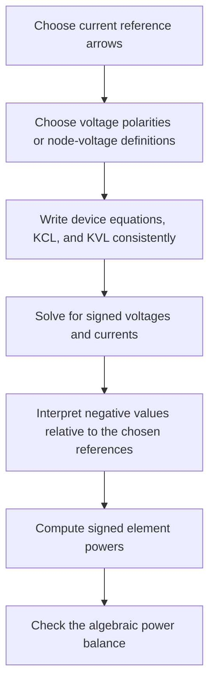

# PWR-0004 — Reference directions, signs, and passive-versus-active power

## If you landed here directly

The direct prerequisite is [`PWR-0003 — DC circuits: sources, loads, resistance, KCL, and KVL`](PWR-0003-dc-circuits-sources-loads-resistance-kcl-and-kvl.md).

You should already be able to:

- identify nodes and branches;
- assign branch-current arrows;
- label voltages;
- use Ohm's law;
- apply KCL;
- apply KVL;
- compute electrical power magnitude from voltage and current.

This lesson makes those calculations **signed and systematic**.

The central idea is simple:

> an arrow or polarity mark in a circuit diagram is first a reference definition, not a claim about what nature must do.

Once that distinction is clear, negative currents, negative voltages, absorbed power, delivered power, charging, and discharging become bookkeeping rather than mystery.

---

## The problem worth understanding

Suppose you draw a current arrow from left to right and solve the circuit.

The answer is:

$$ i=-2\ \mathrm{A}. $$

Did the calculation fail?

No.

It says the actual current is $2\ \mathrm{A}$ in the direction opposite to the arrow you chose.

Now suppose you label a component voltage $+$ at the top and $-$ at the bottom, and define

$$ v=V_{\mathrm{top}}-V_{\mathrm{bottom}}. $$

The solution gives:

$$ v=-5\ \mathrm{V}. $$

Again, the model did not fail.

It says the bottom terminal is actually $5\ \mathrm{V}$ higher than the top terminal.

Signs become useful only when you know **what was defined as positive**.

That is why circuit analysis needs reference directions before it needs arithmetic.

---

## A reference direction is not a prediction

When you draw:

```text
            i
            --->
     +               -
   a o----[ element ]----o b
            v
```

you are defining two variables.

The current variable $i$ is positive when charge flow follows the arrow.

The voltage variable $v$ is positive when terminal $a$ is at higher electric potential than terminal $b$:

$$ v=V_a-V_b. $$

Nothing in those marks guarantees that the solved values will be positive.

The arrow and polarity are coordinates for describing the electrical state.

They do not force the state.

---

## Reference direction versus actual direction

Suppose you define $i$ toward the right.

Three outcomes are possible.

### Positive result

$$ i=3\ \mathrm{A}. $$

The actual current is $3\ \mathrm{A}$ to the right.

### Zero result

$$ i=0. $$

There is no net current in that branch in the model.

### Negative result

$$ i=-3\ \mathrm{A}. $$

The actual current is $3\ \mathrm{A}$ to the left.

This is exactly analogous to choosing an $x$ axis in mechanics.

If east is positive, a velocity of $-5\ \mathrm{m/s}$ means westward motion.

The minus sign describes orientation relative to your reference.

---

## Worked example PWR-EX-013 — the guessed arrow points the wrong way

You define a branch current $i_x$ from node $a$ toward node $b$.

After applying KCL and KVL, you obtain:

$$ i_x=-1.5\ \mathrm{A}. $$

Interpretation:

- the reference arrow remains defined from $a$ to $b$;
- the variable value is negative;
- therefore the physical current represented by the solution is $1.5\ \mathrm{A}$ from $b$ to $a$.

Do **not** silently erase the minus sign during the algebra.

First finish the equations consistently.

Then interpret the sign.

---

## Voltage polarity is also a definition

For two terminals $a$ and $b$, define:

$$ v_{ab}=V_a-V_b. $$

Then automatically:

$$ v_{ba}=-v_{ab}. $$

If:

$$ v_{ab}=8\ \mathrm{V}, $$

then:

$$ v_{ba}=-8\ \mathrm{V}. $$

These are not two different physical situations.

They are two descriptions of the same potential difference using opposite reference polarity.

---

## Why arbitrary references are useful

At first, arbitrary reference choices may seem like unnecessary complexity.

They are useful because a real network can be too complicated to know every current direction before solving it.

Instead of guessing the physics perfectly in advance:

1. choose reference arrows;
2. choose voltage polarities;
3. write the equations consistently;
4. solve;
5. let the signs tell you the actual orientation.

This turns uncertainty about direction into algebra.

---

## Device equations depend on your references

For a positive resistance $R$, the familiar resistor relation is:

$$ v=Ri. $$

That equation assumes a compatible choice of voltage and current references.

In the standard passive choice, positive current enters the terminal labeled positive.

```text
            i
            --->
        +         -
      o---[ R ]---o
            v
```

Then a positive $i$ produces a positive voltage drop:

$$ v=Ri. $$

If you deliberately reverse only one of the two references, the algebraic form changes sign.

The physics of the resistor did not change.

Your coordinate definitions changed.

This is why diagrams and variable definitions belong next to equations.

---

## The passive sign convention

The most useful power convention for two-terminal elements is the **passive sign convention**.

Choose the current reference so that positive current enters the terminal marked positive for the voltage reference.

```text
            i
            --->
        +             -
      o---[ element ]---o
              v
```

Under this convention, define the instantaneous electrical power absorbed by the element as:

$$ p=vi. $$

The sign now has a direct interpretation.

If:

$$ p>0, $$

the element is absorbing electrical power.

If:

$$ p<0, $$

the element is delivering electrical power to the rest of the circuit.

If:

$$ p=0, $$

there is no net instantaneous electrical power transfer through that element boundary.

---

## Why the word “passive” can mislead

The passive sign convention can be used for **any** two-terminal element.

That includes:

- resistors;
- capacitors;
- inductors;
- batteries;
- generators;
- ideal voltage sources;
- ideal current sources;
- controlled sources.

You do not first need to decide whether the device is a source or a load.

Use the same sign convention.

Then let the sign of $p$ tell you whether the device is absorbing or delivering power in that operating condition.

That is one of the strongest reasons to use the convention.

---

## Worked example PWR-EX-014 — positive power means absorption

A two-terminal element has:

$$ v=12\ \mathrm{V} $$

with positive current defined as entering its positive terminal.

The solved current is:

$$ i=3\ \mathrm{A}. $$

Then:

$$ p=vi=(12)(3)=36\ \mathrm{W}. $$

Because:

$$ p>0, $$

the element absorbs:

$$ 36\ \mathrm{W}. $$

If the element is a resistor, that result is exactly what you expect.

If the element is a rechargeable battery, it could represent charging.

The sign tells you the energy-transfer direction across the electrical boundary.

The device label alone does not.

---

## Worked example PWR-EX-015 — negative power means delivery

Keep the same voltage reference:

$$ v=12\ \mathrm{V}. $$

Keep the passive-sign-convention current reference pointing **into** the positive terminal.

But suppose the actual current is $2\ \mathrm{A}$ leaving the positive terminal.

Relative to the chosen current reference:

$$ i=-2\ \mathrm{A}. $$

Therefore:

$$ p=vi=(12)(-2)=-24\ \mathrm{W}. $$

The negative result means the element delivers:

$$ 24\ \mathrm{W} $$

to the rest of the circuit.

A discharging battery is a familiar example.

---

## Source and load are operating roles

It is tempting to classify components permanently:

- battery = source;
- resistor = load;
- motor = load;
- generator = source.

Real operation is more flexible.

A rechargeable battery:

- delivers electrical power while discharging;
- absorbs electrical power while charging.

An electric machine can operate as:

- a motor, absorbing electrical power and producing mechanical output;
- a generator, receiving mechanical input and delivering electrical power.

A power converter can transfer energy in either direction if designed for bidirectional operation.

So the more precise question is not:

> “What kind of object is this?”

It is:

> “What is the signed power flow through this boundary in this operating condition?”

---

## Passive sign convention and a source-style convention

Some diagrams deliberately define current for a source as leaving the positive terminal.

```text
              i_s
            <---
        +             -
      o---[ source ]---o
```

With that source-oriented reference choice, a positive value of $v i_s$ naturally corresponds to delivered power.

This can be convenient.

But it is a different reference convention.

The important rule is not “sources always use one sign.”

The important rule is:

> define the references explicitly and use one interpretation consistently.

In this course, when we say **power absorbed** without another stated convention, we will prefer the passive sign convention:

$$ p=vi $$

with positive current entering the positive-voltage terminal.

---

## Do not confuse this with AC “real power”

Later in the power-engineering track, the word **active power** will appear in AC systems as another name for real power.

That is a different concept.

This lesson is about:

- reference directions;
- signed instantaneous or DC power;
- absorbed versus delivered power;
- passive-sign bookkeeping.

Do not prematurely identify “active” here with the later AC quantity measured as average real power.

The later AC lesson will define real, reactive, and apparent power explicitly.

---

## Reversing a reference does not reverse reality

Suppose an element is described under the passive sign convention by:

$$ v=10\ \mathrm{V} $$

and:

$$ i=2\ \mathrm{A}. $$

Therefore:

$$ p=20\ \mathrm{W}. $$

Now reverse both the voltage polarity and current reference.

The new variables are:

$$ v'=-10\ \mathrm{V} $$

and:

$$ i'=-2\ \mathrm{A}. $$

Then:

$$ p'=v'i'=(-10)(-2)=20\ \mathrm{W}. $$

The physical power transfer is unchanged.

You changed both coordinate directions.

---

## Worked example PWR-EX-016 — two descriptions, one physical power

Description A:

$$ v=6\ \mathrm{V},\qquad i=4\ \mathrm{A}. $$

Under passive references:

$$ p=24\ \mathrm{W}. $$

Description B reverses both references:

$$ v'=-6\ \mathrm{V},\qquad i'=-4\ \mathrm{A}. $$

Then:

$$ p'=24\ \mathrm{W}. $$

The signs of the variables changed.

The energy-flow conclusion did not.

This is a useful self-check when redrawing a circuit.

---

## What happens if you reverse only one reference?

Suppose you keep the voltage polarity but reverse only the current reference.

If the old current was $i$, the new current variable is:

$$ i'=-i. $$

If you still want **absorbed power** to be positive, then under that non-passive pair of references:

$$ p=-vi'. $$

This is why memorizing $p=vi$ without looking at the arrow and polarity can create sign errors.

The formula and the diagram belong together.

---

## Power balance across a network

Conservation of energy gives a powerful solution check.

For an isolated lumped circuit model, if every element power is expressed using the same absorbed-power sign convention, the algebraic sum should satisfy:

$$ \sum_k p_k=0. $$

Positive terms are absorbing.

Negative terms are delivering.

This is not magic cancellation.

It is energy bookkeeping across all modeled component boundaries.

---

## Worked example PWR-EX-017 — power conservation finds a sign mistake

Suppose a solved DC network gives:

- source A: $p_A=-100\ \mathrm{W}$;
- load B: $p_B=60\ \mathrm{W}$;
- load C: $p_C=40\ \mathrm{W}$.

Then:

$$ p_A+p_B+p_C=-100+60+40=0. $$

The result is power-balanced.

The source delivers $100\ \mathrm{W}$.

The two loads absorb a total of $100\ \mathrm{W}$.

Now suppose you accidentally report:

$$ p_A=+100\ \mathrm{W}. $$

Then:

$$ 100+60+40=200\ \mathrm{W}. $$

That does not satisfy the modeled energy balance.

The failure tells you to inspect:

- current-reference signs;
- voltage polarities;
- arithmetic;
- omitted elements;
- model assumptions.

Power balance is one of the best circuit-analysis debugging tools.

---

## A systematic sign workflow

When solving a circuit:



The order matters.

Do not reinterpret arrows halfway through the algebra.

Keep the references fixed until the solution is complete.

---

## A compact sign table

Under the passive sign convention:

| Voltage variable | Current variable | Power $p=vi$ | Interpretation |
|---|---:|---:|---|
| positive | positive | positive | absorbing |
| negative | negative | positive | absorbing |
| positive | negative | negative | delivering |
| negative | positive | negative | delivering |

The table is not a separate law.

It is simply multiplication plus the passive-sign definition.

---

## Why a resistor normally absorbs power

For an ideal resistor with $R>0$ under passive references:

$$ v=Ri. $$

Therefore:

$$ p=vi=(Ri)i=Ri^2. $$

Because:

$$ R>0 $$

and:

$$ i^2\ge 0, $$

we have:

$$ p\ge 0. $$

Equivalently:

$$ p=\frac{v^2}{R}\ge 0. $$

An ideal positive resistor in this model cannot be a sustained net power source.

It converts electrical energy into other forms, commonly thermal energy.

---

## Why a battery can have either sign

For a battery, a positive terminal voltage does not by itself determine whether the battery is charging or discharging.

You also need current direction.

With passive current entering the positive terminal:

- $i>0$ gives $p>0$: electrical energy enters the battery boundary;
- $i<0$ gives $p<0$: electrical energy leaves the battery boundary.

This is the circuit-level signature of charging versus discharging.

A more detailed electrochemical model comes later in specialized study.

---

## A negative current is not a negative amount of charge

When:

$$ i=-2\ \mathrm{A}, $$

the minus sign does not mean there are “negative two amperes of charge.”

Current is a signed rate relative to a reference direction.

The magnitude is:

$$ |i|=2\ \mathrm{A}. $$

The sign gives orientation.

Keep magnitude and orientation conceptually separate.

---

## A negative voltage is not “less electricity”

Similarly:

$$ v=-12\ \mathrm{V} $$

does not mean a component has a physically impossible voltage.

It means the actual terminal ordering is opposite to the one declared positive.

Voltage is a signed potential difference.

The sign belongs to the reference definition.

---

## Common failure mode: redraw the arrow after getting a negative answer

A learner chooses a current arrow, solves:

$$ i=-1\ \mathrm{A}, $$

then flips the arrow on the diagram and writes:

$$ i=+1\ \mathrm{A} $$

without updating the equations.

That mixes two coordinate systems.

Either description can be valid.

But every equation must correspond to the same chosen references.

Finish one convention cleanly before converting to another.

---

## Common failure mode: “a source must have negative power”

A source-like device does not always deliver power.

A battery can charge.

A generator can be driven electrically as a motor.

An ideal source model can absorb power depending on the surrounding network.

Under the passive sign convention, the result determines the operating role:

- $p>0$: absorbing;
- $p<0$: delivering.

Do not force the sign from the component name.

---

## Common failure mode: power has no sign because watts are positive

A rated magnitude such as:

> “a 60 W lamp”

is normally presented as a positive consumption rating.

But in circuit analysis, signed power is a bookkeeping variable.

The unit remains watts.

The sign tells the direction of energy transfer relative to the chosen boundary and convention.

---

## Common failure mode: flip voltage polarity but keep the old equation

If you change:

$$ v=V_a-V_b $$

to:

$$ v'=V_b-V_a, $$

then:

$$ v'=-v. $$

Every equation using that voltage variable must reflect the new definition.

A diagram edit is an algebra edit.

---

## Common failure mode: confuse current direction with electron drift

Conventional current direction is defined as the direction positive charge would move.

In metallic conductors, electron drift is opposite conventional current.

Circuit equations, KCL, KVL, and passive sign convention use **conventional current**.

Do not switch to electron-flow arrows halfway through a circuit problem.

---

## Active work

### Exercise 1 — interpret a negative current

You define $i_x$ upward through a branch.

The solution is:

$$ i_x=-4\ \mathrm{A}. $$

State the actual current magnitude and direction.

### Exercise 2 — interpret a negative voltage

You define:

$$ v_{ab}=V_a-V_b. $$

The solution gives:

$$ v_{ab}=-9\ \mathrm{V}. $$

Which node is at the higher potential, and by how much?

### Exercise 3 — absorbed power

Using passive references:

$$ v=20\ \mathrm{V},\qquad i=0.5\ \mathrm{A}. $$

Find signed power and state whether the element absorbs or delivers power.

### Exercise 4 — delivered power

Using passive references:

$$ v=15\ \mathrm{V},\qquad i=-2\ \mathrm{A}. $$

Find signed power and state whether the element absorbs or delivers power.

### Exercise 5 — battery operating mode

A $14\ \mathrm{V}$ battery has a $3\ \mathrm{A}$ current entering its positive terminal.

Is it absorbing or delivering electrical power?

What is the signed power under passive convention?

### Exercise 6 — reverse both references

An element has:

$$ v=8\ \mathrm{V},\qquad i=2.5\ \mathrm{A}. $$

Reverse both voltage polarity and current reference.

Write the new signed variables and show that the physical power conclusion is unchanged.

### Exercise 7 — power balance

Three modeled elements have:

$$ p_1=-75\ \mathrm{W}, $$

$$ p_2=30\ \mathrm{W}, $$

and:

$$ p_3=45\ \mathrm{W}. $$

Check the total.

Which element delivers power?

### Exercise 8 — diagnose the convention

A student writes $p=vi$ but draws the current arrow leaving the positive-voltage terminal.

What information is missing before you can interpret the sign of $p$ as absorbed power?

---

## Retrieval check

Without looking back:

1. What is a current reference direction?
2. What does a negative solved current mean?
3. How is $v_{ab}$ defined?
4. What does a negative $v_{ab}$ mean?
5. What relationship between current arrow and voltage polarity defines the passive sign convention?
6. Under passive convention, what does $p>0$ mean?
7. Under passive convention, what does $p<0$ mean?
8. Can a battery absorb power?
9. Why is “source” not always a permanent operating role?
10. Why can reversing both voltage and current references leave power unchanged?
11. What should the algebraic sum of signed element powers be in a closed idealized circuit model?
12. Why is power balance useful as a debugging check?

---

## Connections

### Backward: PWR-0002

`PWR-0002` separated:

- charge;
- current;
- voltage;
- energy;
- power.

This lesson makes current, voltage, and power explicitly signed.

### Backward: PWR-0003

`PWR-0003` introduced branch-current arrows, voltage labels, KCL, KVL, and circuit power checks.

This lesson explains what those arrows and signs actually mean.

### Forward: PWR-N-0005

The next canonical lesson is about:

- sinusoids;
- frequency;
- phase;
- the AC waveform.

Reference directions will remain essential because AC voltages and currents change sign with time.

A sign convention that feels optional in DC becomes indispensable in AC analysis.

### Long-range connection

Later power-system models use the same discipline at much larger scale:

- bus voltage reference angles;
- branch power-flow directions;
- generator injection signs;
- load-consumption signs;
- real and reactive power balances.

The notation changes.

The habit does not:

> define the reference before interpreting the sign.

---

## What this unlocks

You should now be able to:

- distinguish a reference direction from actual physical direction;
- interpret negative current and voltage solutions correctly;
- define voltage polarity explicitly;
- apply the passive sign convention;
- interpret positive signed power as absorption;
- interpret negative signed power as delivery;
- explain how a battery can alternate between source-like and load-like behavior;
- reverse reference definitions without changing the underlying physics;
- use signed power balance as a circuit-analysis check;
- avoid mixing passive-sign bookkeeping with later AC real-power terminology.

---

## References

- **PWR-REF-012** — MIT OpenCourseWare, *Dynamics and Control II*, Lecture 16, passive sign convention and power flow.
- **PWR-REF-013** — James L. Kirtley Jr. / MIT OpenCourseWare, *Introduction to Electric Power Systems*, Chapter 2, voltage, current, power, and energy in circuit elements.
