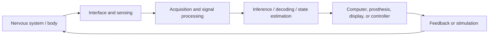
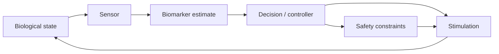

# NNE-0001 — What neurotechnology and neural engineering are actually studying

## If you landed here directly

You need no prior neuroscience, medicine, electronics, signal-processing, or machine-learning course.

This track starts from zero subject-specific knowledge.

The goal of this first lesson is not to make you memorize brain regions or device names.

It is to give you a **systems map** strong enough that every later detail has somewhere to attach.

By the end, you should be able to look at a neural technology and ask:

- What biological source or target is involved?
- Is the system observing, perturbing, restoring, rehabilitating, or augmenting?
- What physical interface connects the nervous system to the engineered system?
- What signal or energy crosses that interface?
- What computation happens after sensing or before stimulation?
- Is the system open-loop or closed-loop?
- What tradeoffs are being made in resolution, selectivity, invasiveness, bandwidth, stability, latency, safety, and usability?
- What human, clinical, regulatory, security, and ethical constraints are part of the design?

That set of questions is the foundation of the entire track.

---

## The problem worth understanding

A headline might say:

> “A brain implant reads thoughts.”

Another might say:

> “Electrical stimulation turns a brain region on.”

A third might say:

> “A BCI connects the brain directly to a computer.”

These phrases are memorable.

They are also dangerously imprecise.

A real neural technology is not a magical wire between “the brain” and “a computer.”

It is a chain of biological, physical, electronic, computational, behavioral, and human processes.

For a recording system, the chain may look like:

```text
neural activity
    ↓
physical field or chemical signal
    ↓
sensor / electrode / imaging mechanism
    ↓
analog front end or transduction
    ↓
sampling and digitization
    ↓
signal processing
    ↓
features or learned representation
    ↓
inference / decoder
    ↓
decision, display, prosthesis, or scientific interpretation
```

For a modulation system, information or energy travels in the other direction too:

```text
therapeutic or experimental objective
    ↓
controller / stimulation policy
    ↓
stimulator or actuator
    ↓
electric, magnetic, acoustic, optical, chemical, or mechanical interaction
    ↓
neural tissue
    ↓
physiological response
    ↓
behavior, symptom, biomarker, or measured neural change
```

A closed-loop system joins those chains.

Understanding **the whole loop** is what turns a collection of devices into neural engineering.

---

## Neurotechnology and neural engineering overlap, but they are not identical words

### Neurotechnology

In this track, **neurotechnology** means technologies used to:

- observe nervous-system structure or activity;
- measure physiological signals related to neural function;
- perturb or modulate neural activity;
- restore or replace lost neural or sensory-motor functions;
- support rehabilitation;
- interact with neural systems for research or clinical use;
- in some cases, augment interaction between nervous systems and machines.

This is intentionally broad.

NIH BRAIN research spans electrical, optical, magnetic, acoustic, molecular, genetic, imaging, computational, and integrated approaches.

So neurotechnology is much larger than electrodes.

It is also much larger than brain-computer interfaces.

### Neural engineering

**Neural engineering** is the engineering discipline that asks how such systems should be:

- modeled;
- measured;
- designed;
- built;
- tested;
- controlled;
- validated;
- translated;
- maintained;
- governed.

It sits at an intersection of:

- neuroscience;
- physiology;
- biomedical engineering;
- electrical engineering;
- materials science;
- signal processing;
- control;
- computation;
- statistics and machine learning;
- robotics and prosthetics;
- clinical science;
- human factors;
- regulatory science;
- ethics.

The word *engineering* matters because performance is never the only constraint.

A system that produces an impressive laboratory signal but is unsafe, unstable, unusable, impossible to manufacture, or impossible to validate is not a successful neural-engineering system.

---

## The nervous system is the system of interest, not merely the brain

A common beginner error is to reduce neurotechnology to the brain.

The nervous system includes the central and peripheral nervous systems.

At a very high level:

```text
nervous system
├── central nervous system
│   ├── brain
│   └── spinal cord
└── peripheral nervous system
    ├── sensory pathways
    ├── motor pathways
    └── autonomic pathways
```

Neural engineering therefore includes interfaces with:

- cortex;
- deep brain structures;
- spinal cord;
- cranial nerves;
- peripheral nerves;
- neuromuscular systems;
- sensory organs and pathways.

This matters because different locations create different engineering opportunities and constraints.

A cortical microelectrode array, a cochlear implant, a vagus-nerve stimulator, a spinal interface, and a scalp EEG system are all neurotechnologies.

They do not interact with the same tissue in the same way.

---

## Neural systems are multiscale

A nervous system can be described at many scales:

```text
ions and channels
        ↓
cell membrane
        ↓
single neuron
        ↓
synapse
        ↓
local population
        ↓
circuit
        ↓
brain or spinal system
        ↓
body
        ↓
behavior
        ↓
person in an environment
```

No single scale is “the real one.”

The useful scale depends on the question.

If you are designing a patch-clamp experiment, membrane currents may be central.

If you are designing an EEG interface, population activity and volume conduction matter.

If you are evaluating an assistive BCI, the final outcome may be communication rate, independence, fatigue, reliability, and usability.

A core skill in neural engineering is choosing the right system boundary.

---

## Neural activity is not one kind of signal

The phrase **neural signal** can refer to very different physical quantities.

Examples include:

- transmembrane voltage;
- action potentials;
- extracellular voltage;
- local field potentials;
- population rhythms;
- magnetic fields generated by electrical currents;
- neurotransmitter concentrations;
- calcium-dependent optical signals;
- blood-oxygenation changes associated with neural activity;
- muscle activity driven by neural commands.

These signals differ in:

- origin;
- spatial scale;
- temporal scale;
- measurement mechanism;
- directness;
- noise;
- delay;
- interpretation.

So asking:

> “Which device reads neural activity best?”

is incomplete.

You must first ask:

> “Which neural activity, at what scale, for which purpose?”

---

## Measurement is not direct access to a thought

Every neural measurement is mediated.

A sensor responds to some physical or chemical quantity.

That quantity is transformed by:

- tissue;
- geometry;
- distance;
- conductivity;
- sensor properties;
- electronics;
- sampling;
- noise;
- artifacts;
- processing.

Then a model or human interprets the measurement.

A more honest conceptual chain is:

```text
underlying neural process
        ↓
measurable physical consequence
        ↓
interface
        ↓
recorded signal
        ↓
processed data
        ↓
inference
```

The recorded signal is not identical to the biological process.

And the biological process is not automatically identical to a mental state.

This distinction will protect you from many exaggerated claims about neurotechnology.

---

## The four broad objectives

A useful first classification is to ask what the technology is trying to do.

### 1. Record or observe

Examples:

- EEG;
- intracranial recordings;
- microelectrode arrays;
- optical neural recordings;
- MEG;
- fMRI.

Goal:

> obtain information about nervous-system structure, physiology, or activity.

### 2. Modulate or perturb

Examples:

- deep brain stimulation;
- spinal cord stimulation;
- peripheral nerve stimulation;
- transcranial magnetic stimulation;
- focused ultrasound;
- optogenetic perturbation in research.

Goal:

> intentionally alter activity in a target system.

### 3. Restore or replace function

Examples:

- cochlear implants;
- motor BCIs controlling assistive devices;
- neural prostheses providing sensory feedback;
- stimulation systems restoring movement in selected contexts.

Goal:

> replace, bypass, supplement, or restore a function that has been lost or impaired.

### 4. Augment interaction or capability

Some systems are proposed not only to restore lost function but to extend human-machine interaction beyond ordinary biological outputs.

That goal raises distinct:

- design;
- safety;
- social;
- ethical;
- governance

questions.

Do not silently treat therapy and enhancement as the same objective.

---

## These categories can overlap

A closed-loop therapeutic device may:

1. record a neural or physiological signal;
2. infer a relevant state;
3. stimulate;
4. record the response;
5. adapt future stimulation.

So one device can be both:

- a recording technology;
- a modulation technology;
- a therapeutic system;
- a closed-loop controller.

Categories help us analyze systems.

They are not rigid boxes.

---

## The reusable neural-interface loop

A powerful mental model for this entire track is:



Not every system contains every block.

But when you encounter a new neurotechnology, try placing each component in this loop.

If a block is missing, ask whether it is truly absent or merely hidden inside another subsystem.

---

## Read path and write path

Engineers sometimes informally describe neural interfaces as having:

- a **read path**;
- a **write path**.

The terminology is useful if used carefully.

### Read path

```text
nervous system
→ sensor
→ acquisition
→ processing
→ inference
```

Examples:

- EEG classification;
- spike-based motor decoding;
- neural biomarker estimation.

### Write path

```text
desired intervention
→ controller
→ stimulator
→ physical interaction
→ nervous system
```

Examples:

- electrical stimulation;
- magnetic stimulation;
- sensory feedback through a neural prosthesis.

But neural tissue is not computer memory.

“Read” and “write” are engineering shorthand.

They must not be interpreted as literal digital access to thoughts or memories.

---

## Example NNE-EX-001 — EEG versus intracortical recording

Imagine one goal:

> infer intended hand movement.

Two candidate interfaces are:

- scalp EEG;
- an intracortical microelectrode array.

A beginner might ask:

> “Which is better?”

A neural engineer asks a different set of questions.

| Property | Scalp EEG | Intracortical array |
|---|---|---|
| Invasiveness | noninvasive | invasive |
| Distance from neuronal sources | larger | much smaller |
| Spatial specificity | relatively coarse | much finer locally |
| Access to individual spikes | generally no | possible |
| Surgical burden | none | substantial |
| Chronic tissue/device concerns | limited at brain interface | central design issue |
| Setup burden | electrodes/cap and preparation | implanted hardware plus external/implanted system |
| Signal stability challenge | placement/artifact/state dependent | biology, micromotion, materials, electronics, drift |
| Use context | research/clinical/consumer contexts vary | specialized research/clinical contexts |

Neither technology is universally superior.

The correct choice depends on the objective and constraints.

This is the first major lesson in neurotechnology:

> **performance exists inside a tradeoff space.**

---

## Spatial resolution is not the only resolution

“Higher resolution” can mean several different things.

### Spatial resolution

How finely can the system distinguish different locations or sources?

### Temporal resolution

How quickly can the system distinguish changes over time?

### Cellular selectivity

Can the measurement or intervention distinguish individual cells or cell types?

### Functional selectivity

Can it isolate a functionally relevant pathway or population?

### Spectral resolution

Can it distinguish frequency content over a useful time window?

A technology can be strong on one axis and weak on another.

There is no single scalar called “resolution.”

---

## Bandwidth is not the same as information

A recording system may sample rapidly and produce enormous data volume.

That does not guarantee enormous useful information.

Data can include:

- redundant channels;
- correlated activity;
- noise;
- artifacts;
- irrelevant variability;
- unstable features.

Conversely, a low-bandwidth signal may be highly useful if it contains a reliable task-relevant feature.

Later lessons will distinguish:

- physical bandwidth;
- sampled data rate;
- signal-to-noise ratio;
- decodable information;
- task performance.

---

## Invasiveness is a spectrum

“Invasive” and “noninvasive” are useful labels, but real systems occupy a spectrum.

Examples may include:

- sensors outside the body;
- sensors on the skin or scalp;
- implanted peripheral interfaces;
- electrodes on the cortical surface;
- depth electrodes;
- penetrating microelectrode arrays.

As the interface moves closer to neural sources, some signal properties can improve.

But other burdens can increase:

- surgical risk;
- infection risk;
- tissue response;
- device failure modes;
- packaging challenges;
- chronic stability requirements;
- regulatory burden.

Closer is not automatically better.

---

## Example NNE-EX-002 — an assistive motor BCI is a system, not a decoder

Suppose a person intends to move a cursor using neural activity.

A simplified system might be:

```text
motor-related neural activity
        ↓
neural sensor
        ↓
analog front end
        ↓
digitized channels
        ↓
artifact handling / preprocessing
        ↓
decoder
        ↓
cursor command
        ↓
visual feedback
        ↓
user adapts strategy
        ↓
neural activity changes
```

Notice the final arrow.

The user is part of the adaptive loop.

If performance changes over time, the cause may involve:

- biological state;
- attention;
- fatigue;
- sensor drift;
- tissue-interface change;
- signal-processing change;
- decoder drift;
- feedback design;
- user learning.

Calling the decoder “the BCI” hides most of the engineering problem.

---

## Decoding does not mean mind reading

A decoder maps measured features to an estimated variable.

For example:

```text
neural features
→ estimated cursor velocity
```

or:

```text
EEG features
→ estimated selection class
```

The decoder succeeds only relative to:

- a defined task;
- a measurement modality;
- training data;
- labels or objective;
- assumptions;
- evaluation criteria.

It does not imply universal access to a person's private mental content.

A model that decodes one constrained variable in one experimental setting does not thereby decode arbitrary thoughts.

---

## Encoding is the reverse modeling question

If decoding asks:

> “Given neural activity, what external or internal variable can we estimate?”

encoding asks:

> “Given a stimulus, action, or state, what neural response should we expect?”

Both directions matter.

In sensory neuroprosthetics, for example, the engineering problem is not only to record the nervous system.

It may also require transforming external information into stimulation patterns that the nervous system can use.

---

## Example NNE-EX-003 — a cochlear implant is not simply a louder hearing aid

A hearing aid primarily amplifies acoustic sound for a functioning auditory pathway.

A cochlear implant uses a different system concept.

At a high level:

```text
sound
→ microphone
→ signal processing
→ encoded stimulation pattern
→ implanted electrode array
→ auditory nerve activation
→ nervous-system processing
→ perception
```

This is a sensory neuroprosthesis.

The engineering challenge is not merely:

> “make sound stronger.”

It is:

> transform environmental information into a form that can interact meaningfully with the remaining neural pathway.

That is an **encoding** problem as well as a device problem.

---

## Modulation is not an on-off switch for a brain region

Electrical, magnetic, acoustic, optical, or chemical intervention interacts with:

- cells;
- axons;
- synapses;
- circuits;
- network state;
- ongoing activity.

The resulting effect can depend on:

- target anatomy;
- field distribution;
- cell orientation;
- timing;
- state;
- adaptation;
- plasticity;
- dose history;
- surrounding pathways.

So avoid simplistic language such as:

> “stimulation activates area X.”

A better engineering question is:

> “What physical interaction occurs, which neural elements are affected, and how does that perturbation propagate through the system?”

---

## Open-loop versus closed-loop

### Open-loop system

An open-loop system applies an intervention without using contemporaneous measured output to adjust that intervention.

Conceptually:

```text
planned input
→ nervous system
→ response
```

### Closed-loop system

A closed-loop system measures something about the system and uses that information to adapt the next action.

```text
measure
→ estimate state
→ decide
→ intervene
→ measure again
```

Closed-loop operation can improve specificity or adaptation.

It also introduces new failure modes:

- incorrect biomarkers;
- sensor faults;
- latency;
- unstable control;
- model drift;
- unsafe adaptation;
- software errors;
- adversarial or cybersecurity risks.

“Closed loop” is not automatically better.

It is a more complex system architecture.

---

## Example NNE-EX-004 — closed-loop neuromodulation

Imagine a therapeutic system that monitors a physiological biomarker and adjusts stimulation.

The useful abstraction is:



The important engineering questions include:

- Is the biomarker valid?
- How noisy is the measurement?
- How much delay exists?
- Can the state drift?
- What happens when the sensor fails?
- Can the controller become unstable?
- What hard safety limits exist outside the adaptive algorithm?
- How is the system validated?

The intelligence of the algorithm is only one part of the design.

---

## The interface is both electrical and biological

For implanted devices, an electrode or sensor is not floating in an ideal circuit diagram.

It contacts living tissue.

That means performance can change because of:

- proteins;
- cells;
- inflammation;
- scar-like tissue responses;
- micromotion;
- corrosion;
- insulation damage;
- mechanical mismatch;
- encapsulation;
- electrode impedance changes.

This is why neural engineering must include:

- materials science;
- biomechanics;
- electrochemistry;
- tissue biology;
- reliability engineering.

A high-performance day-one interface can become a poor chronic interface.

---

## Stability is a first-class performance metric

A neural interface is not successful merely because it works once.

Depending on the application, we may care about stability over:

- minutes;
- hours;
- days;
- months;
- years.

Long-term stability can involve:

- signal amplitude;
- electrode impedance;
- decoder performance;
- stimulation threshold;
- tissue health;
- mechanical integrity;
- battery or power system;
- connectors;
- packaging;
- software;
- calibration burden.

For clinical implants, chronic performance is not a detail.

It is part of the product.

---

## Safety is not one number

Safety may include:

- tissue injury;
- electrical safety;
- thermal effects;
- unintended stimulation;
- mechanical injury;
- infection;
- material toxicity;
- MRI interaction;
- electromagnetic interference;
- software failure;
- wireless failure;
- cybersecurity;
- behavioral consequences;
- psychological effects;
- loss of function if the device fails.

This is why neural-device safety cannot be reduced to one stimulation amplitude or one laboratory test.

---

## Clinical neurotechnology is not DIY electronics

This track explains mechanisms and engineering principles.

It does **not** provide:

- self-experimentation protocols;
- implantation instructions;
- surgical procedures;
- individualized stimulation settings;
- treatment recommendations;
- instructions for bypassing clinical or regulatory oversight.

Human neural stimulation and implanted interfaces can create serious risks.

Clinical and experimental work requires appropriate professional, institutional, ethical, and regulatory oversight.

Understanding a system is not permission to use it on a person.

---

## Example NNE-EX-005 — classify the objective before judging the technology

Consider five systems:

1. scalp EEG used to study sleep;
2. deep brain stimulation used therapeutically;
3. a cochlear implant;
4. a motor BCI controlling a robotic device;
5. a research platform that records neural activity and delivers stimulation.

A useful classification is:

| System | Primary role |
|---|---|
| EEG sleep study | recording / observation |
| therapeutic DBS | modulation / therapy |
| cochlear implant | sensory restoration / encoding |
| motor BCI | recording + decoding + assistive output |
| record-and-stimulate research platform | bidirectional observation + perturbation |

But the classifications can overlap.

A research platform may later become therapeutic.

A therapeutic system may also record biomarkers.

The purpose of classification is to expose the system architecture.

---

## A device is not the same as a therapy

An electrode, stimulator, imaging scanner, decoder, or implant is a technology component.

A therapy includes a broader context:

- indication;
- patient selection;
- implantation or use procedure;
- programming;
- follow-up;
- outcome measurement;
- risk management;
- clinical workflow;
- training;
- failure handling.

A technically impressive device can fail as a therapy if the broader system fails.

---

## A laboratory metric is not the same as a human outcome

Suppose a BCI classifier reaches high offline accuracy.

That is useful information.

It does not automatically tell you:

- whether the system works online;
- whether it works for months;
- whether calibration is tolerable;
- whether the user is fatigued;
- whether communication is fast enough to matter;
- whether errors are safe;
- whether the user prefers it to alternatives;
- whether the system improves independence or quality of life.

Engineering evaluation must match the actual objective.

---

## The main tradeoff space

A neural technology can be described along several coupled axes.

| Axis | Question |
|---|---|
| Spatial resolution | How finely can sources or targets be distinguished? |
| Temporal resolution | How quickly can changes be observed or influenced? |
| Selectivity | Which cells, fibers, pathways, or functions are affected? |
| Bandwidth | How much physical signal can the system capture or deliver? |
| Signal-to-noise ratio | How distinguishable is the desired signal from noise and artifacts? |
| Invasiveness | What tissue or procedural burden is required? |
| Chronic stability | Does performance remain usable over time? |
| Latency | How long from event to estimate or intervention? |
| Power and heat | What energy budget and thermal burden exist? |
| Safety | What biological, electrical, mechanical, software, and system hazards exist? |
| Calibration | How much setup or repeated adaptation is needed? |
| Usability | Can the intended person actually use the system in context? |
| Manufacturability | Can it be built reproducibly? |
| Regulatory burden | What evidence and controls are required? |
| Privacy and security | What sensitive data or control channels are exposed? |
| Equity and access | Who can benefit, and who may be excluded? |

There is no universally optimal corner.

The design objective determines which compromises are acceptable.

---

## Resolution versus coverage

High spatial resolution can come with narrow coverage.

For example, a local invasive recording may provide detailed information from a small region.

A whole-head noninvasive modality may provide much broader coverage but weaker local specificity.

So ask separately:

- how fine is the measurement?
- how much of the system does it cover?

These are different properties.

---

## Selectivity versus invasiveness

A more targeted interface may require:

- closer proximity;
- implantation;
- surgical access;
- more complex geometry.

But invasive access also creates additional safety and reliability constraints.

The tradeoff cannot be evaluated from signal quality alone.

---

## Performance versus stability

A complex high-dimensional decoder may outperform a simple model on one dataset.

But a clinically useful interface may value:

- robustness;
- low calibration burden;
- interpretability;
- predictable failure;
- low compute;
- low power;
- stable performance

more than a small offline accuracy improvement.

A neural engineer must optimize the **system objective**, not a benchmark in isolation.

---

## The human is inside the system boundary

Many engineering diagrams stop at:

```text
device output
```

That is often too early.

For assistive and therapeutic technology, the real loop may include:

```text
device
→ perception
→ action
→ learning
→ adaptation
→ behavior
→ new neural state
```

People adapt to interfaces.

Interfaces can also adapt to people.

This co-adaptation can be useful.

It can also make evaluation harder.

A person's nervous system is not a stationary signal generator.

---

## Plasticity changes the problem

The nervous system can change with:

- learning;
- injury;
- rehabilitation;
- repeated stimulation;
- disease;
- development;
- experience.

That means the interface can alter the system it is trying to measure or control.

This is fundamentally different from many ordinary sensors.

Later lessons will treat nonstationarity and plasticity as central engineering issues.

---

## Neural meaning depends on context

The same recorded feature may change with:

- behavior;
- task;
- attention;
- posture;
- medication;
- sleep;
- fatigue;
- learning;
- disease state;
- electrode position;
- time since implantation.

A useful decoder is therefore not merely a function of signal amplitude.

It is a model embedded in context.

---

## “More channels” is not automatically “more knowledge”

High-channel-count recording can produce enormous datasets.

But useful information depends on:

- signal quality;
- coverage;
- redundancy;
- stability;
- behavioral alignment;
- metadata;
- artifact control;
- statistical power;
- analysis quality;
- validation.

A thousand noisy or redundant channels do not guarantee a better scientific answer than a smaller well-designed experiment.

---

## Neural data are especially sensitive data

Neural and neurobehavioral datasets may contain information about:

- health;
- disability;
- behavior;
- task performance;
- movement;
- communication;
- cognitive state;
- treatment response.

Future systems may infer additional attributes.

So privacy cannot be an afterthought.

A mature neurotechnology curriculum must ask:

- What is collected?
- What can be inferred?
- Who stores it?
- Who can access it?
- Can the system be attacked?
- Can neural-device control be manipulated?
- What happens when software support ends?

Cybersecurity and privacy are part of system safety.

---

## Neuroethics belongs in the engineering loop

Neurotechnology can affect unusually intimate domains:

- agency;
- autonomy;
- communication;
- identity;
- behavior;
- privacy;
- responsibility.

A technically valid system may still raise difficult questions.

Examples:

- Who controls adaptive settings?
- What constitutes meaningful informed consent for a rapidly evolving implant?
- Who owns or governs neural data?
- How should risk be evaluated when a device restores a critical function?
- How should devices be supported after a trial ends?
- How should enhancement differ from treatment?
- How do we prevent access from being limited to a narrow population?

These are not decorations around the engineering.

They shape requirements.

NIH BRAIN explicitly treats neuroethics as part of responsible neurotechnology development.

---

## “Brain reading” and “brain writing” are shorthand, not literal descriptions

You will encounter phrases such as:

- read from the brain;
- write to the brain;
- decode intention;
- encode sensation.

These phrases can be useful.

But each must be expanded into a real mechanism.

For “read”:

> Which biological variable produces which measurable signal through which interface, and what inference is trained or justified from it?

For “write”:

> Which physical input interacts with which neural elements, and what evidence connects that interaction to the claimed effect?

If a claim cannot answer those questions, it is not yet engineering-grade.

---

## The same behavior can be approached through different interfaces

Suppose the goal is restoring communication.

Possible approaches might involve:

- residual muscle activity;
- eye movement;
- scalp EEG;
- ECoG;
- intracortical recording.

A neural interface is not automatically the best solution merely because it is more direct or more invasive.

A good engineering comparison asks:

> Which complete system best serves the user under the real constraints?

Sometimes the best neurotechnology solution may be to avoid unnecessary neural intervention.

---

## Why models matter

Neural engineering repeatedly builds models of:

- membrane currents;
- electric fields;
- electrode impedance;
- volume conduction;
- neural encoding;
- decoding;
- tissue response;
- control dynamics;
- battery life;
- heat;
- failure probability;
- clinical outcome.

Models let us reason beyond trial-and-error.

But a model is only useful within its assumptions.

Later lessons will repeatedly ask:

> What did this model leave out?

---

## Why experiments matter

Neural systems are too complex for theory alone.

Experiments are needed to determine:

- whether a signal exists;
- whether it is stable;
- whether stimulation has the intended effect;
- whether a decoder generalizes;
- whether tissue tolerates an interface;
- whether a person can use the system;
- whether a clinical outcome improves.

Engineering in this field is a cycle:

```text
model
→ design
→ build
→ measure
→ compare with prediction
→ revise
```

This is why reproducibility and experimental design are part of the curriculum.

---

## Research tool versus clinical device

A research tool and a clinical device can use similar physical principles.

But their requirements can differ dramatically.

A laboratory prototype may tolerate:

- skilled operators;
- external cables;
- frequent recalibration;
- short sessions;
- experimental failure.

A chronic clinical device may require:

- predictable behavior;
- long-term reliability;
- safe failure modes;
- usability;
- validated manufacturing;
- regulatory evidence;
- support over years.

Translation is not just shrinking the prototype.

It changes the engineering problem.

---

## The field has many successful technologies, but no universal neural interface

Examples of mature or clinically important neurotechnologies include:

- cochlear implants;
- deep brain stimulation systems;
- spinal cord stimulation;
- peripheral nerve stimulation;
- EEG and intracranial monitoring systems.

Other areas remain active research frontiers.

The correct attitude is neither:

> “neurotechnology can already read and write the brain”

nor:

> “nothing works.”

The field contains technologies at very different levels of maturity.

We will keep evidence and maturity separate from hype.

---

## A useful first-pass taxonomy

When you meet an unfamiliar neurotechnology, classify it along these axes.

### Biological location

- brain;
- spinal cord;
- peripheral nerve;
- sensory organ;
- muscle or neuromuscular pathway.

### Direction

- recording;
- stimulation;
- bidirectional.

### Invasiveness

- noninvasive;
- minimally invasive;
- implanted;
- penetrating.

### Modality

- electrical;
- magnetic;
- optical;
- acoustic;
- chemical or molecular;
- imaging/hemodynamic;
- multimodal.

### Purpose

- basic research;
- diagnosis or monitoring;
- therapy;
- restoration;
- rehabilitation;
- assistance;
- augmentation.

### Loop architecture

- open loop;
- closed loop;
- adaptive / learning.

This taxonomy does not replace detailed analysis.

It gives you a starting coordinate system.

---

## What the track will deliberately avoid

This track will not teach neurotechnology as a list of product names.

It will not equate:

- neural signal with thought;
- correlation with mechanism;
- decoder accuracy with clinical benefit;
- higher channel count with better science;
- higher invasiveness with better interface;
- stimulation with deterministic control;
- AI with understanding;
- regulatory clearance with universal effectiveness;
- a published paper with a settled result.

Instead, it will repeatedly return to:

- source;
- interface;
- measurement;
- model;
- intervention;
- evidence;
- constraints;
- human outcome.

---

## The curriculum map

The track is organized as a long dependency graph rather than a short survey.

### Foundation layer

You will learn:

- nervous-system organization;
- neurons and glia;
- membrane potentials;
- action potentials;
- synapses;
- neural populations;
- major neural-signal classes.

### Measurement layer

You will learn:

- electrode-tissue interfaces;
- intracellular and extracellular recording;
- EEG, ECoG, MEG, fMRI, optical methods;
- sampling;
- instrumentation;
- noise;
- artifacts;
- filtering;
- spectral analysis.

### Computation layer

You will learn:

- neural datasets;
- tuning;
- population coding;
- decoding;
- encoding;
- machine learning;
- temporal models;
- drift;
- calibration;
- evaluation.

### Modulation and interface layer

You will learn:

- electrical stimulation;
- DBS;
- spinal and peripheral stimulation;
- TMS;
- transcranial electrical stimulation;
- ultrasound;
- optogenetic and molecular approaches;
- neuroprosthetics;
- invasive and noninvasive BCI;
- bidirectional and closed-loop systems.

### Device and tissue layer

You will learn:

- biomaterials;
- tissue response;
- flexible electrodes;
- packaging;
- corrosion;
- power;
- telemetry;
- ASICs;
- thermal and MRI safety;
- peripheral interfaces;
- neural tissue engineering.

### Translation and governance layer

You will learn:

- intended use;
- risk-benefit;
- verification and validation;
- preclinical evidence;
- clinical studies;
- FDA pathways;
- human factors;
- cybersecurity;
- neuroethics;
- equity;
- data governance.

### Research layer

You will learn to:

- integrate modalities;
- reason about closed-loop control;
- evaluate advanced models;
- read papers critically;
- reproduce results;
- design conceptual systems;
- formulate research questions;
- refresh the frontier from current evidence.

This is why the first lesson is a map.

Every later lesson should connect back to it.

---

## Common failure mode: start with “Which BCI is best?”

A BCI is not one device class with one quality score.

Different systems optimize different objectives.

Before comparing them, define:

- intended user;
- target task;
- recording modality;
- invasiveness constraint;
- setup time;
- information rate;
- error cost;
- chronic stability;
- calibration;
- portability;
- power;
- safety;
- clinical workflow.

Without the objective, “best” has no engineering meaning.

---

## Common failure mode: confuse neuroscience observation with causal intervention

Recording that signal $X$ changes before behavior $Y$ does not prove that $X$ causes $Y$.

Likewise, stimulating a region and observing a behavioral change does not automatically identify a single mechanism.

Neural circuits are interconnected.

Later lessons will separate:

- observation;
- prediction;
- intervention;
- causal inference.

---

## Common failure mode: treat a classifier as the whole neural interface

A classifier is one computational block.

The complete interface includes:

- biology;
- sensor;
- acquisition;
- processing;
- model;
- output;
- feedback;
- user;
- hardware;
- failure modes.

A 99% classifier can live inside a poor system.

---

## Common failure mode: treat “noninvasive” as “risk-free”

Noninvasive means no surgical penetration of tissue.

It does not mean:

- no physiological effect;
- no contraindications;
- no discomfort;
- no data privacy risk;
- no interpretive error;
- no misuse.

Risk must be evaluated for the actual technology and context.

---

## Common failure mode: treat “invasive” as “unacceptable”

Invasive devices can create substantial risks and burdens.

They can also provide meaningful benefit in selected clinical contexts.

The correct question is not whether invasiveness is morally or technically bad in the abstract.

It is whether the expected benefit, alternatives, evidence, safety controls, user preferences, and long-term obligations justify the intervention.

That is a risk-benefit problem.

---

## Common failure mode: optimize the algorithm while ignoring the interface

A model cannot recover information that the measurement never captured reliably.

Improving:

- electrode design;
- placement;
- referencing;
- noise control;
- behavioral paradigm;
- calibration

may matter more than choosing a more complex decoder.

Neural engineering is not machine learning applied after the fact.

---

## Common failure mode: ignore the user after deployment

A system that works only under ideal laboratory supervision may not work in daily life.

Real use introduces:

- movement;
- fatigue;
- changing environments;
- maintenance;
- charging;
- caregiver interaction;
- setup time;
- social acceptability;
- failure recovery.

Human factors are system requirements.

---

## Active work

### Exercise 1 — identify the system boundary

For a scalp EEG system used to select one of four on-screen commands, list:

1. biological source;
2. physical signal at the sensor;
3. interface;
4. acquisition step;
5. computational step;
6. output;
7. feedback to the user.

Do not call the entire chain “the AI.”

### Exercise 2 — compare two interfaces

You must infer intended hand movement.

Compare:

- scalp EEG;
- an implanted intracortical array.

Use at least six axes from the tradeoff table.

Do not choose a winner until you define the application.

### Exercise 3 — classify objectives

Classify each system primarily as recording, modulation, restoration, rehabilitation, augmentation, or a combination:

- a sleep EEG;
- deep brain stimulation;
- a cochlear implant;
- an intracortical cursor BCI;
- a closed-loop seizure-responsive system.

Explain overlaps.

### Exercise 4 — direct versus indirect measurement

Why is fMRI not a direct recording of neuronal membrane voltage?

What chain of inference separates the biological event from the measured quantity?

### Exercise 5 — closed loop

Draw a five-block closed-loop neural system containing:

- nervous system;
- sensor;
- state estimate;
- controller;
- stimulation or output.

Then name one failure mode for each block.

### Exercise 6 — hype audit

Rewrite this sentence in engineering-grade language:

> “The implant reads the user's thoughts and sends them to a computer.”

Your rewrite must specify:

- measured signal;
- task;
- decoder output;
- uncertainty;
- system limitations.

### Exercise 7 — choose the metric

A laboratory reports very high offline classification accuracy.

List at least five additional metrics or observations you would want before deciding whether the interface is useful to a person in daily life.

### Exercise 8 — ethics as requirement

Choose one neurotechnology and write one technical requirement that follows from each of these concerns:

- privacy;
- cybersecurity;
- informed consent;
- accessibility.

The point is to turn values into engineering constraints.

---

## Retrieval check

Without looking back:

1. What is the difference in emphasis between neurotechnology and neural engineering?
2. Why does this track include the peripheral nervous system?
3. Name four different physical or physiological quantities that can serve as neural signals.
4. Why is a recorded signal not identical to the underlying neural process?
5. What are the four broad objectives introduced in this lesson?
6. What is the reusable neural-interface loop?
7. What is the difference between a read path and a write path?
8. Why is a decoder not equivalent to mind reading?
9. Why is a cochlear implant an encoding system?
10. What distinguishes open-loop from closed-loop operation?
11. Why is closed-loop operation not automatically better?
12. Name six axes in the neurotechnology tradeoff space.
13. Why is invasiveness a tradeoff rather than a quality score?
14. Why can high channel count fail to produce useful knowledge?
15. Why is chronic stability a first-class metric?
16. Why is the human user inside the system boundary?
17. Why can nervous-system plasticity make interface evaluation difficult?
18. Why are privacy and cybersecurity part of device safety?
19. Why does neuroethics belong in requirements engineering?
20. What five questions should every advanced lesson in this track eventually answer?

---

## Connections

### Forward: NNE-N-0002

The next canonical lesson is:

`NNE-N-0002 — A map of the nervous system: CNS, PNS, cells, circuits, and behavior`.

This first lesson deliberately used nervous-system terms without trying to teach their anatomy in detail.

The next lesson builds that biological map.

### Forward: recording

Later recording lessons will unpack the left side of the interface loop:

```text
neural source
→ tissue
→ sensor
→ electronics
→ digitized data
```

### Forward: decoding and encoding

The computation layer will unpack:

```text
data
→ representation
→ model
→ estimate or command
```

and the reverse problem:

```text
desired sensation or response
→ encoded intervention
→ nervous system
```

### Forward: stimulation and closed-loop control

Modulation lessons will unpack:

```text
controller
→ actuator
→ physical field or interaction
→ neural elements
→ network response
```

### Forward: implants and translation

Device-engineering lessons will add the constraints that are invisible in simple block diagrams:

- tissue reaction;
- materials;
- packaging;
- power;
- telemetry;
- reliability;
- manufacturing;
- safety;
- regulation.

### Forward: neuroethics

Human-system lessons will ask what happens when technology can:

- infer sensitive states;
- alter neural activity;
- mediate communication;
- restore a critical function;
- adapt autonomously.

Those questions belong to the engineering architecture from the beginning.

### Cross-track: Linear Algebra

Advanced neural decoding and population analysis will use vectors, matrices, dimensionality reduction, and inverse problems.

### Cross-track: Electrical Engineering — Power Engineering

Instrumentation, fields, circuits, power, noise, and electromagnetic compatibility share electrical-engineering foundations, although neural interfaces operate at different scales and constraints.

### Cross-track: Large Language Models

Modern neural-data systems may use machine learning and foundation-model ideas.

The shared computation does not make neural signals equivalent to language tokens.

Biological measurement assumptions remain central.

### Cross-track: Philosophy and Logic

Later neuroethics work benefits from precise argument analysis when discussing:

- agency;
- autonomy;
- identity;
- consent;
- enhancement;
- responsibility.

---

## What this unlocks

You should now be able to:

- explain why neurotechnology is broader than BCI;
- explain why neural engineering is more than signal processing;
- locate brain, spinal, peripheral, and sensory interfaces inside one field;
- distinguish recording, modulation, restoration, rehabilitation, and augmentation goals;
- trace a neural-interface system from biology through interface and computation to human outcome;
- distinguish a measured neural signal from an inferred mental or behavioral variable;
- explain open-loop and closed-loop architectures;
- compare technologies using a multidimensional tradeoff space;
- recognize chronic stability, safety, human factors, privacy, security, and ethics as engineering constraints;
- avoid common hype such as “reading thoughts” or “turning a brain region on” without a mechanism;
- understand why the next lessons begin with nervous-system biology before advanced devices or AI.

---

## References

- **NNE-REF-001** — University of Illinois Urbana-Champaign, `NE 100 — Introduction to Neural Engineering`.
- **NNE-REF-002** — University of Illinois Urbana-Champaign, `Neural Engineering, BS`.
- **NNE-REF-003** — NIH BRAIN Initiative, `About the BRAIN Initiative`.
- **NNE-REF-004** — NIH BRAIN Initiative, `Neural Recording and Modulation`.
- **NNE-REF-005** — NIH BRAIN Initiative, `BRAIN 2025: A Scientific Vision`.
- **NNE-REF-007** — U.S. FDA, `Neurological Devices`.
- **NNE-REF-009** — NIH BRAIN Initiative, `BRAIN 2.0 Neuroethics`.
- **NNE-REF-010** — Wolpaw, Millán, and Ramsey, `Brain-computer interfaces: Definitions and principles`.
