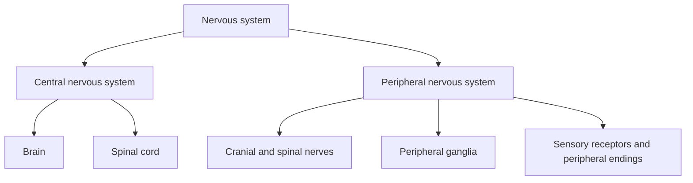
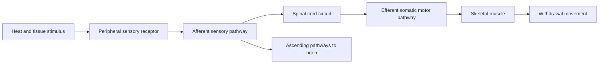
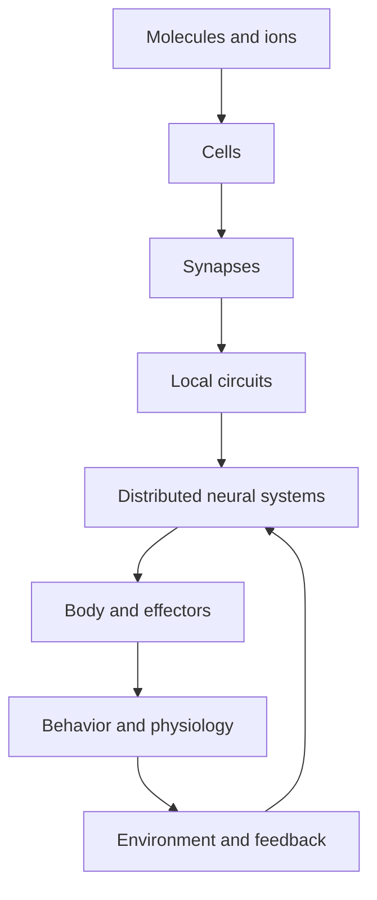

# NNE-0002 — A map of the nervous system: CNS, PNS, cells, circuits, and behavior

## If you landed here directly

You do not need prior anatomy, physiology, medicine, electronics, or neuroscience.

You should know only the main idea from NNE-0001:

> A neurotechnology is a system that interacts with a nervous system through some biological and physical interface.

This lesson gives that nervous system a map.

The goal is **not** to memorize every brain region, cranial nerve, spinal segment, or anatomical label.

The goal is to build a map that answers engineering questions such as:

- Is the target in the brain, spinal cord, peripheral nerve, sensory organ, muscle, or autonomic pathway?
- Is information traveling toward the central nervous system or away from it?
- Is a response somatic, autonomic, enteric, or some combination?
- Is the relevant unit a cell, a bundle of axons, a local circuit, a distributed system, or whole behavior?
- Where could a sensor or stimulator physically interface with the pathway?
- What information is lost, mixed, delayed, transformed, or integrated between the biological source and the final behavior?

By the end, you should be able to draw a useful nervous-system map from memory and place common neural interfaces on it.

---

## The problem worth understanding

Suppose someone says:

> “The brain sends a signal to the hand.”

That sentence is not completely wrong.

But it hides almost everything an engineer needs.

Which part of the brain?

Through which descending pathway?

Through which level of the spinal cord?

Through which peripheral nerve?

Through which motor axons?

To which muscles?

What sensory feedback returns?

What local spinal circuits participate?

What happens if an interface is placed at the cortex instead of the spinal cord, peripheral nerve, or muscle?

A more useful systems view looks like:

```text
distributed brain activity
        ↓
descending CNS pathways
        ↓
spinal circuits
        ↓
peripheral motor pathways
        ↓
neuromuscular junctions
        ↓
muscle force
        ↓
movement
        ↓
sensory consequences
        ↓
peripheral sensory pathways
        ↓
spinal cord and brain
```

The nervous system is not a single wire from a command center to the body.

It is a distributed, recurrent, multiscale network.

That distinction is foundational for neural engineering.

---

## First map: central versus peripheral nervous system

The most basic anatomical division is:



At L0, this is the first map to remember.

The Mermaid diagram above is a categorical map. The static figure below adds the anatomical spatial anchor: the **CNS is physically concentrated in the brain and spinal cord**, while peripheral nerves extend through the body.


*Visual anchor — overview of the human central and peripheral nervous systems. Use it to locate brain, spinal cord, and the body-wide peripheral nerve distribution; it is not a complete atlas of named nerves. Source: [Wikimedia Commons — 1201 Overview of Nervous System.jpg](https://commons.wikimedia.org/wiki/File:1201_Overview_of_Nervous_System.jpg), OpenStax, from* Anatomy and Physiology *version 8.25; CC BY 4.0. Registry: `NNE-REF-067`.*

### Central nervous system

The **central nervous system**, or **CNS**, consists of:

- the brain;
- the spinal cord.

The CNS contains enormous amounts of:

- neural integration;
- local computation;
- long-range communication;
- sensory processing;
- motor planning and control;
- homeostatic regulation;
- memory and learning;
- coordination.

But do not translate that into:

> “The brain does the thinking and the spinal cord is a cable.”

The spinal cord contains active circuits and can organize important responses locally.

We will return to that soon.

### Peripheral nervous system

The **peripheral nervous system**, or **PNS**, includes neural structures outside the brain and spinal cord.

At the level useful for this lesson, think of:

- cranial nerves;
- spinal nerves;
- peripheral nerves;
- sensory endings;
- sensory ganglia;
- autonomic ganglia;
- enteric neural structures.

The PNS connects the CNS with:

- skin;
- muscles;
- joints;
- organs;
- blood vessels;
- glands;
- sensory structures;
- the external and internal environments.

The PNS is not merely a passive bundle of wires.

It contains:

- sensory transduction;
- branching and convergence;
- ganglia;
- specialized endings;
- autonomic relays;
- local enteric circuits.

---

## Anatomical location is not the same as function

A common mistake is to build one tree and assume it explains everything.

For example:

```text
CNS
PNS
```

is an anatomical division.

But:

```text
sensory
motor
somatic
autonomic
enteric
```

are functional or organizational categories.

These maps overlap.

They are not interchangeable.

A peripheral nerve can contain both:

- sensory fibers carrying information toward the CNS;
- motor fibers carrying commands away from the CNS.

A brain region can participate in:

- sensory processing;
- movement;
- autonomic regulation;
- cognition;
- learning.

So do not ask:

> “Is this structure sensory or motor?”

until you define which fibers, cells, circuit, or function you mean.

---

## Second map: information direction

A useful functional distinction is based on direction.

### Afferent

**Afferent** information travels toward a central processing region.

In the simple body-to-CNS map:

```text
receptor
→ peripheral sensory axon
→ spinal cord or brain
```

This is sensory input.

A practical mnemonic is:

> afferent arrives.

But the mnemonic is not the definition.

The definition is about direction relative to the reference structure.

### Efferent

**Efferent** information travels away from a central processing region toward an effector or downstream target.

In the simple CNS-to-body map:

```text
brain or spinal cord
→ motor pathway
→ muscle, gland, or other target
```

A practical mnemonic is:

> efferent exits.

Again, direction is the important idea.

---

## Sensory does not mean conscious

A sensory signal does not have to become a conscious perception.

Your nervous system continuously receives information about:

- muscle length;
- tendon force;
- blood pressure;
- blood chemistry;
- organ stretch;
- temperature;
- tissue damage;
- body position.

Some of this contributes to conscious experience.

Much of it supports regulation and control without becoming a clear conscious sensation.

Therefore:

> sensory ≠ conscious.

This matters in neural engineering because an interface may measure a physiologically important sensory pathway even when the user cannot describe that signal consciously.

---

## Motor does not mean voluntary

Motor output also does not automatically mean:

> “I decided to move.”

Motor pathways can contribute to:

- voluntary skeletal movement;
- reflexive skeletal movement;
- postural control;
- cardiac regulation;
- smooth-muscle activity;
- glandular secretion.

Therefore:

> motor ≠ voluntary.

We need another map.

---

## Third map: somatic, autonomic, and enteric organization

### Somatic nervous system

The **somatic nervous system** is strongly associated with:

- conscious sensory perception from body and environment;
- skeletal muscle control.

But be careful.

Skeletal muscle responses can also be reflexive.

So:

> somatic does not mean every action required a conscious decision.

For engineering purposes, somatic pathways matter in:

- motor BCIs;
- peripheral nerve interfaces;
- functional electrical stimulation;
- prosthetic control;
- sensory feedback;
- EMG-based systems;
- spinal interfaces.

### Autonomic nervous system

The **autonomic nervous system**, or **ANS**, helps regulate:

- cardiac muscle;
- smooth muscle;
- glands;
- internal organs;
- homeostasis.

Later lessons will separate sympathetic and parasympathetic divisions.

For now, the key idea is:

> autonomic pathways regulate internal physiological state through distributed central and peripheral circuits.

Examples include regulation related to:

- heart rate;
- vascular tone;
- digestion;
- pupil size;
- sweating;
- glandular activity.

### Enteric nervous system

The **enteric nervous system**, or **ENS**, is a large neural system embedded in the gastrointestinal tract.

It can perform substantial local processing.

It interacts with:

- autonomic pathways;
- sensory signals;
- local reflexes;
- central regulation.

For this course, its first conceptual importance is simple:

> not every meaningful neural circuit is located in the brain or spinal cord.

---

## The three maps must coexist

You can now classify a pathway along several axes.

For example:

> a sensory fiber from the skin

can be:

- PNS anatomically;
- afferent directionally;
- somatic functionally.

An autonomic motor pathway can include:

- a neuron in the CNS;
- a peripheral autonomic ganglion;
- a peripheral axon;
- an organ target.

So one pathway can cross:

- anatomical divisions;
- functional divisions;
- several physical interfaces.

This is exactly why one-dimensional labels are dangerous.

---

## Example NNE-EX-006 — classify one pathway three ways

Imagine touching a cold metal surface.

A simplified pathway is:

```text
skin receptor
→ peripheral sensory pathway
→ spinal cord
→ brain
→ perception and possible action
```

Classify the early sensory pathway.

### Anatomical map

The receptor and much of the nerve pathway are in the PNS.

The spinal cord and brain are CNS.

### Direction map

The information traveling from the skin toward the CNS is afferent.

### Functional map

This is somatic sensory information.

One pathway therefore requires three labels:

```text
PNS/CNS location
+
afferent direction
+
somatic sensory function
```

These labels answer different questions.

---

## The brain is not one functional block

At L0, the adult brain can be divided into several large regions.

A useful first-pass map is:

```text
brain
├── cerebrum
├── diencephalon
├── brainstem
└── cerebellum
```

You do not need detailed subanatomy yet.

You need only enough orientation to avoid treating “the brain” as one box.

### Cerebrum

The cerebrum includes large cortical and subcortical systems involved in functions such as:

- perception;
- voluntary action;
- language;
- memory;
- planning;
- decision-making;
- association.

That does not mean one patch of cortex owns one complete behavior.

Complex behavior usually depends on distributed networks.

### Diencephalon

The diencephalon includes structures such as:

- thalamus;
- hypothalamus.

At this level:

- the thalamus is involved in major relay and integration relationships with cortex and other systems;
- the hypothalamus is deeply involved in homeostatic and autonomic regulation.

### Brainstem

The brainstem connects major brain regions with the spinal cord and participates in many essential functions.

It contains important:

- ascending and descending pathways;
- cranial nerve nuclei;
- autonomic and sensorimotor circuits.

### Cerebellum

The cerebellum is deeply involved in:

- coordination;
- timing;
- error correction;
- motor learning;
- predictive aspects of movement.

It should not be reduced to:

> “the balance center.”

That phrase is too small.

---

## Brain-region labels are maps, not isolated modules

Neuroscience diagrams often color one region and attach one word:

```text
motor
vision
memory
emotion
```

Those diagrams can be useful for orientation.

But they can also create the false idea that behavior is built from independent boxes.

A more realistic starting assumption is:

> specialized regions participate in interacting circuits.

An engineer should therefore ask:

- What input reaches this region?
- What output leaves it?
- What other regions interact with it?
- What timing matters?
- What behavior or physiological state is being measured?
- Is the recorded signal local, mixed, or volume-conducted?
- Does perturbing this region affect downstream circuits?

---

## The spinal cord is not just a cable

The spinal cord has at least two broad roles.

### Long-distance communication

It carries ascending information toward the brain.

It carries descending information from the brain toward spinal and peripheral targets.

### Local integration

It also contains circuits that can transform sensory input into motor output.

This allows rapid reflexes.

So the spinal cord is both:

```text
communication pathway
+
computational circuit
```

That distinction becomes crucial later for:

- spinal stimulation;
- spinal BCIs;
- rehabilitation;
- reflex modulation;
- motor restoration.

---

## Example NNE-EX-007 — withdrawal from a hot surface

Suppose your hand touches a dangerously hot surface.

A simplified engineering map is:



The important lesson is not the detailed synaptic anatomy yet.

It is this:

> a useful response can begin through spinal circuitry without waiting for a fully conscious cortical decision.

The brain still receives ascending information.

You can perceive pain and learn from the event.

But the reflex demonstrates that the CNS itself is distributed.

---

## Central processing is distributed across levels

It is tempting to imagine this architecture:

```text
sensor
→ brain
→ decision
→ motor command
```

Sometimes that abstraction is useful.

But nervous systems often look more like:

```text
sensor
→ peripheral processing
→ spinal processing
→ brainstem processing
→ cortical/subcortical processing
↕
multiple feedback loops
→ motor/autonomic outputs
```

Different loops operate at different:

- spatial scales;
- time scales;
- levels of abstraction.

This is one reason neurotechnology can target many different locations.

---

## The PNS is not just “the nerves”

The PNS includes structures with different roles.

### Nerves

A **nerve** is a bundle of axons in the PNS.

A nerve can contain:

- sensory axons;
- motor axons;
- autonomic axons;
- mixtures of these.

So “nerve” does not tell you the function automatically.

### Ganglia

A **ganglion** is a collection of neuronal cell bodies in the PNS.

Examples include:

- sensory ganglia;
- autonomic ganglia.

### Sensory endings and receptors

Sensory pathways begin with specialized structures capable of responding to physical or chemical changes.

Examples include sensitivity to:

- pressure;
- stretch;
- temperature;
- light;
- sound-related mechanical energy;
- chemical composition.

The conversion from stimulus into neural activity is called **transduction**.

We will study this more deeply later.

---

## Nerve versus neuron

This distinction is essential.

A **neuron** is a cell.

A **nerve** is a PNS structure containing many axons plus supporting tissues.

Therefore:

```text
neuron ≠ nerve
```

A single peripheral nerve can contain axons from many neurons.

A neural interface placed around a nerve may therefore interact with a mixed population rather than one signal channel.

That matters enormously for:

- selectivity;
- stimulation;
- recording;
- decoding;
- unintended activation.

---

## Tract versus nerve

A useful anatomical vocabulary distinction is:

- **nerve** → bundle of axons in the PNS;
- **tract** → bundle/pathway of axons in the CNS.

This is a naming convention, not a claim that the axons obey different physics.

But the distinction helps you identify the anatomical side of the interface.

Later, when a paper says:

> corticospinal tract

you should immediately think:

> CNS pathway.

When it says:

> median nerve

you should think:

> PNS structure.

---

## Ganglion versus nucleus

Another naming distinction:

- **ganglion** → group of neuronal cell bodies in the PNS;
- **nucleus** → group of neuronal cell bodies in the CNS.

The word *nucleus* can also mean the DNA-containing compartment inside a cell.

Context matters.

In neuroanatomy:

> a brainstem nucleus is a group of neuronal cell bodies.

In cell biology:

> the nucleus is an intracellular structure.

Do not confuse the two meanings.

---

## Gray matter and white matter are organizational labels

At a very simplified level:

- gray matter is relatively enriched in neuronal cell bodies, dendrites, synapses, and local processing structures;
- white matter is relatively enriched in myelinated axonal pathways.

But do not interpret that as:

> gray matter computes, white matter only carries.

Real nervous tissue is more complicated.

The useful L0 point is:

> nervous-system anatomy reflects both local processing and long-range communication.

---

## Fourth map: cell → circuit → system → behavior

The anatomical map is not enough.

We also need a scale map.



This map tells you something profound:

> behavior is not located at one biological scale.

A motor action can depend on:

- ion gradients;
- neuronal excitability;
- synapses;
- spinal circuits;
- cortical and subcortical systems;
- peripheral nerves;
- muscles;
- sensory feedback;
- the environment.

Neural engineering often chooses one or two of these layers as an interface.

The rest still exist.

---

## Cells: neurons and glia

The nervous system contains multiple cell types.

The two broad categories you need now are:

- neurons;
- glial cells.

### Neurons

Neurons are specialized cells capable of:

- receiving signals;
- integrating inputs;
- changing electrical state;
- transmitting signals;
- influencing other cells.

### Glia

Glial cells contribute to many functions including:

- metabolic support;
- insulation;
- extracellular regulation;
- immune-related responses;
- development;
- synaptic environments;
- tissue homeostasis.

Do not memorize glial subtypes yet.

That is the job of NNE-0003.

The only goal here is to avoid the old misconception:

> neurons are the real nervous system and glia are inert glue.

They are not.

---

## A circuit is not just a chain of neurons

A simple textbook drawing often shows:

```text
neuron A
→ neuron B
→ neuron C
```

Real circuits can contain:

- convergence;
- divergence;
- recurrent loops;
- inhibition;
- excitation;
- feedback;
- feedforward control;
- neuromodulation;
- state dependence.

So a circuit is better thought of as:

> a structured network of interacting neural elements whose activity transforms information or controls physiology.

Later lessons will make this precise.

For now, this explains why:

> stimulating one site does not guarantee one simple effect.

---

## Systems connect multiple circuits to function

A neural **system** may involve multiple regions and pathways working together.

Examples include systems supporting:

- vision;
- hearing;
- movement;
- pain;
- memory;
- autonomic regulation;
- reward;
- speech;
- balance.

These systems overlap and interact.

The boundary depends on the engineering question.

If the question is:

> “Can we restore hand opening?”

the relevant system may include:

- cortex;
- descending pathways;
- spinal circuits;
- peripheral motor axons;
- neuromuscular junctions;
- muscles;
- proprioceptive and tactile feedback.

That is a different system boundary from:

> “Can we detect a seizure-related biomarker?”

---

## Behavior closes the loop

Behavior changes the environment.

The changed environment produces new sensory input.

Therefore nervous-system operation is usually not:

```text
input
→ computation
→ output
```

once.

It is:

```text
input
→ state change
→ action
→ world changes
→ new input
→ new state
→ new action
```

Neural interfaces become part of this loop.

This is why:

- user learning;
- adaptation;
- sensory feedback;
- device latency;
- closed-loop control

matter so much.

---

## Example NNE-EX-008 — the same hand movement, four interface locations

Suppose the engineering goal is:

> restore useful hand movement after neurological injury.

Four very different interface locations might be considered conceptually.

### 1. Cortex

A recording interface could attempt to decode movement-related activity.

Potential benefit:

- access to high-level movement-related signals.

Constraints:

- invasive access if implanted;
- decoding and calibration;
- signal stability;
- user training.

### 2. Spinal cord

A spinal interface could target circuits closer to motor output.

Potential benefit:

- interaction with spinal circuitry and remaining descending/sensory pathways.

Constraints:

- targeting;
- state dependence;
- stimulation spread;
- complex spinal organization.

### 3. Peripheral nerve

A peripheral interface could stimulate motor axons or record sensory/motor traffic.

Potential benefit:

- access closer to specific limb pathways.

Constraints:

- fascicular selectivity;
- mixed fibers;
- mechanical and chronic interface issues.

### 4. Muscle

Functional electrical stimulation can activate muscle or motor pathways downstream.

Potential benefit:

- direct access to effectors.

Constraints:

- fatigue;
- recruitment order;
- electrode placement;
- limited access to higher-level neural state.

There is no universal “closest to the brain is best” answer.

Interface location changes the engineering problem.

---

## The nervous system has hierarchical and parallel organization

You will often see hierarchical diagrams:

```text
brain
↓
spinal cord
↓
peripheral nerve
↓
muscle
```

They are useful.

But the nervous system is also massively parallel.

Multiple sensory pathways run simultaneously.

Multiple motor systems contribute simultaneously.

Feedback loops operate at multiple levels.

So a more realistic view is:

```text
many sensory streams
↘
 spinal + brainstem + subcortical + cortical circuits
↗                 ↘
autonomic loops    motor systems
↖                 ↓
 organs ← body ← movement
```

Engineering models simplify this architecture intentionally.

The key is to know what was omitted.

---

## Cranial nerves and spinal nerves

At L0:

- cranial nerves connect directly with the brain, especially brainstem-associated structures, and serve sensory and motor functions;
- spinal nerves connect with the spinal cord and carry sensory and motor fibers.

You do **not** need to memorize the twelve cranial nerves in this lesson.

You do need to understand why:

> not every peripheral pathway enters the CNS through the spinal cord.

Vision, hearing, facial sensation, eye movement, swallowing, and many autonomic functions involve cranial pathways.

---

## The spinal cord is segmented

The spinal cord is organized into levels related to spinal nerves and body regions.

That organization becomes important for:

- spinal injury;
- stimulation;
- sensory mapping;
- motor output;
- rehabilitation;
- pain pathways.

You do not need segment names or dermatomes yet.

Just remember:

> spinal interfaces are location-sensitive because different levels connect to different body pathways and circuits.

---

## Sensory pathways begin at transducers

A nervous system cannot directly know:

- light;
- pressure;
- sound;
- stretch;
- temperature.

Specialized cells or endings convert physical or chemical events into biological signals.

That is sensory **transduction**.

Conceptually:

```text
physical or chemical stimulus
→ receptor process
→ change in cellular electrical state
→ neural signaling
```

This will later connect directly to engineering transducers.

A microphone, electrode, photodiode, and biological receptor are not the same device.

But all force us to ask:

> what physical quantity is being converted into what signal representation?

---

## Motor pathways end in effectors

A motor command matters only if it changes something.

Effectors include:

- skeletal muscle;
- smooth muscle;
- cardiac muscle;
- glands.

For somatic movement, skeletal muscle is central.

For autonomic control, smooth muscle, cardiac muscle, and glands are major targets.

This distinction matters because a stimulation system designed for a peripheral motor nerve and one designed to alter autonomic output have different:

- targets;
- risks;
- outcome metrics;
- failure modes.

---

## Example NNE-EX-009 — somatic versus autonomic output

Compare two outputs.

### Output A: extend the wrist

A simplified path:

```text
CNS motor circuitry
→ somatic motor axon
→ skeletal muscle
→ joint movement
```

### Output B: change heart rate

A simplified path:

```text
central autonomic control
→ autonomic pathways
→ peripheral autonomic relay
→ cardiac target
→ heart-rate change
```

Both are efferent outputs.

But they belong to different functional organizations.

Therefore:

> efferent does not mean somatic.

And:

> motor does not mean voluntary.

---

## Reflexes reveal local computation

A reflex is valuable in this course because it breaks a beginner's command-center model.

A simple reflex shows:

- sensory input;
- local integration;
- motor output.

Some reflexes involve the spinal cord.

Autonomic and enteric systems can also contain local reflex organization.

The engineering lesson is:

> function can emerge from local loops without a high-level controller computing every detail.

That idea later appears in:

- robotics;
- closed-loop stimulation;
- spinal interfaces;
- distributed control;
- biohybrid systems.

---

## Example NNE-EX-010 — map a neuroprosthetic pathway by biological level

Consider a cochlear implant.

A systems map might be:

```text
external sound
→ microphone and processor
→ encoded stimulation
→ cochlear implant electrode array
→ auditory nerve activity
→ brainstem auditory pathways
→ higher auditory systems
→ perception
→ behavior and learning
```

Classify the main biological structures.

- cochlea/auditory nerve: peripheral sensory interface region;
- brainstem and higher processing: CNS;
- auditory nerve activity traveling centrally: afferent;
- perception: distributed system-level outcome;
- behavioral adaptation: whole-person closed-loop effect.

This example shows why a neuroprosthesis cannot be understood from electrode geometry alone.

The interface enters an existing biological hierarchy.

---

## The boundary between CNS and PNS is useful, not magical

Anatomical categories are conventions that help organize a complex system.

They are extremely useful.

But nature is not obligated to make every boundary simple.

For example, cranial structures and sensory systems can create naming and developmental subtleties.

At L0, do not get trapped by edge cases.

Use the working model:

```text
CNS = brain + spinal cord
PNS = peripheral nerves, ganglia, endings, and associated neural structures
```

Then refine it when a real application requires more precision.

Engineering uses models at the level needed for the problem.

---

## Structure does not determine function by itself

Knowing that an electrode is:

> in cortex

does not tell you what it records.

You still need:

- location;
- cell populations;
- depth;
- geometry;
- reference;
- state;
- task;
- frequency content;
- preprocessing.

Knowing that a cuff is:

> around a peripheral nerve

does not tell you:

- which fascicles dominate;
- which fiber types are recruited;
- how selective stimulation is;
- whether the signal is sensory, motor, autonomic, or mixed.

Anatomy constrains interpretation.

It does not substitute for measurement.

---

## Function does not determine structure uniquely

The reverse is also true.

One function can be supported by multiple structures.

“Hand movement” involves:

- cortex;
- subcortical systems;
- brainstem pathways;
- spinal networks;
- peripheral nerves;
- muscles;
- sensory feedback.

So if a paper claims:

> “we recorded the hand-movement signal”

ask:

- where?
- at what scale?
- under what task?
- relative to what reference?
- what exactly was decoded?

---

## A single neuron is not a behavior

A neuron can be strongly related to a stimulus or action.

That does not mean the neuron:

> stores the behavior

or:

> commands the behavior alone.

Neural representations are often:

- distributed;
- context dependent;
- redundant;
- population based;
- dynamic.

NNE-0007 will later expand the neuron-to-population transition.

For now:

> do not jump from cell activity to whole-person meaning without a model.

---

## The nervous system and body are coupled

A common diagram isolates the nervous system.

But the nervous system depends on the body.

Examples:

- muscles create movement;
- sensory receptors measure the consequences;
- hormones alter neural state;
- cardiovascular function supports tissue;
- immune processes influence interfaces;
- biomechanics constrain action.

Therefore many neural-engineering problems are actually:

> nervous-system + body + device + environment problems.

---

## Why this map matters for recording

Suppose you want to record a motor-related signal.

Possible levels include:

- cortical population activity;
- ECoG field potentials;
- spinal activity;
- peripheral nerve activity;
- EMG from muscle.

Each level differs in:

- biological source;
- distance from source;
- dimensionality;
- invasiveness;
- noise;
- stability;
- relation to behavior.

The map tells you what the signal can plausibly mean.

---

## Why this map matters for stimulation

Suppose you want to restore movement.

Possible stimulation targets include:

- cortex;
- deep brain structures;
- spinal cord;
- peripheral nerve;
- motor points or muscle.

Stimulating different levels recruits different biological mechanisms.

Therefore stimulation cannot be described only by:

- waveform;
- amplitude;
- electrode.

You must include anatomical and circuit context.

---

## Why this map matters for decoding

A decoder sees numbers.

Those numbers came from biology.

The same mathematical model applied to:

- EEG;
- intracortical spikes;
- peripheral nerve recordings;
- EMG

is not solving the same biological inference problem.

The nervous-system map tells you what transformations lie between:

```text
intent
and
measured data
```

or between:

```text
stimulation
and
behavior
```

---

## Why this map matters for failure analysis

When a neural interface stops working, ask where the failure occurred.

Possible layers include:

```text
biological source changed
sensor moved or degraded
tissue-interface properties changed
signal quality changed
acquisition changed
decoder drifted
actuator failed
user strategy changed
behavioral context changed
```

The anatomy and scale map gives you places to look.

Without it, every failure becomes:

> “the algorithm got worse.”

---

## Common failure mode: CNS means brain

Incorrect:

> CNS = brain.

Correct:

> CNS = brain + spinal cord.

The spinal cord is both a long-range pathway and an active computational structure.

---

## Common failure mode: PNS is only a cable bundle

Incorrect:

> the PNS just carries messages.

Better:

> the PNS includes nerves, ganglia, receptors, autonomic relays, and local enteric organization.

Peripheral structures transform and organize information.

---

## Common failure mode: nerve and neuron are synonyms

Incorrect.

- neuron = cell;
- nerve = PNS bundle containing many axons and supporting tissue.

A nerve interface usually interacts with populations.

---

## Common failure mode: tract and nerve are synonyms

They both involve axonal pathways.

But conventional location matters:

- tract → CNS;
- nerve → PNS.

---

## Common failure mode: sensory means conscious

Incorrect.

Sensory systems include signals that may never become conscious perception.

Homeostatic control depends on enormous amounts of such information.

---

## Common failure mode: motor means voluntary

Incorrect.

Reflexive somatic output and autonomic output are motor/efferent functions too.

---

## Common failure mode: autonomic means completely independent of the brain

Incorrect.

Autonomic regulation involves:

- central structures;
- brainstem;
- spinal cord;
- peripheral ganglia;
- target organs.

The word autonomic does not mean disconnected from the CNS.

---

## Common failure mode: one brain region equals one function

Useful maps associate regions with important functions.

But complex functions emerge from interacting circuits.

Do not turn localization into isolation.

---

## Common failure mode: the spinal cord only relays messages

Incorrect.

Spinal circuits can integrate sensory input and generate structured motor responses.

---

## Common failure mode: behavior lives at the neuron level

A behavior can depend on processes across:

```text
ions
→ cells
→ synapses
→ circuits
→ systems
→ body
→ environment
```

Choosing one measurement scale does not erase the others.

---

## Common failure mode: interface location is a detail

Interface location can fundamentally change:

- signal source;
- selectivity;
- invasiveness;
- decoding problem;
- stimulation target;
- safety;
- stability;
- surgical burden;
- outcome metric.

It is one of the first design decisions, not a late detail.

---

## Active work

### Exercise 1 — draw the anatomical map

From memory, draw:

```text
nervous system
→ CNS
→ PNS
```

Then place:

- brain;
- spinal cord;
- cranial/spinal nerves;
- peripheral ganglia.

Do not look back until you finish.

### Exercise 2 — classify one sensory pathway

A pressure receptor in the fingertip sends information centrally.

Label each stage as:

- CNS or PNS;
- afferent or efferent;
- somatic or autonomic.

Explain why the same stage can require more than one label.

### Exercise 3 — classify one motor pathway

A command eventually activates a forearm skeletal muscle.

Identify:

- central components;
- peripheral components;
- efferent direction;
- somatic function;
- effector.

### Exercise 4 — break the command-center model

Explain why a withdrawal reflex is evidence that:

> spinal cord ≠ passive cable.

Your answer must include:

- sensory input;
- spinal integration;
- motor output.

### Exercise 5 — choose an interface location

Goal:

> restore hand opening.

Compare conceptually:

- cortical recording;
- spinal stimulation;
- peripheral nerve stimulation;
- muscle stimulation.

Use at least five tradeoff axes from NNE-0001.

### Exercise 6 — nerve versus neuron

Explain why this sentence is wrong:

> “The median nerve is a neuron that carries the hand signal.”

Rewrite it precisely.

### Exercise 7 — functional maps

Create one example for each:

- somatic sensory;
- somatic motor;
- autonomic sensory;
- autonomic motor.

For each, identify the direction of information flow.

### Exercise 8 — multiscale explanation

Choose one simple behavior such as reaching for a cup.

Describe it at four levels:

- cell;
- circuit;
- system;
- behavior/body/environment.

Do not claim one level is the only “real” explanation.

---

## Retrieval check

Without looking back:

1. What structures make up the CNS?
2. What broad structures make up the PNS?
3. Why is CNS versus PNS an anatomical division rather than a complete functional division?
4. What does afferent mean?
5. What does efferent mean?
6. Why does sensory not mean conscious?
7. Why does motor not mean voluntary?
8. What is the somatic nervous system?
9. What is the autonomic nervous system?
10. What is the enteric nervous system?
11. Why can one pathway be PNS, afferent, and somatic at the same time?
12. What are the four major adult brain regions used in this lesson?
13. Why is the spinal cord more than a communication cable?
14. What is a nerve?
15. What is a neuron?
16. What is the conventional difference between a tract and a nerve?
17. What is the conventional neuroanatomical difference between a ganglion and a nucleus?
18. What is the multiscale chain from cell to behavior?
19. Why can a local spinal reflex begin before a conscious decision?
20. Why can interface location change the entire engineering problem?
21. Why is a cortical recording not automatically “closer to intent” in every useful engineering sense?
22. Why can a peripheral nerve contain mixed functional information?
23. Why should an engineer care about sensory feedback after a motor action?
24. Why is a neural decoder always tied to the biological level that generated its input data?

---

## Backward connection: NNE-0001

NNE-0001 gave you this reusable loop:

```text
nervous system
→ interface
→ acquisition or stimulation
→ computation
→ output
→ feedback
→ nervous system
```

NNE-0002 replaces the vague box:

```text
nervous system
```

with a first real map.

You can now ask where the interface sits:

- brain;
- spinal cord;
- peripheral nerve;
- sensory pathway;
- autonomic pathway;
- muscle-adjacent pathway.

That makes the tradeoff analysis from NNE-0001 more concrete.

---

## Forward connection: NNE-0003

The next canonical lesson is:

`NNE-N-0003 — Neurons, glia, membranes, and ions`.

This lesson deliberately treated:

```text
neuron
glia
signal
axon
circuit
```

as high-level words.

NNE-0003 opens the cell layer.

You will learn:

- what a neuron physically is;
- what glial cells contribute;
- what a cell membrane is;
- why ion distributions matter;
- why neural electrical behavior is biological electrochemistry rather than copper-wire electricity.

---

## Forward connection: NNE-0007

`NNE-N-0007 — From single neurons to populations, circuits, systems, and behavior`

will return to the scale map at greater depth.

This lesson gives only the scaffold:

```text
cell
→ circuit
→ system
→ behavior
```

Later we will ask how population activity represents and controls variables.

---

## Forward connection: NNE-0013 and beyond

The electrode-tissue-interface lesson will depend on this map.

An electrode in:

- cortex;
- peripheral nerve;
- spinal cord

does not encounter the same:

- geometry;
- cellular organization;
- signal mixture;
- mechanical environment;
- clinical constraints.

Anatomy becomes part of electrical measurement.

---

## Forward connection: BCI and neuroprosthetics

Later BCI lessons will ask:

> Which nervous-system level are we bypassing, supplementing, decoding, or stimulating?

A motor BCI may bypass part of a damaged pathway.

A sensory prosthesis may inject information into a remaining pathway.

A spinal interface may recruit circuits downstream of an injury.

A peripheral interface may interact near the body's natural communication channels.

You cannot reason about those systems without the map from this lesson.

---

## What this unlocks

You should now be able to:

- define CNS and PNS correctly;
- distinguish anatomical and functional nervous-system maps;
- use afferent and efferent as directional terms;
- explain why sensory is not synonymous with conscious;
- explain why motor is not synonymous with voluntary;
- distinguish somatic, autonomic, and enteric organization at L0;
- explain why the spinal cord performs integration as well as communication;
- distinguish neuron from nerve;
- distinguish CNS tract from PNS nerve;
- distinguish neuroanatomical nucleus from ganglion;
- place brain, spinal, peripheral, sensory, and neuromuscular interfaces on one map;
- reason from cell → circuit → system → behavior;
- explain why interface location changes signal meaning, selectivity, invasiveness, safety, and control;
- recognize that nervous-system function is distributed across interacting feedback loops.

That is enough structure to begin the cellular foundations.

---

## References

- **NNE-REF-013** — OpenStax, `Anatomy and Physiology 2e — 12.1 Basic Structure and Function of the Nervous System`.
- **NNE-REF-014** — OpenStax, `Anatomy and Physiology 2e — 13.2 The Central Nervous System`.
- **NNE-REF-015** — OpenStax, `Anatomy and Physiology 2e — Chapter 13 Review`, especially the peripheral-nervous-system overview.
- **NNE-REF-016** — Purves et al., `Neuroscience — Neural Systems`, NCBI Bookshelf.
- **NNE-REF-067** — OpenStax, *1201 Overview of Nervous System*, verified anatomical visual anchor via Wikimedia Commons; CC BY 4.0.
