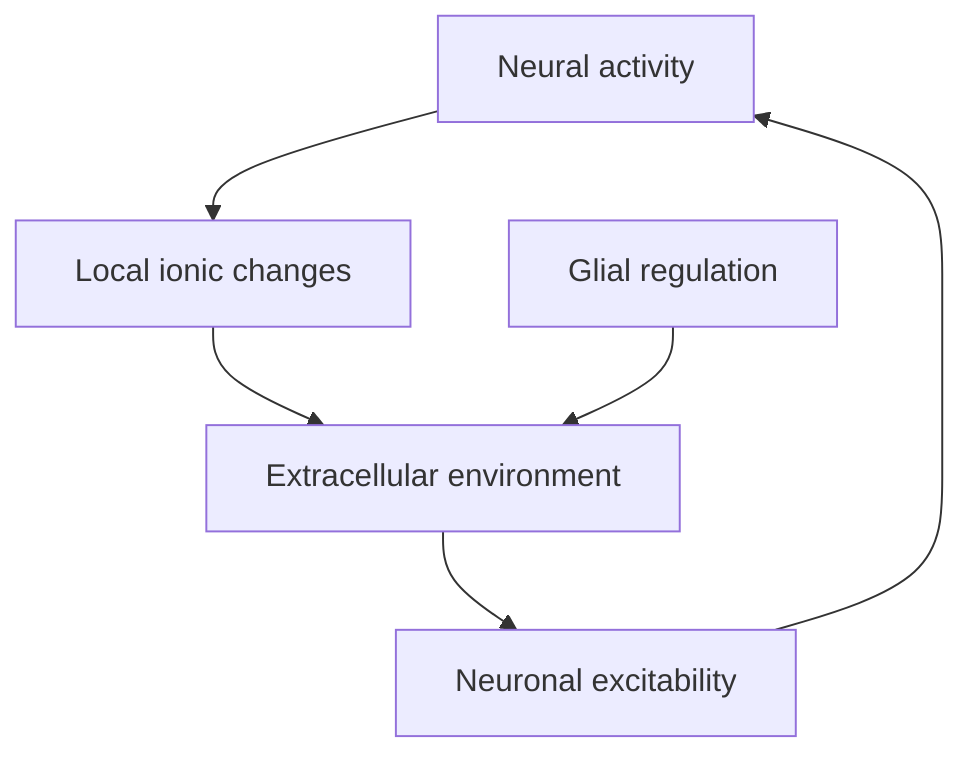

# Neurons, glia, membranes, and ions

## If you landed here directly

This lesson assumes only the map built in `NNE-0002`.

You should already know that the nervous system can be organized at several levels:

```text
cell
→ circuit
→ system
→ body
→ behavior
```

and that the nervous system includes both CNS and PNS structures.

You do **not** need prior cell biology, chemistry, electrophysiology, or electrical engineering.

This lesson opens the cellular layer.

By the end, you should be able to explain:

- what a neuron physically is;
- why dendrites, soma, axon, and terminals have different roles;
- why glia are part of the operating system of nervous tissue rather than inert filler;
- what a cell membrane is doing in an electrical-signaling problem;
- what an ion is and why charge matters;
- why sodium, potassium, chloride, calcium, and large intracellular anions appear repeatedly in neuroscience;
- why electrical signaling in living tissue depends on **ion gradients plus selective permeability**;
- why a neural electrode does not simply “read electricity from a wire.”

The final point is the bridge to neural engineering.

---

## The problem worth understanding

A beginner often hears:

> neurons send electrical signals.

That sentence is useful, but dangerously incomplete.

It can create the mental picture:

```text
neuron = tiny copper wire
```

Then everything downstream becomes confusing.

Why is there a membrane?

Why do sodium and potassium matter?

Why does ion concentration matter if electricity is just charge flow?

Why do glial cells matter?

Why does myelin alter signaling?

Why does an intracellular electrode measure something different from an extracellular electrode?

Why does damaged tissue change recording quality?

Why can extracellular potassium alter excitability?

A better first model is:

```text
living cell
+
selective membrane
+
unequal ion concentrations
+
ion channels and transporters
+
cell geometry
+
supporting glial environment
=
electrically excitable neural tissue
```

That is the cellular substrate neurotechnology interacts with.

---

## A neuron is a living cell, not a wire

A neuron shares many basic features with other cells.

It has:

- a plasma membrane;
- cytoplasm;
- a nucleus;
- organelles;
- proteins;
- metabolic demands;
- water;
- dissolved ions.

What makes neurons distinctive is not that they violate cell biology.

It is that their structure and membrane proteins are specialized for receiving, integrating, and transmitting signals over potentially long distances.

A useful high-level map is:


This diagram is intentionally simple.

Real neurons can have diverse shapes, branching patterns, and signal flows.

But the map gives us functional regions to reason about.

The static figure below gives those regions a physical shape. Pay attention to the dendritic tree, soma, axon hillock/initial segment, axon, myelinated segments, nodes, and terminal synaptic contact.


*Visual anchor — labeled neuron anatomy. This particular drawing labels **Schwann cells**, so treat the myelinated axon in the figure as a PNS-style example; CNS myelin is produced by oligodendrocytes, discussed later in this lesson. Source: [Wikimedia Commons — Anatomy of neuron.png](https://commons.wikimedia.org/wiki/File:Anatomy_of_neuron.png), Curtis Neveu; CC BY-SA 4.0. Registry: `NNE-REF-068`.*

---

## Soma: the cellular center

The **soma**, or cell body, contains the nucleus and much of the machinery needed to maintain the cell.

At this level, think of the soma as the region that supports:

- gene expression;
- protein synthesis;
- metabolism;
- organelle function;
- integration of many inputs.

Do not interpret the word “integration” as:

> the soma alone decides whether the neuron fires.

The electrical behavior of a neuron depends on distributed membrane properties across:

- dendrites;
- soma;
- axon initial region;
- axon;
- terminals.

The soma is important, but the neuron is spatially extended.

---

## Dendrites: receptive geometry

**Dendrites** are branched cellular processes that commonly receive synaptic input.

The engineering idea is not just:

> dendrites receive.

The deeper idea is:

> dendritic geometry creates a large, structured surface over which inputs can arrive.

Where an input arrives can matter.

How far it is from the axon initial region can matter.

Which other inputs arrive at similar times can matter.

The electrical properties of the membrane between the input site and the rest of the cell matter.

So even before learning synapses, you should stop thinking of the neuron as a single point.

A neuron has spatial structure.

---

## Axon: long-range output pathway

The **axon** is a neuronal process specialized for propagating electrical activity toward downstream targets.

Axons can:

- be very short or very long;
- branch;
- be myelinated or unmyelinated;
- terminate on neurons, muscle, glands, or other targets.

In a peripheral nerve, many axons are bundled together.

That immediately connects NNE-0002 to this lesson:

```text
neuron = one cell
nerve = many axons + supporting tissue
```

A nerve cuff therefore does not interact with “one neuron wire.”

It interacts with a biological cable containing many axons, glia, connective tissue, blood supply, and extracellular fluid.

---

## Axon terminals: communication endpoints

At axon terminals, neurons communicate with downstream cells.

In many cases, electrical activity in the axon leads to chemical neurotransmitter release at a synapse.

That is the subject of a later lesson.

For now, keep the transformation in mind:

```text
electrical state in neuron
→ terminal event
→ chemical or electrical communication
→ target-cell response
```

The nervous system is therefore not purely electrical.

It is electrochemical.

---

## One neuron can branch to many targets

An axon can branch.

Therefore one neuron may influence many downstream sites.

Similarly, one neuron can receive input from many upstream neurons.

This creates:

- divergence;
- convergence;
- network structure.

The neuron is a cell embedded in a network, not an isolated signal generator.

---

## Neuron shape is related to function, but shape is not destiny

Neurons can be classified by morphology.

Common introductory categories include:

- multipolar;
- bipolar;
- pseudounipolar.

These labels describe how processes relate to the soma.

You do not need to memorize a complete morphology catalog.

The useful engineering lesson is:

> different neural pathways can present different physical geometries to an interface.

A sensory neuron in a peripheral ganglion is not arranged like a cortical pyramidal neuron.

A motor axon in a peripheral nerve is not physically situated like a dendritic tree in cortex.

Geometry affects:

- where fields are generated;
- where stimulation acts;
- what electrodes can access;
- how signals spread through tissue.

---

## Example NNE-EX-011 — one neuron, several engineering observation points

Imagine a simplified motor neuron.

Possible observation sites include:

1. near the soma;
2. along the axon;
3. outside a peripheral nerve containing that axon;
4. near the muscle activated downstream.

These are not equivalent measurements.

### Near the soma

You may observe membrane-potential changes associated with local synaptic integration.

### Along the axon

You may observe propagating action-potential activity.

### Outside a nerve

You observe extracellular fields produced by many nearby axons, filtered by geometry and tissue.

### At muscle

You may observe EMG, which is downstream of motor-neuron activation and neuromuscular transmission.

Same functional pathway.

Different biological level.

Different signal.

Different inference problem.

---

## Glia are not biological packing material

The word **glia** historically became associated with “glue.”

That metaphor is now inadequate.

Glial cells contribute to the environment in which neurons survive and signal.

At L0, the main roles to remember are:

- maintaining extracellular conditions;
- supporting metabolism;
- forming myelin;
- participating in immune surveillance and tissue responses;
- contributing to barriers and fluid environments;
- supporting neuronal development and repair-related processes.

This matters directly to neural engineering.

An implanted device does not interact with neurons alone.

It interacts with:

```text
neurons
+
glia
+
extracellular matrix
+
blood vessels
+
immune-related processes
+
fluid and ions
```

The “neural interface” is a tissue interface.

---

## Major CNS glial categories

A useful first map is:

```text
CNS glia
├── astrocytes
├── oligodendrocytes
├── microglia
└── ependymal cells
```

You do not need fine molecular detail yet.

You need functional orientation.

---

## Astrocytes: local environmental regulation

Astrocytes interact with:

- neurons;
- synapses;
- extracellular space;
- blood vessels.

At this level, remember that astrocytes help regulate the chemical environment surrounding neurons.

That includes roles related to:

- extracellular ions;
- signaling molecules;
- metabolic support;
- tissue response.

This is a crucial conceptual correction:

> extracellular fluid is not an uncontrolled salt bath.

Neural tissue actively regulates it.

If extracellular ion concentrations change substantially, neuronal excitability can change.

---

## Oligodendrocytes: CNS myelin

Oligodendrocytes produce myelin around axonal segments in the CNS.

One oligodendrocyte can contribute myelin to multiple axonal segments.

Myelin changes the electrical propagation properties of an axon.

Later, NNE-0005 will explain why.

For now:

> myelin is a glial-cell-derived specialization that changes how axonal signals propagate.

---

## Schwann cells: PNS myelin

In the PNS, myelination is performed by **Schwann cells**.

A Schwann cell typically myelinates one segment of one axon.

This gives us another CNS/PNS distinction:

```text
CNS myelin → oligodendrocytes
PNS myelin → Schwann cells
```

Do not memorize this as trivia.

It becomes relevant when comparing:

- central implants;
- peripheral nerve interfaces;
- injury and repair;
- demyelinating conditions;
- conduction changes.

---

## Microglia: resident immune-related cells of the CNS

Microglia participate in immune surveillance and responses to:

- damage;
- infection;
- altered tissue conditions.

For neural engineering, this is important because an implant creates a physical and biological disturbance.

Later lessons on chronic implants will discuss tissue response in detail.

At this stage, only remember:

> a neural implant changes the biological environment, and glial responses are part of that system.

---

## Ependymal cells and fluid environments

Ependymal cells are associated with ventricular surfaces and cerebrospinal-fluid-related structures.

The nervous system operates in regulated fluid compartments.

That matters because neural electrical behavior depends on the composition of the surrounding ionic environment.

Again:

> the electrical problem is inseparable from the biological fluid environment.

---

## PNS satellite cells

Satellite glial cells surround neuronal cell bodies in peripheral ganglia.

They help support and regulate the local environment around those neurons.

This is another reminder that peripheral neural structures are biologically active tissues, not simple insulated cables.

---

## Myelin is not plastic insulation

The analogy:

```text
myelin ≈ insulation
```

is useful.

But it has limits.

Plastic insulation on a copper wire is not:

- living;
- produced by glial cells;
- metabolically maintained;
- interrupted at specialized nodes;
- integrated into a biological excitable membrane.

So use the analogy for one property:

> myelin changes current leakage and signal propagation.

Do not transfer every property of an electrical cable to an axon.

---

## The membrane is the critical boundary

Every neuron is enclosed by a **plasma membrane**.

The membrane is primarily a lipid bilayer containing many proteins.

The lipid core creates a major barrier to freely crossing charged particles.

That matters because ions carry charge.

If every ion could freely diffuse through the membrane at all times, the cell could not maintain the controlled ionic differences required for neural electrical signaling.

So the membrane is not just a wrapper.

It is part of the signal-generating machinery.

---

## A membrane separates two conductive fluids

Inside a neuron is intracellular fluid.

Outside is extracellular fluid.

Both contain water and dissolved ions.

Both can conduct ionic current.

The membrane separates them.

A first electrical abstraction is therefore:

```text
conductive intracellular fluid
|
selective membrane
|
conductive extracellular fluid
```

That is very different from:

```text
metal wire
inside
plastic insulation
outside
```

The membrane itself contains channels and transporters that dynamically control ionic movement.

---

## Ions: charged atoms or molecules

An **ion** is an atom or molecule with net electric charge.

Examples important in neural physiology include:

- sodium: `Na+`;
- potassium: `K+`;
- chloride: `Cl-`;
- calcium: `Ca2+`.

There are also large negatively charged molecules inside cells.

The sign tells you electrical charge.

A positive ion is a **cation**.

A negative ion is an **anion**.

---

## Why ions matter to electrical signaling

Electrical phenomena require charge.

In metals, mobile electrons are major charge carriers.

In biological fluids, current is largely carried by ions moving through water and through selective membrane pathways.

Therefore:

> neural electricity is ionic electricity.

This distinction is foundational.

A metal electrode converts between:

- electronic conduction in the metal;
- ionic conduction in tissue.

The electrode-tissue interface later becomes a major topic because those are different physical domains.

---

## Concentration is not charge

Suppose there are many potassium ions inside a cell.

That does not mean the entire inside of the cell is grossly positively charged.

Bulk intracellular and extracellular fluids are approximately electrically neutral.

Membrane voltage arises from a very small separation of charge near the membrane surfaces.

This is subtle and important.

Do not imagine:

```text
whole inside = negative ocean
whole outside = positive ocean
```

A better picture is:

```text
bulk fluids ≈ nearly electroneutral

very small charge imbalance near membrane
→ measurable voltage difference
```

This is one reason tiny charge redistributions can generate biologically meaningful membrane potentials.

---

## Concentration gradients store potential for movement

A **concentration gradient** exists when the concentration of a substance differs across space.

For an ion across a membrane:

```text
high concentration on one side
low concentration on the other
```

creates a tendency for diffusion from high to low concentration.

But ions also experience electrical forces.

Therefore two effects matter:

1. chemical concentration difference;
2. electrical potential difference.

Together they form an **electrochemical gradient**.

NNE-0004 will make this idea quantitative.

For now, the conceptual rule is enough:

> ions move according to both concentration and electric force, if the membrane permits them to move.

---

## Selective permeability is the key

A membrane can be more permeable to one ion than another.

Why?

Because membrane proteins form selective channels.

A channel may prefer a particular ion or group of ions.

Some channels are:

- open under resting conditions;
- voltage gated;
- ligand gated;
- mechanically gated.

You do not need the full channel taxonomy yet.

You need the systems idea:

```text
ion gradient
+
channel selectivity
+
channel state
=
possible ionic current
```

---

## Channels are pathways, not pumps

An **ion channel** provides a pathway through the membrane.

When open, ions can move according to their electrochemical driving forces.

A **pump** or active transporter can use energy to move ions in a direction that maintains concentration gradients.

Do not collapse these into one concept.

```text
channel
→ permits flow

pump / active transporter
→ maintains or creates gradients using energy
```

Both are necessary parts of neural excitability.

---

## The sodium-potassium pump

The sodium-potassium ATPase is especially important.

At L0, the exact stoichiometry is less important than the function:

> it uses metabolic energy to help maintain sodium and potassium concentration differences across the membrane.

This teaches an important engineering lesson:

> neural signaling is powered by metabolism.

Electrical excitability is not free.

Ion gradients are maintained by energy-consuming biological machinery.

---

## Sodium and potassium are distributed unequally

A common qualitative pattern in neurons is:

```text
outside:
more Na+

inside:
more K+
```

The exact concentrations vary.

Do not memorize one universal concentration table as if every neuron were identical.

The key is:

> unequal concentrations exist and are actively maintained.

Those gradients create stored electrochemical potential.

---

## Chloride adds another equilibrium problem

Chloride is negatively charged.

Its distribution and transport can strongly affect how inhibitory synaptic signals influence a neuron.

At L0, do not attempt detailed chloride physiology.

Just keep this principle:

> each ion has its own concentration distribution, permeability, and electrochemical balance.

Later, inhibition will make chloride especially important.

---

## Calcium is a signal as well as a charge carrier

Calcium has charge `+2`.

Its intracellular concentration is normally kept very low relative to extracellular fluid.

When calcium enters specific cellular regions, it can trigger biochemical events.

At axon terminals, calcium entry is central to neurotransmitter release.

So calcium illustrates an important theme:

> ionic movement can carry electrical current and biochemical information at the same time.

---

## Large intracellular anions matter

Cells contain large negatively charged molecules such as proteins and phosphates.

Many of these do not freely cross the membrane.

They contribute to intracellular charge balance and ionic distributions.

Again, the membrane is not separating pure sodium on one side from pure potassium on the other.

It separates complex ionic solutions.

---

## Example NNE-EX-012 — two compartments and one selective membrane

Imagine two water-filled compartments separated by a membrane.

Initially:

```text
left:
high K+

right:
low K+
```

Suppose the membrane contains channels permeable to K+ but not to a matching large negative ion.

What happens conceptually?

1. K+ tends to diffuse toward the lower-concentration side.
2. Negative charge left behind begins to oppose further positive-charge movement.
3. Chemical and electrical forces begin to compete.
4. Eventually, an equilibrium can be reached.

This is not yet the full neuron.

But it is the conceptual seed of membrane potential.

NNE-0004 will formalize this with equilibrium potentials and resting membrane potential.

---

## Membrane voltage is a difference between two locations

Voltage is always a difference.

For a cell membrane, we commonly compare:

```text
inside
relative to
outside
```

So when someone says:

> the membrane potential is negative,

the complete thought is:

> the inside is at a lower electric potential than the outside under the chosen convention.

This prevents a common conceptual error:

> a neuron “contains negative voltage.”

Voltage is not a substance inside the cell.

It is a potential difference across a boundary.

---

## Biological membranes act partly like capacitors

A lipid membrane separates conductive fluids.

Charge can accumulate on opposite sides of that thin insulating region.

That gives the membrane a capacitor-like property.

You do not need the capacitor equation yet.

The useful intuition is:

```text
conductive fluid
→ charge near membrane surface
|| lipid barrier ||
opposite charge near membrane surface
→ conductive fluid
```

This helps explain why membrane voltage can change without moving huge amounts of charge through the entire cell.

Later electrical-engineering connections will make this more precise.

---

## The membrane also has conductance

Ion channels provide conductive pathways.

Therefore a minimal electrical abstraction of membrane is not just a capacitor.

It has:

- capacitive behavior;
- ion-specific conductances;
- active transport;
- voltage- and chemistry-dependent changes.

Eventually, neural models use circuit elements to approximate these properties.

But always remember:

> the circuit is a model of biology, not the biology itself.

---

## Example NNE-EX-013 — why an intracellular and extracellular electrode differ

Imagine one electrode tip placed inside a neuron and another reference electrode outside.

The measurement can approximate:

```text
inside potential - outside potential
```

which gives direct access to transmembrane voltage at that location.

Now place both electrodes outside the cell.

You are no longer directly measuring inside-versus-outside membrane voltage.

Instead, extracellular electrodes detect local voltage fields produced by ionic currents flowing through surrounding tissue.

Therefore:

```text
intracellular recording
≠
extracellular recording
```

even if both ultimately arise from the same excitable cells.

This distinction becomes essential in later recording lessons.

---

## Extracellular fields depend on geometry

An extracellular electrode sees a mixture shaped by:

- distance to active membranes;
- orientation;
- tissue conductivity;
- synchrony;
- electrode geometry;
- reference choice;
- frequency.

So:

> “a neuron fired” does not imply one universal extracellular waveform.

The same cellular event can produce different measured signals at different locations.

---

## The neuron is electrically nonuniform

Different membrane regions contain different proteins and channel densities.

The axon initial region is not electrically identical to a dendrite.

An axon terminal is not identical to the soma.

A node of Ranvier is not identical to a myelinated internode.

Therefore, a neuron is not a one-compartment resistor.

Later models may approximate neurons as one compartment for simplicity.

That is a modeling choice.

---

## Dendritic inputs spread through membrane and cytoplasm

When synaptic input changes current across a dendritic membrane, the resulting voltage change spreads through the cell.

It attenuates and interacts with other inputs.

This gives us the first intuition for neural integration:

```text
many local membrane currents
→ distributed voltage changes
→ interaction near trigger regions
```

NNE-0006 will study synapses and integration more directly.

---

## The axon initial region is a trigger zone

Many neurons initiate action potentials near the axon initial segment.

Why there?

Because membrane properties and channel densities support regenerative activation.

At L0:

> the neuron does not “fire everywhere at once.”

A local membrane event can trigger a propagating signal.

NNE-0005 will explain threshold, action potential, refractory periods, and propagation.

---

## Myelin changes where membrane current matters

Myelinated axons have specialized exposed membrane regions called nodes of Ranvier.

The membrane between nodes is wrapped by myelin.

This changes:

- effective membrane resistance;
- capacitance;
- current spread;
- propagation speed.

Do not memorize the electrical derivation yet.

The conceptual point is:

> glial structure changes the electrical behavior of the neuron.

That is why “glia are support cells” is incomplete.

Support changes function.

---

## Example NNE-EX-014 — myelinated versus unmyelinated interface intuition

Suppose two axons have similar diameters.

One is myelinated.

One is unmyelinated.

A naive model says:

> same axon diameter → same electrical behavior.

Wrong.

Myelin changes how current leaks through membrane and how rapidly membrane must be charged along the path.

Therefore the propagation dynamics differ.

For a neural engineer, this means fiber properties influence:

- conduction velocity;
- recruitment by stimulation;
- recorded timing;
- interpretation of compound signals.

---

## Glia and extracellular potassium

Neural activity moves ions.

If many cells are active, extracellular ion concentrations can change locally.

Astrocytes contribute to buffering and regulating extracellular potassium.

This shows that signaling alters the environment that supports signaling.

A useful feedback picture is:



This is a biological feedback loop.

It also warns us:

> neural tissue properties can be state dependent.

---

## Metabolism sits underneath electrical signaling

Ion pumps consume energy.

Cells require:

- oxygen;
- glucose;
- ATP;
- blood flow.

Electrical signaling therefore depends on metabolism.

A neuron deprived of metabolic support cannot indefinitely maintain its gradients.

This connects later to:

- ischemia;
- injury;
- BOLD fMRI;
- tissue health;
- chronic implants.

The electrical signal is embedded in physiology.

---

## Size scales matter

Approximate scales span orders of magnitude:

```text
ion channels: nanometer-scale proteins
membrane: nanometer-scale thickness
cell bodies: micrometer scale
axons: micrometers in diameter, potentially very long
circuits: millimeters to centimeters and beyond
behavior: whole-body scale
```

A microelectrode may be small relative to a brain region but large relative to molecular structures.

Always ask:

> small compared with what?

---

## Neural engineering operates across material domains

A neural recording system can include:

```text
ionic currents in tissue
→ electrode interface
→ electronic current in metal
→ amplifier voltage
→ digitized numbers
→ algorithmic features
```

Each arrow crosses a modeling boundary.

NNE-0009 will later formalize the measurement chain.

This lesson supplies the first biological boundary.

---

## Biological charge carriers versus electronic charge carriers

Inside tissue:

- ions move through aqueous environments.

Inside metal conductors:

- electrons are the mobile carriers.

At the electrode interface, electrochemical processes connect these domains.

So a neural electrode is not just:

> a wire touching a wire.

It is:

> an electronic conductor coupled to an ionic conductor through an electrochemical interface.

That is why electrode material and interface chemistry matter.

---

## Example NNE-EX-015 — trace one recorded sample backward

Suppose an acquisition system stores one voltage sample:

```text
37 microvolts
```

What produced that number?

A useful backward trace is:

```text
digitized sample
← amplifier output
← electrode voltage
← electrode-tissue interface
← extracellular electric field
← transmembrane ionic currents
← channel states
← cell and network activity
← ionic gradients maintained by metabolism
```

The sample is not a direct copy of “thought.”

It is the endpoint of a physical measurement chain.

---

## A cell membrane is selective, not perfectly insulating

Saying:

> the membrane is an insulator

is too strong.

The lipid bilayer strongly limits free ion passage.

But membrane proteins provide controlled pathways.

So a more useful description is:

> the membrane is a selectively permeable electrical boundary.

That boundary can change its conductance over time.

This dynamic selectivity is the core of excitability.

---

## Channels can be gated

Some channels change their open probability in response to:

- voltage;
- ligands;
- mechanical deformation;
- intracellular signals.

This provides a mechanism by which the state of a cell changes its future electrical behavior.

Later lessons will turn this into:

```text
stimulus
→ channel-state change
→ ionic current
→ membrane-voltage change
→ more channel-state changes
```

That feedback is central to the action potential.

---

## Equilibrium is ion specific

Each ion experiences:

- its concentration gradient;
- its electrical force.

Therefore each ion can have its own equilibrium potential.

This is why “the voltage ions want” is not one universal value.

Potassium and sodium typically have different equilibrium tendencies.

NNE-0004 will formalize this using the Nernst idea.

For now:

> one membrane voltage interacts with several ion-specific electrochemical gradients.

---

## Resting does not mean inactive

A neuron at rest:

- maintains concentration gradients;
- runs pumps;
- has open leak channels;
- exchanges ions;
- consumes energy;
- maintains membrane voltage.

“Resting” means:

> not currently producing a large regenerative action potential.

It does **not** mean:

> no electrical or metabolic activity.

---

## Electrical neutrality and membrane potential can coexist

This idea is worth retrieving twice.

A neuron can have:

- nearly neutral bulk intracellular fluid;
- nearly neutral bulk extracellular fluid;
- a measurable membrane voltage.

Why?

Because only a tiny fraction of charges need to redistribute near the membrane.

This resembles a capacitor.

If you miss this, you may imagine impossible whole-cell charge imbalances.

---

## Ion concentration and ion flux are different

**Concentration** tells you how much of an ion exists per volume.

**Flux** tells you movement across space or through a boundary.

A high concentration does not automatically imply high current.

Current requires charge movement.

Charge movement through membrane depends on:

- open pathways;
- driving force;
- channel properties.

That distinction becomes essential in electrophysiology.

---

## Current and voltage are related but not identical

Voltage is a potential difference.

Current is charge flow per time.

A membrane can have a voltage even when net current is zero.

A channel can carry current that changes voltage.

Multiple ionic currents can partially cancel.

Do not use:

```text
voltage
current
signal
```

as synonyms.

---

## Membrane potential is local

A large neuron is spatially extended.

Voltage at one membrane location can differ from another.

This is especially important in dendrites.

Therefore:

> “the neuron's voltage” is often a model simplification.

Intracellular recordings are local measurements.

Compartmental models exist because spatial variation matters.

---

## Cells are noisy and variable

Biological systems vary.

Two neurons of the same named type can differ in:

- morphology;
- channel expression;
- resting properties;
- firing behavior;
- synaptic inputs.

Measurements also vary over time.

This is not merely experimental sloppiness.

Biological variability is part of the system.

Later neural-data lessons will treat variability explicitly.

---

## Why glial biology matters for chronic implants

An implant can alter:

- tissue mechanics;
- local chemistry;
- blood-brain-barrier conditions;
- immune-related signaling;
- glial activation;
- neuronal proximity.

Therefore chronic signal quality may change even if the electrode electronics are perfect.

Later implant lessons will examine this in depth.

The important seed is:

> device stability and biological stability are different.

---

## Why membrane biology matters for stimulation

Electrical stimulation changes electric fields in tissue.

Those fields can influence membrane voltage.

Whether a neuron responds depends on:

- cell geometry;
- orientation;
- distance;
- axonal structure;
- membrane properties;
- channel states;
- stimulus waveform.

Therefore:

> stimulation does not inject “commands” directly into a neuron.

It perturbs an excitable physical system.

---

## Why ion biology matters for safety

Strong or prolonged stimulation can cause undesirable effects related to:

- tissue electrochemistry;
- heating;
- excessive activation;
- electrode reactions;
- cellular stress.

This lesson is not a stimulation-parameter guide.

The systems principle is:

> safe stimulation requires respecting both electrode electrochemistry and cellular physiology.

---

## Why membrane biology matters for recording bandwidth

Different neural signals arise from different processes.

Fast action potentials involve rapid membrane events.

Slower local field potentials reflect aggregated transmembrane currents and network processes over longer timescales.

So “record neural voltage” is not one single measurement objective.

What you want to observe determines:

- electrode placement;
- sampling rate;
- filtering;
- spatial scale.

---

## Common failure mode: neuron equals wire

A neuron is:

- living;
- metabolically maintained;
- spatially structured;
- selectively permeable;
- ionic;
- adaptive.

A copper wire is not.

Analogies help only when their limits are explicit.

---

## Common failure mode: glia are just glue

Glia contribute to:

- extracellular regulation;
- myelination;
- tissue maintenance;
- immune-related responses;
- fluid and barrier systems.

Ignoring them breaks the biological model.

---

## Common failure mode: the membrane is a sealed wall

The membrane is selectively permeable.

Channels and transporters cross it.

Its permeability changes.

That changing permeability is essential to signaling.

---

## Common failure mode: ions are tiny electrons

Ions are charged atoms or molecules in solution.

Electrons are not the principal mobile charge carriers in biological fluid.

The conduction mechanisms differ.

---

## Common failure mode: all positive ions behave the same

Na+, K+, and Ca2+ differ in:

- concentration gradients;
- channel selectivity;
- valence;
- physiological roles.

Charge sign alone does not determine behavior.

---

## Common failure mode: more ions inside means the whole cell is charged

Bulk solutions remain close to electrically neutral.

Membrane voltage depends on small charge separation near the membrane.

---

## Common failure mode: pumps cause every rapid neural current

Pumps maintain gradients over longer timescales.

Channels permit rapid ion movement according to electrochemical driving forces.

Do not confuse gradient maintenance with fast signaling current.

---

## Common failure mode: resting means zero activity

Resting cells still:

- maintain gradients;
- exchange ions;
- consume ATP;
- maintain membrane voltage.

---

## Common failure mode: myelin is decorative wrapping

Myelin strongly changes electrical propagation.

It is part of the functional system.

---

## Common failure mode: one voltage sample is one neuron

Extracellular recordings are mixtures.

The mapping from cells to measured voltage depends on geometry, tissue, electrode, and reference.

---

## Active work

### Exercise 1 — label a neuron from function

Draw a neuron with:

- dendrites;
- soma;
- axon initial region;
- axon;
- terminals.

For each region, write one functional role.

Do not copy an anatomy diagram first.

Reconstruct from the logic of information flow.

### Exercise 2 — neuron versus nerve

Explain why:

> “The median nerve is a neuron”

is wrong.

Your answer must mention:

- axons;
- many cells;
- supporting tissue;
- PNS.

### Exercise 3 — glial map

Create a two-column table:

```text
CNS
PNS
```

Place:

- astrocyte;
- oligodendrocyte;
- microglia;
- ependymal cell;
- Schwann cell;
- satellite cell.

Then give one broad function for each.

### Exercise 4 — two conductive fluids

Draw:

```text
intracellular fluid
membrane
extracellular fluid
```

Label:

- ions;
- channels;
- pumps;
- membrane voltage.

Explain why the membrane must be selective.

### Exercise 5 — concentration versus voltage

Explain why a concentration difference and a voltage difference are not the same thing.

Then explain why both matter for an ion.

### Exercise 6 — trace one extracellular sample

Start with:

```text
digital number in a file
```

Trace backward to:

```text
ionic gradients
```

Include at least six intermediate layers.

### Exercise 7 — myelin comparison

Explain why two axons with similar diameter but different myelination should not be expected to have identical conduction properties.

### Exercise 8 — device boundary

Write one paragraph explaining why a neural electrode connects:

```text
ionic biology
to
electronic hardware
```

rather than simply connecting two metallic conductors.

---

## Retrieval check

Without looking back:

1. What is a neuron?
2. What is the soma?
3. What do dendrites commonly contribute?
4. What is the broad role of an axon?
5. What happens at axon terminals?
6. Why is a neuron spatially extended rather than a point?
7. Name four CNS glial categories.
8. Which glial cell myelinates CNS axons?
9. Which glial cell myelinates PNS axons?
10. What broad role do astrocytes play in extracellular regulation?
11. Why do microglia matter to an implant discussion?
12. Why is myelin more than passive wrapping?
13. What is the plasma membrane?
14. Why does the lipid bilayer limit free ion movement?
15. What is an ion?
16. Name four ions important in neural physiology.
17. What is the difference between a cation and an anion?
18. Why is neural electrical current mainly ionic?
19. What is a concentration gradient?
20. What is an electrochemical gradient?
21. Why are ion channels different from pumps?
22. What broad job does the sodium-potassium pump perform?
23. Why can membrane voltage exist while bulk fluids remain nearly neutral?
24. Why is calcium especially interesting as both charge carrier and biochemical signal?
25. Why are intracellular and extracellular recordings not equivalent?
26. Why is an extracellular waveform geometry dependent?
27. Why does metabolism matter to excitability?
28. Why can glial regulation affect neuronal excitability?
29. Why does interface location change what electrical quantity is measured?
30. Why is “neuron = wire” an unsafe mental model?

---

## Connection backward: NNE-0002

NNE-0002 gave you the map:

```text
CNS
PNS
cell
circuit
system
behavior
```

This lesson zoomed into the cell layer.

Now the statement:

> a peripheral nerve contains axons

has cellular meaning.

The statement:

> spinal and brain circuits contain gray and white matter

has cellular meaning.

And the statement:

> neural interfaces contact tissue

now includes:

- neuronal membranes;
- glia;
- extracellular fluid;
- ions.

---

## Connection forward: NNE-0004

The next canonical lesson is:

`NNE-N-0004 — Resting membrane potential and electrochemical gradients`.

This lesson supplied the ingredients:

```text
selective membrane
+
ion concentration gradients
+
channels
+
pumps
+
charge separation
```

NNE-0004 will ask:

> what voltage emerges from those ingredients, and why?

You will meet:

- diffusion tendency;
- electrical force;
- equilibrium potential;
- Nernst intuition;
- resting membrane potential;
- permeability weighting.

---

## Connection forward: NNE-0005

`NNE-N-0005 — Action potentials, thresholds, refractory periods, and propagation`

will explain how voltage-dependent channels create a regenerative traveling signal.

This lesson already planted the feedback loop:

```text
membrane voltage
→ channel state
→ ionic current
→ membrane voltage
```

That loop becomes the action potential.

---

## Connection forward: recording

Later recording lessons will distinguish:

- intracellular membrane voltage;
- extracellular spikes;
- multi-unit activity;
- local field potentials;
- surface potentials.

The distinction begins here:

> different electrodes sample different physical consequences of transmembrane ionic current.

---

## Connection forward: stimulation

Later stimulation lessons will ask how externally applied electric fields alter membrane polarization.

The cell geometry and membrane properties introduced here are therefore not background trivia.

They are part of the stimulation mechanism.

---

## Connection to Power Engineering

The Power track studies voltage, current, sources, loads, and energy in engineered electrical networks.

Neural membranes also invite electrical abstractions.

But the physical implementation differs.

Engineered conductor:

```text
electronic current in metal
```

Neural tissue:

```text
ionic current in electrolyte
+
selective membrane conductance
+
biological energy-dependent gradients
```

The shared mathematics can be useful.

The physical meaning must remain distinct.

---

## Connection to Linear Algebra

Later neural models will represent:

- membrane states;
- channel states;
- ion concentrations;
- population activity

as vectors.

That representation is useful only if the coordinate meanings remain explicit.

The biological map in this lesson tells you what those coordinates could represent.

---

## What this unlocks

You should now be able to reason through this chain:

```text
neuron structure
→ membrane boundary
→ ion gradients
→ selective permeability
→ ionic current
→ membrane voltage
→ electrical signaling
```

and this parallel chain:

```text
glial regulation
→ extracellular environment
→ membrane conditions
→ neuronal excitability
```

You should also be able to explain why a neural electrode sits at the boundary between:

```text
living ionic tissue
and
electronic instrumentation
```

That is enough to move from cellular anatomy to membrane biophysics.

---

## References

- **NNE-REF-017** — OpenStax, *Anatomy and Physiology 2e*, §12.2, “Nervous Tissue.”
- **NNE-REF-018** — OpenStax, *Anatomy and Physiology 2e*, §12.4, “The Action Potential,” especially the membrane, ion, channel, pump, and resting-state foundations used here.
- **NNE-REF-019** — Purves et al., *Neuroscience*, 2nd ed., “Channels and Transporters,” NCBI Bookshelf.
- **NNE-REF-020** — OpenStax, *Biology 2e*, §35.1, “Neurons and Glial Cells.”
- **NNE-REF-068** — Curtis Neveu, *Anatomy of neuron.png*, verified neuron-morphology visual anchor via Wikimedia Commons; CC BY-SA 4.0.
