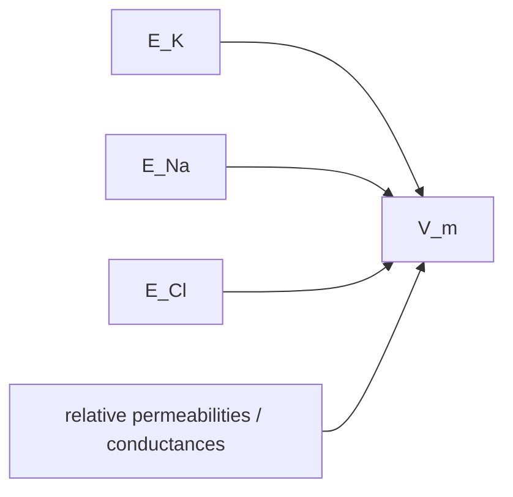
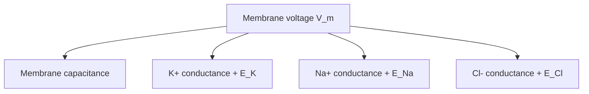
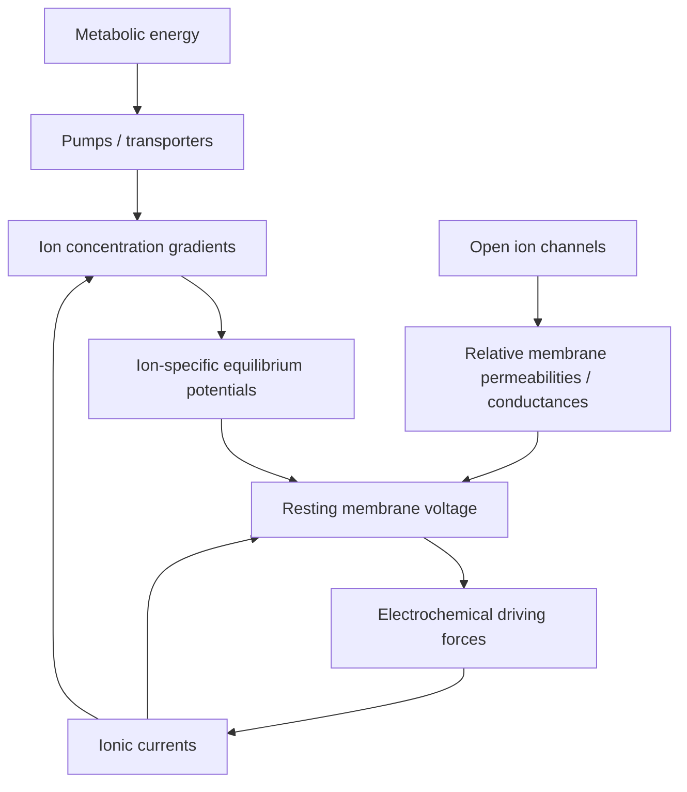

# Resting membrane potential and electrochemical gradients

## If you landed here directly

This lesson assumes the cellular foundations from `NNE-0003`.

You should already know that:

- a neuron is separated from extracellular fluid by a selectively permeable membrane;
- intracellular and extracellular fluids contain ions;
- Na+ is generally more concentrated outside many neurons;
- K+ is generally more concentrated inside;
- ion channels permit selective passive movement;
- pumps and transporters maintain concentration differences using metabolic energy;
- membrane voltage is a voltage difference across the membrane, not a substance stored inside the cell.

You do **not** need calculus, differential equations, physical chemistry, or circuit theory.

This lesson turns those ingredients into one of the most important ideas in neuroscience:

> why a resting neuron has a nonzero membrane voltage.

By the end, you should be able to explain:

- why concentration gradients create diffusion tendencies;
- why electrical forces can oppose or reinforce diffusion;
- what an electrochemical gradient is;
- what an ion-specific equilibrium potential means;
- what the Nernst equation is telling you conceptually;
- why K+ often strongly influences resting membrane potential;
- why a real resting neuron is not at equilibrium;
- why multiple permeable ions pull membrane voltage toward different equilibrium potentials;
- why the Na+/K+ pump matters mostly by maintaining gradients over time;
- why changing extracellular K+ can strongly alter excitability;
- what an intracellular membrane-voltage measurement actually compares.

---

## The problem worth understanding

A simplified neuron may have:

```text
inside:
high K+
low Na+

outside:
low K+
high Na+
```

Now suppose the membrane contains K+-selective leak channels.

K+ can move.

The obvious first guess is:

> K+ diffuses outward forever because its concentration is higher inside.

But that does not happen.

As positive K+ leaves, the inside becomes slightly more negative relative to the outside.

That electrical difference attracts K+ back inward.

So two tendencies oppose one another:

```text
chemical tendency:
K+ outward

electrical tendency:
K+ inward
```

At some membrane voltage, they exactly balance for K+.

That voltage is the **equilibrium potential for K+**.

This is the central mechanism behind membrane potentials.

---

## Two forces act on an ion

For a permeant ion, two broad forces matter.

### Chemical force

Particles tend to diffuse from regions of higher concentration toward regions of lower concentration.

For K+ in a typical neuron:

```text
high K+ inside
low K+ outside
```

so the concentration gradient tends to drive K+ outward.

### Electrical force

Charged particles respond to electric fields.

A positive ion is attracted toward relatively negative electric potential.

A negative ion is attracted toward relatively positive electric potential.

If the inside of a neuron is negative relative to the outside, that electrical condition tends to pull positive ions inward.

---

## Electrochemical gradient

The combination of:

```text
concentration effect
+
electrical effect
```

is the **electrochemical gradient**.

For an ion, the electrochemical gradient determines the direction in which passive movement is energetically favored, assuming a permeable pathway exists.

This statement contains three separate requirements:

1. there is a concentration difference and/or voltage difference;
2. the ion has charge and therefore responds electrically;
3. the membrane is permeable to that ion.

No open pathway means no large passive transmembrane flux even when the driving force is strong.

---

## Driving force is not the same as permeability

This distinction is essential.

Suppose Na+ strongly “wants” to enter a resting neuron electrochemically.

If almost no Na+ channels are open, Na+ current can still be small.

So:

```text
electrochemical driving force
≠
actual ionic current
```

A useful conceptual relation is:

```text
ionic current
depends on
driving force × available conductance/permeability
```

The exact mathematical form depends on the model.

But the separation is foundational:

- **driving force** asks what direction and strength the ion is pushed;
- **permeability/conductance** asks how open the pathway is.

---

## Membrane voltage convention

We usually define membrane voltage as:

$$ V_m=V_{\text{inside}}-V_{\text{outside}}. $$

If:

$$ V_m=-70\ \text{mV}, $$

then the inside is 70 mV lower in electric potential than the outside under this convention.

This does **not** mean:

> the entire inside of the cell contains a giant net negative charge.

As you learned in NNE-0003, bulk intracellular and extracellular fluids remain close to electrically neutral.

Only a tiny separation of charge near the membrane is needed to create a measurable voltage.

---

## Resting membrane potential

The **resting membrane potential**, often abbreviated RMP, is the relatively stable membrane voltage of an unstimulated excitable cell under its resting conditions.

A common introductory value for neurons is around:

$$ -70\ \text{mV}. $$

But this is not a universal constant.

Different cells can rest at different values.

The value also depends on:

- ion concentrations;
- membrane permeabilities;
- channel expression;
- cell type;
- temperature;
- metabolic state;
- extracellular environment.

So use `-70 mV` as a useful example, not a law of nature.

---

## Resting does not mean static

A resting neuron is dynamically active.

At rest:

- ions leak through open channels;
- pumps consume ATP;
- concentration gradients are maintained;
- membrane charge is continually balanced;
- channels still open and close stochastically;
- extracellular conditions are regulated.

Therefore:

> resting membrane potential is a steady state, not inactivity.

This distinction becomes even more important when we separate **steady state** from **equilibrium**.

---

## Equilibrium potential for one ion

Imagine a membrane permeable to only one ion species, X.

Initially, X has a concentration gradient.

It begins to diffuse.

Because X is charged, its movement creates a voltage difference.

That voltage creates an electrical force.

Eventually:

```text
chemical tendency
=
opposing electrical tendency
```

for that ion.

At that point, there is no net electrochemical driving force on X.

The corresponding membrane voltage is the **equilibrium potential** for X, written:

$$ E_X. $$

Examples:

- `E_K` for potassium;
- `E_Na` for sodium;
- `E_Cl` for chloride;
- `E_Ca` for calcium.

---

## Equilibrium potential is ion specific

Different ions have different:

- concentration ratios;
- charges;
- transport histories.

Therefore they generally have different equilibrium potentials.

A neuron does not have one universal “ion equilibrium voltage.”

Instead it may have:

```text
E_K
E_Na
E_Cl
E_Ca
...
```

all at once.

This becomes the key to understanding a real resting membrane.

---

## The Nernst equation

For an ion X, the Nernst equation relates equilibrium potential to the ion's concentration ratio, charge, and temperature:

$$ E_X=\frac{RT}{zF}\ln\left(\frac{[X]_{\text{out}}}{[X]_{\text{in}}}\right). $$

Where:

- `R` is the gas constant;
- `T` is absolute temperature;
- `z` is the ion's valence;
- `F` is Faraday's constant;
- `[X]out` is extracellular concentration;
- `[X]in` is intracellular concentration.

Do not memorize constants first.

Memorize the meaning:

> the equilibrium voltage is the voltage required to balance the ion's concentration gradient.

---

## What the logarithm is doing

The concentration ratio matters multiplicatively.

A tenfold concentration difference is qualitatively different from a twofold difference.

The logarithm converts that concentration ratio into an additive voltage scale.

At body temperature, a useful approximate base-10 form for a monovalent ion is:

$$ E_X\approx\frac{61.5\ \text{mV}}{z}\log_{10}\left(\frac{[X]_{\text{out}}}{[X]_{\text{in}}}\right). $$

This is an approximation for intuition and calculation.

The exact coefficient depends on temperature.

---

## Sign matters

For a positive ion:

```text
more outside than inside
→ positive equilibrium potential
```

because the electrical force needed to oppose inward diffusion must make the inside positive enough to repel the cation.

For a positive ion with more inside than outside:

```text
more inside than outside
→ negative equilibrium potential
```

because a negative interior is needed to oppose outward diffusion.

For anions such as Cl-, the negative valence changes the sign logic.

The Nernst equation handles this through `z`.

---

## Example NNE-EX-016 — the potassium tug of war

Assume:

```text
K+ concentration:
inside = high
outside = low
```

and K+ channels are open.

### Step 1: chemical tendency

K+ diffuses outward.

### Step 2: charge separation

As positive charge leaves, the inside becomes slightly more negative.

### Step 3: electrical opposition

The increasingly negative interior attracts K+ inward.

### Step 4: balance

Eventually the inward electrical tendency balances the outward concentration tendency.

At that membrane voltage:

```text
net electrochemical driving force for K+ = 0
```

That voltage is `E_K`.

This is not because K+ stops moving microscopically.

It means there is no net passive flux produced by the electrochemical gradient in the ideal equilibrium model.

---

## Example NNE-EX-017 — estimate E_K and E_Na

Use illustrative concentrations at approximately body temperature:

```text
K+:
inside = 140 mM
outside = 5 mM

Na+:
inside = 15 mM
outside = 145 mM
```

For K+:

$$ E_K\approx61.5\log_{10}\left(\frac{5}{140}\right)\ \text{mV}. $$

This gives approximately:

$$ E_K\approx-89\ \text{mV}. $$

For Na+:

$$ E_{Na}\approx61.5\log_{10}\left(\frac{145}{15}\right)\ \text{mV}. $$

This gives approximately:

$$ E_{Na}\approx+61\ \text{mV}. $$

The important result is not the exact numbers.

It is the separation:

```text
E_K strongly negative
E_Na strongly positive
```

So if the membrane voltage is around `-70 mV`:

- K+ is relatively close to its equilibrium potential;
- Na+ is far from its equilibrium potential.

That difference becomes crucial during action potentials.

---

## Do not memorize one universal concentration table

Ion concentrations vary by:

- species;
- cell type;
- tissue;
- preparation;
- measurement method.

The values in examples are teaching values.

The robust concepts are:

- K+ is often much more concentrated intracellularly;
- Na+ is often much more concentrated extracellularly;
- resting neuronal membranes are often much more permeable to K+ than Na+;
- therefore resting voltage often lies much closer to `E_K` than `E_Na`.

---

## One ion at equilibrium does not mean the cell is at equilibrium

This is one of the most important distinctions in the lesson.

Suppose:

$$ V_m=E_K. $$

Then K+ has no net electrochemical driving force in the simplified model.

But Na+ may still have a large inward driving force.

Cl- may have another driving force.

Ca2+ may have another.

Therefore:

> `V_m = E_K` does not imply the whole neuron is at thermodynamic equilibrium.

It means only that K+ is at its ion-specific electrochemical equilibrium under the model.

---

## Real resting neurons have several permeable ions

A real resting membrane is not permeable only to K+.

At rest, different channels may permit:

- substantial K+ permeability;
- smaller Na+ permeability;
- Cl- permeability;
- other ion contributions.

Therefore several ion-specific equilibrium potentials influence the actual membrane voltage.

A useful mental model is:



The membrane voltage lies where the combined ionic currents balance.

---

## The resting voltage is usually closest to the dominant permeability

If the resting membrane is much more permeable to K+ than to Na+, then `V_m` tends to sit closer to `E_K`.

If Na+ permeability increases substantially, `V_m` moves toward `E_Na`.

If Cl- permeability dominates under some condition, `V_m` is strongly influenced by `E_Cl`.

This gives the core rule:

> membrane voltage is pulled toward the equilibrium potentials of ions to which the membrane is permeable, weighted by how strongly those ions can conduct.

---

## A conductance-weighted intuition

In a simplified parallel-conductance model, we can build intuition with:

$$ V_m\approx\frac{g_KE_K+g_{Na}E_{Na}+g_{Cl}E_{Cl}}{g_K+g_{Na}+g_{Cl}}. $$

Here:

- `g_K` is potassium conductance;
- `g_Na` is sodium conductance;
- `g_Cl` is chloride conductance.

This expression is a useful circuit-style approximation under simplifying assumptions.

It is **not** the universal exact equation for every membrane.

More complete constant-field descriptions use the Goldman-Hodgkin-Katz framework and ion permeabilities.

The conceptual message is the same:

> more available pathway for an ion gives that ion's equilibrium potential more influence over membrane voltage.

---

## Goldman-Hodgkin-Katz idea

The Goldman-Hodgkin-Katz, or GHK, framework extends the single-ion Nernst idea to multiple permeant ions.

At L0, you do not need to memorize its full equation.

You need the modeling hierarchy:

```text
Nernst:
one ion
→ its equilibrium potential

GHK:
multiple permeant ions
→ membrane potential from concentration gradients + relative permeabilities
```

This prevents a common error:

> “The resting membrane potential is just the potassium Nernst potential.”

Often it is **near** `E_K`.

It is not generally identical to it.

---

## Example NNE-EX-018 — why extracellular K+ matters

Start with:

```text
[K+]in = 140 mM
[K+]out = 5 mM
```

We estimated:

$$ E_K\approx-89\ \text{mV}. $$

Now double extracellular potassium:

```text
[K+]out = 10 mM
```

Then:

$$ E_K\approx61.5\log_{10}\left(\frac{10}{140}\right)\ \text{mV}. $$

This is approximately:

$$ E_K\approx-70\ \text{mV}. $$

So doubling extracellular K+ makes `E_K` much less negative.

If resting voltage is strongly influenced by K+ permeability, the cell tends to depolarize.

This is why extracellular K+ regulation is physiologically important.

It also connects directly to the astrocyte discussion in NNE-0003.

---

## The phrase “K+ wants to leave” is shorthand

It is acceptable at first to say:

> K+ wants to leave because concentration is higher inside.

But once voltage develops, that sentence becomes incomplete.

The correct question is:

> What is the **net electrochemical driving force** on K+ at the current membrane voltage?

At `V_m = E_K`:

```text
net K+ driving force = 0
```

At voltages more positive or more negative than `E_K`, the net direction changes.

---

## Driving force as V_m minus E_ion

A useful electrophysiology quantity is:

$$ V_m-E_{\text{ion}}. $$

This is often called an electrochemical driving-force term.

For example, if:

```text
V_m = -70 mV
E_K = -90 mV
```

then:

$$ V_m-E_K=+20\ \text{mV}. $$

If a K+ conductance is open under standard electrophysiological current conventions, this condition favors outward positive current.

For Na+:

```text
V_m = -70 mV
E_Na = +60 mV
```

so:

$$ V_m-E_{Na}=-130\ \text{mV}. $$

This reflects a strong inward electrochemical tendency for Na+.

Do not overfocus on current-sign conventions yet.

The important point is:

> the distance between membrane voltage and an ion's equilibrium potential tells you how far that ion is from electrochemical balance.

---

## Reversal potential

In electrophysiology, you will often see the term **reversal potential**.

For an ideal ion-selective conductance, the reversal potential is the voltage at which current through that conductance reverses direction.

For a perfectly selective channel carrying one ion species, reversal potential is closely associated with that ion's Nernst equilibrium potential.

For channels permeable to multiple ions, the reversal potential can reflect several ionic gradients.

Therefore:

```text
equilibrium potential
and
reversal potential
```

are closely related but should not always be treated as identical in every biological channel model.

---

## Equilibrium versus steady state

Now we can state the distinction precisely.

### Equilibrium

At true thermodynamic equilibrium:

- no net driving forces sustain fluxes;
- no continuous energy expenditure is required to maintain gradients;
- the system has relaxed into equilibrium.

### Steady state

At a steady state:

- macroscopic variables can remain approximately constant;
- fluxes may still occur;
- opposing fluxes can balance;
- energy can be consumed continuously.

A resting neuron is a **steady-state** system.

Ions leak.

Pumps move ions.

ATP is consumed.

Yet concentrations and membrane voltage remain approximately stable over relevant timescales.

---

## Why the pump is necessary

Passive leaks would gradually dissipate ion gradients.

If:

- K+ continually leaks outward;
- Na+ continually leaks inward;

then without active transport the concentration differences would slowly collapse.

The Na+/K+ ATPase uses energy to maintain these gradients.

A common simplified description is:

```text
3 Na+ moved out
2 K+ moved in
per ATP-driven transport cycle
```

Because the transported charges are unequal, the pump is electrogenic.

But its most important role for resting excitability is broader:

> it preserves the Na+ and K+ gradients that make equilibrium potentials and action potentials possible.

---

## Direct versus indirect pump contribution

Avoid two opposite errors.

### Error 1

> The Na+/K+ pump creates the whole resting membrane potential directly.

Too strong.

In many neurons, selective passive permeability, especially substantial resting K+ permeability, is the dominant immediate determinant of RMP.

### Error 2

> The pump has nothing to do with resting membrane potential.

Also wrong.

The pump:

- maintains the gradients that passive channels act on;
- is itself electrogenic;
- therefore contributes both indirectly and, usually to a smaller degree, directly.

The gradients are an energy-stored biological resource.

---

## Batteries as an analogy

In equivalent-circuit models, an ion's equilibrium potential is often represented as an ion-specific **battery**.

For example:

```text
K+ conductance branch:
conductance g_K
+
battery E_K
```

This analogy is powerful.

It lets us model ion current as depending on:

- conductance;
- difference between membrane voltage and equilibrium potential.

But the “battery” is not a chemical battery component physically embedded in the membrane.

It represents stored electrochemical free energy in the ion concentration gradient.

---

## Membrane as capacitor plus ionic branches

NNE-0003 introduced the capacitor analogy.

Now we can enrich it:

```text
membrane capacitance
in parallel with
ion-specific conductive branches
```

Conceptually:



This is the beginning of an electrical model of excitable membrane.

Later action-potential models make the conductances time- and voltage-dependent.

---

## Resting leak channels are not literally holes

The phrase **leak channel** can suggest damage.

That is misleading.

Leak channels are normal membrane proteins with characteristic open behavior.

They contribute to resting permeability.

So:

> resting ionic leak is part of healthy membrane physiology.

A damaged membrane can also leak abnormally, but that is a different claim.

---

## Potassium often dominates, but not alone

Why is resting voltage often close to `E_K`?

Because many neurons have substantial resting K+ conductance relative to Na+ conductance.

But several caveats matter:

- the exact K+/Na+ permeability ratio varies;
- Cl- can matter;
- specialized channels can alter the resting state;
- development and cell type matter;
- extracellular ion concentrations matter.

Therefore avoid:

> `V_rest = E_K`

as an identity.

A better statement is:

> `V_rest` is often strongly K+-influenced and therefore relatively close to `E_K`.

---

## Example NNE-EX-019 — a conductance-weighted resting voltage

Consider an intentionally simplified model:

```text
E_K = -90 mV
E_Na = +60 mV

g_K = 20 arbitrary units
g_Na = 1 arbitrary unit
```

Use:

$$ V_m\approx\frac{g_KE_K+g_{Na}E_{Na}}{g_K+g_{Na}}. $$

Then:

$$ V_m\approx\frac{20(-90)+1(60)}{21}\ \text{mV}. $$

So:

$$ V_m\approx-82.9\ \text{mV}. $$

The result is much closer to `E_K` because K+ conductance dominates.

Now imagine Na+ conductance becomes much larger.

The voltage would shift toward `E_Na`.

This is the essential mechanism behind depolarization in the next lesson.

---

## Chloride requires careful sign thinking

Cl- is an anion.

Because its valence is negative, the Nernst sign behaves differently from cations.

In many neurons, chloride distribution is also influenced by transporters rather than simple passive equilibrium alone.

This becomes especially important when we study inhibitory synapses.

For now, remember:

> do not reason about Cl- by copying the cation rule without accounting for negative charge.

---

## Calcium has a very large electrochemical gradient

Intracellular free Ca2+ concentration is kept extremely low relative to extracellular Ca2+.

Because Ca2+ is positively charged and the resting interior is negative, both:

- chemical tendency;
- electrical tendency

often strongly favor Ca2+ entry when Ca2+ channels open.

This is one reason calcium entry can be a powerful cellular signal.

The next several lessons will revisit this in:

- neurotransmitter release;
- intracellular signaling;
- stimulation effects.

---

## Tiny ion movement can produce meaningful voltage

A crucial conceptual point from NNE-0003 returns here.

The Nernst equilibrium can be established by movement of a very small fraction of the total ions.

You do **not** need to move most intracellular K+ out of the cell to make the interior negative.

Only a tiny surface charge separation is required.

Therefore:

```text
large membrane voltage
does not imply
large change in bulk ion concentration
```

for brief electrical events.

This is why action potentials can occur repeatedly without instantly destroying concentration gradients.

---

## Membrane potential is local, not global

A large neuron can have different membrane voltages at different locations.

Dendrites may experience local voltage changes.

The axon initial region may differ.

Axonal nodes can differ from internodes.

So `V_m` should be understood as:

> voltage across the membrane at a defined location and time.

A one-compartment model assumes one shared `V_m`.

That is a modeling simplification.

---

## Reference electrode choice matters

To measure membrane potential, voltage must be measured between two locations.

For a classic intracellular measurement:

```text
recording electrode:
inside cell

reference electrode:
extracellular fluid
```

The measured difference approximates:

$$ V_{\text{inside}}-V_{\text{outside}}. $$

Without a reference, “voltage at the neuron” is incomplete.

All voltage measurements are differential.

---

## Example NNE-EX-020 — what does -68 mV actually mean?

Suppose a sharp intracellular electrode reads:

```text
-68 mV
```

relative to an extracellular reference.

Interpretation:

> the intracellular recording location is 68 mV lower in electric potential than the extracellular reference location.

It does **not** mean:

- the neuron contains `-68 mV` as a substance;
- every point inside the neuron is exactly `-68 mV`;
- the extracellular space is physically absolute zero volts;
- one ion alone caused the voltage;
- the cell is at thermodynamic equilibrium.

The number is a measured potential difference under a defined reference convention.

---

## Extracellular recording is different

An extracellular electrode does not directly measure:

$$ V_{\text{inside}}-V_{\text{outside}}. $$

It measures extracellular voltage relative to another reference electrode.

That extracellular voltage reflects fields generated by currents from many membranes and cells.

So:

```text
intracellular RMP measurement
≠
extracellular field-potential measurement
```

This is why EEG electrodes do not directly report neuronal resting membrane potentials.

---

## Why EEG cannot read resting membrane potential directly

EEG measures scalp-level potential differences produced by aggregate neural currents after:

- spatial summation;
- volume conduction;
- tissue filtering;
- reference choice.

A stable `-70 mV` transmembrane potential inside one neuron is not simply projected to the scalp.

What matters for extracellular fields is current flow and coordinated transmembrane activity.

This distinction prevents a major neurotechnology misconception.

---

## Changes in extracellular ions change the operating point

The resting membrane is a physical operating point.

Change:

- extracellular K+;
- extracellular Na+;
- intracellular Cl-;
- channel conductance;
- pump function;

and you can change that operating point.

Therefore the “same neuron” can have different excitability under different physiological states.

This is one reason neural systems are nonstationary.

---

## Depolarization and hyperpolarization

If membrane voltage becomes less negative than its resting value, we often call that **depolarization**.

Example:

```text
-70 mV
→
-55 mV
```

If it becomes more negative, we often call that **hyperpolarization**.

Example:

```text
-70 mV
→
-80 mV
```

These words describe movement relative to a reference state.

They do not identify the underlying ion automatically.

Different ionic mechanisms can produce similar voltage directions.

---

## Polarization is not “charge filling”

The membrane is **polarized** when there is a voltage difference across it.

Depolarization means the magnitude of that separation is reduced toward zero under the common neuronal convention.

Do not imagine the cell as:

```text
battery level:
full
half full
empty
```

Membrane voltage is an electrical state produced by distributed charge and conductance conditions.

---

## Nernst potential is not a threshold

`E_Na`, `E_K`, and `E_Cl` are equilibrium potentials.

They are not:

- action-potential thresholds;
- firing thresholds;
- stimulation thresholds.

A neuron can have:

```text
resting potential
threshold
equilibrium potentials
reversal potentials
```

all with different meanings.

NNE-0005 will define threshold and action potentials.

---

## The resting potential does not “contain” the action potential

The action potential is not a stored waveform waiting inside the RMP.

Instead, the resting state creates the electrochemical conditions from which voltage-gated channel dynamics can generate a regenerative event.

So:

```text
resting gradients
+
voltage-sensitive conductances
→
action-potential possibility
```

The stored energy is largely in ion gradients.

The waveform emerges dynamically.

---

## Energy accounting matters

Maintaining ion gradients costs metabolic energy.

After neural activity shifts ions:

- pumps;
- transporters;
- glial regulation

help restore and maintain conditions.

This creates a bridge to:

- neural metabolic demand;
- blood flow;
- fMRI;
- tissue health;
- ischemia.

Electrical signaling is coupled to energy metabolism.

---

## Why ischemia disrupts electrical function

If ATP production fails:

- Na+/K+ pump activity falls;
- ion gradients begin to dissipate;
- extracellular K+ can rise;
- membrane potential shifts;
- excitability becomes abnormal;
- cells can eventually lose ionic homeostasis.

This is not a clinical-treatment lesson.

The engineering lesson is:

> membrane voltage depends on maintained physiological state, not just passive electrode physics.

---

## Why glia belong in the membrane-potential story

Astrocytes help regulate extracellular K+.

Therefore neuronal membrane potential is influenced by a shared extracellular environment that is biologically regulated.

This creates a system-level loop:

```text
neuronal activity
→ extracellular K+ changes
→ glial buffering
→ extracellular environment
→ neuronal equilibrium potentials / excitability
```

The neuron cannot always be modeled as isolated from surrounding cells.

---

## Why stimulation depends on resting potential

Electrical stimulation perturbs membrane polarization.

Whether that perturbation triggers an action potential depends partly on the starting state.

A neuron beginning at:

```text
-80 mV
```

is not in exactly the same electrical condition as one beginning at:

```text
-60 mV
```

Other channel-state variables also matter.

Therefore stimulation threshold is state dependent.

Later lessons will make this much more precise.

---

## Why decoding can depend on membrane state

A decoder sees recorded signals.

The biological system producing those signals can shift with:

- arousal;
- extracellular ionic conditions;
- neuromodulation;
- fatigue;
- pathology;
- adaptation.

Even if you do not directly record RMP, underlying excitability changes can alter:

- firing rates;
- spike waveforms;
- synchrony;
- network dynamics.

This is one source of neural-data nonstationarity.

---

## Why “voltage = information” is too simple

Membrane voltage is a physical state variable.

Its information content depends on:

- location;
- cell type;
- timing;
- task;
- network context;
- measurement method.

A resting potential near `-70 mV` is not a semantic message.

Changes in membrane state participate in signaling mechanisms.

Do not confuse physical carrier with interpreted information.

---

## The membrane is a nonlinear biological system

At rest, a simple weighted-conductance model can be useful.

But channel conductances may depend on:

- voltage;
- ligands;
- stretch;
- intracellular chemistry.

Therefore membrane behavior can be nonlinear.

The action potential is a dramatic example.

Circuit analogies are valuable precisely because we know their assumptions.

---

## A map of the whole mechanism



This is a dynamic loop.

The voltage influences current.

Current influences voltage.

Long-term current would alter gradients.

Pumps maintain the gradients.

That loop is the physical foundation for excitability.

---

## Common failure mode: the inside is simply “negative”

Incomplete.

The useful statement is:

> inside is at a lower electric potential than outside under the membrane-voltage convention.

Bulk fluids remain approximately electroneutral.

---

## Common failure mode: concentration gradient alone determines ion movement

Incorrect.

Charged ions respond to:

- concentration;
- electrical potential.

The net effect is electrochemical.

---

## Common failure mode: equilibrium potential is the resting potential

Not generally.

`E_X` is ion specific.

Resting voltage reflects multiple permeant ions plus active maintenance.

---

## Common failure mode: resting neuron is at thermodynamic equilibrium

Incorrect.

It is a metabolically maintained steady state with ongoing fluxes.

---

## Common failure mode: pumps create the rapid voltage by moving huge numbers of ions

The pump is slow relative to fast electrical signaling and mainly maintains gradients.

Rapid voltage changes are usually produced by changes in membrane conductance and passive ion flow down electrochemical gradients.

---

## Common failure mode: K+ always moves outward

Not always.

Direction depends on:

$$ V_m-E_K. $$

At `V_m = E_K`, net electrochemical driving force is zero.

On the other side of `E_K`, direction reverses.

---

## Common failure mode: Na+ always moves inward

Same issue.

Under normal resting conditions, Na+ typically has strong inward driving force.

But direction is defined by electrochemical conditions, not ion identity alone.

---

## Common failure mode: permeability and driving force are the same

They are separate.

A large driving force with a closed channel can produce little current.

A large conductance with almost zero driving force can also produce little net current.

---

## Common failure mode: -70 mV is universal

It is a teaching approximation.

Real resting potentials vary.

Always check the cell type and experimental condition.

---

## Common failure mode: EEG measures neuronal resting potential

It does not directly.

EEG is an extracellular, aggregate, reference-dependent measurement.

---

## Common failure mode: Nernst equation predicts the full real membrane voltage

Nernst predicts an equilibrium potential for one ion.

A real resting membrane with several permeant ions requires a multi-ion model.

---

## Common failure mode: ion gradients are free

They are maintained by metabolic energy.

Electrical excitability depends on biochemical energy.

---

## Active work

### Exercise 1 — two-force reasoning

For K+ with high concentration inside and a negative interior:

1. state the chemical direction;
2. state the electrical direction;
3. explain what happens at `E_K`.

Do not use an equation until the verbal explanation is complete.

### Exercise 2 — Nernst sign prediction

Without calculating exact values, predict whether the equilibrium potential is positive or negative for:

- K+ high inside;
- Na+ high outside;
- Cl- high outside.

Explain the role of charge sign.

### Exercise 3 — compute E_K

Use:

```text
[K+]in = 140 mM
[K+]out = 5 mM
```

and:

$$ E_K\approx61.5\log_{10}\left(\frac{[K^+]_{\text{out}}}{[K^+]_{\text{in}}}\right)\ \text{mV}. $$

Calculate and interpret the result.

### Exercise 4 — extracellular K+ perturbation

Repeat the calculation with:

```text
[K+]out = 10 mM
```

Compare the two `E_K` values.

Explain why elevated extracellular K+ tends to depolarize a K+-dominated resting membrane.

### Exercise 5 — one ion versus many ions

Draw two models:

```text
Model A:
membrane permeable only to K+

Model B:
membrane permeable to K+, Na+, Cl-
```

Explain why Nernst is enough for Model A but not generally for Model B.

### Exercise 6 — steady state versus equilibrium

Write two paragraphs.

First:

> what would equilibrium mean?

Second:

> what does neuronal resting steady state mean?

Your explanation must mention ATP.

### Exercise 7 — conductance weighting

Use:

```text
E_K = -90 mV
E_Na = +60 mV
g_K = 10
g_Na = 1
```

Estimate the weighted voltage.

Then increase `g_Na` to 10.

Explain the change geometrically as a pull between equilibrium potentials.

### Exercise 8 — measurement interpretation

A student says:

> “My intracellular electrode reads -72 mV, so the whole neuron contains -72 mV.”

Correct the sentence precisely.

Mention:

- reference electrode;
- voltage difference;
- location;
- extracellular reference.

---

## Retrieval check

Without looking back:

1. What is membrane voltage?
2. What convention is commonly used for `V_m`?
3. What is a concentration gradient?
4. What electrical force acts on a cation in a negative interior?
5. What is an electrochemical gradient?
6. Why is driving force different from permeability?
7. What is an ion-specific equilibrium potential?
8. What does `E_K` mean?
9. What does `E_Na` mean?
10. What does the Nernst equation calculate?
11. Why does valence `z` matter?
12. Why is `E_K` typically negative in neurons?
13. Why is `E_Na` typically positive?
14. Why does only a tiny fraction of ions need to move to produce membrane voltage?
15. Why is RMP often closer to `E_K` than `E_Na`?
16. Why is RMP not identical to `E_K` in a real neuron?
17. What is the difference between Nernst and GHK ideas?
18. What does `V_m - E_ion` tell you conceptually?
19. What is a reversal potential?
20. Why is resting state not thermodynamic equilibrium?
21. What ongoing processes occur at rest?
22. What is the broad role of Na+/K+ ATPase?
23. What is its direct electrogenic property?
24. Why is its indirect role usually more important for excitability?
25. Why can extracellular K+ strongly shift resting voltage?
26. Why do astrocytes matter to extracellular K+?
27. Why is `-70 mV` not universal?
28. Why does an extracellular electrode not directly measure RMP?
29. Why does EEG not equal neuronal membrane voltage?
30. Why can changes in resting state alter stimulation and decoding?
31. What does depolarization mean?
32. What does hyperpolarization mean?
33. Why is equilibrium potential not a firing threshold?
34. Where is electrochemical energy stored in this system?
35. Why is neural electrical signaling metabolically expensive?

---

## Connection backward: NNE-0003

NNE-0003 gave you:

```text
membrane
+
ions
+
channels
+
pumps
```

This lesson added:

```text
concentration gradients
+
electric force
=
electrochemical gradients
```

and then:

```text
electrochemical gradients
+
selective permeability
→
membrane voltage
```

Now the cell is electrically understandable.

---

## Connection forward: NNE-0005

The next canonical lesson is:

`NNE-N-0005 — Action potentials, thresholds, refractory periods, and propagation`.

The key transition will be:

```text
rest:
g_K relatively dominant
V_m near a negative resting value

excitation:
voltage-dependent conductances change
→ V_m moves
→ more channel-state changes
→ regenerative action potential
```

The action potential is therefore not a separate phenomenon from resting membrane potential.

It is a dynamic reconfiguration of the same electrochemical system.

---

## Connection forward: NNE-0006

`NNE-N-0006 — Synapses, neurotransmitters, excitation, inhibition, and integration`

will use equilibrium and reversal potentials again.

When a synaptic conductance opens, the direction of its voltage effect depends partly on:

- its reversal potential;
- the current `V_m`.

That is why “excitatory ion” and “inhibitory ion” are oversimplifications.

---

## Connection to recording

An intracellular electrode can measure transmembrane voltage directly relative to an extracellular reference.

An extracellular electrode measures fields produced by transmembrane currents.

So the same membrane biophysics appears differently depending on the recording geometry.

Later recording lessons will use this distinction constantly.

---

## Connection to stimulation

An externally applied electric field can shift membrane polarization.

Whether that shift is enough to activate voltage-gated channels depends on:

- resting voltage;
- cell geometry;
- channel state;
- field orientation;
- stimulus dynamics.

Resting membrane potential is therefore part of the initial condition for stimulation.

---

## Connection to electrical engineering

The membrane can be approximated using:

- capacitance;
- conductances;
- voltage sources representing equilibrium potentials.

That creates a bridge to circuit analysis.

But the component meanings remain biological:

```text
battery-like source
→ ion gradient

conductance
→ open ion channels

capacitor
→ charge separation across lipid membrane
```

The equations can resemble electrical circuits while the physical substrate is living tissue.

---

## Connection to Linear Algebra

Later, multi-compartment neuron models may represent many local voltages as a state vector:

```text
[V_1, V_2, ..., V_n]
```

and coupling among compartments can be represented with matrices.

The scalar membrane-potential concept learned here becomes one coordinate of a larger dynamical state.

---

## What this unlocks

You should now be able to reason through:

```text
ion concentration difference
→ chemical diffusion tendency

membrane voltage
→ electrical tendency

chemical + electrical
→ electrochemical gradient

electrochemical balance for one ion
→ equilibrium potential

multiple permeant ions + relative conductances
→ resting membrane voltage

passive leaks + active pumps
→ metabolically maintained steady state
```

You should also be able to explain why:

```text
resting membrane potential
is not
a universal -70 mV battery
```

but a dynamic operating point of a living, selectively permeable electrochemical system.

That is the correct starting point for action potentials.

---

## References

- **NNE-REF-021** — OpenStax, *Anatomy and Physiology 2e*, §12.4, “The Action Potential,” especially the resting membrane potential, leakage-channel, ion-gradient, and measurement foundations.
- **NNE-REF-022** — Purves et al., *Neuroscience*, 2nd ed., “The Forces that Create Membrane Potentials,” NCBI Bookshelf.
- **NNE-REF-023** — Purves et al., *Neuroscience*, 2nd ed., “The Ionic Basis of the Resting Membrane Potential,” NCBI Bookshelf.
- **NNE-REF-024** — *Basic Neurochemistry*, “The Ionic Hypothesis and Rules of Ionic Electricity,” NCBI Bookshelf, especially the distinction between ion-specific equilibrium and the multi-ion steady state of real cells.
