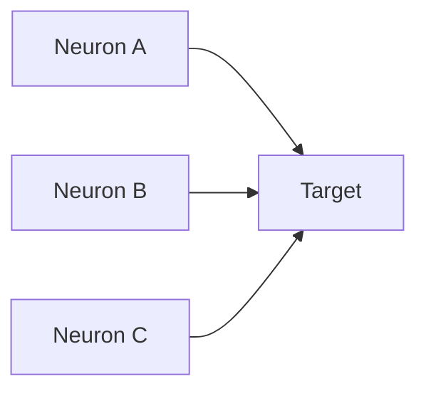
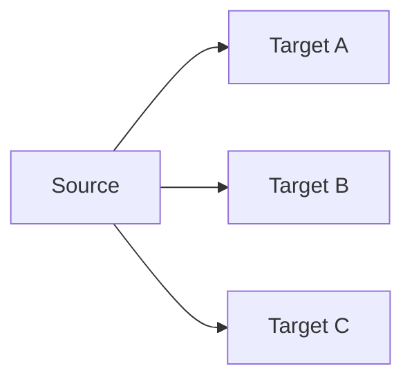
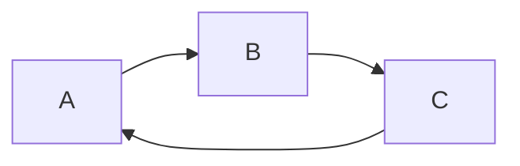

# From single neurons to populations, circuits, systems, and behavior

## If you landed here directly

This lesson assumes the cellular signaling foundations from `NNE-0003` through `NNE-0006`.

You should already know that:

- neurons generate membrane potentials and action potentials;
- action potentials propagate along axons;
- synapses transform presynaptic spikes into postsynaptic conductance changes;
- postsynaptic potentials are graded;
- neurons integrate excitation, inhibition, timing, location, and membrane state;
- a single neuron can influence many targets and receive many inputs.

Now we change scale.

The central question is:

> how do individual cellular events become coordinated neural activity, circuit computation, system-level function, and ultimately behavior?

This is not answered by simply saying:

> many neurons fire together.

We need a hierarchy of organization.

By the end, you should be able to explain:

- what a neural population is;
- what a neural circuit is;
- what a neural system is;
- how convergence and divergence reshape information flow;
- what feedforward, feedback, and recurrent connectivity mean;
- why excitation and inhibition matter at circuit scale;
- how population activity can represent variables more robustly than one cell alone;
- why correlation is not the same as causal contribution;
- why a recorded population is only a sample of the biological population;
- why behavior is a system-level outcome rather than a direct reading of one spike train;
- how scale, connectivity, dynamics, and measurement geometry jointly shape neural-engineering interpretations.

---

## The problem worth understanding

Imagine recording one motor-related neuron.

During one movement, its firing rate increases.

It is tempting to say:

> this neuron causes the movement.

That conclusion is too strong.

The neuron is embedded in:

```text
local synaptic inputs
→ local circuit
→ larger interacting circuits
→ sensory and motor systems
→ muscles and body
→ environment
→ new sensory feedback
```

Its activity may be:

- causally important;
- redundant with other neurons;
- correlated with a shared upstream input;
- one component of a distributed population code;
- influenced by feedback from the behavior itself.

So a neural signal must be interpreted at the correct organizational scale.

---

## The hierarchy of neural organization

A useful first hierarchy is:

```text
molecules / ion channels
→ membrane
→ neuron
→ synapse
→ local population
→ circuit
→ system
→ behavior
```

Each level depends on the previous ones.

But higher levels introduce new organization.

Knowing every Na+ channel state does not automatically tell you:

- which circuit is active;
- what variable a population represents;
- what movement occurs.

The mapping across levels is a scientific problem.

---

## A neuron is not an isolated computing box

A neuron receives many inputs.

Its output affects many targets.

Its membrane state depends on:

- local synaptic activity;
- neuromodulation;
- network state;
- recent history.

Therefore a neuron should often be understood as a node in a dynamical network.

Its response can change when the network context changes.

---

## Neural population

A **neural population** is a group of neurons considered together because they share some relevant:

- location;
- cell type;
- projection;
- response property;
- function;
- experimental grouping.

There is no single universal population boundary.

The useful population depends on the question.

Examples:

```text
neurons in one cortical layer
motor neurons controlling one muscle group
retinal ganglion cells
dopaminergic neurons in a nucleus
all recorded units on one electrode array
```

These are not equivalent groupings.

---

## Biological population versus recorded population

Suppose a brain region contains millions of neurons.

Your electrode array isolates 120 units.

Then:

```text
biological population
≠
recorded population
```

The recording is a sample.

It may be biased by:

- electrode placement;
- cell size;
- distance;
- spike amplitude;
- sorting quality;
- tissue response;
- hardware thresholds.

This distinction is fundamental in neural engineering.

---

## Population activity

At one time point, a simplified population state can be represented as:

```text
neuron 1 activity
neuron 2 activity
...
neuron n activity
```

For example:

```math
\mathbf{r}(t)=
\begin{bmatrix}
r_1(t)\\
r_2(t)\\
\vdots\\
r_n(t)
\end{bmatrix}.
```

Here `r_i(t)` could represent a firing-rate estimate for neuron `i`.

This vector is a model.

The underlying biology still consists of spikes, membrane states, synaptic currents, and cell-specific dynamics.

---

## One neuron can be ambiguous

Suppose one neuron fires at 20 spikes/s.

What does that mean?

Without context, very little.

The same rate could occur during:

- different movements;
- different sensory stimuli;
- different internal states.

Population patterns can disambiguate cases that one cell cannot.

---

## Distributed representation

A **distributed representation** means that a variable or state is reflected across the activity of multiple neurons rather than being assigned completely to one neuron.

A simple example:

```text
movement A:
[high, low, medium, low]

movement B:
[medium, high, low, medium]
```

Neither one neuron nor one spike necessarily identifies the state.

The pattern across neurons carries more structure.

---

## Distributed does not mean every neuron matters equally

Some neurons can be:

- more selective;
- more informative;
- more causally influential;
- more strongly connected.

Distributed representation does not require uniform contribution.

It means the relevant information is not assumed to live in one unique cell.

---

## Sparse versus dense population activity

A representation can be relatively **sparse**:

```text
few neurons strongly active
many weakly active
```

or relatively **dense**:

```text
many neurons participate
```

Real populations can show mixtures of these regimes.

Do not equate:

```text
distributed
with
dense
```

A sparse population code can still be distributed across a set of cells.

---

## Example NNE-EX-031 — one neuron versus a population pattern

Suppose three neurons produce average rates:

```text
Condition A:
N1 = 25
N2 = 5
N3 = 15

Condition B:
N1 = 25
N2 = 20
N3 = 3
```

Neuron `N1` alone cannot distinguish A from B.

But the population vector can:

```math
\mathbf{r}_A=
\begin{bmatrix}
25\\
5\\
15
\end{bmatrix},
\qquad
\mathbf{r}_B=
\begin{bmatrix}
25\\
20\\
3
\end{bmatrix}.
```

This does not prove the brain literally computes with that vector representation.

It shows why multi-neuron measurements can contain information unavailable from one unit.

---

## Ensemble

The word **ensemble** is often used for a group of neurons whose activity is analyzed collectively.

Depending on the field, ensemble may imply:

- simultaneous recording;
- coordinated activity;
- task relevance.

Do not assume `ensemble`, `population`, and `circuit` are perfect synonyms.

A recorded ensemble may not contain all neurons in the underlying biological circuit.

---

## Circuit

A **neural circuit** is a set of interconnected neurons whose synaptic organization supports some transformation or function.

Connectivity is central.

A random list of neurons is not automatically a circuit.

A circuit asks:

```text
who influences whom?
with what sign?
with what timing?
through what pathways?
```

---

## Connectivity creates computation

Suppose neurons have identical intrinsic membrane properties.

Different connectivity can still create different dynamics.

Example:

```text
Network A:
A → B → C

Network B:
A → B
B → C
C → B
```

The second network contains recurrence.

The same cell types can produce different behavior because connectivity differs.

---

## Synaptic graph

A simplified circuit can be represented as a graph:

```text
nodes:
neurons

edges:
synaptic influences
```

But biological edges have properties:

- excitatory/inhibitory/modulatory;
- strength;
- delay;
- plasticity;
- receptor kinetics;
- direction.

So a plain graph is only the start.

---

## Convergence

**Convergence** means multiple presynaptic neurons influence one target.



Convergence enables:

- integration;
- pooling;
- coincidence detection;
- combining multiple information sources.

`NNE-0006` described integration inside one neuron.

Convergence is the circuit architecture that supplies those multiple inputs.

---

## Divergence

**Divergence** means one neuron influences multiple downstream targets.



Divergence enables one signal to affect several pathways.

A single sensory or command-related signal can influence multiple downstream processes.

---

## Convergence and divergence coexist

Real circuits can contain both.

Example:

```text
many sensory neurons
→ convergent interneuron
→ divergent outputs
→ several motor pathways
```

This creates many-to-many information flow.

---

## Feedforward pathway

A **feedforward** circuit moves influence primarily from an earlier stage to a later stage.

Simplified:

```text
input
→ stage 1
→ stage 2
→ output
```

Feedforward does not mean:

- no recurrence anywhere;
- no feedback from the body;
- no lateral interactions.

It is a local architectural description.

---

## Feedback pathway

**Feedback** sends influence from a later stage back toward an earlier stage.

Example:

```text
stage 1 → stage 2
stage 2 → stage 1
```

Feedback can support:

- gain control;
- state estimation;
- attention;
- error correction;
- stabilization;
- amplification.

Its effect depends on sign and dynamics.

---

## Recurrent circuit

A **recurrent** circuit contains loops.

Activity can influence future activity through the network.



Recurrence creates memory-like state dependence.

The response at time `t` can depend on previous circuit activity.

---

## Recurrent does not automatically mean unstable

Positive feedback can amplify.

Negative feedback can stabilize.

Mixed recurrent connectivity can produce:

- persistent activity;
- oscillation;
- attractor-like states;
- sequence generation;
- controlled decay.

"Recurrent" only says loops exist.

---

## Excitation and inhibition at circuit scale

A circuit contains many excitatory and inhibitory interactions.

Inhibition can:

- prevent runaway excitation;
- sharpen selectivity;
- gate pathways;
- control timing;
- normalize population responses.

Excitation and inhibition create dynamical structure together.

---

## Feedforward inhibition

A source excites:

- a principal neuron;
- an inhibitory interneuron.

The interneuron then inhibits the principal neuron.

This can create a narrow timing window.

Simplified:

```text
input → target excitation
input → inhibitory neuron → target inhibition
```

The delayed inhibitory path can limit response duration.

---

## Feedback inhibition

A principal neuron activates an inhibitory neuron that feeds inhibition back.

Simplified:

```text
principal → inhibitory neuron
inhibitory neuron → principal
```

This can limit activity growth.

Again, actual circuits are more complex.

---

## Lateral inhibition

Neighboring channels can suppress one another through inhibitory circuitry.

This can increase contrast.

Classic sensory systems use variants of this logic.

The general computation is:

```text
strong local activation
→ suppress nearby competitors
→ sharpen relative differences
```

---

## Circuit motif

A **circuit motif** is a recurring connectivity pattern.

Examples:

- convergence;
- divergence;
- feedforward inhibition;
- feedback inhibition;
- recurrence.

Motifs are useful abstractions.

But the same motif can behave differently with different:

- synaptic strengths;
- delays;
- cell properties;
- neuromodulation.

Topology alone does not determine dynamics.

---

## Circuit state

A circuit is not defined only by static connections.

At one moment, its state includes:

- membrane voltages;
- recent spikes;
- synaptic conductances;
- adaptation;
- neuromodulatory state.

Same connectivity.

Different current state.

Different response.

---

## Example NNE-EX-032 — same connectivity, different state

Consider two identical recurrent circuits.

Circuit A begins with:

```text
low excitability
strong adaptation
```

Circuit B begins with:

```text
higher excitability
weak adaptation
```

Give both the same brief input.

They can produce different trajectories.

Therefore:

```text
connectivity
+
state
+
input
→ circuit response
```

not:

```text
connectivity alone
→ response
```

---

## Population dynamics

Instead of analyzing each neuron independently, we can examine how the population state changes over time:

```math
\mathbf{r}(t_1)\rightarrow
\mathbf{r}(t_2)\rightarrow
\mathbf{r}(t_3).
```

This trajectory can reveal:

- transitions;
- preparation;
- movement;
- decision states;
- oscillations.

Later lessons will formalize low-dimensional population dynamics.

---

## Population trajectory

Imagine three recorded dimensions.

At each time point, activity gives one point in a 3D activity space.

As time passes:

```text
point
→ point
→ point
→ trajectory
```

This is an analytical representation.

It does not imply a physical object moves through the brain.

The trajectory lives in a mathematical state space.

---

## Correlation between neurons

Two neurons can show correlated activity.

Possible reasons include:

- direct connection;
- shared input;
- common behavioral variable;
- common network state;
- chance.

Therefore:

> correlation does not identify the circuit mechanism by itself.

---

## Functional connectivity versus structural connectivity

**Structural connectivity** asks about physical connections.

**Functional connectivity** often describes statistical relationships among signals.

High functional coupling does not prove a direct synapse.

Low measured correlation does not prove absence of anatomical connection.

Keep anatomy and statistics separate.

---

## Effective connectivity

Some analyses use **effective connectivity** for directed causal influence estimated under a model.

This is stronger than simple correlation.

But it is still model dependent.

Neural engineering should distinguish:

```text
structural
functional
effective
```

connectivity.

---

## Synchrony

Neurons are **synchronous** when events or activity patterns align in time more than expected under a chosen reference.

Synchrony can matter for:

- downstream summation;
- oscillations;
- communication;
- field potentials.

But synchrony does not automatically imply:

- direct connectivity;
- same function;
- better computation.

---

## Oscillation

Population activity can exhibit rhythmic structure.

Common frequency-band labels exist in electrophysiology.

But a frequency band is not itself a mechanism.

An oscillation can arise from:

- recurrent excitation/inhibition;
- pacemaker properties;
- network coupling;
- external rhythmic drive.

Do not equate a spectral peak with one unique circuit explanation.

---

## Neural system

A **neural system** groups multiple circuits that contribute to a broader function.

Examples include:

- visual system;
- auditory system;
- somatosensory system;
- motor system.

A system typically spans:

- multiple anatomical regions;
- multiple cell types;
- multiple circuits;
- multiple processing stages.

---

## Circuits versus systems

Useful distinction:

```text
circuit:
specific interconnected neuronal organization

system:
larger coordinated collection of circuits serving broader functional goals
```

The boundary is question dependent.

Do not expect a single universally accepted scale cutoff.

---

## Sensory system example

A sensory system can include stages:

```text
receptor
→ peripheral nerve
→ brainstem / spinal processing
→ thalamic or other relay
→ cortex
→ association areas
```

Information is transformed at each stage.

It is not simply copied forward.

---

## Motor system example

A motor behavior can involve:

```text
goal / context
→ planning circuits
→ command pathways
→ spinal circuits
→ motor neurons
→ muscles
→ movement
```

Then:

```text
movement
→ sensory feedback
→ nervous system
```

The process is closed loop.

---

## Behavior closes the loop

Behavior changes:

- body position;
- sensory input;
- environment.

Those changes feed back into neural activity.

So:

```text
brain → behavior
```

is incomplete.

A better loop is:

```text
neural state
→ action
→ environment/body changes
→ sensory feedback
→ new neural state
```

---

## Example NNE-EX-033 — reaching as a closed loop

Suppose a person reaches for a cup.

A simplified chain:

```text
visual information
→ target estimation
→ movement planning
→ descending commands
→ spinal circuits
→ muscle activation
→ arm movement
```

But the movement changes:

- retinal image;
- proprioception;
- tactile input.

So:

```text
movement
→ new sensory input
→ ongoing correction
```

The behavior is produced by interaction among multiple neural systems and the body.

No one neuron's spike train is the whole behavior.

---

## Sensorimotor loop

A **sensorimotor loop** links sensing and action.

In engineering language:

```text
plant:
body + environment

sensors:
biological receptors

controller:
distributed neural circuitry

actuators:
muscles
```

This analogy is useful.

But the nervous system also adapts, learns, and changes its own internal state.

---

## Behavior is not simply decoded from cortex

A behavior depends on:

- neural activity;
- body mechanics;
- task rules;
- environment;
- feedback;
- history.

A decoder can predict behavior from neural signals.

Prediction does not prove that the recorded neurons alone generate the behavior.

---

## Representation versus causation

Suppose neural activity predicts hand velocity.

That may mean the activity:

- contributes causally to motor command;
- reflects upstream planning;
- reflects sensory feedback;
- correlates with another hidden process.

Prediction and causation are different questions.

---

## Causal intervention

Stronger causal evidence can come from intervention:

```text
stimulate circuit
silence circuit
lesion circuit
perturb timing
```

and observe how behavior changes.

Even then, interpretation must consider:

- off-target effects;
- compensation;
- network adaptation.

---

## Necessity and sufficiency

If disrupting a circuit prevents a behavior, the circuit may be **necessary** under those conditions.

If activating a circuit produces a behavior, it may be **sufficient** under those conditions.

A component can be:

- necessary but not sufficient;
- sufficient but not necessary;
- neither alone.

These are stronger concepts than correlation.

---

## Population code

A **population code** is a model in which a variable is represented in the joint activity of many neurons.

Examples of modeled variables include:

- direction;
- position;
- stimulus identity;
- decision state.

Do not assume every neural population uses one universal coding scheme.

"Population code" is a framework, not one algorithm.

---

## Tuning

A neuron is **tuned** when its response systematically varies with some variable.

Example:

```text
firing high for one movement direction
lower for another
```

Tuning does not imply the neuron represents only that variable.

A neuron can be **mixed selective**, responding to combinations of variables.

---

## Preferred stimulus is context dependent

A neuron's apparent preference can change with:

- task;
- attention;
- adaptation;
- behavioral state;
- measurement window.

Therefore tuning curves are experimental relationships, not immutable labels.

---

## Population vector intuition

If neurons have preferred directions and activity levels, one can sometimes combine their contributions into a population estimate.

This is historically important.

But real population decoding can use many methods.

Do not confuse one decoder model with the biological mechanism.

---

## Redundancy

Several neurons may carry overlapping information.

This can make a population representation robust to loss or noise.

But redundancy also means:

```text
same variable
may be decodable from many different subsets
```

So decoder success does not identify one unique causal set.

---

## Degeneracy

Different neural configurations can sometimes support similar functions.

This broader concept is often called **degeneracy**.

It helps explain why:

- neural systems can be robust;
- individual neurons can vary;
- similar behaviors can emerge from different activity patterns.

---

## Variability

Repeatedly presenting the same stimulus does not produce identical spikes every trial.

Neural responses vary because of:

- synaptic stochasticity;
- network state;
- intrinsic noise;
- uncontrolled variables;
- behavioral fluctuations.

Population analysis often asks whether shared structure can be extracted from this variability.

---

## Signal versus noise is task dependent

A fluctuation irrelevant to one decoder may carry information about another variable.

Therefore:

```text
noise
```

often means:

> unexplained variability relative to the current model.

Do not assume all residual activity is biologically meaningless.

---

## Shared variability

Neurons can fluctuate together.

Shared variability can arise from:

- common input;
- global state;
- recurrent interactions.

It affects how population information scales with neuron count.

Later statistical lessons will revisit covariance and correlation.

---

## Sampling changes apparent population structure

If you record:

```text
10 neurons
```

you may infer one structure.

Record:

```text
1000 neurons
```

and additional dimensions may appear.

Apparent dimensionality depends on:

- sample size;
- recording modality;
- task;
- preprocessing;
- time window.

---

## Measurement scale

Different neurotechnologies observe different scales.

### Intracellular electrode

One cell, detailed membrane dynamics.

### Extracellular microelectrode

Nearby spikes and local fields.

### Electrode array

Sampled population activity.

### ECoG

Mesoscopic cortical fields.

### EEG / MEG

Large-scale population fields.

### fMRI

Hemodynamic signals linked indirectly to neural activity.

No modality gives "the whole brain state."

---

## Scale mismatch

Suppose an EEG electrode records a rhythm.

Do not immediately attribute it to:

```text
one neuron firing rhythmically
```

The measurement reflects coordinated population currents over a large spatial scale.

Likewise, one unit's spike train cannot directly describe whole-system behavior.

Correct interpretation requires scale matching.

---

## Example NNE-EX-034 — one event at five scales

Take one finger movement.

Possible measurements:

```text
single motor-unit spikes
multi-unit cortical activity
local field potential
ECoG
EEG
```

All can change around the movement.

But they measure different physical aggregates.

Therefore:

```text
same behavior
≠
same neural variable across modalities
```

A neural engineer must identify the mapping between scale and signal.

---

## Neural circuit diagram versus true anatomy

A diagram might show:

```text
A → B → C
```

The real anatomy can include:

- thousands of neurons per node;
- recurrent loops;
- neuromodulation;
- multiple cell types;
- hidden inputs.

Circuit diagrams are compressed models.

They are useful precisely because they omit detail.

---

## Model boundary

Every circuit model has a boundary.

Inside:

```text
variables modeled explicitly
```

Outside:

```text
inputs treated as external
```

Changing the boundary changes interpretation.

A cortical circuit may be open to:

- thalamic input;
- neuromodulatory input;
- behavioral feedback.

---

## State and context

The same sensory input can produce different responses during:

- sleep;
- wakefulness;
- attention;
- movement;
- expectation.

So:

```text
input alone
```

does not determine population response.

A better conceptual model:

```text
input
+
network state
+
context
+
history
→ response
```

---

## Example NNE-EX-035 — decoder success versus causal claim

Suppose a decoder predicts left versus right movement from 50 neurons with high accuracy.

Valid conclusion:

> the recorded population contains information predictive of movement direction under the tested conditions.

Not automatically valid:

> these 50 neurons uniquely cause the movement.

To support causation, we need intervention or stronger causal evidence.

This distinction is essential in BCI interpretation.

---

## Neural decoding

A **decoder** maps neural measurements to an estimated variable.

Examples:

```text
spikes → cursor velocity
EEG → intended selection
ECoG → speech feature
```

Decoder performance depends on:

- signal quality;
- features;
- model;
- training distribution;
- neural stationarity.

---

## Neural encoding

An **encoding model** asks how a variable influences or predicts neural activity.

Example:

```text
stimulus orientation
→ predicted firing rate
```

Decoding reverses the practical direction:

```text
neural activity
→ estimated stimulus / behavior
```

Encoding and decoding answer different questions.

---

## A good decoder does not prove a good encoding theory

Several decoders can extract the same variable from correlated neural features.

Prediction can succeed without identifying the biological generative mechanism.

This is a general lesson for machine learning in neuroscience.

---

## Closed-loop BCI changes the system

In an open-loop experiment:

```text
record neural activity
→ analyze later
```

In a closed-loop BCI:

```text
neural activity
→ decoder
→ device movement
→ visual/proprioceptive feedback
→ neural activity changes
```

The decoder becomes part of the sensorimotor loop.

The user and algorithm can co-adapt.

---

## Population stationarity is not guaranteed

Recorded population statistics can change because of:

- learning;
- electrode drift;
- cell loss;
- arousal;
- task strategy;
- plasticity.

A decoder trained yesterday may degrade tomorrow.

Population-level modeling must handle nonstationarity.

---

## Emergence

An **emergent** circuit property is a behavior or dynamic pattern that is not meaningfully assigned to one component alone.

Examples can include:

- oscillation;
- persistent activity;
- competition;
- sequence generation.

The property arises from interactions.

"Emergent" does not mean mysterious.

It means the interaction structure matters.

---

## Circuit computation

A circuit can transform inputs.

Examples:

```text
combine signals
select one pathway
amplify differences
integrate over time
generate rhythm
maintain state
```

The computation depends on:

- connectivity;
- cell properties;
- synaptic dynamics;
- state.

---

## Time is part of the computation

A static connectivity graph cannot fully predict a dynamical circuit.

Neural computation unfolds in time.

Relevant timescales include:

- milliseconds for spikes;
- tens to hundreds of milliseconds for integration;
- seconds for state changes;
- longer for plasticity.

---

## Multiple timescales coexist

One circuit can simultaneously have:

```text
fast spiking
slower synaptic modulation
adaptation
plasticity
```

So one sampling rate or one static snapshot may miss important dynamics.

---

## Hierarchy is not strictly one-way

The hierarchy:

```text
neuron → circuit → system → behavior
```

is useful.

But influence also travels downward.

Example:

```text
behavioral context
→ neuromodulatory systems
→ local circuit state
→ single-neuron response
```

Higher-scale state can change lower-scale dynamics.

---

## Top-down influence

Top-down signals can modify sensory processing according to:

- attention;
- expectation;
- task demands.

This is one reason feedforward-only models are incomplete for many behaviors.

---

## Bottom-up influence

Sensory evidence can propagate from receptors toward higher processing stages.

Many systems combine:

```text
bottom-up evidence
+
top-down context
```

The exact architecture varies.

---

## Hierarchy versus distributed network

Some neural systems are described with hierarchical stages.

Others are highly recurrent and distributed.

These descriptions are not mutually exclusive.

A system can have:

- anatomical hierarchy;
- recurrent interactions;
- parallel pathways.

---

## Parallel processing

Different pathways can process aspects of information simultaneously.

Parallel processing can improve:

- speed;
- robustness;
- specialization.

But pathways often interact rather than remain independent.

---

## Serial processing

Some transformations occur in ordered stages.

Serial and parallel processing can coexist.

Avoid false binary thinking:

```text
brain is serial
or
brain is parallel
```

Real systems use both.

---

## Bottleneck

A **bottleneck** is a stage where available capacity limits information flow.

A bottleneck can arise from:

- few output neurons;
- slow dynamics;
- limited bandwidth;
- task constraints.

Neural interfaces also have bottlenecks:

```text
millions of neurons
→ hundreds of channels
→ decoder
```

---

## Dimensionality

A population with 1000 neurons has 1000 measured coordinates.

But activity may occupy a much lower-dimensional structure.

This means many neurons covary in organized ways.

Later lessons will study:

- low-dimensional manifolds;
- latent variables;
- PCA-like methods.

At L0, keep the distinction:

```text
number of neurons
≠
effective number of independent activity patterns
```

---

## High-dimensional representation

Some tasks may use many independent activity dimensions.

High-dimensional representations can support separability and flexible coding.

Again, "high" and "low" are relative to the measurement and task.

---

## Circuit anatomy and population dynamics are complementary

Anatomy tells us:

```text
who can influence whom
```

Dynamics tell us:

```text
what activity actually happens over time
```

One without the other is incomplete.

---

## Lesions and compensation

Damage to one region can alter behavior.

But other circuits may compensate over time.

Therefore a lesion result can depend on:

- lesion extent;
- adaptation time;
- alternative pathways.

Neural systems are adaptive.

---

## Stimulation and network spread

Stimulating one region does not necessarily affect only local neurons.

Activity can propagate through connected circuits.

A stimulation effect can include:

- local activation;
- downstream activation;
- feedback;
- inhibition;
- network-state change.

This matters when interpreting DBS, TMS, cortical stimulation, and peripheral stimulation.

---

## Recording is also a sampling intervention

Most recording is designed to be minimally perturbative.

But electrodes can still:

- displace tissue;
- alter local environment;
- sample selectively.

Measurement is never completely abstract from the biological substrate.

---

## Behavior as the final observable

Behavior can include:

- movement;
- speech;
- choice;
- autonomic response;
- report.

Behavior is not only an "output."

It also changes future inputs.

This closes the organism-environment loop.

---

## Common failure mode: one neuron equals one behavior

Too simple.

A neuron's activity occurs in a population and circuit context.

---

## Common failure mode: a population is just every neuron nearby

Population definition depends on the scientific question.

Nearby neurons may belong to different circuits.

Distant neurons may participate in the same system.

---

## Common failure mode: recorded population equals biological population

No.

Recordings sample selectively.

---

## Common failure mode: circuit means any group of neurons

Connectivity and functional interaction matter.

---

## Common failure mode: correlated neurons are directly connected

Not necessarily.

They may share input or state.

---

## Common failure mode: high decoding accuracy proves causation

No.

Prediction and causal contribution are different.

---

## Common failure mode: feedback is always negative feedback

No.

Feedback can be excitatory, inhibitory, stabilizing, amplifying, or context dependent.

---

## Common failure mode: recurrence means instability

No.

Recurrent networks can be stable or unstable depending on parameters.

---

## Common failure mode: inhibition simply turns neurons off

Inhibition can shape timing, gain, contrast, and pathway selection.

---

## Common failure mode: oscillation frequency identifies one mechanism

No.

Similar spectral patterns can arise through different circuits.

---

## Common failure mode: behavior is generated by brain alone

Behavior depends on brain, body, environment, and feedback.

---

## Common failure mode: EEG is population firing rate

EEG reflects aggregate extracellular fields, especially synchronized transmembrane currents.

It is not a direct population spike-count meter.

---

## Common failure mode: more recorded neurons always means complete understanding

More channels can improve sampling.

But interpretation still requires models, behavior, anatomy, and causal testing.

---

## Active work

### Exercise 1 — scale ladder

For a hand movement, write one plausible object at each scale:

```text
neuron
population
circuit
system
behavior
```

Explain what information is lost when moving upward.

### Exercise 2 — convergence and divergence

Draw:

- one convergent motif;
- one divergent motif.

Give one functional reason each could be useful.

### Exercise 3 — recurrent state

Build a three-neuron recurrent loop.

Explain why the response can depend on previous activity even when the new input is identical.

### Exercise 4 — correlation

Two neurons have highly correlated firing.

List at least four explanations that do **not** require a direct synapse between them.

### Exercise 5 — population decoding

Construct two population vectors where neuron 1 has the same activity in both conditions but the whole vector differs.

Explain why population decoding succeeds where single-neuron classification fails.

### Exercise 6 — causal claim

Rewrite:

> "This neuron predicts movement, therefore it causes movement."

into a scientifically defensible statement.

Then state one intervention that could provide stronger causal evidence.

### Exercise 7 — scale matching

For each modality:

```text
single-unit electrode
ECoG
EEG
fMRI
```

state the rough biological scale it samples and one interpretation error to avoid.

### Exercise 8 — closed loop

Draw:

```text
neural activity
→ decoder
→ device
→ environment
→ sensory feedback
→ neural activity
```

Explain why decoder performance can change over training even if the code is unchanged.

---

## Retrieval check

Without looking back:

1. What is a neural population?
2. What is a recorded population?
3. Why are they not identical?
4. What is a neural circuit?
5. What role does connectivity play?
6. What is convergence?
7. What is divergence?
8. What is feedforward connectivity?
9. What is feedback?
10. What is recurrence?
11. Why does recurrence create history dependence?
12. What is feedforward inhibition?
13. What is feedback inhibition?
14. What is lateral inhibition?
15. What is a circuit motif?
16. Why does topology alone not determine dynamics?
17. What is a neural system?
18. How is a system different from a local circuit?
19. What is distributed representation?
20. Does distributed mean every neuron contributes equally?
21. What is population activity?
22. What is a population trajectory?
23. What is tuning?
24. Why is tuning context dependent?
25. What is synchrony?
26. Why does synchrony not prove direct connectivity?
27. What is structural connectivity?
28. What is functional connectivity?
29. What is effective connectivity?
30. Why is correlation not causation?
31. What is a decoder?
32. What is an encoding model?
33. Why can a decoder succeed without revealing mechanism?
34. What is a sensorimotor loop?
35. Why does behavior create feedback?
36. What is redundancy?
37. What is degeneracy?
38. What is neural variability?
39. Why can residual variability still contain information?
40. What is dimensionality at population scale?
41. Why can 1000 neurons occupy a lower-dimensional activity structure?
42. What is an emergent circuit property?
43. Why must circuit analysis include time?
44. Why does stimulation affect connected networks?
45. Why must neural-engineering interpretations match measurement scale?

---

## Connection backward: NNE-0006

`NNE-0006` gave the connection rule:

```text
presynaptic neuron
→ synapse
→ postsynaptic influence
```

This lesson scales that rule:

```text
many synapses
→ interconnected neurons
→ circuits
→ interacting systems
→ behavior
```

The transition from cell to circuit is not a new physical law.

It is organization of many known mechanisms.

---

## Connection backward: NNE-0005

Action potentials provide long-distance discrete events.

At population scale, we now care about:

- who spikes;
- when;
- how often;
- with whom;
- in what circuit state.

The spike becomes one coordinate in a larger dynamic pattern.

---

## Connection forward: NNE-0008

The next canonical lesson is:

`NNE-N-0008 — Neural signal types: spikes, field potentials, EEG, EMG, and hemodynamic signals`.

This lesson prepares the key question:

> which level of the hierarchy does a measurement actually observe?

Different signal types emphasize different:

- physical mechanisms;
- spatial scales;
- temporal scales;
- populations.

---

## Connection forward: neural recording

Later recording lessons will separate:

```text
single-unit
multi-unit
LFP
ECoG
EEG
ENG
EMG
```

The interpretation of each depends on the scale ladder learned here.

---

## Connection forward: decoding

Later computational lessons will represent a population using vectors and matrices.

A decoder might map:

```math
\mathbf{r}(t)\rightarrow\hat{\mathbf{y}}(t).
```

But the biological population is not identical to the mathematical vector.

The vector is a representation of measurements.

---

## Connection to Linear Algebra

Population activity naturally becomes a vector:

```math
\mathbf{r}=
\begin{bmatrix}
r_1\\
r_2\\
\vdots\\
r_n
\end{bmatrix}.
```

Multiple time points can form a matrix:

```text
neurons × time
```

or:

```text
time × neurons
```

depending on convention.

This makes shape semantics critical.

The next Linear Algebra lesson introduces matrices precisely as organized arrays and operators.

---

## Connection to control

Neural systems participate in feedback control:

```text
state estimate
→ action
→ body/environment
→ sensors
→ state estimate
```

Closed-loop neurotechnology inserts engineered components into this loop.

Understanding circuit/system scale is therefore essential before stimulation and decoding.

---

## What this unlocks

You should now be able to reason through:

```text
single-cell signals
→ population patterns
→ synaptic connectivity
→ circuit dynamics
→ distributed neural systems
→ behavior
→ sensory feedback
→ new neural activity
```

and distinguish:

```text
recorded activity
from
biological population

correlation
from
causation

circuit
from
system

prediction
from
mechanism
```

That is the conceptual foundation needed to understand what different neural recording modalities actually measure.

---

## References

- **NNE-REF-033** — Purves et al., *Neuroscience*, 2nd ed., “Neural Circuits,” NCBI Bookshelf.
- **NNE-REF-034** — Purves et al., *Neuroscience*, 2nd ed., “Neural Systems,” NCBI Bookshelf.
- **NNE-REF-035** — Purves et al., *Neuroscience*, 2nd ed., Chapter 1, “The Organization of the Nervous System,” NCBI Bookshelf.
- **NNE-REF-036** — OpenStax, *Introduction to Behavioral Neuroscience*, §2.2, “Neural Circuits,” especially circuit motifs, feedback, excitation/inhibition balance, and computational modeling.
