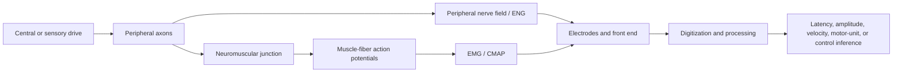

# Peripheral neural and neuromuscular signals: ENG and EMG

## If you landed here directly

The direct prerequisite is:

`NNE-0018 — Scalp EEG: potentials, montages, volume conduction, and spatial ambiguity`.

That lesson established three reusable rules:

```text
electrode location
≠
unique source location

channel
=
voltage difference

measured amplitude
≠
direct scalar amount of biological activity
```

Those rules remain true in the periphery.

But the source anatomy changes dramatically.

Instead of asking:

```text
what distributed cortical currents reached the scalp?
```

we now ask questions such as:

```text
what propagated along a peripheral nerve?

what electrical activity occurred in muscle fibers?

what does a nerve stimulus followed by a muscle response actually measure?

how do electrode placement, tissue, recruitment, conduction, and cancellation shape the waveform?
```

The sentence to keep throughout this lesson is:

> ENG and EMG are related but not interchangeable: ENG records electrical activity propagating in peripheral nerves, whereas EMG records electrical activity generated by muscle fibers; a compound muscle action potential evoked by stimulating a motor nerve is therefore a muscle response used to infer nerve function, not a direct recording of the motor nerve itself.

---

# Part I — Why this distinction matters

A common introductory diagram looks like:

```text
motor neuron
→ peripheral nerve
→ neuromuscular junction
→ muscle
```

It is tempting to call every voltage measured anywhere along that chain a "nerve signal."

That is wrong.

The biological source represented in the waveform depends on **where the recording electrodes are**.

For example:

```text
record from nerve
→ neural action potentials

record from muscle
→ muscle-fiber action potentials
```

Even if the muscle response was triggered by stimulating the nerve.

The stimulus location and the recording location are different parts of the measurement chain.

---

# Part II — The peripheral pathway as a measurement chain

For a motor pathway:

```text
spinal motor neuron
→ motor axon
→ peripheral nerve
→ neuromuscular junction
→ muscle-fiber action potentials
→ contraction
```

For a sensory pathway:

```text
peripheral receptor / sensory ending
→ sensory axon
→ peripheral nerve
→ central nervous system
```

Different experiments place sensors at different points.

That changes what can be inferred.

---

# Part III — A peripheral nerve is not one wire

A peripheral nerve contains many axons.

These axons can differ in:

- diameter;
- myelination;
- conduction velocity;
- modality;
- direction of physiological information flow;
- recruitment by an external electrical stimulus.

So an extracellular electrode near a nerve usually does not isolate one axon.

It often records a **compound** signal.

---

# Part IV — Single-fiber action potential versus compound nerve action potential

Suppose axon $k$ contributes an extracellular waveform $s_k(t)$ with amplitude factor $a_k$ and delay $\tau_k$.

A simplified compound nerve action potential can be written as:

$$ V_{\mathrm{CNAP}}(t)\approx\sum_{k=1}^{N}a_k s_k(t-\tau_k) $$

This is a superposition model.

The measured compound waveform depends on:

```text
which axons were activated
+
their conduction velocities
+
their spatial position
+
electrode geometry
+
volume conduction
+
temporal dispersion
```

So:

```text
CNAP amplitude
≠
number of active axons by itself
```

---

# Part V — What ENG means here

In this curriculum, **ENG — electroneurography** means electrical recording from a peripheral nerve or nerve bundle.

Possible recording arrangements include:

- electrodes placed near a superficial nerve;
- percutaneous or needle-adjacent recordings in clinical or research contexts;
- cuff electrodes around a nerve in implanted interfaces;
- intraoperative direct nerve recordings.

The essential criterion is not the device name.

It is:

> the recorded source is the propagating electrical activity of peripheral axons.

---

# Part VI — ENG can be spontaneous or evoked

An ENG signal can arise from:

```text
natural physiological activity
```

or from:

```text
electrical stimulation
→ evoked compound neural response
```

Evoked recordings are useful because stimulus timing provides a known temporal reference.

But the stimulus artifact can also be large.

Detailed artifact control belongs later.

---

# Part VII — A compound response is a population signal

Suppose a nerve stimulus recruits 500 myelinated fibers.

The electrode does not necessarily produce 500 individually visible spikes.

Instead, many single-fiber contributions overlap.

At lower stimulus intensity:

```text
subset of excitable fibers
→ smaller compound response
```

As stimulus intensity increases:

```text
more fibers recruited
→ compound response changes
```

until recruitment approaches a plateau.

But amplitude can also change because of geometry, dispersion, and cancellation.

---

# Part VIII — Temporal dispersion

Axons do not all conduct at exactly the same speed.

If a stimulus occurs at one location and a recording electrode is farther away:

```text
fast fibers arrive earlier
slow fibers arrive later
```

The population response spreads in time.

This is **temporal dispersion**.

It can reduce the sharpness and peak amplitude of a compound waveform even when many axons are still conducting.

---

# Part IX — Phase cancellation in nerve recordings

If individual fiber waveforms overlap with different phases:

```text
positive contribution
+
negative contribution
→ partial cancellation
```

Therefore:

```text
smaller compound amplitude
```

can result from:

- fewer conducting fibers;
- greater dispersion;
- stronger phase cancellation;
- altered recording geometry;

or combinations of these.

Amplitude alone is not a complete diagnosis of mechanism.

---

# Part X — Sensory nerve action potentials

In a sensory nerve conduction study, a peripheral sensory nerve is stimulated and the propagating compound neural response is recorded from the nerve.

The recorded waveform is commonly called a:

```text
SNAP
=
sensory nerve action potential
```

A SNAP is a **neural** compound response.

The recording electrode is sensing activity in sensory axons.

---

# Part XI — Orthodromic and antidromic sensory conduction

Physiological sensory signals normally travel toward the CNS.

That is the **orthodromic** direction.

Electrical stimulation can also launch action potentials in the opposite direction.

That is **antidromic** propagation.

Therefore:

```text
direction of evoked propagation
≠
necessarily physiological information direction
```

Electrical stimulation can drive axons both ways from the stimulation site.

---

# Part XII — Motor nerve conduction studies are different

A common clinical motor nerve conduction experiment does this:

```text
stimulate motor nerve
→ action potentials propagate in motor axons
→ neuromuscular junction activates muscle fibers
→ record electrical response from muscle
```

The recorded waveform is called a:

```text
CMAP
=
compound muscle action potential
```

or often an:

```text
M-wave
```

The crucial distinction is:

> the CMAP is recorded from muscle, not directly from the motor nerve.

---

# Part XIII — Verified visual anchor: stimulation is not the same as recording location


*Visual anchor — photograph by Paul Anthony Stewart showing surface stimulating electrodes positioned over the ulnar-nerve region and separate surface recording electrodes on the hand. Use the photograph to inspect the physical separation between **where a nerve is stimulated** and **where the evoked muscle response is recorded**. The visible recording arrangement is therefore useful for understanding a nerve-to-muscle CMAP measurement; it should not be mislabeled as direct ENG from the motor nerve. Source: [Wikimedia Commons — Electromyographic recording at adductor pollicis muscle and stimulation of the ulnar nerve.jpg](https://commons.wikimedia.org/wiki/File:Electromyographic_recording_at_adductor_pollicis_muscle_and_stimulation_of_the_ulnar_nerve.jpg), Paul Anthony Stewart, CC BY-SA 4.0. Registry: `NNE-REF-097`.*

The visual solves this physical question:

```text
where is stimulation delivered
relative to
where voltage is recorded?
```

It does **not** establish one universal clinical placement protocol.

---

# Part XIV — Three measurements that are often confused

| Experiment | Stimulate | Record | Main recorded source |
|---|---|---|---|
| sensory NCS | sensory nerve | sensory nerve | compound sensory axon activity — SNAP |
| direct ENG / CNAP experiment | peripheral nerve | peripheral nerve | compound peripheral axon activity |
| motor NCS | motor nerve | muscle | compound muscle-fiber activity — CMAP |

That table is worth memorizing.

Especially:

```text
motor nerve stimulation
+
muscle recording
=
CMAP
```

not:

```text
direct motor ENG
```

---

# Part XV — Why motor conduction velocity uses two stimulation sites

A distal motor latency includes more than axonal travel time.

It contains contributions from:

```text
nerve conduction
+
neuromuscular transmission
+
muscle-fiber activation and propagation
+
instrument / threshold definitions
```

If the nerve is stimulated at two sites and the CMAP is recorded from the same muscle:

```text
proximal latency
-
distal latency
```

cancels much of the distal neuromuscular and muscle delay.

That isolates the conduction time along the nerve segment between stimulation sites more effectively.

---

# Part XVI — Worked example NNE-EX-089: motor conduction velocity

Suppose:

```text
distance between wrist and elbow stimulation sites = 0.25 m

distal CMAP onset latency = 3.8 ms

proximal CMAP onset latency = 8.0 ms
```

The nerve-segment travel time is:

$$ \Delta t=8.0\ \mathrm{ms}-3.8\ \mathrm{ms}=4.2\ \mathrm{ms} $$

Therefore:

$$ v=\frac{0.25\ \mathrm{m}}{0.0042\ \mathrm{s}}\approx59.5\ \mathrm{m/s} $$

The important reasoning is not merely the arithmetic.

It is:

```text
do not use proximal latency alone
```

because that latency contains delays outside the proximal nerve segment.

---

# Part XVII — Sensory conduction velocity can use a simpler geometry

For an evoked sensory nerve response:

```text
stimulus
→ propagation along sensory axons
→ nerve recording
```

a known stimulus-to-recording distance can be paired with an appropriate latency measure.

If:

```text
distance = 0.14 m
latency = 2.6 ms
```

then:

$$ v\approx\frac{0.14}{0.0026}\approx53.8\ \mathrm{m/s} $$

This is a simplified teaching example.

Clinical interpretation requires standardized distance, temperature, electrode placement, and waveform definitions.

---

# Part XVIII — Worked example NNE-EX-090: velocity and amplitude answer different questions

Consider two sensory responses:

```text
response A:
conduction velocity = 54 m/s
peak amplitude = 20 μV

response B:
conduction velocity = 54 m/s
peak amplitude = 8 μV
```

The unchanged velocity does not imply the responses are identical.

The lower amplitude could reflect:

- fewer effective contributors;
- electrode geometry;
- dispersion;
- cancellation;
- recording conditions.

Likewise:

```text
same amplitude
≠
same conduction velocity
```

Do not collapse waveform dimensions into one score.

---

# Part XIX — Temperature matters

Peripheral conduction velocity changes with temperature.

Cooler limbs can produce:

- slower measured conduction;
- longer distal latency;
- altered waveform duration or amplitude.

Therefore a nerve-conduction number without temperature context can be misleading.

This is a measurement-system issue, not merely a biological footnote.

---

# Part XX — Distance measurement matters

If conduction velocity is:

$$ v=\frac{\Delta x}{\Delta t} $$

then error in $\Delta x$ becomes error in $v$.

A curved nerve path measured as a straight surface distance can introduce mismatch.

Electrode and stimulation landmarks therefore matter.

---

# Part XXI — Latency has a definition

A waveform can have:

- onset latency;
- peak latency;
- other feature latencies.

They are not interchangeable.

When comparing measurements:

```text
same physiological event
+
different latency definition
→
different numerical result
```

Clinical standards define which feature should be measured for a given test.

---

# Part XXII — Conduction block versus temporal dispersion

Suppose a proximal nerve stimulus produces a smaller, broader CMAP than a distal stimulus.

Possible mechanisms include:

```text
conduction failure in some fibers
```

and/or:

```text
greater temporal dispersion
→
greater phase cancellation
```

Interpreting the difference requires more than checking peak amplitude.

This is why area, duration, waveform shape, and standardized technique can matter.

---

# Part XXIII — ENG and stimulation artifact

An electrical stimulus can produce a large artifact near time zero.

The artifact may be much larger than the neural response.

So:

```text
largest early transient
≠
necessarily nerve action potential
```

The measurement chain must distinguish:

```text
stimulus artifact
from
evoked biological response
```

Detailed artifact mechanisms are deferred to `NNE-N-0025`.

---

# Part XXIV — Now move downstream: what EMG measures

**Electromyography — EMG** records electrical activity generated by muscle fibers.

The relevant causal chain is:

```text
motor-neuron discharge
→ axonal action potential
→ neuromuscular junction
→ muscle-fiber action potentials
→ extracellular field
→ EMG electrode
```

So EMG is downstream of motor-neuron activity.

That makes it informative about neural drive.

But not identical to neural drive.

---

# Part XXV — The motor unit

A **motor unit** consists of:

```text
one alpha motor neuron
+
its axon
+
all skeletal muscle fibers innervated by that neuron
```

When the motor neuron discharges:

```text
axon action potential
→ neuromuscular transmission
→ action potentials in many muscle fibers
```

The muscle-fiber contributions form a motor-unit electrical signature.

---

# Part XXVI — Muscle-fiber action potential versus motor-unit action potential

One muscle fiber produces a propagating muscle-fiber action potential.

A motor unit contains many muscle fibers.

Their extracellular contributions sum to produce a recorded:

```text
MUAP
=
motor unit action potential
```

or in needle-EMG terminology often:

```text
MUP
=
motor unit potential
```

The waveform depends on the recording configuration.

---

# Part XXVII — A MUAP is not a motor-neuron spike waveform

The motor neuron initiates the event.

But the EMG waveform is generated in muscle tissue.

Therefore:

```text
MUAP
≠
extracellular spike recorded from the motor-neuron axon
```

The relationship is causal, not identity.

---

# Part XXVIII — Surface EMG is usually a mixture

During voluntary contraction, many motor units discharge.

A simplified surface EMG model is:

$$ x(t)=\sum_k\sum_r h_k(t-t_{k,r})+n(t) $$

where:

- $t_{k,r}$ is the $r$th discharge time of motor unit $k$;
- $h_k$ is the recorded MUAP waveform for that motor unit;
- $n(t)$ represents noise and unmodeled contributions.

This equation captures a central fact:

> surface EMG is a mixture of motor-unit action-potential trains.

---

# Part XXIX — The interference pattern

At weak contraction:

```text
few motor units active
→
individual MUAPs may be more distinguishable
```

At stronger contraction:

```text
more units
+
higher discharge rates
→
greater temporal overlap
→
interference-pattern EMG
```

The apparent "noise-like" waveform is structured biological superposition.

---

# Part XXX — Surface EMG is a volume-conducted signal

Muscle fibers are beneath:

- muscle tissue;
- fascia;
- subcutaneous fat;
- skin.

Their fields spread through these tissues.

Therefore:

```text
surface EMG electrode
←
weighted mixture from a detection volume
```

The weighting depends on:

- depth;
- orientation;
- distance;
- tissue conductivity;
- electrode geometry.

---

# Part XXXI — Deeper motor units are usually attenuated more strongly

A deeper source is farther from the surface electrodes.

Its field is generally more spatially smoothed and attenuated.

Therefore:

```text
surface EMG
is not an unbiased census
of all active motor units
```

Superficial units often contribute more strongly to the measured waveform.

---

# Part XXXII — Subcutaneous fat is a spatial filter

A thicker adipose layer increases source-to-electrode distance and smooths spatial detail.

Two people producing similar underlying muscle activation can therefore yield different surface EMG amplitudes.

So:

```text
between-person EMG amplitude comparison
```

requires caution.

---

# Part XXXIII — Differential surface EMG

A common bipolar surface EMG channel is:

$$ V_{\mathrm{EMG}}(t)=\phi_1(t)-\phi_2(t) $$

Two nearby electrodes sample the skin potential field.

The subtraction emphasizes spatial differences.

This is conceptually related to bipolar EEG.

But the physical sources are different.

---

# Part XXXIV — Electrode orientation matters

Muscle-fiber action potentials propagate along fibers.

A bipolar electrode pair aligned with the dominant fiber direction samples this propagation differently from a pair rotated away from the fibers.

Therefore:

```text
same muscle
+
different electrode orientation
→
different waveform
```

Electrode placement is part of the measurement definition.

---

# Part XXXV — Interelectrode distance matters

Increasing the distance between a bipolar electrode pair changes:

- detection volume;
- spatial filtering;
- amplitude;
- frequency content;
- crosstalk sensitivity.

Therefore:

```text
electrode spacing
≠
cosmetic setup choice
```

SENIAM recommendations exist partly to improve reproducibility.

---

# Part XXXVI — The innervation zone matters

Muscle-fiber action potentials propagate away from the neuromuscular junction region.

If a bipolar electrode pair straddles or lies near an innervation zone, the two electrodes can detect similar or opposite propagating contributions in ways that strongly alter amplitude.

A placement that looks centered on the muscle can therefore be a poor choice for some measurements.

---

# Part XXXVII — Worked example NNE-EX-091: the same propagating event under two electrode pairs

Imagine a MUAP moving along muscle fibers.

At one instant:

```text
pair A:
φ1 = +0.8 mV
φ2 = +0.2 mV

pair B near a symmetric innervation-zone geometry:
φ3 = +0.5 mV
φ4 = +0.5 mV
```

Differential outputs are:

$$ V_A=0.8-0.2=0.6\ \mathrm{mV} $$

and:

$$ V_B=0.5-0.5=0\ \mathrm{mV} $$

The zero from pair B does not mean:

```text
no muscle activation
```

It means:

```text
the chosen differential geometry canceled the sampled field
at that moment
```

---

# Part XXXVIII — Crosstalk

A surface electrode over muscle A can also detect activity from nearby muscle B.

This is **crosstalk**.

Its magnitude depends on:

- anatomy;
- source depth;
- electrode size;
- spacing;
- placement;
- tissue properties;
- contraction pattern.

So:

```text
signal recorded over one muscle
≠
guaranteed signal exclusively from that muscle
```

---

# Part XXXIX — Crosstalk is not electronic channel leakage

As with EEG volume conduction:

```text
biological field from neighboring muscle
→ electrode
```

is not the same mechanism as:

```text
electronic channel A
→ contaminates channel B through hardware
```

Do not use one term for both.

---

# Part XL — Surface EMG versus intramuscular EMG

## Surface EMG

Advantages:

- noninvasive;
- repeatable;
- convenient;
- useful for global muscle activation patterns;
- compatible with arrays and high-density recording.

Limitations:

- broad detection volume;
- crosstalk;
- strong geometry dependence;
- limited access to deep muscles;
- mixture of many motor units.

## Intramuscular / needle or fine-wire EMG

Advantages:

- more spatially selective;
- can access deeper muscles;
- can isolate individual motor-unit activity more directly.

Limitations:

- invasive;
- smaller sampled tissue volume;
- placement-sensitive;
- discomfort and procedural constraints.

---

# Part XLI — "More selective" does not mean "more representative"

A needle electrode can provide highly local information.

But:

```text
local sample
≠
whole-muscle activity
```

Surface EMG sees a broader mixture.

Intramuscular EMG sees a smaller region.

Neither is universally "better."

They answer different questions.

---

# Part XLII — Needle EMG at rest

A healthy resting skeletal muscle normally has little ongoing voluntary motor-unit activity.

Needle EMG can reveal spontaneous electrical activity under some pathological conditions.

But interpreting specific spontaneous waveforms belongs to clinical electrodiagnostic training.

This lesson focuses on measurement logic, not diagnosis.

---

# Part XLIII — Voluntary EMG

During voluntary contraction, the CNS modulates force partly through:

- motor-unit recruitment;
- motor-unit discharge rate;
- synchronization and common synaptic inputs;
- muscle mechanics.

EMG reflects the electrical consequences of these processes.

But the mapping is many-to-one and context-dependent.

---

# Part XLIV — Recruitment

As force demand increases, additional motor units are generally recruited.

This tends to increase the number of MUAP trains contributing to the EMG.

But:

```text
more recruited units
→
not necessarily proportional increase in surface EMG amplitude
```

because of cancellation and geometry.

---

# Part XLV — Rate coding

Already-active motor units can also increase discharge rate.

That changes temporal overlap and the statistical structure of EMG.

Thus two contractions with the same number of recruited motor units can have different EMG characteristics.

---

# Part XLVI — EMG amplitude is not motor-neuron firing rate

A global amplitude measure such as rectified mean or RMS can correlate with muscle activation under controlled conditions.

But it is not physically identical to:

- motor-neuron firing rate;
- number of recruited motor units;
- muscle force;
- muscle activation percentage.

It is a transformed feature of a mixed electrical signal.

---

# Part XLVII — Amplitude cancellation

Two MUAP contributions can overlap with opposite polarity.

If:

```text
MUAP A = +0.8 mV
MUAP B = -0.6 mV
```

then the instantaneous sum is:

```text
+0.2 mV
```

Both motor units are active.

The observed amplitude is small because of cancellation.

---

# Part XLVIII — Worked example NNE-EX-092: stronger neural drive can fail to double EMG amplitude

Suppose condition 1 has one dominant contribution:

```text
+0.8 mV
```

Condition 2 adds a second simultaneously active contribution:

```text
+0.8 mV
+
-0.6 mV
=
+0.2 mV
```

It would be absurd to conclude:

> condition 2 has one quarter the neural drive.

The waveform is a signed superposition.

Global EMG amplitude depends on the timing and shape of overlapping MUAPs.

---

# Part XLIX — EMG amplitude and muscle force

Under controlled isometric conditions and within a limited range, EMG amplitude often increases with force.

But the relationship can be:

- nonlinear;
- muscle-dependent;
- contraction-type-dependent;
- task-dependent;
- affected by fatigue;
- affected by electrode geometry.

Therefore:

```text
EMG amplitude
≠
universal force sensor
```

---

# Part L — Dynamic movement makes geometry move

During movement:

- muscle fibers shorten;
- pennation angles change;
- muscle belly shifts relative to the skin;
- electrodes can move relative to innervation zones;
- cable movement can occur.

Thus a changing EMG waveform can reflect both:

```text
changed neural drive
```

and:

```text
changed recording geometry
```

---

# Part LI — Conduction velocity in muscle fibers

Muscle-fiber action potentials propagate along muscle fibers.

With a linear array aligned along the fiber direction, the same propagating MUAP can appear at neighboring channels with a time delay.

If distance $d$ and delay $\Delta t$ are known:

$$ v_{\mathrm{muscle}}=\frac{d}{\Delta t} $$

This looks mathematically like nerve conduction velocity.

But the biological conductor is different.

---

# Part LII — Nerve conduction velocity and muscle-fiber conduction velocity are not the same variable

Both use units such as:

```text
m/s
```

But:

```text
nerve conduction velocity
→ propagation along peripheral axons
```

whereas:

```text
muscle-fiber conduction velocity
→ propagation along muscle membrane
```

Never report one as the other.

---

# Part LIII — Propagation direction differs in muscle

A muscle-fiber action potential begins near the neuromuscular junction and generally propagates toward tendon regions in both directions along the fiber.

Therefore:

```text
one motor-neuron discharge
→
bidirectional muscle-fiber propagation
```

Surface arrays can exploit this spatial pattern.

---

# Part LIV — High-density surface EMG

High-density EMG uses many closely spaced electrodes.

Instead of one or two time series, it samples a two-dimensional skin-potential field.

This can reveal:

- propagation;
- innervation-zone location;
- spatial signatures of motor units;
- local conduction velocity;
- spatial distribution changes.

It is the peripheral analogue of moving from one sensor to an array.

---

# Part LV — High-density EMG is not simply "more amplitude channels"

The value of the array is spatial structure.

Adjacent channels can show:

```text
time shifts
polarity reversals
localized maxima
propagation patterns
```

The array can therefore support source-separation and decomposition methods that a single bipolar pair cannot.

---

# Part LVI — EMG decomposition

Advanced algorithms can estimate:

- motor-unit discharge times;
- MUAP templates;
- recruitment behavior;

from intramuscular or high-density surface EMG.

This is powerful.

But:

```text
decomposition output
≠
ground-truth motor neuron spike train automatically
```

Validation, signal quality, overlap, and model assumptions matter.

---

# Part LVII — Modern EMG can become a neural interface

Once motor-unit discharge information can be estimated, EMG can support:

- prosthetic control;
- human-machine interfaces;
- rehabilitation feedback;
- motor-intent decoding.

This creates an important hierarchy:

```text
motor cortex
→ spinal motor neurons
→ peripheral axons
→ muscle fibers
→ EMG
→ decoder
→ device
```

The decoder operates on a downstream biological signal.

---

# Part LVIII — Distal does not mean uninformative

EMG is farther downstream than intracortical recording.

Yet it can be extremely useful for movement intent because the motor system has already transformed central commands into peripheral motor-unit activity.

So:

```text
closer to brain
≠
automatically better control signal
```

The appropriate signal depends on the application.

---

# Part LIX — ENG as an interface signal

ENG can also support peripheral neural interfaces.

Cuff or intraneural electrodes can record activity associated with:

- motor commands;
- sensory signals;
- organ-related peripheral nerve activity.

Potential advantages include access to neural traffic before muscle activation.

Potential costs include:

- invasiveness;
- smaller signal amplitudes;
- motion;
- fascicular mixing;
- chronic interface stability.

---

# Part LX — Nerve cuffs and fascicles

A nerve cuff electrode surrounds a nerve.

Different contacts can sample different weighted mixtures of fascicular activity.

But:

```text
one cuff contact
≠
one fascicle
```

Volume conduction and anatomy still mix sources.

Selectivity depends on:

- cuff geometry;
- nerve size;
- fascicle location;
- contact layout;
- signal processing.

---

# Part LXI — ENG amplitude is not direct firing rate either

A compound ENG waveform can change because of:

- number of recruited axons;
- firing synchrony;
- conduction velocity;
- geometry;
- distance;
- dispersion;
- cancellation.

Therefore:

```text
ENG amplitude
≠
simple axon firing-rate meter
```

The same interpretive caution used for EMG remains necessary.

---

# Part LXII — Evoked and spontaneous ENG carry different information

Evoked CNAP:

```text
known stimulus time
→
synchronized response
```

Spontaneous ENG:

```text
ongoing physiological traffic
→
many asynchronous sources
```

Evoked responses are often easier to average.

Spontaneous activity may be more directly related to natural function but can be harder to separate.

---

# Part LXIII — Averaging can reveal evoked responses

If an evoked response is time-locked to repeated stimuli and noise is not time-locked:

```text
repeat
→ align
→ average
```

can improve visibility.

But averaging can also hide trial-to-trial variability.

Formal statistical averaging belongs later.

---

# Part LXIV — CMAP amplitude is not direct nerve amplitude

Return to the motor NCS chain:

```text
stimulus
→ motor axon
→ NMJ
→ muscle-fiber action potentials
→ CMAP
```

A small CMAP can result from abnormalities or variation at multiple stages.

The measurement is informative about the motor pathway.

But the recorded voltage is muscle-generated.

---

# Part LXV — Why supramaximal stimulation is used in many evoked studies

As stimulus strength rises:

```text
more excitable axons recruited
→ response grows
```

Eventually, the response may plateau.

A stimulus above the level needed to recruit the available target fibers can reduce uncertainty about partial recruitment.

Detailed clinical stimulation settings are protocol-specific and are not being prescribed here.

---

# Part LXVI — Stimulus polarity and electrode geometry matter

External stimulation creates an electric field in tissue.

Cathode/anode placement changes where depolarization is most likely.

Stimulus duration and intensity influence which fibers are recruited.

Detailed stimulation physics belongs to later modulation lessons.

For this lesson, remember:

```text
stimulation parameters
are part of the experiment
```

---

# Part LXVII — Safety boundary

Peripheral nerve stimulation and needle EMG are medical or research procedures.

This lesson explains signals.

It is not a procedural guide for self-experimentation or clinical testing.

Actual stimulation, needle insertion, sterile technique, contraindications, and device safety require appropriate trained supervision and approved equipment.

---

# Part LXVIII — Electrode impedance still matters

Surface EMG and ENG electrodes couple through skin.

Needle or implanted electrodes couple through tissue.

The electrode-tissue interface affects:

- noise;
- amplitude;
- bandwidth;
- motion sensitivity;
- common-mode behavior.

This reconnects directly to `NNE-0013`.

Detailed front-end engineering is deferred to `NNE-N-0024`.

---

# Part LXIX — Differential amplification still matters

Peripheral biopotentials are often small.

A differential amplifier can reject common-mode interference if:

- electrode impedances are appropriately controlled;
- amplifier input characteristics are suitable;
- wiring and grounding are appropriate.

The detailed engineering belongs to `NNE-N-0024`.

---

# Part LXX — Mains pickup

The body and leads can couple to 50/60 Hz electric fields.

A clean-looking sinusoid can therefore be environmental interference.

It is not a biological rhythm merely because it is periodic.

Detailed artifact handling belongs to `NNE-N-0025`.

---

# Part LXXI — Motion artifact

Electrode-skin motion can change the interface potential.

Cable movement can also inject artifact.

During dynamic EMG tasks this can overlap the very time period of interest.

Therefore:

```text
movement-related voltage
≠
automatically muscle activation
```

---

# Part LXXII — ECG contamination

Surface EMG recorded near the trunk can contain cardiac activity.

A recurring sharp waveform at the heart rate is not necessarily a motor-unit event.

Biological artifacts can come from other organs.

---

# Part LXXIII — Stimulation artifact can saturate electronics

In evoked nerve studies, the stimulation pulse can be orders of magnitude larger than the neural response.

Poor front-end recovery can obscure the early response.

So:

```text
stimulus delivery
+
recording
```

is a coupled system-design problem.

---

# Part LXXIV — Filtering changes clinical features

Changing filter cutoffs can alter:

- amplitude;
- onset appearance;
- peak latency;
- waveform duration;
- number of phases.

Therefore:

```text
filter settings
are part of the measurement definition
```

Detailed filtering belongs to `NNE-N-0026`.

---

# Part LXXV — Sampling rate matters

If sampling is too slow:

- onset timing becomes imprecise;
- fast components are distorted or aliased;
- conduction estimates can shift.

Formal sampling theory belongs to `NNE-N-0023`.

---

# Part LXXVI — The same unit "mV" does not mean the same source

An EMG channel and a nerve recording can both be expressed in volts.

But the units do not define the biological origin.

Always ask:

```text
where are the electrodes?
what tissue generates the field?
what is the reference?
what event is being measured?
```

---

# Part LXXVII — Worked example NNE-EX-093: classify the measurement before interpreting it

Classify each experiment.

### Experiment A

```text
stimulate digital sensory nerve
record from the same nerve proximally
```

Recorded source:

```text
SNAP / compound sensory axon activity
```

### Experiment B

```text
stimulate ulnar motor nerve at wrist
record from hand muscle
```

Recorded source:

```text
CMAP / compound muscle-fiber activity
```

### Experiment C

```text
no electrical stimulation
surface electrodes over biceps during voluntary flexion
```

Recorded source:

```text
voluntary surface EMG interference signal
```

### Experiment D

```text
cuff electrode around a peripheral nerve
record ongoing traffic
```

Recorded source:

```text
ENG / peripheral axonal activity
```

Correct interpretation starts by naming the source correctly.

---

# Part LXXVIII — Nerve conduction studies do not measure one universal "nerve speed"

Different fibers conduct at different velocities.

Clinical latency and conduction-velocity measures often emphasize the fastest reliably conducting large fibers contributing to the measured feature.

Therefore:

```text
reported conduction velocity
≠
velocity of every axon in the nerve
```

It is a measurement-derived summary.

---

# Part LXXIX — CMAP shape is a population property

A CMAP is the sum of muscle-fiber action potentials activated through many motor axons.

Its shape depends on:

- motor axon conduction;
- neuromuscular transmission;
- muscle-fiber conduction;
- motor-point geometry;
- electrode placement;
- phase cancellation.

It is not a copy of the upstream nerve action potential.

---

# Part LXXX — SNAP and CMAP amplitudes live on different scales

Sensory nerve responses are often much smaller than CMAPs recorded from muscle.

That difference is not evidence that sensory nerves are "less active."

The source populations, geometry, and recording tissues differ.

Amplitude must be interpreted within modality.

---

# Part LXXXI — Muscle force is mechanical, EMG is electrical

A force transducer measures mechanical force.

EMG measures voltage.

They may covary.

But:

```text
electrical activation
→ excitation-contraction coupling
→ mechanical force
```

contains additional dynamics.

So simultaneous EMG and force provide complementary measurements.

---

# Part LXXXII — Electromechanical delay

Muscle electrical activity precedes measurable force development.

The delay includes:

- excitation-contraction coupling;
- calcium dynamics;
- tendon and series-elastic mechanics;
- force-transmission dynamics.

Therefore:

```text
EMG onset
≠
force onset
```

and the delay is not simply nerve conduction time.

---

# Part LXXXIII — Fatigue complicates interpretation

During sustained contraction, EMG amplitude and spectrum can change.

But "fatigue" affects:

- motor-unit recruitment;
- firing rates;
- muscle-fiber conduction velocity;
- metabolite state;
- mechanics;
- central drive.

A single EMG feature is not a universal fatigue meter.

Detailed spectral interpretation belongs later.

---

# Part LXXXIV — Spectral shifts have multiple causes

Surface EMG power spectra are affected by:

- muscle-fiber conduction velocity;
- electrode geometry;
- tissue filtering;
- MUAP shape;
- recruitment;
- cancellation.

Therefore:

```text
lower median frequency
≠
one unique physiological mechanism
```

This is why the 2004–2024 EMG literature emphasizes careful model-based interpretation.

---

# Part LXXXV — Normalization is not magic

Researchers often normalize EMG amplitude to:

- maximum voluntary contraction;
- task-specific reference;
- baseline.

Normalization can improve within-study comparability.

But it does not remove:

- crosstalk;
- placement error;
- fat thickness differences;
- cancellation;
- dynamic geometry.

---

# Part LXXXVI — Reproducibility requires metadata

A useful EMG or ENG dataset should document:

- muscle or nerve;
- laterality;
- electrode type;
- electrode positions;
- interelectrode distance;
- reference;
- stimulation site and parameters if used;
- limb position;
- temperature when relevant;
- sampling rate;
- filters;
- task or event markers.

This anticipates `NNE-N-0029`.

---

# Part LXXXVII — The complete peripheral measurement chain



The important branch is:

```text
nerve
→ direct nerve recording
```

versus:

```text
nerve
→ muscle
→ muscle recording
```

---

# Part LXXXVIII — A compact comparison

| Property | ENG / nerve recording | EMG / muscle recording |
|---|---|---|
| dominant source | peripheral axons | muscle fibers |
| common compound waveform | CNAP / SNAP | MUAP mixture / CMAP |
| spontaneous recording | possible | possible |
| evoked recording | possible | possible |
| volume conduction | yes | yes |
| electrode geometry matters | yes | yes |
| direct motor-neuron spike recording | no | no |
| can support neural-interface inference | yes | yes |
| invasive options | cuff, intraneural, direct | needle, fine-wire |
| noninvasive options | limited superficial nerve/NCS configurations | surface EMG |

---

# Part LXXXIX — Common failure modes

## Failure mode 1 — "Stimulating a motor nerve and recording from muscle is ENG"

Why it fails:

The recorded voltage is muscle-generated CMAP.

---

## Failure mode 2 — "CMAP is the motor nerve action potential"

Why it fails:

The motor axon triggers the response, but electrodes over muscle record muscle-fiber fields.

---

## Failure mode 3 — "SNAP and CMAP are the same type of compound potential"

Why it fails:

SNAP is recorded from sensory nerve; CMAP from muscle.

---

## Failure mode 4 — "Peripheral nerve is one cable"

Why it fails:

It contains many axons with different diameters, modalities, and conduction velocities.

---

## Failure mode 5 — "CNAP amplitude counts active axons directly"

Why it fails:

Geometry, dispersion, and phase cancellation also change amplitude.

---

## Failure mode 6 — "One conduction velocity belongs to every fiber"

Why it fails:

A nerve contains a distribution of fiber velocities.

---

## Failure mode 7 — "Use proximal motor latency divided by total distance"

Why it fails:

Proximal latency includes distal nerve, NMJ, and muscle delays.

---

## Failure mode 8 — "Peak latency and onset latency are interchangeable"

Why it fails:

They are different waveform features.

---

## Failure mode 9 — "Cooler limb means neuropathy"

Why it fails:

Temperature itself slows peripheral conduction.

---

## Failure mode 10 — "Surface EMG is direct motor-neuron firing"

Why it fails:

It is downstream muscle electrical activity.

---

## Failure mode 11 — "MUAP is an axonal extracellular spike"

Why it fails:

MUAP is generated by the muscle fibers of one motor unit.

---

## Failure mode 12 — "Surface EMG amplitude is proportional to neural drive"

Why it fails:

Cancellation, recruitment, geometry, and tissue filtering intervene.

---

## Failure mode 13 — "Zero bipolar EMG means no muscle activity"

Why it fails:

Symmetric electrode geometry can cancel a propagating field.

---

## Failure mode 14 — "Electrode location on the muscle does not matter"

Why it fails:

Fiber orientation, innervation zone, spacing, and crosstalk matter.

---

## Failure mode 15 — "Surface EMG comes only from the muscle underneath the pair"

Why it fails:

Neighboring muscles can volume-conduct into the channel.

---

## Failure mode 16 — "Needle EMG represents the whole muscle better because it is invasive"

Why it fails:

It is more local and selective, not necessarily more globally representative.

---

## Failure mode 17 — "High-density EMG is just many copies of the same channel"

Why it fails:

Spatial propagation and motor-unit signatures carry additional information.

---

## Failure mode 18 — "HD-EMG decomposition returns unquestionable motor-neuron ground truth"

Why it fails:

It is an inference requiring validation and signal-quality assumptions.

---

## Failure mode 19 — "Muscle-fiber conduction velocity equals nerve conduction velocity"

Why it fails:

They are propagation speeds in different biological membranes.

---

## Failure mode 20 — "EMG onset equals mechanical force onset"

Why it fails:

Electromechanical delay separates electrical activation from force.

---

## Failure mode 21 — "Higher EMG always means greater force"

Why it fails:

The relation is context-dependent and often nonlinear.

---

## Failure mode 22 — "A 50/60 Hz line in EMG is a physiological rhythm"

Why it fails:

Mains pickup is a common artifact.

---

## Failure mode 23 — "The stimulus artifact is the evoked nerve response"

Why it fails:

The electrical pulse contaminates the recording independently of the biological response.

---

## Failure mode 24 — "Filtering only removes noise"

Why it fails:

Filter settings can change amplitude, latency, duration, and phase structure.

---

## Failure mode 25 — "Same mV value means same biological activity across ENG and EMG"

Why it fails:

The modalities have different source populations and geometries.

---

# Part XC — Active work

## Exercise A — classify the source

For each recording, choose:

```text
nerve
muscle
```

1. sensory stimulation at finger, recording from sensory nerve at wrist;
2. ulnar stimulation at wrist, recording from hypothenar muscle;
3. voluntary biceps contraction with skin electrodes;
4. implanted cuff around tibial nerve recording spontaneous traffic.

### Check

```text
1. nerve
2. muscle
3. muscle
4. nerve
```

---

## Exercise B — motor conduction velocity

Given:

```text
distance between stimulation sites = 0.30 m
distal latency = 4.1 ms
proximal latency = 9.1 ms
```

Calculate segment velocity.

### Check

$$ \Delta t=9.1-4.1=5.0\ \mathrm{ms} $$

$$ v=\frac{0.30}{0.005}=60\ \mathrm{m/s} $$

---

## Exercise C — bipolar cancellation

At one instant:

```text
electrode 1 = +0.42 mV
electrode 2 = +0.40 mV
```

What is the bipolar channel?

### Check

```text
+0.02 mV
```

Does that prove the muscle is nearly inactive?

No.

It proves the two sampled potentials are similar at that moment.

---

## Exercise D — source versus inference

Classify each as measurement or inference:

1. CMAP onset latency = 4.2 ms.
2. motor nerve segment conducts at 58 m/s.
3. surface EMG RMS increased by 35%.
4. central neural drive increased by exactly 35%.

### Check

```text
1. measurement-derived feature
2. inference/calculation from geometry and latency
3. processed EMG feature
4. unsupported direct conversion
```

---

## Exercise E — HD-EMG

Why can a 64-electrode EMG grid provide information unavailable from one bipolar pair?

### Check

Because the grid samples spatial propagation, polarity, innervation-zone structure, and motor-unit spatial signatures.

---

## Exercise F — crosstalk or electronics?

A channel over forearm muscle A changes when nearby muscle B contracts while all hardware remains unchanged.

Is biological crosstalk plausible?

### Check

Yes.

The field from muscle B can volume-conduct to electrodes over muscle A.

---

## Exercise G — choose the next concept owner

Match each topic to its later lesson:

1. anti-aliasing;
2. CMRR and input impedance;
3. motion and mains artifact;
4. filter phase distortion;
5. event detection and spike-like thresholding;
6. EMG spectra;
7. channel/stimulation metadata.

### Check

```text
1. NNE-N-0023
2. NNE-N-0024
3. NNE-N-0025
4. NNE-N-0026
5. NNE-N-0027
6. NNE-N-0028
7. NNE-N-0029
```

---

# Part XCI — Retrieval practice

Answer without looking back.

1. What is the central difference between ENG and EMG?
2. What tissue generates ENG?
3. What tissue generates EMG?
4. Why is a peripheral nerve not one electrical wire?
5. What is a CNAP?
6. What creates temporal dispersion in a CNAP?
7. Why can dispersion reduce peak amplitude?
8. What is a SNAP?
9. Is a SNAP neural or muscular?
10. What is a CMAP?
11. Is a CMAP recorded from nerve or muscle?
12. Why is motor NCS not direct motor ENG?
13. Why are two stimulation sites useful for motor conduction velocity?
14. Write the motor segment velocity equation.
15. Why should proximal latency not simply be divided by the whole distance?
16. Why does temperature matter in NCS?
17. Why does distance measurement matter?
18. What is onset latency?
19. Why are onset and peak latency not interchangeable?
20. What is conduction block conceptually?
21. What is temporal dispersion?
22. What is stimulus artifact?
23. What is a motor unit?
24. What is a muscle-fiber action potential?
25. What is a MUAP?
26. Why is a MUAP not a motor-neuron extracellular spike?
27. What forms the surface EMG interference pattern?
28. Why is surface EMG volume-conducted?
29. Why are deeper motor units often attenuated?
30. How does subcutaneous fat affect spatial detail?
31. Write the bipolar EMG equation.
32. Why does electrode orientation matter?
33. Why does interelectrode distance matter?
34. What is the innervation zone?
35. Why can placement near an innervation zone attenuate a bipolar signal?
36. What is crosstalk?
37. Why is crosstalk not necessarily electronic leakage?
38. What is one advantage of surface EMG?
39. What is one advantage of intramuscular EMG?
40. Why is intramuscular EMG not automatically representative of the whole muscle?
41. What is motor-unit recruitment?
42. What is rate coding?
43. Why is EMG amplitude not direct firing rate?
44. What is amplitude cancellation?
45. Why can more active motor units fail to produce proportional amplitude increase?
46. Why is EMG not a universal force sensor?
47. What changes during dynamic contractions?
48. What is muscle-fiber conduction velocity?
49. Why is it not nerve conduction velocity?
50. Why do muscle action potentials propagate bidirectionally from the innervation zone?
51. What does HD-EMG add?
52. What is EMG decomposition trying to estimate?
53. Why must decomposition be validated?
54. Why can EMG be useful for prosthetic control?
55. Why can ENG be useful for peripheral neural interfaces?
56. Why does one cuff contact not equal one fascicle?
57. Why can spontaneous ENG be harder to interpret than evoked CNAP?
58. What does averaging help with?
59. Why is CMAP amplitude not direct motor-axon amplitude?
60. Why is supramaximal stimulation used in many standardized evoked measurements?
61. Why are stimulation parameters part of the experiment?
62. Why is electrode impedance relevant?
63. What is mains pickup?
64. What is motion artifact?
65. Why can ECG contaminate EMG?
66. Why can a stimulation pulse obscure an early response?
67. Why are filter settings part of the measurement?
68. Why does sampling rate matter for latency?
69. Why can SNAP and CMAP amplitudes not be compared as if they were the same modality?
70. What is electromechanical delay?
71. Why is one EMG feature not a universal fatigue marker?
72. Why is spectral interpretation model-dependent?
73. Why does normalization not remove placement error?
74. What metadata should accompany ENG/EMG?
75. What is the next canonical lesson?
76. Finish: stimulation location ______ recording location.
77. Finish: motor nerve stimulation plus muscle recording produces a ______.
78. Finish: ENG records ______ activity; EMG records ______ activity.

---

# Part XCII — Backward connections

## NNE-0002 — CNS and PNS map

This lesson moves explicitly into the peripheral nervous system and its downstream muscle effectors.

---

## NNE-0005 — action potentials

Axonal and muscle-fiber propagation both reuse action-potential physics.

But they occur in different excitable membranes.

---

## NNE-0006 — synapses

The neuromuscular junction is the synaptic bridge between motor axon and muscle fiber.

That bridge is why motor NCS can stimulate nerve and record muscle.

---

## NNE-0007 — populations

CNAP, SNAP, CMAP, and surface EMG are all population measurements.

Single-cell intuition is insufficient.

---

## NNE-0008 — signal types

Peripheral axonal action potentials and muscle-fiber action potentials are distinct biological signals even when both are electrical.

---

## NNE-0009 — measurement chain

This lesson makes the chain explicit:

```text
source
→ tissue
→ electrode
→ electronics
→ feature
→ inference
```

and adds:

```text
stimulus
→ biological pathway
→ recorded downstream response
```

---

## NNE-0012 — coupled tradeoffs

Surface versus intramuscular EMG and direct nerve versus muscle recording each trade:

- invasiveness;
- selectivity;
- coverage;
- amplitude;
- accessibility;
- stability.

---

## NNE-0013 — electrode interface

Every peripheral electrode interacts electrically with skin, muscle, or nerve tissue.

Interface quality changes the data.

---

## NNE-0015 — extracellular fields

ENG and EMG are extracellular field measurements.

Superposition, source geometry, distance, and cancellation remain central.

---

## NNE-0018 — scalp EEG

The same core lesson repeats in a new anatomy:

```text
sensor field
≠
unique source
```

But muscle action potentials propagate along organized fibers, making spatial arrays especially informative.

---

# Part XCIII — Forward connections

## NNE-N-0020 — MEG: magnetic fields generated by neural currents

The next lesson returns to central neural sources but changes the measured physical field:

```text
ENG / EMG
→ electric potential differences

MEG
→ magnetic fields generated by neural currents
```

This creates a direct comparison between electric and magnetic observation.

---

## NNE-N-0023 — Sampling, digitization, aliasing, dynamic range, and quantization

Latency, sharp evoked responses, and high-frequency EMG components require appropriate digital sampling.

---

## NNE-N-0024 — Biopotential front ends

That lesson owns:

- differential amplification;
- input impedance;
- common-mode rejection;
- grounding;
- detailed reference design.

---

## NNE-N-0025 — Noise and artifacts

That lesson owns:

- motion;
- mains pickup;
- stimulation artifact;
- ECG contamination;
- electrode noise.

---

## NNE-N-0026 — Filtering

That lesson owns filter:

- cutoff;
- order;
- phase;
- ringing;
- distortion.

---

## NNE-N-0027 — Event detection

That lesson will connect thresholding and event extraction to fast neural and muscular waveforms.

---

## NNE-N-0028 — Spectra and time-frequency analysis

That lesson owns formal interpretation of EMG frequency features.

---

## NNE-N-0029 — Neural datasets

That lesson formalizes:

- channels;
- trial timing;
- stimulation markers;
- electrode coordinates;
- task labels;
- metadata;
- alignment.

---

# Compact summary

```text
1. ENG and EMG measure different biological sources.

2. ENG records propagated electrical activity in peripheral axons.

3. EMG records electrical activity generated by muscle fibers.

4. A peripheral nerve contains many axons, so many nerve recordings are compound population signals.

5. CNAP amplitude depends on recruitment, geometry, temporal dispersion, and phase cancellation.

6. A SNAP is a compound sensory nerve response recorded from nerve.

7. A CMAP is a compound muscle response recorded from muscle.

8. Stimulating a motor nerve and recording a CMAP is not direct motor ENG.

9. Motor conduction velocity is commonly estimated from the latency difference between proximal and distal stimulation sites.

10. Temperature, distance, electrode placement, and latency definition affect conduction measurements.

11. A motor unit is one motor neuron and all muscle fibers it innervates.

12. A MUAP is generated by muscle fibers, not by directly recording the motor-neuron axon.

13. Surface EMG is a volume-conducted mixture of motor-unit action-potential trains.

14. Electrode location, orientation, size, interelectrode distance, and innervation-zone geometry shape surface EMG.

15. Crosstalk can arise biologically from nearby muscles.

16. Surface EMG and intramuscular EMG trade coverage, selectivity, depth access, and invasiveness.

17. EMG amplitude is not a direct proportional measure of neural drive, motor-unit count, firing rate, or force.

18. Phase cancellation can reduce measured EMG even when multiple motor units are active.

19. Nerve conduction velocity and muscle-fiber conduction velocity are distinct variables.

20. High-density EMG adds spatial propagation and motor-unit structure, not merely more copies of one channel.

21. ENG and EMG can both support neural interfaces, but they observe different points in the motor or sensory pathway.

22. Stimulation artifact, mains pickup, motion, ECG, filtering, and sampling can all change the observed waveform.

23. The correct interpretation begins by naming the recording source and sensor geometry before interpreting amplitude or latency.

24. The next canonical lesson changes modality again: MEG measures magnetic fields generated by neural currents.
```

---

# References used in this lesson

- **NNE-REF-091** — A. Mallik and A. I. Weir, *Nerve conduction studies: essentials and pitfalls in practice*, Journal of Neurology, Neurosurgery & Psychiatry 76(Suppl 2), ii23–ii31 (2005), DOI 10.1136/jnnp.2005.069138, PMID 15961865, PMCID PMC1765692. Review used for the distinction between sensory and motor nerve-conduction measurements, latency and conduction-velocity logic, temperature, technical pitfalls, and clinical measurement boundaries.
- **NNE-REF-092** — R. Schoonhoven and D. F. Stegeman, *Models and analysis of compound nerve action potentials*, Critical Reviews in Biomedical Engineering 19(1), 47–111 (1991), PMID 1893755. Review used for compound nerve action potentials as superpositions of single-fiber contributions, propagation-velocity distributions, volume-conductor modeling, and the inverse interpretation of compound responses.
- **NNE-REF-093** — Isabella Campanini, Andrea Merlo, Catherine Disselhorst-Klug, Luca Mesin, Silvia Muceli, and Roberto Merletti, *Fundamental Concepts of Bipolar and High-Density Surface EMG Understanding and Teaching for Clinical, Occupational, and Sport Applications: Origin, Detection, and Main Errors*, Sensors 22(11), 4150 (2022), DOI 10.3390/s22114150, PMID 35684769, PMCID PMC9185290, CC BY 4.0. Review used for MUAP generation, propagation, bipolar detection, innervation zones, crosstalk, electrode geometry, and high-density EMG.
- **NNE-REF-094** — H. J. Hermens, B. Freriks, C. Disselhorst-Klug, and G. Rau, *Development of recommendations for SEMG sensors and sensor placement procedures*, Journal of Electromyography and Kinesiology 10(5), 361–374 (2000), DOI 10.1016/S1050-6411(00)00027-4, PMID 11018445. SENIAM recommendations used for reproducible surface-EMG sensor geometry and placement principles.
- **NNE-REF-095** — Dario Farina, Roberto Merletti, and Roger M. Enoka, *The extraction of neural strategies from the surface EMG: 2004–2024*, Journal of Applied Physiology 138(1), 121–135 (2025), DOI 10.1152/japplphysiol.00453.2024, PMID 39576281. Contemporary review used for model-based interpretation of surface EMG, neural-drive inference, decomposition, cancellation, and modern interfacing applications.
- **NNE-REF-096** — Hatice Tankisi et al., *Standards of instrumentation of EMG*, Clinical Neurophysiology 131(1), 243–258 (2020), DOI 10.1016/j.clinph.2019.07.025, PMID 31761717, CC BY-NC-ND 4.0. IFCN consensus report used for EMG instrumentation, electrodes, stimulation, filters, artifacts, safety, and standardization boundaries.
- **NNE-REF-097** — Paul Anthony Stewart, *Electromyographic recording at adductor pollicis muscle and stimulation of the ulnar nerve.jpg*, Wikimedia Commons, original photograph 2016, CC BY-SA 4.0. Verified static visual anchor used to distinguish the physical stimulation site over a peripheral nerve from the separate muscle recording site in an evoked CMAP arrangement.
