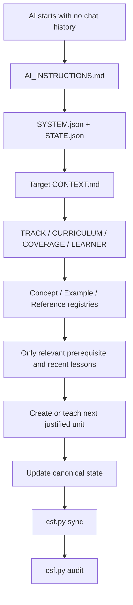

# V3.1 Repository Architecture

V3 uses one principle aggressively:

> **One canonical structured source for machine state; Markdown for human reading.**

This prevents long-lived AI sessions from gradually creating contradictory copies of the same state.

## Source-of-truth map

| Concern | Canonical source | Human-readable view |
|---|---|---|
| System architecture/version | `SYSTEM.json` | `README.md`, this document |
| Repository handoff | `STATE.json` | `STATE.md` |
| Track identity/scope | `<track>/TRACK.json` | `<track>/README.md`, `docs/TRACKS.md` |
| Dependency graph / planned curriculum | `<track>/CURRICULUM.json` | `<track>/ROADMAP.md` |
| Coverage / omission audit | `<track>/COVERAGE.json` | summarized in roadmap/context |
| Concept registry | `<track>/registry/concepts.json` | `<track>/CONCEPTS.md` |
| Example registry | `<track>/registry/examples.json` | `<track>/EXAMPLES.md` |
| Reference registry / freshness | `<track>/registry/references.json` | `<track>/REFERENCES.md` |
| Learner progress | `<track>/LEARNER_STATE.json` | `<track>/LEARNER.md` |
| Published lesson prose | `<track>/lessons/*.md` | same file |
| Lesson catalog | lesson front matter | `<track>/CATALOG.md` |
| Fast AI handoff | all relevant canonical state | `<track>/CONTEXT.md` |
| Curriculum publication progress | `CURRICULUM.json` + lessons | `<track>/PROGRESS.md` |
| Cross-track relationships | manifests + graph edges | `docs/CROSS_TRACK_INDEX.md` |

Generated views are committed so a web-only AI can read them, but they are never the final authority when canonical JSON disagrees.


## Track discovery and organizational containers

Track discovery is recursive: any non-tooling directory containing `TRACK.json` is a curriculum track. A directory may also exist purely as an organizational container and contain no `TRACK.json`. This supports structures such as:

```text
09-Auxiliary-Studies/
├── 01-Advanced-English/        # TRACK.json -> independent track
├── 02-German-Language/        # TRACK.json -> independent track
└── 03-Philosophy-and-Logic/   # TRACK.json -> independent track
```

The container itself has no curriculum state. Each nested track keeps its own graph, registries, learner state, references, exercises, projects, and research frontier. `scripts/csf.py` resolves schema paths relative to each track, so nesting does not require special-case audit code.

## Normal-session data flow



A recursive scan of every lesson is **not** part of this path.

## Audit mode

Full recursive inspection is appropriate when:

- constructing or re-auditing an entire roadmap;
- investigating suspected semantic duplication;
- migrating schema versions;
- performing a research-frontier refresh;
- verifying broad completeness;
- reviewing a long-paused track after major field change.

This distinction is what allows the repository to scale from dozens to thousands of files.

## Curriculum graph

`CURRICULUM.json` is a graph, not a numbered playlist.

Each curriculum node can record:

- stable node ID;
- title;
- depth level;
- status;
- prerequisite node IDs, including cross-track nodes;
- intended outcomes;
- target concept/depth pairs;
- optional branch/specialization;
- published lesson ID when one exists.

`unlocks` are derived from prerequisite edges rather than stored twice.

The audit rejects unresolved prerequisite node IDs, self-dependencies, and cycles.

## Prerequisite closure

"Starts from zero" means **zero subject-specific knowledge is silently assumed**.

Outside knowledge may still be genuinely necessary. It must be handled explicitly by one of these routes:

1. a bridge inside the track;
2. a canonical node in another track;
3. a declared external prerequisite with rationale.

A curriculum must not suddenly rely on calculus, shell literacy, C memory models, or computer architecture merely because the author forgot to state the dependency.

## Curriculum state versus learner state

A published lesson means:

> the repository contains an approved learning unit.

It does **not** mean:

> the learner knows it.

`LEARNER_STATE.json` therefore tracks learner engagement separately. Recommended states are:

`unseen → read → practiced → demonstrated`

A `review_due` state can coexist with prior evidence.

An AI must not promote a learner to `demonstrated` solely from confidence or from the existence of a lesson. Evidence can include exercises, explanations, debugging, derivations, projects, or other appropriate demonstrations.

## Coverage model

`COVERAGE.json` exists because a long roadmap can still have blind spots.

Before the first lesson of an activated track, curriculum reconnaissance should define external baselines drawn from multiple authoritative classes such as university sequences, canonical texts, standards, official documentation, seminal work, and research surveys.

Coverage items map those external expectations to curriculum nodes and can be:

- `planned`
- `covered`
- `gap`
- `deferred`

A `deferred` item requires rationale.

This makes "we forgot an entire area" visible instead of relying on memory.

## Freshness model

Not every old source is stale.

A seminal paper may remain important indefinitely. A tool flag, compiler behavior, kernel interface, or "current research frontier" snapshot may expire quickly.

Reference entries therefore opt into freshness tracking with explicit dates such as `review_after`. The audit warns only when a source declares that it is time-sensitive.

Research frontier snapshots use their own `review_due` dates.

## Human-readable navigation

GitHub renders relative Markdown links and Mermaid diagrams, so the repository prefers text-native navigation and diagrams that remain readable in version control.

Optional deep dives or exercise solutions may use collapsible `<details>` blocks, but core prerequisite material must not be hidden as optional content.

## CI and merge safety

`.github/workflows/curriculum-audit.yml` runs unit/self-tests plus `python scripts/csf.py audit --strict` on pushes and pull requests. Action dependencies are pinned to reviewed commit SHAs.

CI can report a bad direct push only after it has reached `main`; therefore the intended steady-state workflow is a protected `main` branch or repository ruleset that requires the curriculum-integrity status check before merge.

## Schema evolution

Every canonical JSON file carries `schema_version`.

Schema changes should be deliberate. When a breaking architecture change is needed:

1. update the specification;
2. update templates and audit logic;
3. migrate canonical data;
4. regenerate views;
5. run stress tests;
6. record the decision in `docs/DECISIONS.md`.

## Authoring versus learner progression

These are deliberately separate queries. `next-authoring` asks which audited curriculum node may be written next. `next-study` asks what the learner should review, practice, or newly study based on learner evidence. `next` prints both views. A curriculum dependency being published is not the same thing as the learner satisfying it.

## Evidence artifacts

Lessons are not the only evidence-bearing files. Exercises (`EXR` IDs), projects (`PRJ` IDs), and research notes (`R` IDs) carry validated front matter and may be referenced by learner evidence.

## Declarative schemas versus executable audit

Files under `schemas/` are declarative JSON Schema contracts for editors and external tooling. `scripts/csf.py audit` is the dependency-free executable validator used locally and in CI. A schema change and the corresponding audit rule must be changed together and covered by tests; neither is allowed to drift silently from the other.

## Architecture regression tests

`python -m unittest discover -s tests -v` exercises failure gates such as fake coverage audits, cycles, learner-evidence references, concept-depth drift, and dynamic track discovery. `python scripts/stress_test.py` is a manual scale regression that builds a temporary 3,000-node dependency chain and then injects a cycle; it never modifies the real repository.
